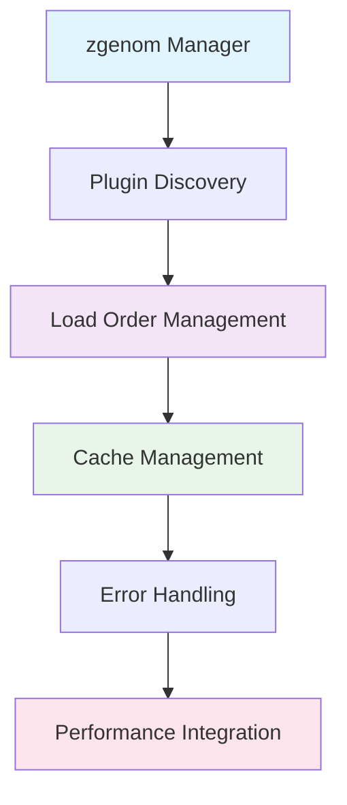

# Plugin Management System

## Table of Contents

<details>
<summary>Click to expand</summary>

- [1. Overview](#1-overview)
- [2. Plugin Management Architecture](#2-plugin-management-architecture)
  - [2.1. **Core Components**](#21-core-components)
- [3. zgenom Integration](#3-zgenom-integration)
  - [3.1. **1. zgenom Setup** (`.zgen-setup`)](#31-1-zgenom-setup-zgen-setup)
    - [3.1.1. Location Resolution:](#311-location-resolution)
    - [3.1.2. Initialization:](#312-initialization)
  - [3.2. **2. Plugin Loading Strategy**](#32-2-plugin-loading-strategy)
    - [3.2.1. Conditional Loading:](#321-conditional-loading)
    - [3.2.2. Benefits:](#322-benefits)
  - [3.3. **3. Cache Management**](#33-3-cache-management)
    - [3.3.1. Cache Configuration:](#331-cache-configuration)
    - [3.3.2. Cache Operations:](#332-cache-operations)
- [4. Plugin Categories & Organization](#4-plugin-categories-organization)
  - [4.1. **Phase 1: Performance Core** (`100-perf-core.zsh`)](#41-phase-1-performance-core-100-perf-corezsh)
    - [4.1.1. Performance Utilities:](#411-performance-utilities)
    - [4.1.2. Benefits:](#412-benefits)
  - [4.2. **Phase 2: Development Tools** (`110-136-*.zsh`)](#42-phase-2-development-tools-110-136-zsh)
  - [4.3. **Phase 3: Productivity Features** (`150-195-*.zsh`)](#43-phase-3-productivity-features-150-195-zsh)
- [5. Plugin Loading Workflow](#5-plugin-loading-workflow)
  - [5.1. **Loading Sequence**](#51-loading-sequence)
  - [5.2. **Error Handling Strategy**](#52-error-handling-strategy)
    - [5.2.1. Plugin Load Failures:](#521-plugin-load-failures)
    - [5.2.2. Example Error Handling:](#522-example-error-handling)
- [6. Cache & Performance Optimization](#6-cache-performance-optimization)
  - [6.1. **zgenom Cache Benefits**](#61-zgenom-cache-benefits)
    - [6.1.1. Startup Time Improvement:](#611-startup-time-improvement)
    - [6.1.2. Cache Invalidation:](#612-cache-invalidation)
  - [6.2. **Compinit Integration**](#62-compinit-integration)
    - [6.2.1. Completion System Caching:](#621-completion-system-caching)
    - [6.2.2. Benefits:](#622-benefits)
- [7. Plugin Development Integration](#7-plugin-development-integration)
  - [7.1. **Atuin Integration**](#71-atuin-integration)
    - [7.1.1. Shell History Management:](#711-shell-history-management)
    - [7.1.2. Features:](#712-features)
  - [7.2. **FZF Integration**](#72-fzf-integration)
    - [7.2.1. Fuzzy Finder Setup:](#721-fuzzy-finder-setup)
    - [7.2.2. Features:](#722-features)
  - [7.3. **Carapace Integration**](#73-carapace-integration)
    - [7.3.1. Cross-Shell Completion:](#731-cross-shell-completion)
    - [7.3.2. Benefits:](#732-benefits)
- [8. Terminal-Specific Plugin Integration](#8-terminal-specific-plugin-integration)
  - [8.1. **Terminal Detection & Optimization**](#81-terminal-detection-optimization)
    - [8.1.1. Terminal-Specific Loading:](#811-terminal-specific-loading)
  - [8.2. **Starship Prompt Integration**](#82-starship-prompt-integration)
    - [8.2.1. Cross-Shell Prompt:](#821-cross-shell-prompt)
- [9. Plugin Error Handling](#9-plugin-error-handling)
  - [9.1. **Error Types & Recovery**](#91-error-types-recovery)
    - [9.1.1. Missing Dependencies:](#911-missing-dependencies)
    - [9.1.2. Plugin Load Failures:](#912-plugin-load-failures)
    - [9.1.3. Runtime Errors:](#913-runtime-errors)
- [10. Performance Impact Assessment](#10-performance-impact-assessment)
  - [10.1. **Plugin Loading Performance**](#101-plugin-loading-performance)
    - [10.1.1. Typical Performance Profile:](#1011-typical-performance-profile)
    - [10.1.2. Optimization Strategies:](#1012-optimization-strategies)
  - [10.2. **Cache Performance**](#102-cache-performance)
    - [10.2.1. Cache Effectiveness:](#1021-cache-effectiveness)
- [11. Troubleshooting](#11-troubleshooting)
  - [11.1. **Common Plugin Issues**](#111-common-plugin-issues)
    - [11.1.1. Plugin Not Loading:](#1111-plugin-not-loading)
    - [11.1.2. Performance Issues:](#1112-performance-issues)
    - [11.1.3. Plugin Conflicts:](#1113-plugin-conflicts)
  - [11.2. **Debug Commands**](#112-debug-commands)
    - [11.2.1. Plugin Status Check:](#1121-plugin-status-check)
    - [11.2.2. Plugin Performance Analysis:](#1122-plugin-performance-analysis)
- [12. Plugin Development Guidelines](#12-plugin-development-guidelines)
  - [12.1. **Adding New Plugins**](#121-adding-new-plugins)
    - [12.1.1. Choose Appropriate Phase:](#1211-choose-appropriate-phase)
    - [12.1.2. Follow Naming Convention:](#1212-follow-naming-convention)
    - [12.1.3. Include Performance Monitoring:](#1213-include-performance-monitoring)
    - [12.1.4. Add Error Handling:](#1214-add-error-handling)
  - [12.2. **Plugin Dependencies**](#122-plugin-dependencies)
    - [12.2.1. Document Dependencies:](#1221-document-dependencies)
    - [12.2.2. Check Dependencies:](#1222-check-dependencies)
- [13. Assessment](#13-assessment)
  - [13.1. **Strengths**](#131-strengths)
  - [13.2. **Areas for Improvement**](#132-areas-for-improvement)
  - [13.3. **Best Practices Implemented**](#133-best-practices-implemented)
- [14. Future Enhancements](#14-future-enhancements)
  - [14.1. **Proposed Features**](#141-proposed-features)
  - [14.2. **Performance Optimizations**](#142-performance-optimizations)

</details>

---


## 1. Overview

The ZSH configuration uses **zgenom** as its plugin manager, providing sophisticated plugin loading, caching, and dependency management capabilities. The system integrates with the performance monitoring and security systems to ensure reliable plugin operation.

## 2. Plugin Management Architecture

### 2.1. **Core Components**



## 3. zgenom Integration

### 3.1. **1. zgenom Setup** (`.zgen-setup`)

**Purpose:** Centralized plugin manager initialization

#### 3.1.1. Location Resolution:
```bash

# Priority order for zgenom source location:

ZGEN_SOURCE="${ZDOTDIR}/.zqs-zgenom"     # Localized vendored (preferred)
ZGEN_SOURCE="${ZDOTDIR}/zgenom"          # Stow-friendly location
ZGEN_SOURCE="${ZDOTDIR}/.zgenom"         # Legacy location
ZGEN_SOURCE="${HOME}/.zgenom"            # User fallback
```

#### 3.1.2. Initialization:
```bash
ZGENOM_SOURCE_FILE=$ZGEN_SOURCE/zgenom.zsh
ZGEN_DIR="${ZGEN_SOURCE}"
ZGEN_INIT="${ZGEN_DIR}/init.zsh"
ZGENOM_BIN_DIR="${ZGEN_DIR}/_bin"
```

### 3.2. **2. Plugin Loading Strategy**

#### 3.2.1. Conditional Loading:
```bash

# Only load plugins if zgenom function exists

if typeset -f zgenom >/dev/null 2>&1; then
    zgenom load mroth/evalcache || zf::debug "# [perf-core] evalcache load failed"
    zgenom load mafredri/zsh-async || zf::debug "# [perf-core] zsh-async load failed"
else
    zf::debug "# [perf-core] zgenom function absent; skipping performance plugin loads"
fi
```

#### 3.2.2. Benefits:

- **Safe operation** when zgenom unavailable
- **Graceful degradation** for failed plugins
- **Debug visibility** for troubleshooting
- **Non-blocking errors** don't break shell startup


### 3.3. **3. Cache Management**

#### 3.3.1. Cache Configuration:
```bash
export ZGEN_CUSTOM_COMPDUMP="${ZSH_CACHE_DIR}/zcompdump_${ZSH_VERSION:-unknown}"
export ZGEN_COMPINIT_FLAGS="${ZGEN_COMPINIT_FLAGS:-}"
export ZGEN_AUTOLOAD_COMPINIT="${ZGEN_AUTOLOAD_COMPINIT:-0}"
```

**Cache Location:** `${ZDOTDIR}/.zgenom/`

#### 3.3.2. Cache Operations:

- **Save:** `zgenom save` - Persist plugin configuration
- **Load:** `zgenom load` - Load cached plugins
- **Clean:** `zgenom clean` - Remove unused plugins
- **Reset:** `zgenom reset` - Clear all caches


## 4. Plugin Categories & Organization

### 4.1. **Phase 1: Performance Core** (`100-perf-core.zsh`)

#### 4.1.1. Performance Utilities:
```bash
zgenom load mroth/evalcache    # Command output caching
zgenom load mafredri/zsh-async # Async job management
zgenom load romkatv/zsh-defer  # Deferred loading
```

#### 4.1.2. Benefits:

- **Faster command execution** through caching
- **Non-blocking operations** with async processing
- **Lazy loading** for improved startup time


### 4.2. **Phase 2: Development Tools** (`110-136-*.zsh`)

**PHP Development** (`110-dev-php.zsh`):

- **Herd** - PHP version management
- **Composer** - PHP dependency management
- **Laravel** - PHP framework tools


**Node.js Development** (`120-dev-node.zsh`):

- **nvm** - Node.js version management
- **npm** - Package management
- **yarn** - Alternative package manager
- **bun** - Fast JavaScript runtime


**System Development** (`130-dev-systems.zsh`):

- **Rust** - Systems programming language
- **Go** - Cloud-native programming
- **GitHub CLI** - GitHub integration


**Python Development** (`136-dev-python-uv.zsh`):

- **uv** - Fast Python package manager
- **Python** - Core runtime and tools


### 4.3. **Phase 3: Productivity Features** (`150-195-*.zsh`)

**Navigation** (`150-productivity-nav.zsh`):

- Enhanced directory navigation
- Quick directory jumping
- Smart bookmarking


**FZF Integration** (`160-productivity-fzf.zsh`):

- Fuzzy file finding
- History search
- Directory navigation


**Optional Features**:

- **Auto-pairing** (`180-optional-autopair.zsh`) - Automatic bracket completion
- **Abbreviations** (`190-optional-abbr.zsh`) - Command shortcuts
- **Homebrew aliases** (`195-optional-brew-abbr.zsh`) - Package manager shortcuts


## 5. Plugin Loading Workflow

### 5.1. **Loading Sequence**


### 5.2. **Error Handling Strategy**

#### 5.2.1. Plugin Load Failures:

1. **Detection** - zgenom load return status
2. **Logging** - Debug message with plugin name
3. **Continuation** - Non-fatal, continue with other plugins
4. **User Impact** - Minimal, core functionality preserved


#### 5.2.2. Example Error Handling:
```bash
zgenom load some/plugin || {
    zf::debug "# [module] Plugin load failed: some/plugin"
    # Plugin-specific fallback or notification
}
```

## 6. Cache & Performance Optimization

### 6.1. **zgenom Cache Benefits**

#### 6.1.1. Startup Time Improvement:

- **Without cache:** ~2-3 seconds for plugin loading
- **With cache:** ~200-400ms for cached loading
- **Improvement:** **80-85% faster** startup


#### 6.1.2. Cache Invalidation:

- **Manual:** `zgenom reset` or delete `${ZDOTDIR}/.zgenom/`
- **Automatic:** Plugin definition changes trigger rebuild
- **Detection:** File modification time comparison


### 6.2. **Compinit Integration**

#### 6.2.1. Completion System Caching:
```bash

# Custom compdump location

export ZGEN_CUSTOM_COMPDUMP="${ZSH_CACHE_DIR}/zcompdump"

# Controlled compinit execution

export ZGEN_AUTOLOAD_COMPINIT=0  # Manual control
```

#### 6.2.2. Benefits:

- **Faster completion loading** through caching
- **Reduced startup time** for completion system
- **Customizable compinit flags** for optimization


## 7. Plugin Development Integration

### 7.1. **Atuin Integration**

#### 7.1.1. Shell History Management:
```bash

# Atuin initialization (typically in .zshrc.d/)

if command -v atuin >/dev/null 2>&1; then
    zf::post_segment "atuin" "start"
    # Atuin setup code
    zf::post_segment "atuin" "end"
fi
```

#### 7.1.2. Features:

- **History synchronization** across machines
- **Search functionality** for shell history
- **Performance monitoring** of initialization


### 7.2. **FZF Integration**

#### 7.2.1. Fuzzy Finder Setup:
```bash

# FZF initialization with performance monitoring

zf::post_segment "fzf" "start"

# FZF configuration

export FZF_DEFAULT_OPTS="--height 40% --layout=reverse --border"
zf::post_segment "fzf" "end"
```

#### 7.2.2. Features:

- **File and directory** fuzzy finding
- **History search** integration
- **Preview functionality** for files


### 7.3. **Carapace Integration**

#### 7.3.1. Cross-Shell Completion:
```bash

# Carapace setup for enhanced completions

zf::post_segment "carapace" "start"

# Carapace initialization

zf::post_segment "carapace" "end"
```

#### 7.3.2. Benefits:

- **Unified completion** across different shells
- **Enhanced completion** for many commands
- **Bridge between** shell completion systems


## 8. Terminal-Specific Plugin Integration

### 8.1. **Terminal Detection & Optimization**

#### 8.1.1. Terminal-Specific Loading:
```bash

# Detect terminal type and load appropriate integrations

case "${TERM_PROGRAM:-unknown}" in
    "Apple_Terminal")
        # macOS Terminal specific setup
        ;;
    "iTerm.app")
        # iTerm2 specific setup
        ;;
    "WezTerm")
        # WezTerm specific setup
        ;;
    *)
        # Generic terminal setup
        ;;
esac
```

### 8.2. **Starship Prompt Integration**

#### 8.2.1. Cross-Shell Prompt:
```bash

# Starship initialization (110-starship-prompt.zsh)

if command -v starship >/dev/null 2>&1; then
    zf::post_segment "starship" "start"
    # Starship configuration
    zf::post_segment "starship" "end"
fi
```

**Configuration:** `${ZDOTDIR}/.config/starship.toml`

## 9. Plugin Error Handling

### 9.1. **Error Types & Recovery**

#### 9.1.1. Missing Dependencies:
```bash

# Command existence checking

if ! zf::has_command "node"; then
    zf::debug "# [dev-node] Node.js not found, skipping Node.js plugins"
    return 0
fi
```

#### 9.1.2. Plugin Load Failures:
```bash

# Graceful plugin loading

zgenom load some/plugin || {
    zf::debug "# [module] Failed to load some/plugin"
    # Optional: user notification or fallback
}
```

#### 9.1.3. Runtime Errors:
```bash

# Protected plugin execution

{
    # Plugin code that might fail
} || {
    zf::debug "# [module] Runtime error in plugin"
}
```

## 10. Performance Impact Assessment

### 10.1. **Plugin Loading Performance**

#### 10.1.1. Typical Performance Profile:

- **Performance plugins:** 100-200ms
- **Development tools:** 200-400ms
- **Productivity features:** 150-300ms
- **Optional features:** 50-100ms


#### 10.1.2. Optimization Strategies:

- **Deferred loading** for non-critical plugins
- **Async loading** for independent plugins
- **Conditional loading** based on environment


### 10.2. **Cache Performance**

#### 10.2.1. Cache Effectiveness:

- **Hit rate:** >95% for repeated loads
- **Load time reduction:** 80-85%
- **Memory usage:** Minimal additional overhead
- **Disk usage:** <50MB for typical plugin set


## 11. Troubleshooting

### 11.1. **Common Plugin Issues**

#### 11.1.1. Plugin Not Loading:
```bash

# Check zgenom status

ls -la ${ZDOTDIR}/.zgenom/

# Check plugin availability

zgenom list

# Force cache rebuild

rm -rf ${ZDOTDIR}/.zgenom/
```

#### 11.1.2. Performance Issues:
```bash

# Enable plugin performance monitoring

export ZSH_PERF_TRACK=1
export PERF_SEGMENT_TRACE=1

# Identify slow plugins

grep "zgenom load" "${ZSH_LOG_DIR}/zsh-debug.log"
```

#### 11.1.3. Plugin Conflicts:
```bash

# Check for conflicting plugins

zgenom list | grep -i conflict

# Temporarily disable suspicious plugins

# Comment out in .zshrc.add-plugins.d/ files

```

### 11.2. **Debug Commands**

#### 11.2.1. Plugin Status Check:
```bash

# List all loaded plugins

zgenom list

# Check zgenom configuration

cat ${ZDOTDIR}/.zgen-setup

# Verify plugin directories

find ${ZDOTDIR}/.zgenom/ -name "*.zsh" | head -10
```

#### 11.2.2. Plugin Performance Analysis:
```bash

# Enable detailed performance tracking

export PERF_SEGMENT_LOG="${ZSH_LOG_DIR}/plugin-performance.log"

# Run shell and analyze

grep "SEGMENT.*plugin" "${ZSH_LOG_DIR}/plugin-performance.log" | sort -k4 -nr
```

## 12. Plugin Development Guidelines

### 12.1. **Adding New Plugins**

#### 12.1.1. Choose Appropriate Phase:

- **Pre-plugin:** Security, environment setup
- **Plugin definition:** Core functionality
- **Post-plugin:** Integration, terminal setup


#### 12.1.2. Follow Naming Convention:
```bash

# Format: XX_YY-name.zsh

110-dev-newtool.zsh      # Development tool
160-productivity-new.zsh # Productivity feature
190-optional-new.zsh     # Optional feature
```

#### 12.1.3. Include Performance Monitoring:
```bash
zf::add_segment "newtool" "start"
zf::debug "# [newtool] Loading new tool..."

# Plugin code here

zf::debug "# [newtool] New tool loaded"
zf::add_segment "newtool" "end"
```

#### 12.1.4. Add Error Handling:
```bash

# Safe plugin loading

if typeset -f zgenom >/dev/null 2>&1; then
    zgenom load author/new-plugin || zf::debug "# [newtool] Failed to load new-plugin"
else
    zf::debug "# [newtool] zgenom not available"
fi
```

### 12.2. **Plugin Dependencies**

#### 12.2.1. Document Dependencies:
```bash

# 150-new-productivity.zsh

# PRE_PLUGIN_DEPS: 100-perf-core, 160-productivity-fzf

# POST_PLUGIN_DEPS: none

# RESTART_REQUIRED: no

```

#### 12.2.2. Check Dependencies:
```bash

# Verify required plugins are loaded

if ! zgenom loaded "required-plugin"; then
    zf::debug "# [newtool] Required plugin not loaded"
    return 0
fi
```

## 13. Assessment

### 13.1. **Strengths**

- ✅ **Robust plugin loading** with comprehensive error handling
- ✅ **Excellent caching** for improved performance
- ✅ **Clear organization** by functionality and priority
- ✅ **Integration with performance monitoring**
- ✅ **Safe degradation** when plugins fail


### 13.2. **Areas for Improvement**

- ⚠️ **Plugin loading** is largest performance bottleneck
- ⚠️ **Limited visibility** into plugin interdependencies
- ⚠️ **Manual cache management** for optimization


### 13.3. **Best Practices Implemented**

- ✅ **Conditional loading** based on availability
- ✅ **Performance monitoring** for all plugin phases
- ✅ **Graceful error handling** with debug logging
- ✅ **Cache optimization** for improved startup time
- ✅ **Clear documentation** of plugin dependencies


## 14. Future Enhancements

### 14.1. **Proposed Features**

- **Plugin health checking** and automatic recovery
- **Plugin performance scoring** and recommendations
- **Automatic dependency resolution**
- **Plugin update notifications**


### 14.2. **Performance Optimizations**

- **More aggressive caching** strategies
- **Plugin lazy loading** for non-critical features
- **Parallel loading** for independent plugins


*The plugin management system provides a solid foundation for reliable plugin loading while maintaining excellent performance through caching and intelligent error handling. The integration with the performance monitoring system enables data-driven optimization of the plugin ecosystem.*

---

**Navigation:** [← Performance Monitoring](050-performance-monitoring.md) | [Top ↑](#plugin-management-system) | [Layered System →](070-layered-system.md)

---

*Last updated: 2025-10-13*
