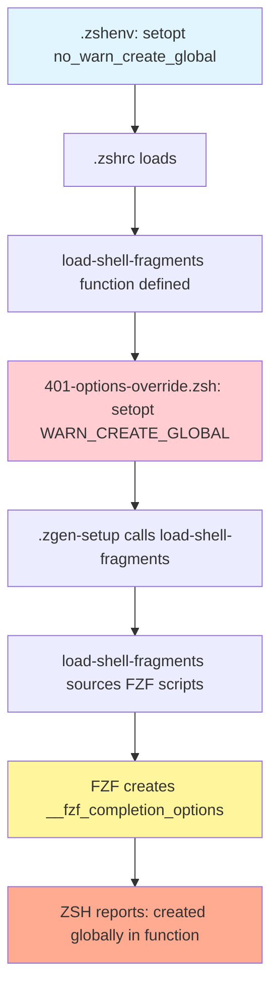
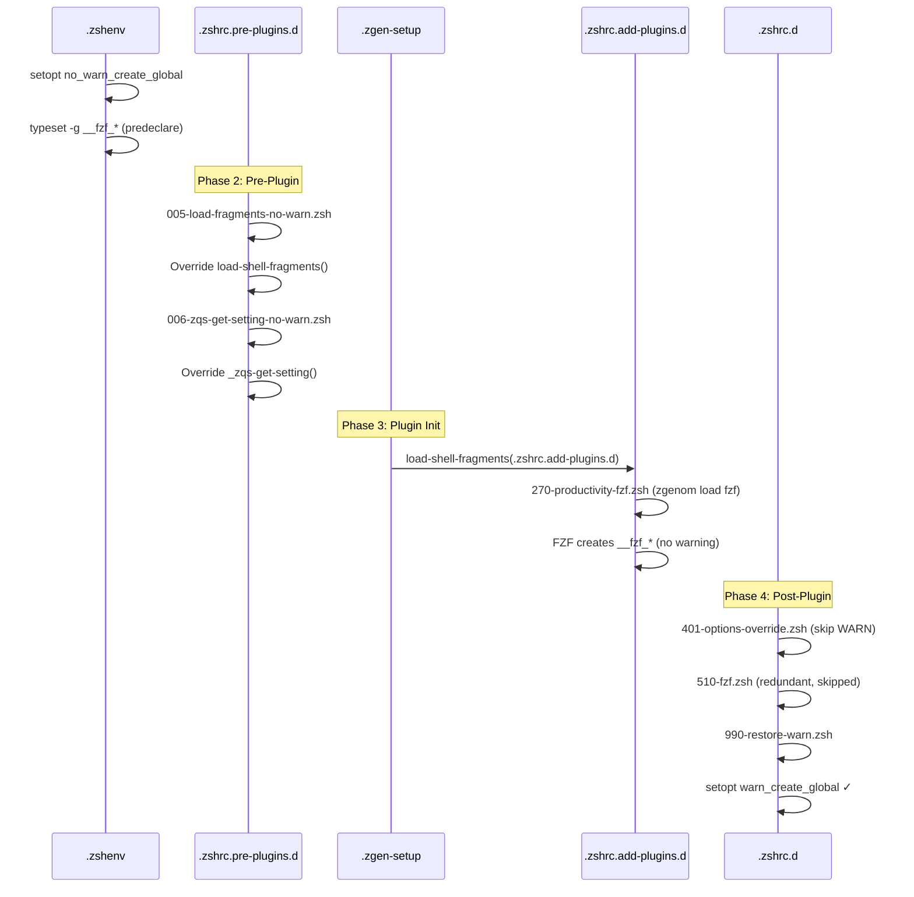

# Troubleshooting Startup Warnings

## Table of Contents

<details>
<summary>Click to expand</summary>

- [1. WARN_CREATE_GLOBAL Issues](#1-warn_create_global-issues)
  - [1.1. **Problem: Scalar Parameter Created Globally**](#11-problem-scalar-parameter-created-globally)
  - [1.2. Root Cause](#12-root-cause)
  - [1.3. Understanding the Mechanism](#13-understanding-the-mechanism)
  - [1.4. Solution Architecture](#14-solution-architecture)
    - [1.4.1. **1. Variable Predeclaration in `.zshenv`**](#141-1-variable-predeclaration-in-zshenv)
    - [1.4.2. **2. Function Override with LOCAL_OPTIONS**](#142-2-function-override-with-local_options)
    - [1.4.3. **3. Delayed Warning Activation**](#143-3-delayed-warning-activation)
  - [1.5. Complete Loading Sequence](#15-complete-loading-sequence)
  - [1.6. Verification](#16-verification)
- [2. Function Context Warnings](#2-function-context-warnings)
  - [2.1. Problem: Variables in Sourced Files Attributed to Function](#21-problem-variables-in-sourced-files-attributed-to-function)
  - [2.2. Example](#22-example)
  - [2.3. Best Practices](#23-best-practices)
- [3. FZF Integration Warnings](#3-fzf-integration-warnings)
  - [3.1. Common FZF Variables](#31-common-fzf-variables)
  - [3.2. Loading Mechanisms](#32-loading-mechanisms)
  - [3.3. Prevention](#33-prevention)
- [4. Composer Directory Permissions](#4-composer-directory-permissions)
  - [4.1. Problem: World-Writable Directory Warning](#41-problem-world-writable-directory-warning)
  - [4.2. Root Cause](#42-root-cause)
  - [4.3. Solution](#43-solution)
  - [4.4. Understanding Permissions](#44-understanding-permissions)
  - [4.5. Prevention](#45-prevention)
- [5. Missing Configuration Files](#5-missing-configuration-files)
  - [5.1. Problem: File Not Found Errors](#51-problem-file-not-found-errors)
  - [5.2. Common Missing Files](#52-common-missing-files)
  - [5.3. Why This Happens](#53-why-this-happens)
  - [5.4. Solutions](#54-solutions)
    - [5.4.1. Create Empty Placeholder](#541-create-empty-placeholder)
    - [5.4.2. Disable Tool That Requires It](#542-disable-tool-that-requires-it)
- [6. Prevention Strategies](#6-prevention-strategies)
  - [6.1. Comprehensive Variable Predeclaration](#61-comprehensive-variable-predeclaration)
  - [6.2. Function Wrapper Pattern](#62-function-wrapper-pattern)
  - [6.3. Vendor Script Override Pattern](#63-vendor-script-override-pattern)
  - [6.4. Debug Mode for Detection](#64-debug-mode-for-detection)
  - [6.5. Automated Testing](#65-automated-testing)
- [7. Additional Resources](#7-additional-resources)
  - [7.1. Related Documentation](#71-related-documentation)
  - [7.2. External References](#72-external-references)
  - [7.3. Debugging Commands](#73-debugging-commands)
- [8. Troubleshooting Checklist](#8-troubleshooting-checklist)
- [9. Summary](#9-summary)

</details>

---


## 1. WARN_CREATE_GLOBAL Issues

### 1.1. **Problem: Scalar Parameter Created Globally**

**Symptom:**
```log
/opt/homebrew/opt/fzf/shell/completion.zsh:34: scalar parameter __fzf_completion_options created globally in function load-shell-fragments
/opt/homebrew/opt/fzf/shell/key-bindings.zsh:21: scalar parameter __fzf_key_bindings_options created globally in function load-shell-fragments
load-shell-fragments:6: scalar parameter _zqs_fragment created globally in function load-shell-fragments
_zqs-get-setting:5: scalar parameter svalue created globally in function _zqs-get-setting
```

### 1.2. Root Cause

When `setopt WARN_CREATE_GLOBAL` is active, ZSH reports warnings for any variable created globally within a function. The issue occurs because:

1. **Vendor scripts are sourced inside functions** - The `load-shell-fragments` function sources configuration files
2. **Function context propagates** - Variables created by `source` are seen as created "in" the calling function
3. **Timing of option setting** - The warning option was enabled before vendor scripts loaded

### 1.3. Understanding the Mechanism



### 1.4. Solution Architecture

The fix involves three complementary strategies:

#### 1.4.1. **1. Variable Predeclaration in `.zshenv`**

Declare all vendor-created globals before they're assigned:

```zsh
# In .zshenv interactive block
if [[ -o interactive ]]; then
  setopt no_warn_create_global
  setopt extendedglob
  
  # Predeclare vendor globals
  typeset -g __fzf_completion_options=
  typeset -g __fzf_key_bindings_options=
  typeset -g _zqs_fragment=
  typeset -g svalue=
  typeset -g _ZF_ATUIN=
  typeset -g _ZF_ATUIN_KEYBINDS=
fi
```

#### 1.4.2. **2. Function Override with LOCAL_OPTIONS**

Override vendor functions to suppress warnings during sourcing:

**File:** `.zshrc.pre-plugins.d/005-load-fragments-no-warn.zsh`

```zsh
function load-shell-fragments() {
  # Suppress WARN_CREATE_GLOBAL only within this function
  setopt LOCAL_OPTIONS no_warn_create_global
  
  # Properly scope loop variable
  local _zqs_fragment
  
  if [[ -z ${1-} ]]; then
    echo "You must give load-shell-fragments a directory path"
  else
    if [[ -d "$1" ]]; then
      if [ -n "$(/bin/ls -A "$1")" ]; then
        for _zqs_fragment in $(/bin/ls -A "$1"); do
          if [ -r "$1/$_zqs_fragment" ]; then
            source "$1/$_zqs_fragment"
          fi
        done
      fi
    else
      echo "$1 is not a directory"
    fi
  fi
}
```

**File:** `.zshrc.pre-plugins.d/006-zqs-get-setting-no-warn.zsh`

```zsh
_zqs-get-setting() {
  setopt LOCAL_OPTIONS no_warn_create_global
  
  local sfile="${_ZQS_SETTINGS_DIR}/${1}"
  local svalue
  
  if [[ -f "$sfile" ]]; then
    svalue=$(cat "$sfile")
  else
    if [[ $# -eq 2 ]]; then
      svalue=$2
    else
      svalue=''
    fi
  fi
  
  echo "$svalue"
}
```

#### 1.4.3. **3. Delayed Warning Activation**

Enable `WARN_CREATE_GLOBAL` AFTER vendor scripts load:

**File:** `.zshrc.d/401-options-override.zsh`

```zsh
# Comment out early WARN_CREATE_GLOBAL setting
# setopt WARN_CREATE_GLOBAL  # Commented - enabled later in 990-restore-warn.zsh
```

**File:** `.zshrc.d/990-restore-warn.zsh`

```zsh
# Restore WARN_CREATE_GLOBAL after vendor scripts loaded
if [[ -o interactive ]]; then
  setopt warn_create_global
fi
```

### 1.5. Complete Loading Sequence



### 1.6. Verification

After implementing the fixes, verify with:

```bash
# Start a new shell
exec zsh

# Should see NO warnings like:
# ✗ scalar parameter X created globally in function Y

# Verify WARN_CREATE_GLOBAL is active after startup
[[ -o warn_create_global ]] && echo "✓ Warning enabled" || echo "✗ Warning disabled"

# Test that warnings work for new code
function test_warn() {
  new_global_var="test"  # Should warn
}
test_warn
```

---

## 2. Function Context Warnings

### 2.1. Problem: Variables in Sourced Files Attributed to Function

**Why This Happens:**

When you `source` a file from within a function, ZSH considers any global variables created by that file as being created "in" the function context, even though the code is in a separate file.

### 2.2. Example

```zsh
# Bad: sourcing inside function
function setup_tools() {
  source /opt/homebrew/opt/fzf/shell/completion.zsh
  # FZF creates __fzf_completion_options
  # Warning: "created globally in function setup_tools"
}

# Good: use LOCAL_OPTIONS
function setup_tools() {
  setopt LOCAL_OPTIONS no_warn_create_global
  source /opt/homebrew/opt/fzf/shell/completion.zsh
  # No warning
}

# Better: source at top level
source /opt/homebrew/opt/fzf/shell/completion.zsh
function setup_tools() {
  # Use FZF completion
}
```

### 2.3. Best Practices

1. **Source vendor scripts at top level** when possible
2. **Use LOCAL_OPTIONS** in functions that must source files
3. **Predeclare variables** if you know what will be created
4. **Document function overrides** clearly

---

## 3. FZF Integration Warnings

### 3.1. Common FZF Variables

These variables are created by FZF initialization scripts:

- `__fzf_completion_options` - Completion configuration
- `__fzf_key_bindings_options` - Key binding configuration
- `FZF_DEFAULT_OPTS` - Default FZF options
- `_fzf_base` - Installation path

### 3.2. Loading Mechanisms

FZF can be loaded in multiple ways:

1. **Via zgenom plugin** - `.zshrc.add-plugins.d/270-productivity-fzf.zsh`
2. **Via direct source** - `.zshrc.d/510-fzf.zsh`
3. **Via Oh-My-Zsh plugin** - If OMZ plugins enabled

### 3.3. Prevention

**In `.zshenv`:**
```zsh
if [[ -o interactive ]]; then
  typeset -g __fzf_completion_options=
  typeset -g __fzf_key_bindings_options=
  typeset -g FZF_DEFAULT_OPTS=
  typeset -g _fzf_base=
fi
```

**Skip redundant loading:**
```zsh
# In 510-fzf.zsh
if [[ -n ${_ZF_PM_FZF_LOADED:-} ]]; then
  return 0  # Already loaded via plugin manager
fi
```

---

## 4. Composer Directory Permissions

### 4.1. Problem: World-Writable Directory Warning

**Symptom:**
```log
/System/Library/Frameworks/Ruby.framework/Versions/2.6/usr/lib/ruby/2.6.0/universal-darwin25/rbconfig.rb:21: warning: Insecure world writable dir /Users/s-a-c/.local/share/composer in PATH, mode 040777
```

### 4.2. Root Cause

The Composer directory has overly permissive permissions (777 = world-writable), which is a security risk that Ruby and other security-conscious tools will warn about.

### 4.3. Solution

Fix directory permissions:

```bash
# Check current permissions
ls -ld ~/.local/share/composer

# Should show: drwxrwxrwx (777) - INSECURE

# Fix permissions
chmod 755 ~/.local/share/composer

# Verify fix
ls -ld ~/.local/share/composer
# Should show: drwxr-xr-x (755) - SECURE
```

### 4.4. Understanding Permissions

```
777 (rwxrwxrwx) - INSECURE
├── Owner: read+write+execute
├── Group: read+write+execute
└── Other: read+write+execute (anyone can modify!)

755 (rwxr-xr-x) - SECURE
├── Owner: read+write+execute
├── Group: read+execute only
└── Other: read+execute only (cannot modify)
```

### 4.5. Prevention

Check all directories in PATH for world-writable permissions:

```bash
# Audit PATH directories
echo $PATH | tr ':' '\n' | while read dir; do
  if [[ -d "$dir" ]]; then
    perms=$(ls -ld "$dir" | cut -d' ' -f1)
    if [[ "$perms" =~ w.w$ ]]; then
      echo "⚠️  World-writable: $dir ($perms)"
    fi
  fi
done

# Fix all world-writable directories in PATH
echo $PATH | tr ':' '\n' | while read dir; do
  if [[ -d "$dir" ]]; then
    perms=$(ls -ld "$dir" | cut -d' ' -f1)
    if [[ "$perms" =~ w.w$ ]]; then
      chmod 755 "$dir"
      echo "✓ Fixed: $dir"
    fi
  fi
done
```

---

## 5. Missing Configuration Files

### 5.1. Problem: File Not Found Errors

**Symptom:**
```log
sed: /Users/s-a-c/.Xresources: No such file or directory
```

### 5.2. Common Missing Files

1. **`.Xresources`** - X11 color scheme configuration
2. **`.Xdefaults`** - X11 defaults (deprecated, use `.Xresources`)
3. **`.inputrc`** - Readline configuration

### 5.3. Why This Happens

Some tools (like `colorscript`) attempt to read terminal color configurations from X11 resource files, even on macOS where X11 is not the native display system.

### 5.4. Solutions

#### 5.4.1. Create Empty Placeholder

```bash
# Create empty .Xresources
touch ~/.Xresources

# Or with basic content
cat > ~/.Xresources << 'EOF'
! Basic X11 color scheme
*foreground: #ffffff
*background: #000000
EOF
```

#### 5.4.2. Disable Tool That Requires It

If the file is required by a tool you don't use:

```bash
# Check what's trying to read .Xresources
grep -r "Xresources" ~/.config/zsh/

# Disable colorscript if causing issues
export ZSH_DISABLE_COLORSCRIPT=1
```

---

## 6. Prevention Strategies

### 6.1. Comprehensive Variable Predeclaration

Maintain a complete list of vendor-created variables in `.zshenv`:

```zsh
if [[ -o interactive ]]; then
  setopt no_warn_create_global
  setopt extendedglob
  
  # ZF framework globals
  typeset -g _ZF_ATUIN=
  typeset -g _ZF_ATUIN_KEYBINDS=
  typeset -g __ZF_COMPINIT_DONE=
  typeset -g _ZF_SEGMENT_CAPTURE=
  
  # FZF globals
  typeset -g __fzf_completion_options=
  typeset -g __fzf_key_bindings_options=
  typeset -g FZF_DEFAULT_OPTS=
  typeset -g _fzf_base=
  
  # Atuin globals
  typeset -g ATUIN_HISTORY_ID=
  
  # Zoxide globals
  typeset -g __zoxide_result=
  
  # Autosuggestions globals
  typeset -ga ZSH_AUTOSUGGEST_STRATEGY=()
  
  # ZQS framework globals
  typeset -g _zqs_fragment=
  typeset -g svalue=
  
  # Other vendor globals
  typeset -ga items=()
  typeset -ga ndirs=()
  typeset -g ndir=
  typeset -g entry=
fi
```

### 6.2. Function Wrapper Pattern

Create wrappers for functions that source external files:

```zsh
# Template for safe sourcing wrapper
function safe_source() {
  setopt LOCAL_OPTIONS no_warn_create_global
  local file="$1"
  
  if [[ -r "$file" ]]; then
    source "$file"
  fi
}

# Usage
safe_source /opt/homebrew/opt/fzf/shell/completion.zsh
safe_source ~/.custom/aliases.zsh
```

### 6.3. Vendor Script Override Pattern

Override vendor functions before they're called:

```zsh
# In .zshrc.pre-plugins.d/XXX-override-vendor.zsh
if [[ -z ${_ZF_VENDOR_OVERRIDE_DONE:-} ]]; then
  
  # Override vendor function
  function vendor_function_name() {
    setopt LOCAL_OPTIONS no_warn_create_global
    local var1 var2  # Properly scope all variables
    
    # Original function logic
    # ...
  }
  
  typeset -g _ZF_VENDOR_OVERRIDE_DONE=1
fi
```

### 6.4. Debug Mode for Detection

Enable debug mode to detect new warnings:

```bash
# In ~/.zshenv.local
export ZSH_DEBUG=1

# Start new shell
exec zsh

# Watch for new warnings
# Add any new global variables to predeclaration list
```

### 6.5. Automated Testing

Create a test to catch new warnings:

```bash
# tests/test-startup-warnings.zsh
#!/usr/bin/env zsh

echo "Testing for startup warnings..."

output=$(zsh -i -c "exit" 2>&1)

if echo "$output" | grep -q "created globally in function"; then
  echo "❌ FAIL: Startup warnings detected:"
  echo "$output" | grep "created globally in function"
  exit 1
else
  echo "✅ PASS: No startup warnings"
  exit 0
fi
```

Run on every configuration change:

```bash
./tests/test-startup-warnings.zsh
```

---

## 7. Additional Resources

### 7.1. Related Documentation

- [030-activation-flow.md](030-activation-flow.md) - Complete startup sequence
- [060-plugin-management.md](060-plugin-management.md) - Plugin loading architecture
- [210-issues-inconsistencies.md](210-issues-inconsistencies.md) - Known issues catalog

### 7.2. External References

- [ZSH Options Documentation](http://zsh.sourceforge.net/Doc/Release/Options.html)
- [ZSH Functions Documentation](http://zsh.sourceforge.net/Doc/Release/Functions.html)
- [File Permissions Guide](https://www.redhat.com/sysadmin/linux-file-permissions-explained)

### 7.3. Debugging Commands

```bash
# Check if WARN_CREATE_GLOBAL is set
[[ -o warn_create_global ]] && echo "ON" || echo "OFF"

# List all global variables
typeset -g

# Find where a variable is set
grep -r "VARIABLE_NAME" ~/.config/zsh/

# Trace function calls
zsh -x -i -c "exit" 2>&1 | grep "function_name"

# Profile startup with timing
ZSH_PERF_TRACK=1 zsh -i -c "exit"
```

---

## 8. Troubleshooting Checklist

When encountering startup warnings, work through this checklist:

- [ ] **Identify the warning type** - Global variable, permission, missing file?
- [ ] **Locate the source** - Which file/function is creating the warning?
- [ ] **Check timing** - When is WARN_CREATE_GLOBAL being enabled?
- [ ] **Verify predeclarations** - Is the variable predeclared in `.zshenv`?
- [ ] **Check function overrides** - Are vendor functions properly overridden?
- [ ] **Test in isolation** - Does the warning occur with minimal config?
- [ ] **Review load order** - Are files loading in the correct sequence?
- [ ] **Check permissions** - Are directory permissions secure (755)?
- [ ] **Verify files exist** - Are all referenced files present?
- [ ] **Test fix** - Does `exec zsh` show no warnings?

---

## 9. Summary

Startup warnings in ZSH configurations are typically caused by:

1. **Function context issues** - Variables created in sourced files appear to come from the calling function
2. **Timing problems** - Warning option enabled before vendor scripts load
3. **Missing predeclarations** - Variables not declared before assignment
4. **Permission issues** - World-writable directories in PATH
5. **Missing files** - Tools expecting configuration files that don't exist

The solution involves:

1. **Predeclare all vendor globals** in `.zshenv`
2. **Override vendor functions** with LOCAL_OPTIONS
3. **Delay warning activation** until after vendor scripts load
4. **Fix directory permissions** (755 for directories in PATH)
5. **Create placeholder files** for tools that require them

By following these strategies, you can maintain a clean, warning-free startup while still benefiting from `WARN_CREATE_GLOBAL` protection in your own code.


*Last Updated: October 2025*
*Configuration Base: zsh-quickstart-kit v2*
*Shell Compatibility: ZSH 5.0+*

---

**Navigation:** [← Completion System](140-completion-system.md) | [Top ↑](#troubleshooting-startup-warnings) | [Option Files Comparison →](160-option-files-comparison.md)

---

*Last updated: 2025-10-13*
