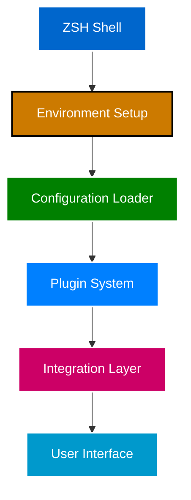
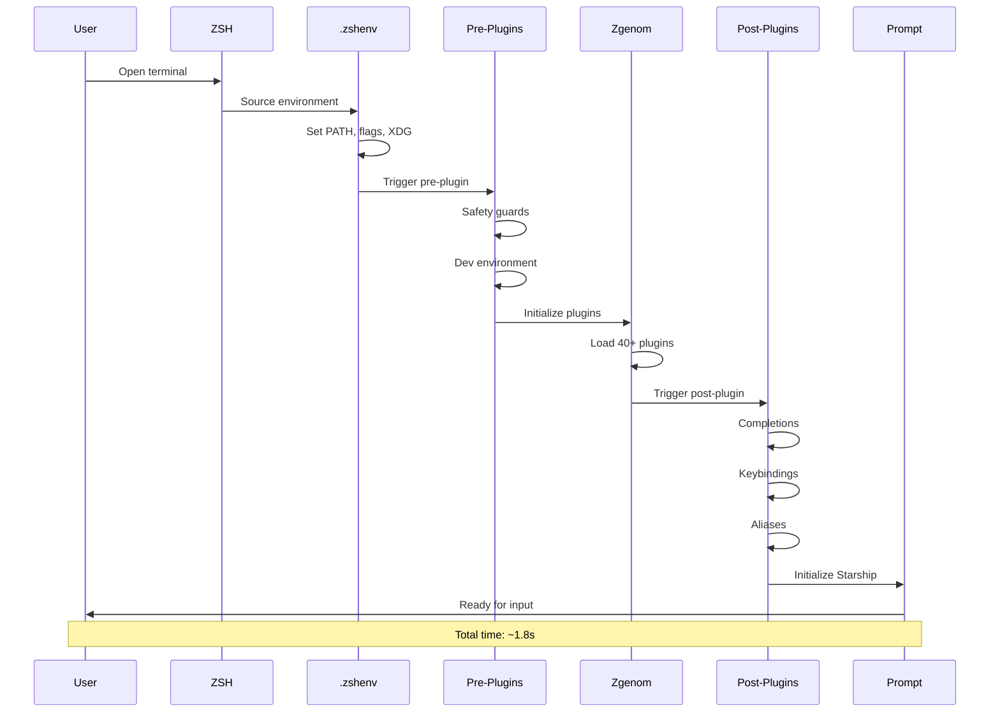
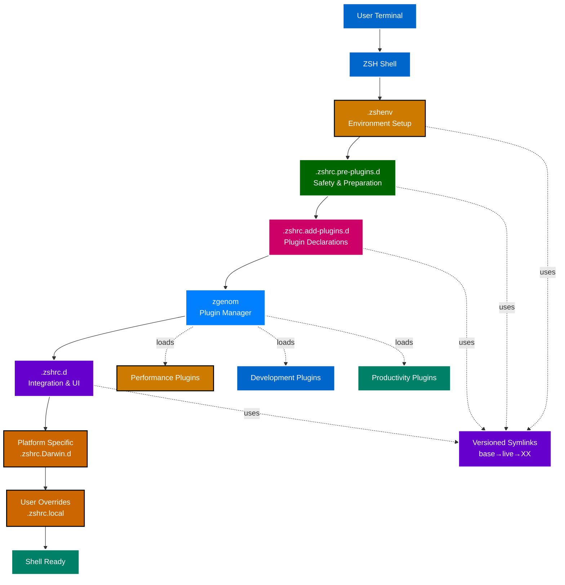
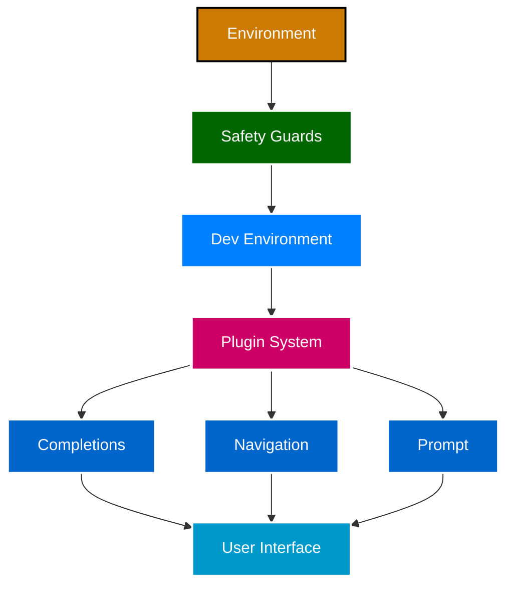

# Architecture Overview

**System Design & Core Principles** | **Technical Level: Intermediate**

---

## Table of Contents

<details>
<summary>Expand Table of Contents</summary>

- [1. High-Level Architecture](#1-high-level-architecture)
  - [1.1. Architecture Overview](#11-architecture-overview)
- [2. Design Principles](#2-design-principles)
  - [2.1. Modularity First](#21-modularity-first)
  - [2.2. Performance Conscious](#22-performance-conscious)
  - [2.3. Safety by Default](#23-safety-by-default)
  - [2.4. Version Control Everything](#24-version-control-everything)
  - [2.5. User Customization Without Forking](#25-user-customization-without-forking)
- [3. System Components](#3-system-components)
  - [3.1. Core Components](#31-core-components)
  - [3.2. Environment Foundation (`.zshenv`)](#32-environment-foundation-zshenv)
  - [3.3. Shell Orchestrator (`.zshrc`)](#33-shell-orchestrator-zshrc)
  - [3.4. Pre-Plugin Setup (`.zshrc.pre-plugins.d.01/`)](#34-pre-plugin-setup-zshrcpre-pluginsd01)
  - [3.5. Plugin System (`.zshrc.add-plugins.d.00/`)](#35-plugin-system-zshrcadd-pluginsd00)
  - [3.6. Post-Plugin Integration (`.zshrc.d.01/`)](#36-post-plugin-integration-zshrcd01)
  - [3.7. Version Management System](#37-version-management-system)
- [4. Configuration Flow](#4-configuration-flow)
  - [4.1. Complete Load Sequence](#41-complete-load-sequence)
  - [4.2. Phase Timing Breakdown](#42-phase-timing-breakdown)
- [5. Key Technologies](#5-key-technologies)
  - [5.1. Plugin Manager: zgenom](#51-plugin-manager-zgenom)
  - [5.2. Prompt: Starship](#52-prompt-starship)
  - [5.3. Fuzzy Finder: FZF](#53-fuzzy-finder-fzf)
  - [5.4. History: Atuin (Optional)](#54-history-atuin-optional)
- [6. Architecture Diagram](#6-architecture-diagram)
  - [6.1. System Architecture (High-Level)](#61-system-architecture-high-level)
  - [6.2. Data Flow](#62-data-flow)
- [7. Component Interactions](#7-component-interactions)
  - [7.1. Module Communication](#71-module-communication)
  - [7.2. Dependencies](#72-dependencies)
- [8. Design Patterns](#8-design-patterns)
  - [8.1. Modular Loading Pattern](#81-modular-loading-pattern)
  - [8.2. **Feature Flag Pattern**](#82-feature-flag-pattern)
  - [8.3. **Performance Monitoring Pattern**](#83-performance-monitoring-pattern)
  - [8.4. **Graceful Degradation Pattern**](#84-graceful-degradation-pattern)
  - [8.5. **Versioned Resource Pattern**](#85-versioned-resource-pattern)
- [9. Scalability Considerations](#9-scalability-considerations)
  - [9.1. Current Scale](#91-current-scale)
  - [9.2. Growth Capacity](#92-growth-capacity)
  - [9.3. Performance Boundaries](#93-performance-boundaries)
- [10. Architectural Strengths](#10-architectural-strengths)
- [11. Known Limitations](#11-known-limitations)
  - [Related Documentation](#related-documentation)

</details>

---

## 1. High-Level Architecture

This ZSH configuration implements a **sophisticated modular architecture** built on three core pillars:

```text
┌─────────────────────────────────────────────────────────-──┐
│                    USER INTERACTION LAYER                  │
│  Terminal Emulators │ Shell Commands │ Custom Scripts      │
└────────────────────────┬─────────────────────────────────-─┘
                         │
┌────────────────────────┴──────────────────────────────────-┐
│                  CONFIGURATION ORCHESTRATION               │
│  .zshenv → .zshrc → Pre-Plugins → Plugins → Post-Plugins   │
└────────────────────────┬───────────────────────────────────┘
                         │
┌────────────────────────┴────────────────────────────────-──┐
│                    FOUNDATION SERVICES                     │
│  Symlink System │ Security │ Performance │ Plugin Manager  │
└──────────────────────────────────────────────────────────-─┘

```

### 1.1. Architecture Overview

| Layer | Purpose | Key Components |
|-------|---------|----------------|
| **User Interface** | Terminal interaction | Starship prompt, FZF, completions |
| **Orchestration** | Configuration loading | Six-phase startup sequence |
| **Foundation** | Core services | Versioning, security, performance monitoring |

---

## 2. Design Principles

### 2.1. Modularity First

Every feature is self-contained and independently loadable:

```bash

# Each module is a discrete unit

.zshrc.d.01/
├── 400-options.zsh          # Shell options
├── 410-completions.zsh      # Completion system
├── 420-terminal-integration.zsh  # Terminal detection
└── ...                       # Each focuses on one concern

```

**Benefits**:

- Easy to debug individual features
- Simple to add/remove functionality
- Clear dependencies

### 2.2. Performance Conscious

Every operation is monitored and optimized:

```bash

# Performance tracking built-in

zf::segment "module-name" "start"

# ... module code ...

zf::segment "module-name" "end"

```

**Results**:

- ~1.8 second startup target
- Real-time performance regression detection
- Detailed timing logs available

### 2.3. Safety by Default

Multiple layers of protection:

- **Nounset Safety**: Variables guarded against undefined access
- **Path Validation**: Only existing directories added to PATH
- **Plugin Verification**: Integrity checks before loading
- **Graceful Degradation**: Continue on non-critical failures

### 2.4. Version Control Everything

Symlink-based versioning enables:

```bash

# Atomic configuration updates

.zshrc.d → .zshrc.d.live → .zshrc.d.01
                              └─→ .zshrc.d.02 (development)

```

**Benefits**:

- Instant rollback capability
- Safe experimentation
- Configuration history preservation

### 2.5. User Customization Without Forking

Clear extension points:

- `.zshrc.local` - User-specific shell configuration
- `.zshenv.local` - User-specific environment variables
- `.zshrc.Darwin.d` - Platform-specific configurations

**Result**: Users customize without modifying core files

---

## 3. System Components

### 3.1. Core Components



### 3.2. Environment Foundation (`.zshenv`)

**Purpose**: Establish baseline environment before any shell operations

**Key Responsibilities**:

- Set essential PATH entries
- Define feature flags (70+ configuration options)
- Establish XDG base directories
- Configure terminal detection
- Initialize logging system

**File**: `.zshenv.01` (~1,415 lines)

### 3.3. Shell Orchestrator (`.zshrc`)

**Purpose**: Central control for loading all configuration phases

**Key Responsibilities**:

- Initialize zsh-quickstart-kit
- Trigger pre-plugin phase
- Activate zgenom plugin manager
- Execute post-plugin phase
- Apply platform-specific configs

**File**: Vendored from `zsh-quickstart-kit/zsh/.zshrc`

### 3.4. Pre-Plugin Setup (`.zshrc.pre-plugins.d.01/`)

**Purpose**: Prepare safe environment before plugin loading

**Key Modules** (7 files):

- `000-layer-set-marker.zsh` - Layer system initialization
- `010-shell-safety.zsh` - Nounset safety guards
- `020-zqs-overrides.zsh` - Quickstart kit customizations
- `030-dev-environment.zsh` - Development tool setup
- `040-starship-compat.zsh` - Prompt compatibility layer
- `050-logging-and-monitoring.zsh` - Performance tracking init
- `060-zqs-enhancements.zsh` - Additional enhancements

### 3.5. Plugin System (`.zshrc.add-plugins.d.00/`)

**Purpose**: Declare and load zgenom-managed plugins

**Plugin Categories** (12 files):

- **Performance** (200): evalcache, zsh-async, zsh-defer
- **Development** (210-250): PHP, Node.js, Python, GitHub
- **Productivity** (260-270): Navigation tools, FZF
- **Optional** (280-310): Autopair, abbreviations, UI enhancements

**Total Plugins**: 40+ managed by zgenom

### 3.6. Post-Plugin Integration (`.zshrc.d.01/`)

**Purpose**: Configure features that depend on loaded plugins

**Key Modules** (14 files):

- `400-options.zsh` - Shell options (after plugins)
- `410-completions.zsh` - Completion system setup
- `420-terminal-integration.zsh` - Terminal-specific configs
- `430-navigation-tools.zsh` - Directory navigation
- `440-neovim.zsh` - Editor integration
- `450-node-environment.zsh` - Node.js environment
- `460-prompt.zsh` - Prompt finalization (placeholder)
- `470-user-interface.zsh` - UI elements
- `480-history.zsh` - History configuration
- `490-keybindings.zsh` - Keyboard shortcuts
- `500-aliases.zsh` - Command aliases
- `510-developer-tools.zsh` - Development utilities
- `520-kilocode-memory-bank.zsh` - AI integration
- `990-final-overrides.zsh` - Last-resort overrides

### 3.7. Version Management System

**Purpose**: Enable atomic updates and rollbacks

**Structure**:

```bash

# User references symlink

.zshrc.d/

# Points to active version

.zshrc.d.live → .zshrc.d.01

# Contains actual configuration

.zshrc.d.01/
├── 400-options.zsh
├── 410-completions.zsh
└── ...

```

**Versioned Components**:

- `.zshenv` (Environment)
- `.zshrc.pre-plugins.d` (Pre-plugin)
- `.zshrc.add-plugins.d` (Plugins)
- `.zshrc.d` (Post-plugin)

---

## 4. Configuration Flow

### 4.1. Complete Load Sequence



### 4.2. Phase Timing Breakdown

| Phase | Duration | Files Loaded | Purpose |
|-------|----------|--------------|---------|
| Environment | ~100ms | 1 file | PATH, flags, XDG setup |
| Pre-Plugin | ~150ms | 7 files | Safety, dev environment |
| Plugin Loading | ~800ms | 40+ plugins | Feature ecosystem |
| Post-Plugin | ~400ms | 14 files | Integration, UI setup |
| Finalization | ~350ms | Platform + user | Prompt, local configs |
| **Total** | **~1.8s** | **220+ files** | **Complete shell** |

---

## 5. Key Technologies

### 5.1. Plugin Manager: zgenom

**Why zgenom?**

- Fast loading with static init script generation
- Lightweight (minimal overhead)
- Oh-My-Zsh plugin compatibility
- Automatic cache management

**Usage Pattern**:

```bash

# In .zshrc.add-plugins.d.00/

if (( $+functions[zgenom] )); then
    zgenom load author/plugin-name
fi

```

### 5.2. Prompt: Starship

**Why Starship?**

- Cross-shell compatible (future-proof)
- Fast (written in Rust)
- Highly customizable
- Modern, beautiful output

**Configuration**: `~/.config/starship.toml`

### 5.3. Fuzzy Finder: FZF

**Integration Points**:

- `Ctrl+R` - Command history search
- `Ctrl+T` - File finder
- `Ctrl+G` - Git integration
- `Alt+C` - Directory navigation

### 5.4. History: Atuin (Optional)

**Features**:
- Encrypted shell history sync
- Cross-machine history
- Context-aware search
- SQLite backend

---

## 6. Architecture Diagram

### 6.1. System Architecture (High-Level)



### 6.2. Data Flow


---

## 7. Component Interactions

### 7.1. Module Communication

Modules communicate through:

#### 7.1.1. Environment Variables

```bash
   export ZSH_PERF_TRACK=1      # Enable performance tracking
   export ZSH_DISABLE_SPLASH=0  # Show splash screen

```

#### 7.1.2. Helper Functions

```bash
   zf::segment "module" "start"   # Performance tracking
   zf::debug "message"            # Debug logging
   zf::path_prepend "/new/path"  # Safe PATH management

```

#### 7.1.3. Function Existence Checks

```bash
   if (( $+functions[zgenom] )); then
       # zgenom is available
   fi

```

### 7.2. Dependencies



---

## 8. Design Patterns

### 8.1. Modular Loading Pattern

Each module is self-contained:

```bash

#!/usr/bin/env zsh
# 400-options.zsh - Shell options configuration
# Phase: post-plugin
# Dependencies: none

# Guard against multiple loads

if (( ${+_ZF_OPTIONS_LOADED} )); then
    return 0
fi
typeset -g _ZF_OPTIONS_LOADED=1

# Module implementation
# ...


```

### 8.2. **Feature Flag Pattern**

Everything is controllable:

```bash

# Check flag before enabling feature

if (( ${ZSH_ENABLE_FEATURE:-1} )); then
    # Enable feature
fi

```

### 8.3. **Performance Monitoring Pattern**

All expensive operations are tracked:

```bash
zf::segment "module-name" "start"

# ... expensive operation ...

zf::segment "module-name" "end"

```

### 8.4. **Graceful Degradation Pattern**

Non-critical failures don't stop shell:

```bash
if ! source optional-module.zsh; then
    zf::debug "Optional module failed, continuing..."
fi

```

### 8.5. **Versioned Resource Pattern**

All configs use symlink indirection:

```bash

# User accesses via symlink

source ~/.config/zsh/.zshrc.d/400-options.zsh

# Resolves through chain
# .zshrc.d → .zshrc.d.live → .zshrc.d.01/400-options.zsh


```

---

## 9. Scalability Considerations

### 9.1. Current Scale

- **220 configuration files**
- **40+ plugins managed**
- **70+ feature flags**
- **~1.8s startup time**

### 9.2. Growth Capacity

The architecture supports:

- ✅ Additional plugins (modular loading)
- ✅ New phases (extensible orchestration)
- ✅ Platform variants (conditional loading)
- ✅ User customizations (layered configs)

### 9.3. Performance Boundaries

Optimizations in place:

- Lazy loading for expensive operations
- Plugin cache management (zgenom)
- Conditional feature activation
- Minimal external command usage

---

## 10. Architectural Strengths

✅ **Modular**: Easy to add/remove features
✅ **Versioned**: Safe updates with rollback
✅ **Performant**: Monitored and optimized
✅ **Secure**: Multiple safety layers
✅ **Extensible**: Clear extension points
✅ **User-Friendly**: Customization without forking

## 11. Known Limitations

⚠️ **Complexity**: Steep learning curve for new contributors
⚠️ **File Count**: 220 files requires good organization
⚠️ **Startup Time**: 1.8s target not achievable on all systems
⚠️ **macOS Focus**: Primary development on macOS

---

## 12. Navigation

### Related Documentation

- [Startup Sequence](030-startup-sequence.md) - Detailed load order
- [Configuration Phases](040-configuration-phases.md) - Six-phase system
- [Versioned Symlinks](050-versioned-symlinks.md) - Version management
- [Plugin System](060-plugin-system.md) - Plugin architecture
- [Architecture Diagram](150-diagrams/010-architecture-diagram.md) - Visual reference

**Navigation:** [← Getting Started](010-getting-started.md) | [Top ↑](#architecture-overview) | [Startup Sequence →](030-startup-sequence.md)

---

*Compliant with AI-GUIDELINES.md (v1.0 2025-10-30)*
