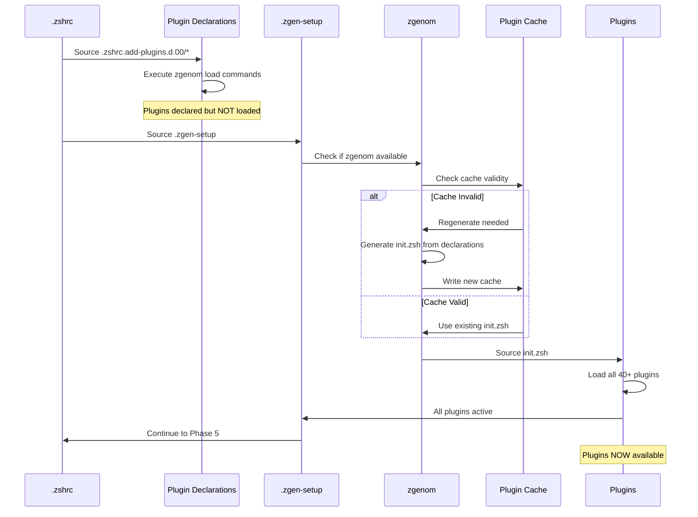
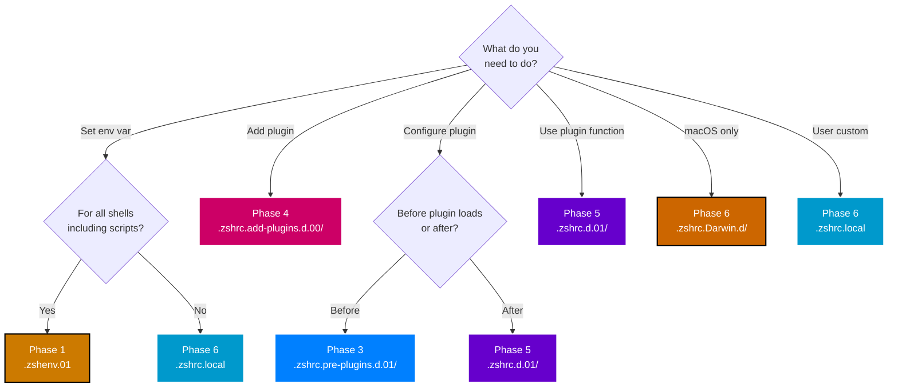

# Configuration Phases Deep Dive

**Detailed Phase Analysis** | **Technical Level: Advanced**

---

## 📋 Table of Contents

<details>
<summary>Expand Table of Contents</summary>

- [1. Phase Overview](#1-phase-overview)
- [2. Phase 1: Environment Setup](#2-phase-1-environment-setup)
  - [2.1. File Location](#21-file-location)
  - [2.2. Execution Context](#22-execution-context)
  - [2.3. Responsibilities](#23-responsibilities)
  - [2.4. Phase 1 Rules](#24-phase-1-rules)
  - [2.5. What Goes Here](#25-what-goes-here)
- [3. Phase 2: Shell Entry](#3-phase-2-shell-entry)
  - [3.1. File Location](#31-file-location)
  - [3.2. Execution Context](#32-execution-context)
  - [3.3. Responsibilities](#33-responsibilities)
  - [3.4. Phase 2 Rules](#34-phase-2-rules)
  - [3.5. How to Customize Instead](#35-how-to-customize-instead)
- [4. ️ Phase 3: Pre-Plugin Configuration](#4-phase-3-pre-plugin-configuration)
  - [4.1. Directory Location](#41-directory-location)
  - [4.2. Execution Context](#42-execution-context)
  - [4.3. Module Breakdown](#43-module-breakdown)
  - [4.4. Phase 3 Rules](#44-phase-3-rules)
  - [4.5. What Goes Here](#45-what-goes-here)
- [5. Phase 4: Plugin Activation](#5-phase-4-plugin-activation)
  - [5.1. Directory & File Locations](#51-directory-file-locations)
  - [5.2. Execution Context](#52-execution-context)
  - [5.3. Process Flow](#53-process-flow)
  - [5.4. Plugin Categories](#54-plugin-categories)
  - [5.5. Phase 4 Rules](#55-phase-4-rules)
  - [5.6. What Goes Here](#56-what-goes-here)
- [6. Phase 5: Post-Plugin Integration](#6-phase-5-post-plugin-integration)
  - [6.1. Directory Location](#61-directory-location)
  - [6.2. Execution Context](#62-execution-context)
  - [6.3. Module Categories](#63-module-categories)
  - [6.4. Phase 5 Rules](#64-phase-5-rules)
  - [6.5. What Goes Here](#65-what-goes-here)
- [7. Phase 6: Finalization](#7-phase-6-finalization)
  - [7.1. Components](#71-components)
  - [7.2. Phase 6 Rules](#72-phase-6-rules)
- [8. ️ File Placement Guide](#8-file-placement-guide)
  - [8.1. Decision Tree](#81-decision-tree)
  - [8.2. Quick Reference Table](#82-quick-reference-table)
- [9. Common Patterns](#9-common-patterns)
  - [9.1. Pattern 1: Module Guard](#91-pattern-1-module-guard)
  - [9.2. Pattern 2: Performance Tracking](#92-pattern-2-performance-tracking)
  - [9.3. Pattern 3: Feature Flag](#93-pattern-3-feature-flag)
  - [9.4. Pattern 4: Plugin Function Check](#94-pattern-4-plugin-function-check)
  - [9.5. Pattern 5: Conditional Loading](#95-pattern-5-conditional-loading)
- [Related Documentation](#related-documentation)

</details>

---

## 1. 🎯 Phase Overview

The six-phase system provides **clear separation of concerns** and **predictable load order**:

| Phase | What | Where | Plugin Access |
|-------|------|-------|---------------|
| 1 | Environment | `.zshenv.01` | ❌ No |
| 2 | Orchestration | `.zshrc` | ❌ No |
| 3 | Preparation | `.zshrc.pre-plugins.d.01/` | ❌ No |
| 4 | Plugin Loading | `.zshrc.add-plugins.d.00/` + zgenom | ⚠️ Loading |
| 5 | Integration | `.zshrc.d.01/` | ✅ Yes |
| 6 | Finalization | Platform + User | ✅ Yes |

---

## 2. 📌 Phase 1: Environment Setup

### 2.1. File Location


```text
.zshenv → .zshenv.live → .zshenv.01

```

### 2.2. Execution Context

- **When**: ALWAYS (every shell: login, interactive, scripts)
- **Duration**: ~100ms
- **Files**: 1 large file (~1,415 lines)

### 2.3. Responsibilities

#### 1. System PATH Configuration


```bash

# Essential system paths first

export PATH="/opt/homebrew/bin:/usr/local/bin:/usr/bin:/bin:/usr/sbin:/sbin"

# XDG-compliant paths

export PATH="$XDG_BIN_HOME:$PATH"

```

#### 2. Configuration Directory


```bash

# Set ZDOTDIR for all ZSH configs

export ZDOTDIR="${HOME}/.config/zsh"

```

#### 3. Feature Flags (70+ options)


```bash

# Visual/Splash

export ZSH_DISABLE_SPLASH=${ZSH_DISABLE_SPLASH:-0}
export ZSH_MINIMAL=${ZSH_MINIMAL:-0}

# Performance

export ZSH_PERF_TRACK=${ZSH_PERF_TRACK:-0}
export PERF_SEGMENT_LOG=${PERF_SEGMENT_LOG:-}

# Debug

export ZSH_DEBUG=${ZSH_DEBUG:-0}

# And 60+ more...


```

#### 4. XDG Base Directories


```bash
export XDG_CONFIG_HOME="${HOME}/.config"
export XDG_DATA_HOME="${HOME}/.local/share"
export XDG_CACHE_HOME="${HOME}/.cache"
export XDG_STATE_HOME="${HOME}/.local/state"

```

#### 5. Terminal Detection


```bash
if [[ -n ${ALACRITTY_LOG:-} ]]; then
    export TERM_PROGRAM=Alacritty
elif [[ -n ${GHOSTTY_RESOURCES_DIR:-} ]]; then
    export TERM_PROGRAM=Ghostty

# ... detect iTerm2, Kitty, Warp, etc.

fi

```

#### 6. Core Helper Functions


```bash

# Path management

zf::path_prepend() { ... }
zf::path_append() { ... }
zf::path_remove() { ... }

# Debug utilities

zf::debug() { ... }

# Performance tracking

zf::segment() { ... }
zf::segment_fallback() { ... }

# Script directory resolution

zf::script_dir() { ... }

```

### 2.4. Phase 1 Rules

> 🔴 **CRITICAL RULES**:
> - ❌ NO plugins available
> - ❌ NO plugin commands/functions
> - ✅ ONLY environment variables
> - ✅ ONLY helper function definitions
> - ✅ Must be fast (affects scripts too!)

### 2.5. What Goes Here

✅ **DO place here**:

- PATH configuration
- Environment variables (for ALL shells)
- XDG directory setup
- Feature flags
- Helper function definitions

❌ **DO NOT place here**:

- Plugin loading
- Completion setup
- Aliases (not needed in scripts)
- Terminal-specific features (interactive only)

---

## 3. 🎬 Phase 2: Shell Entry

### 3.1. File Location


```text
.zshrc → zsh-quickstart-kit/zsh/.zshrc (vendored)

```

### 3.2. Execution Context

- **When**: Interactive shells only
- **Duration**: ~50ms
- **Files**: 1 vendored file

### 3.3. Responsibilities

This phase is pure **orchestration**:

1. Source `.zshrc.pre-plugins.d/*`
2. Source `.zgen-setup`
3. Source `.zshrc.d/*`
4. Source `.zshrc.$(uname).d/*`
5. Source `.zshrc.local` (if exists)
6. Finalize prompt

### 3.4. Phase 2 Rules

> ❌ **ABSOLUTELY FORBIDDEN**: Edit this file!
>
> This is vendored from zsh-quickstart-kit. Changes will be overwritten.

### 3.5. How to Customize Instead

Use the extension directories:

- `.zshrc.pre-plugins.d/` - Run before plugins
- `.zshrc.d/` - Run after plugins
- `.zshrc.Darwin.d/` - Platform-specific
- `.zshrc.local` - User overrides

---

## 4. 🛡️ Phase 3: Pre-Plugin Configuration

### 4.1. Directory Location


```text
.zshrc.pre-plugins.d → .zshrc.pre-plugins.d.live → .zshrc.pre-plugins.d.01/

```

### 4.2. Execution Context

- **When**: After .zshenv, before plugins
- **Duration**: ~150ms
- **Files**: 7 configuration files

### 4.3. Module Breakdown

#### 000-layer-set-marker.zsh

**Purpose**: Mark layered system initialization

```bash

# Set marker for layer system

export _ZF_LAYER_SYSTEM_INITIALIZED=1

```

#### 010-shell-safety.zsh

**Purpose**: Nounset safety for plugin compatibility

**Problem**: Many plugins break with `set -u` (nounset)

**Solution**:

```bash

# Disable nounset during plugin loading

if [[ -o nounset ]]; then
    export _ZQS_NOUNSET_WAS_ON=1
    unsetopt nounset
    export _ZQS_NOUNSET_DISABLED_FOR_OMZ=1
fi

# Can be re-enabled later in Phase 5


```

#### 020-zqs-overrides.zsh

**Purpose**: Customize zsh-quickstart-kit behavior

```bash

# Override quickstart defaults

export ZQS_CUSTOM_SETTING=value

```

#### 030-dev-environment.zsh

**Purpose**: Prepare development tool paths and environment

```bash

# Prepare for Node.js, PHP, Python
# Actual loading happens in plugins (Phase 4)
# But we prepare the environment here


```

#### 040-starship-compat.zsh

**Purpose**: Starship prompt compatibility setup

```bash

# Configure variables Starship needs

export STARSHIP_CONFIG="${XDG_CONFIG_HOME}/starship.toml"

```

#### 050-logging-and-monitoring.zsh

**Purpose**: Initialize performance tracking system

```bash

# Start performance monitoring

zf::segment "pre-plugin" "start"

# Setup log paths if tracking enabled

if (( ZSH_PERF_TRACK )); then
    export PERF_SEGMENT_LOG="${PERF_SEGMENT_LOG:-$ZSH_LOG_DIR/perf-$(date +%Y%m%d).log}"
fi

```

#### 060-zqs-enhancements.zsh

**Purpose**: Additional quickstart enhancements

```bash

# Enhance quickstart kit features
# Custom functions, settings, etc.


```

### 4.4. Phase 3 Rules

> ⚠️ **IMPORTANT RULES**:
> - ❌ NO plugin functions available yet
> - ❌ Cannot call zgenom commands
> - ✅ CAN define functions for later use
> - ✅ CAN set environment variables
> - ✅ CAN configure plugin behavior (they'll see these settings when they load)

### 4.5. What Goes Here

✅ **DO place here**:

- Safety guards (nounset protection)
- Environment preparation
- Performance monitoring setup
- Plugin configuration (settings plugins will read)
- Helper functions (used in Phase 5)

❌ **DO NOT place here**:

- Plugin loading (goes in Phase 4)
- Completion setup (needs plugins, goes in Phase 5)
- Aliases (goes in Phase 5)
- Plugin usage (goes in Phase 5)

---

## 5. 🔌 Phase 4: Plugin Activation

### 5.1. Directory & File Locations


```text
.zshrc.add-plugins.d → .zshrc.add-plugins.d.live → .zshrc.add-plugins.d.00/
.zgen-setup (vendored)

```

### 5.2. Execution Context

- **When**: After pre-plugin setup
- **Duration**: ~800ms (largest phase!)
- **Files**: 12 declaration files + zgenom orchestrator

### 5.3. Process Flow



### 5.4. Plugin Categories

#### Performance Utilities (200-perf-core.zsh)


```bash
zgenom load mroth/evalcache           # Cache eval results
zgenom load mafredri/zsh-async         # Async jobs
zgenom load romkatv/zsh-defer          # Defer loading

```

#### Development Tools (210-250)


```bash

# PHP (210)

zgenom load laravel/herd-zsh-plugin

# Node.js (220)

zgenom load lukechilds/zsh-nvm

# Systems (230)

zgenom load unixorn/git-extra-commands

# Python (240)
# UV-based Python management

# GitHub (250)

zgenom load github/gh-cli

```

#### Productivity (260-270)


```bash

# Navigation (260)

zgenom load agkozak/zsh-z              # Smart directory jumping

# FZF (270)

zgenom load junegunn/fzf
zgenom load Aloxaf/fzf-tab              # Tab completion with FZF

```

#### Optional Features (280-310)


```bash

# Autopair (280)

zgenom load hlissner/zsh-autopair       # Auto-close brackets

# Abbreviations (290)

zgenom load olets/zsh-abbr              # Fish-like abbreviations

# Homebrew (300)
# Brew abbreviations and aliases


```

### 5.5. Phase 4 Rules

> ⚠️ **TRANSITION PHASE RULES**:
> - Plugins are being declared but NOT active at start
> - After `.zgen-setup` completes, ALL plugins are active
> - Functions become available mid-phase
> - Best practice: Assume NO plugin functions in this phase

### 5.6. What Goes Here

✅ **DO place here**:

- `zgenom load` declarations
- `zgenom oh-my-zsh` commands
- Plugin configuration flags

❌ **DO NOT place here**:

- Direct plugin usage (too early)
- Completion setup (goes in Phase 5)
- Functions that use plugins (goes in Phase 5)

---

## 6. 🔧 Phase 5: Post-Plugin Integration

### 6.1. Directory Location


```text
.zshrc.d → .zshrc.d.live → .zshrc.d.01/

```

### 6.2. Execution Context

- **When**: After ALL plugins loaded
- **Duration**: ~400ms
- **Files**: 14 integration modules

### 6.3. Module Categories

#### Core Integration (400-499)

**400-options.zsh** - Shell Options

```bash

# Set shell options AFTER plugins

setopt AUTO_CD              # Change directory without cd
setopt AUTO_PUSHD           # Push directories to stack
setopt PUSHD_IGNORE_DUPS    # No duplicate dirs

# ... 30+ more options


```

**410-completions.zsh** - Completion System

```bash

# Initialize completion (requires plugins)

autoload -Uz compinit
compinit

# Configure completions from plugins

zstyle ':completion:*' menu select

```

**420-terminal-integration.zsh** - Terminal Detection

```bash

# Configure based on $TERM_PROGRAM (set in Phase 1)

case "$TERM_PROGRAM" in
    iTerm*)
        source ~/.iterm2_shell_integration.zsh
        ;;
    Warp)
        # Warp-specific configs
        ;;
esac

```

**430-navigation-tools.zsh** - Directory Navigation

```bash

# Use zsh-z plugin (loaded in Phase 4)

if (( $+functions[zshz] )); then
    alias j=zshz    # Jump to frecent directory
fi

```

**440-neovim.zsh** - Editor Integration

```bash

# Neovim configuration

export EDITOR=nvim
export VISUAL=nvim

# Helper functions

function v() {
    nvim "$@"
}

```

**450-node-environment.zsh** - Node.js Setup

```bash

# Use nvm plugin (loaded in Phase 4)

if (( $+functions[nvm] )); then
    # Auto-load .nvmrc if present
    autoload -U add-zsh-hook
    add-zsh-hook chpwd load-nvmrc
fi

```

**470-user-interface.zsh** - UI Elements

```bash

# Splash screen (if enabled)

if (( ! ZSH_DISABLE_SPLASH )); then
    # Show welcome banner
fi

```

**480-history.zsh** - History Configuration

```bash

# History settings

HISTFILE="${XDG_STATE_HOME}/zsh/history"
HISTSIZE=50000
SAVEHIST=50000

# History options

setopt EXTENDED_HISTORY
setopt HIST_IGNORE_DUPS
setopt SHARE_HISTORY

```

**490-keybindings.zsh** - Keyboard Shortcuts

```bash

# FZF keybindings (requires FZF plugin)

bindkey '^R' fzf-history-widget
bindkey '^T' fzf-file-widget
bindkey '^G' fzf-git-widget

```

**500-aliases.zsh** - Command Aliases

```bash

# Git aliases

alias g='git'
alias gs='git status'
alias ga='git add'

# Navigation

alias ..='cd ..'
alias ...='cd ../..'

# Modern replacements (if installed)

alias ls='eza'
alias cat='bat'

```

**510-developer-tools.zsh** - Dev Utilities

```bash

# Development helper functions

function serve() {
    python3 -m http.server "${1:-8000}"
}

```

**990-final-overrides.zsh** - Last-Chance Overrides

```bash

# Override any previous settings
# Use sparingly for emergency fixes


```

### 6.4. Phase 5 Rules

> ✅ **FULL PLUGIN ACCESS**:
> - ✅ All plugin functions available
> - ✅ Can call plugin commands
> - ✅ Can configure plugin-dependent features
> - ✅ Completions, keybindings work

### 6.5. What Goes Here

✅ **DO place here**:

- Completion configuration
- Keybindings
- Aliases
- Plugin usage/configuration
- Terminal-specific setup
- UI elements
- Functions that use plugin commands

❌ **DO NOT place here**:

- Environment variables (go in Phase 1)
- Plugin declarations (go in Phase 4)

---

## 7. 🏁 Phase 6: Finalization

### 7.1. Components

#### 1. Platform-Specific Configuration


```text
.zshrc.Darwin.d/  (macOS only)

```

**Purpose**: macOS-specific features

```bash

# macOS defaults
# Homebrew-specific configs
# macOS terminal integrations


```

#### 2. User Overrides


```text
.zshrc.local (requires explicit approval for edits)
.zshenv.local (requires explicit approval for edits)

```

**Purpose**: User-specific customizations

> ⚠️ **IMPORTANT**: These files require **EXPLICIT user approval** before ANY modifications.

**Example `.zshrc.local`**:

```bash

# User's personal aliases

alias myproject='cd ~/projects/my-awesome-app'

# User's environment

export MY_EDITOR=code

# User's functions

function backup_project() {
    tar -czf "project-$(date +%Y%m%d).tar.gz" ~/projects/
}

```

#### 3. Prompt Initialization


```bash

# Initialize Starship prompt

if (( ! ZSH_DISABLE_STARSHIP )); then
    eval "$(starship init zsh)"
fi

```

#### 4. Health Checks (Optional)


```bash

# If enabled

if (( ZSH_ENABLE_HEALTH_CHECK )); then
    zsh-healthcheck
fi

```

#### 5. Performance Summary (Optional)


```bash

# If tracking enabled

if (( ZSH_PERF_TRACK )); then
    # Output performance summary
fi

```

### 7.2. Phase 6 Rules

> 💡 **TIP**: This is the last chance to override anything
>
> - Platform-specific goes in `.zshrc.Darwin.d/`
> - User-specific goes in `.zshrc.local`
> - Both have full shell environment available

---

## 8. 🗺️ File Placement Guide

### 8.1. Decision Tree



### 8.2. Quick Reference Table

| I Want To... | Phase | Location | Example |
|--------------|-------|----------|---------|
| Set PATH | 1 | `.zshenv.01` | `export PATH="/new:$PATH"` |
| Define flag | 1 | `.zshenv.01` | `export ZSH_MY_FLAG=1` |
| Add helper function | 1 or 3 | `.zshenv.01` or pre-plugins | `zf::my_helper() { }` |
| Setup safety guard | 3 | `.zshrc.pre-plugins.d.01/` | Nounset guards |
| Add plugin | 4 | `.zshrc.add-plugins.d.00/` | `zgenom load user/plugin` |
| Use plugin command | 5 | `.zshrc.d.01/` | `nvm use 20` |
| Add alias | 5 | `.zshrc.d.01/500-aliases.zsh` | `alias ll='ls -la'` |
| Add keybinding | 5 | `.zshrc.d.01/490-keybindings.zsh` | `bindkey '^X' widget` |
| macOS-specific | 6 | `.zshrc.Darwin.d/` | Homebrew configs |
| User custom | 6 | `.zshrc.local` | Personal settings |

---

## 9. 🎨 Common Patterns

### 9.1. Pattern 1: Module Guard

Prevent double-loading:

```bash

#!/usr/bin/env zsh
# 450-my-module.zsh

# Guard

if (( ${+_MY_MODULE_LOADED} )); then
    return 0
fi
typeset -g _MY_MODULE_LOADED=1

# Module implementation
# ...


```

### 9.2. Pattern 2: Performance Tracking

Wrap expensive operations:

```bash
zf::segment "my-module" "start"

# Expensive operation here

source large-config.zsh

zf::segment "my-module" "end"

```

### 9.3. Pattern 3: Feature Flag

Make features optional:

```bash

# At top of module

if (( ! ${ZSH_ENABLE_MY_FEATURE:-1} )); then
    return 0
fi

# Feature implementation
# ...


```

### 9.4. Pattern 4: Plugin Function Check

Safely use plugin functions:

```bash

# Check plugin loaded

if (( $+functions[plugin_function] )); then
    plugin_function args
else
    zf::debug "Plugin not loaded, skipping feature"
fi

```

### 9.5. Pattern 5: Conditional Loading

Platform or condition-specific:

```bash

# Only on macOS

if [[ "$(uname)" == "Darwin" ]]; then
    # macOS-specific code
fi

# Only in iTerm2

if [[ "$TERM_PROGRAM" == "iTerm.app" ]]; then
    source ~/.iterm2_shell_integration.zsh
fi

```

---

## 🔗 Related Documentation

- [Startup Sequence](030-startup-sequence.md) - Overall sequence
- [File Organization](070-file-organization.md) - Directory structure
- [Development Guide](090-development-guide.md) - Adding new features
- [Startup Flow Diagram](150-diagrams/020-startup-flow.md) - Visual flow

---

**Navigation:** [← Startup Sequence](030-startup-sequence.md) | [Top ↑](#configuration-phases) | [Versioned Symlinks →](050-versioned-symlinks.md)

---

*Compliant with AI-GUIDELINES.md (v1.0 2025-10-30)*
