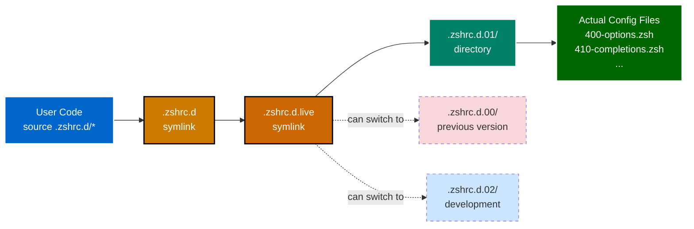

# Versioned Symlink System

**Atomic Updates & Rollback Capability** | **Technical Level: Intermediate**

---

## 📋 Table of Contents

<details>
<summary>Expand Table of Contents</summary>

- [1. Overview](#1-overview)
  - [1.1. The Problem It Solves](#11-the-problem-it-solves)
  - [1.2. Benefits](#12-benefits)
- [Symlink Architecture](#symlink-architecture)
  - [1.3. The Three-Tier Pattern](#13-the-three-tier-pattern)
  - [1.4. Visual Representation](#14-visual-representation)
  - [1.5. Why Three Tiers?](#15-why-three-tiers)
- [2. ⚙️ How It Works](#2-how-it-works)
  - [2.1. Current Configuration](#21-current-configuration)
  - [2.2. Resolution Chain](#22-resolution-chain)
  - [2.3. Atomic Update Example](#23-atomic-update-example)
- [3. Versioned Components](#3-versioned-components)
  - [3.1. Environment (.zshenv)](#31-environment-zshenv)
  - [3.2. Pre-Plugin Configuration](#32-pre-plugin-configuration)
  - [3.3. Plugin Declarations](#33-plugin-declarations)
  - [3.4. Post-Plugin Configuration](#34-post-plugin-configuration)
  - [3.5. Summary Table](#35-summary-table)
- [4. Working with Versions](#4-working-with-versions)
  - [4.1. Editing Configuration](#41-editing-configuration)
  - [4.2. Creating New Files](#42-creating-new-files)
  - [4.3. Viewing All Versions](#43-viewing-all-versions)
- [5. Update Workflow](#5-update-workflow)
  - [5.1. Safe Update Process](#51-safe-update-process)
- [6. ↩️ Rollback Procedure](#6-rollback-procedure)
  - [6.1. When Things Go Wrong](#61-when-things-go-wrong)
  - [6.2. Emergency Recovery](#62-emergency-recovery)
- [7. ✅ Best Practices](#7-best-practices)
  - [7.1. DO ✅](#71-do)
  - [7.2. DON'T ❌](#72-dont)
- [8. Verification Commands](#8-verification-commands)
  - [8.1. Check Current Setup](#81-check-current-setup)
  - [8.2. Verify All Components](#82-verify-all-components)
  - [8.3. Test Symlink Resolution](#83-test-symlink-resolution)
- [9. ️ Advanced Usage](#9-advanced-usage)
  - [9.1. Development Workflow](#91-development-workflow)
  - [9.2. Version Naming Conventions](#92-version-naming-conventions)
- [10. Version Comparison](#10-version-comparison)
  - [10.1. Diff Between Versions](#101-diff-between-versions)
  - [10.2. File Count by Version](#102-file-count-by-version)
- [11. Common Patterns](#11-common-patterns)
  - [11.1. Pattern 1: Incremental Updates](#111-pattern-1-incremental-updates)
  - [11.2. Pattern 2: Major Refactoring](#112-pattern-2-major-refactoring)
  - [11.3. Pattern 3: Feature Flags for Gradual Rollout](#113-pattern-3-feature-flags-for-gradual-rollout)
- [12. Maintenance](#12-maintenance)
  - [12.1. Clean Up Old Versions](#121-clean-up-old-versions)
  - [12.2. Backup Before Major Changes](#122-backup-before-major-changes)
- [13. ⚠️ Common Pitfalls](#13-common-pitfalls)
  - [13.1. Pitfall 1: Editing Symlinks](#131-pitfall-1-editing-symlinks)
  - [13.2. Pitfall 2: Breaking Symlink Chain](#132-pitfall-2-breaking-symlink-chain)
  - [13.3. Pitfall 3: Deleting Active Version](#133-pitfall-3-deleting-active-version)
- [Related Documentation](#related-documentation)

</details>

---

## 1. 🎯 Overview

The versioned symlink system enables **atomic configuration updates** with **instant rollback** capability through a three-tier symlink chain.

### 1.1. The Problem It Solves

Without versioning:

```bash

# Direct editing - risky!

vim .zshrc.d/400-options.zsh

# If you break something, you need to remember what changed
# No easy way to rollback


```

With versioning:

```bash

# Edit versioned copy

vim .zshrc.d.01/400-options.zsh

# Test it
# If broken, instantly rollback symlink to .zshrc.d.00
# No data loss!


```

### 1.2. Benefits

✅ **Atomic Updates**: All-or-nothing configuration changes
✅ **Instant Rollback**: Revert to last working version immediately
✅ **Safe Experimentation**: Develop in non-live versions
✅ **Configuration History**: Multiple versions coexist
✅ **Zero Downtime**: Switch versions without shell restart

---

## 🔗 Symlink Architecture

### 1.3. The Three-Tier Pattern

```text
User References        Active Pointer         Actual Files
    (base)           →     (live)        →    (numbered)
       ↓                      ↓                    ↓
   .zshrc.d          → .zshrc.d.live     →   .zshrc.d.01/
                                                   ├─ 400-options.zsh
                                                   ├─ 410-completions.zsh
                                                   └─ ...

```

### 1.4. Visual Representation



### 1.5. Why Three Tiers?

1. **Base Symlink** (`.zshrc.d`)
   - What users and system reference
   - Stays stable, points to "live"
   - Never changes location

2. **Live Pointer** (`.zshrc.d.live`)
   - Points to current active version
   - This is what you change for updates/rollbacks
   - Single point of configuration control

3. **Numbered Version** (`.zshrc.d.01`)
   - Contains actual configuration files
   - Multiple versions can coexist
   - Edit these, not the symlinks!

---

## 2. ⚙️ How It Works

### 2.1. Current Configuration

```bash

# Check current symlink chain

$ ls -la ~/.config/zsh/ | grep "\.zshrc\.d"

lrwxr-xr-x  .zshrc.d -> .zshrc.d.live
lrwxr-xr-x  .zshrc.d.live -> .zshrc.d.01
drwxr-xr-x  .zshrc.d.01/

```

### 2.2. Resolution Chain

When ZSH sources a file:

```bash

# User/system code says:

source ~/.config/zsh/.zshrc.d/400-options.zsh

# ZSH resolves:

~/.config/zsh/.zshrc.d            # Follow symlink →
~/.config/zsh/.zshrc.d.live       # Follow symlink →
~/.config/zsh/.zshrc.d.01/        # Directory found!
~/.config/zsh/.zshrc.d.01/400-options.zsh  # File loaded

```

### 2.3. Atomic Update Example

```bash

# Currently using version 01

.zshrc.d.live → .zshrc.d.01

# Create new version 02

cp -R .zshrc.d.01 .zshrc.d.02

# Edit version 02

vim .zshrc.d.02/400-options.zsh

# Test in new shell
# (still using version 01 in existing shells)

# Activate version 02 atomically

ln -snf .zshrc.d.02 .zshrc.d.live

# All NEW shells now use version 02
# Existing shells still on version 01 until they reload


```

---

## 3. 📦 Versioned Components

All major configuration components use versioning:

### 3.1. Environment (.zshenv)

```bash
.zshenv → .zshenv.live → .zshenv.01

# Single file versioning
# Contains: 1,415 lines of environment setup


```

### 3.2. Pre-Plugin Configuration

```bash
.zshrc.pre-plugins.d → .zshrc.pre-plugins.d.live → .zshrc.pre-plugins.d.01/

# Directory versioning
# Contains: 7 configuration files


```

### 3.3. Plugin Declarations

```bash
.zshrc.add-plugins.d → .zshrc.add-plugins.d.live → .zshrc.add-plugins.d.00/

# Directory versioning
# Contains: 12 plugin declaration files
# Note: Version 00 (not 01) - convention for plugin declarations


```

### 3.4. Post-Plugin Configuration

```bash
.zshrc.d → .zshrc.d.live → .zshrc.d.01/

# Directory versioning
# Contains: 14 integration files


```

### 3.5. Summary Table

| Component | Base | Live | Active Version | Rollback Version | Type |
|-----------|------|------|----------------|------------------|------|
| Environment | `.zshenv` | `.zshenv.live` | `.zshenv.02` | `.zshenv.01` | File |
| Pre-Plugin | `.zshrc.pre-plugins.d` | `.zshrc.pre-plugins.d.live` | `.zshrc.pre-plugins.d.02/` | `.zshrc.pre-plugins.d.01/` | Directory |
| Plugins | `.zshrc.add-plugins.d` | `.zshrc.add-plugins.d.live` | `.zshrc.add-plugins.d.02/` | `.zshrc.add-plugins.d.00/` | Directory |
| Post-Plugin | `.zshrc.d` | `.zshrc.d.live` | `.zshrc.d.02/` | `.zshrc.d.01/` | Directory |

**Note**: Version `.02` is now the active production layer (as of 2025-11-02). Version `.01` remains available for instant rollback if needed.

---

## 4. 🔧 Working with Versions

### 4.1. Editing Configuration

> 🔴 **CRITICAL**: Always edit the numbered version, NEVER the symlinks!

**✅ CORRECT**:

```bash

# Edit the actual versioned file (current active layer .02)

vim ~/.config/zsh/.zshrc.d.02/400-options.zsh

```

**❌ WRONG**:

```bash

# Don't edit through symlinks

vim ~/.config/zsh/.zshrc.d/400-options.zsh

# This works but is confusing and error-prone


```

### 4.2. Creating New Files

```bash

# Navigate to numbered version (current active layer .02)

cd ~/.config/zsh/.zshrc.d.02/

# Create new file with proper number

vim 520-my-new-feature.zsh

# Add proper header

cat > 520-my-new-feature.zsh << 'EOF'

#!/usr/bin/env zsh
# 520-my-new-feature.zsh - My awesome feature
# Phase: post-plugin
# Dependencies: 410-completions.zsh

# Implementation
# ...

EOF

```

### 4.3. Viewing All Versions

```bash

# See all available versions

cd ~/.config/zsh
ls -ld .zshrc.d.*

# Output:

drwxr-xr-x  .zshrc.d.00/        # Legacy/backup version
drwxr-xr-x  .zshrc.d.01/        # Previous version (rollback)
drwxr-xr-x  .zshrc.d.02/        # Current active (production)
lrwxr-xr-x  .zshrc.d.live -> .zshrc.d.02

```

**Current State**: All components now use `.02` as active production (as of 2025-11-02). Version `.01` remains available for instant rollback if needed.

---

## 5. 🔄 Update Workflow

### 5.1. Safe Update Process

#### Step 1: Work in Available Version

```bash
cd ~/.config/zsh

# Version .02 already exists for all components
# Edit directly in .02 for development

# OR create a new version if needed:
cp -R .zshrc.d.02 .zshrc.d.03

```

#### Step 2: Make Changes

```bash

# Edit version 02 (or your development version)

vim .zshrc.d.02/400-options.zsh

# Add new files

vim .zshrc.d.02/530-new-feature.zsh

```

#### Step 3: Test in Isolated Shell

```bash

# Start new shell with explicit version

env ZDOTDIR=~/.config/zsh-test zsh

# Or manually test files

zsh -i -c "source ~/.config/zsh/.zshrc.d.02/530-new-feature.zsh"

```

#### Step 4: Activate New Version

```bash

# Atomically switch live pointer

cd ~/.config/zsh
ln -snf .zshrc.d.02 .zshrc.d.live

# Verify

ls -la .zshrc.d.live

# Should show: .zshrc.d.live -> .zshrc.d.02


```

#### Step 5: Test in New Shell

```bash

# Open fresh shell

zsh

# Verify everything works

zsh-healthcheck

```

#### Step 6: Commit (Optional)

```bash
git add .zshrc.d.02/ .zshrc.d.live
git commit -m "feat(config): update shell options in v02"

```

---

## 6. ↩️ Rollback Procedure

### 6.1. When Things Go Wrong

If the new version breaks something:

#### Instant Rollback

```bash

# Revert live pointer to previous version

cd ~/.config/zsh
ln -snf .zshrc.d.01 .zshrc.d.live

# Open new shell - back to working state!

zsh

```

#### Verify Rollback

```bash

# Check symlink

ls -la .zshrc.d.live

# Should show: .zshrc.d.live -> .zshrc.d.01

# Test shell

zsh-healthcheck

```

#### Clean Up Failed Version

```bash

# Once stable, remove broken version

rm -rf .zshrc.d.02

```

### 6.2. Emergency Recovery

If symlinks are broken:

```bash

# Recreate live pointer manually

cd ~/.config/zsh
ln -snf .zshrc.d.01 .zshrc.d.live

# Recreate base pointer

ln -snf .zshrc.d.live .zshrc.d

# Test

source ~/.zshrc

```

---

## 7. ✅ Best Practices

### 7.1. DO ✅

1. **Always edit numbered versions**

```bash
   vim .zshrc.d.01/400-options.zsh  # Correct

```

2. **Use version .02 for development**

```bash
   # Version .02 is available for all components
   vim .zshrc.d.02/400-options.zsh
   # Make changes in .02
   # Test thoroughly
   # Switch live pointer when ready

```

3. **Keep multiple versions for safety**

```bash
   # Current setup maintains .01 (active) and .02 (development)
   # Create .03 for experimental features if needed
   # Always have a known-good version to rollback to

```

4. **Test before switching**

```bash
   # Test new version in isolation
   # Only switch live when confident

```

5. **Commit version changes**

```bash
   git add .zshrc.d.02/ .zshrc.d.live
   git commit -m "feat: update to version 02"

```

### 7.2. DON'T ❌

1. **Don't edit through symlinks**

```bash
   vim .zshrc.d/400-options.zsh  # Confusing!

```

2. **Don't delete all versions**

```bash
   # Always keep at least one working version

```

3. **Don't switch without testing**

```bash
   # Test new version first!

```

4. **Don't hard-code version numbers**

```bash
   # ❌ Wrong
   source ~/.config/zsh/.zshrc.d.01/file.zsh

   # ✅ Correct
   source ~/.config/zsh/.zshrc.d/file.zsh
   # (resolves via symlinks to active version)

```

---

## 8. 🔍 Verification Commands

### 8.1. Check Current Setup

```bash

# View symlink chain

ls -la ~/.config/zsh/.zshrc.d*

# Should show:
# lrwxr-xr-x  .zshrc.d -> .zshrc.d.live
# lrwxr-xr-x  .zshrc.d.live -> .zshrc.d.01
# drwxr-xr-x  .zshrc.d.01/


```

### 8.2. Verify All Components

```bash
cd ~/.config/zsh

# Check all versioned components

for base in .zshenv .zshrc.pre-plugins.d .zshrc.add-plugins.d .zshrc.d; do
    echo "=== $base ==="
    ls -la $base* 2>/dev/null | grep "^l\|^d"
    echo
done

```

### 8.3. Test Symlink Resolution

```bash

# Resolve full path

readlink -f ~/.config/zsh/.zshrc.d/400-options.zsh

# Should output:
# /Users/s-a-c/dotfiles/dot-config/zsh/.zshrc.d.01/400-options.zsh


```

---

## 9. 🛠️ Advanced Usage

### 9.1. Development Workflow

#### Scenario: Testing New Feature

```bash

# 1. Create development version

cp -R .zshrc.d.01 .zshrc.d.dev

# 2. Develop in .dev

vim .zshrc.d.dev/540-new-feature.zsh

# 3. Test manually

zsh -i -c "source ~/.config/zsh/.zshrc.d.dev/540-new-feature.zsh && my_test_function"

# 4. When ready, promote to .02

mv .zshrc.d.dev .zshrc.d.02

# 5. Activate

ln -snf .zshrc.d.02 .zshrc.d.live

```

#### Scenario: A/B Testing Configurations

```bash

# Keep two versions:

.zshrc.d.01/  # Version A (conservative)
.zshrc.d.02/  # Version B (experimental)

# Switch between them:

ln -snf .zshrc.d.01 .zshrc.d.live  # Activate A
ln -snf .zshrc.d.02 .zshrc.d.live  # Activate B

# Compare performance
# Version A:

ln -snf .zshrc.d.01 .zshrc.d.live && zsh-performance-baseline

# Version B:

ln -snf .zshrc.d.02 .zshrc.d.live && zsh-performance-baseline

```

### 9.2. Version Naming Conventions

**Current Production Versions** (all components have these):

- `.02` - Active/production version (currently in use as of 2025-11-02)
- `.01` - Previous/rollback version (stable, available for instant rollback)

**Optional Versions**:

- `.00` - Legacy/backup version (if maintained)
- `.03` - Experimental/feature development (when needed)
- `.dev` - Active development branch
- `.test` - Testing/QA
- `.exp` - Experimental features

**Backup Versions**:

- `.backup-YYYYMMDD` - Dated backups

**Recommendation**: Edit `.02` for production changes. Version `.01` serves as a stable rollback point. Create `.03` if you need experimental/development isolation.

---

## 10. 📊 Version Comparison

### 10.1. Diff Between Versions

```bash

# Compare two versions

diff -ur .zshrc.d.01/ .zshrc.d.02/

# Or use git

git diff --no-index .zshrc.d.01/ .zshrc.d.02/

# Show only filenames

diff -qr .zshrc.d.01/ .zshrc.d.02/

```

### 10.2. File Count by Version

```bash

# Count files in each version

for ver in .zshrc.d.*/; do
    echo "$ver: $(ls -1 $ver | wc -l) files"
done

```

---

## 11. 🎯 Common Patterns

### 11.1. Pattern 1: Incremental Updates

```bash

# Start from current

cp -R .zshrc.d.01 .zshrc.d.02

# Make small change

echo "# New feature" >> .zshrc.d.02/500-aliases.zsh

# Test

zsh -i -c "source ~/.config/zsh/.zshrc.d.02/500-aliases.zsh"

# Activate

ln -snf .zshrc.d.02 .zshrc.d.live

# Verify in new shell

zsh

```

### 11.2. Pattern 2: Major Refactoring

```bash

# Create clean version

mkdir .zshrc.d.03

# Build from scratch or selectively copy

cp .zshrc.d.01/400-options.zsh .zshrc.d.03/
cp .zshrc.d.01/410-completions.zsh .zshrc.d.03/

# ... refactor as you go

# Test extensively
# Switch only when ready

ln -snf .zshrc.d.03 .zshrc.d.live

```

### 11.3. Pattern 3: Feature Flags for Gradual Rollout

```bash

# In .zshrc.d.02/540-new-feature.zsh

if (( ${ZSH_ENABLE_NEW_FEATURE:-0} )); then
    # New feature implementation
fi

# Activate version 02 but feature is disabled

ln -snf .zshrc.d.02 .zshrc.d.live

# Users can opt-in

export ZSH_ENABLE_NEW_FEATURE=1

# Later, flip default in .zshenv.01

export ZSH_ENABLE_NEW_FEATURE=${ZSH_ENABLE_NEW_FEATURE:-1}

```

---

## 12. 🧹 Maintenance

### 12.1. Clean Up Old Versions

```bash

# List all versions with dates

ls -ldt .zshrc.d.*/

# Remove old versions (keep 2-3 recent)

rm -rf .zshrc.d.00/

# Keep:
# - Current active (.01)
# - Previous stable (.00 or .02)
# - Development (.dev or .03)


```

### 12.2. Backup Before Major Changes

```bash

# Create dated backup

cp -R .zshrc.d.01 .zshrc.d.backup-$(date +%Y%m%d)

# Or use git

git add .zshrc.d.01/
git commit -m "chore: backup before major refactor"

```

---

## 13. ⚠️ Common Pitfalls

### 13.1. Pitfall 1: Editing Symlinks

❌ **WRONG**:

```bash

# This edits through symlink - confusing!

vim .zshrc.d/400-options.zsh

```

✅ **CORRECT**:

```bash

# Edit the actual active version (.02)

vim .zshrc.d.02/400-options.zsh

```

### 13.2. Pitfall 2: Breaking Symlink Chain

❌ **WRONG**:

```bash

# Don't make base point directly to numbered version

ln -snf .zshrc.d.01 .zshrc.d

```

✅ **CORRECT**:

```bash

# Maintain the chain

ln -snf .zshrc.d.01 .zshrc.d.live  # Live points to version

# Base (.zshrc.d) always points to .live


```

### 13.3. Pitfall 3: Deleting Active Version

❌ **WRONG**:

```bash

# Don't delete version while it's active

rm -rf .zshrc.d.01/  # DANGER if this is active!

```

✅ **CORRECT**:

```bash

# Switch away first

ln -snf .zshrc.d.02 .zshrc.d.live

# Now safe to remove

rm -rf .zshrc.d.01/

```

---

## 🔗 Related Documentation

- [File Organization](070-file-organization.md) - Directory structure
- [Development Guide](090-development-guide.md) - Making changes safely
- [Symlink Chain Diagram](150-diagrams/030-symlink-chain.md) - Visual reference

---

**Navigation:** [← Configuration Phases](040-configuration-phases.md) | [Top ↑](#versioned-symlinks) | [Plugin System →](060-plugin-system.md)

---

*Compliant with AI-GUIDELINES.md (v1.0 2025-10-30)*
