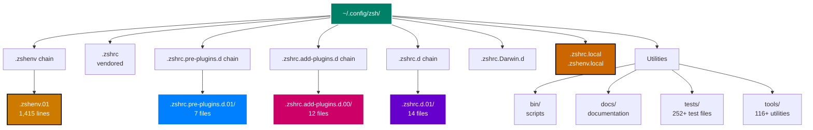

# File Organization

**Directory Structure & Naming** | **Technical Level: Beginner-Intermediate**

---

## 📋 Table of Contents

<details>
<summary>Expand Table of Contents</summary>

- [1. Directory Structure](#1-directory-structure)
  - [1.1. Top-Level Layout](#11-top-level-layout)
  - [1.2. Visual Tree](#12-visual-tree)
- [2. Numbered Prefixes](#2-numbered-prefixes)
  - [2.1. Prefix Ranges](#21-prefix-ranges)
  - [2.2. Numbering Strategy](#22-numbering-strategy)
- [3. File Naming System](#3-file-naming-system)
  - [3.1. Standard Format](#31-standard-format)
  - [3.2. Examples](#32-examples)
  - [3.3. Naming Conventions](#33-naming-conventions)
- [4. File Types](#4-file-types)
  - [4.1. Configuration Files (`.zsh`)](#41-configuration-files-zsh)
  - [4.2. Documentation (`.md`)](#42-documentation-md)
  - [4.3. Tests (`.zsh`, `.sh`, `.bash`)](#43-tests-zsh-sh-bash)
  - [4.4. Tools & Scripts](#44-tools-scripts)
  - [4.5. Finding Files by Purpose](#45-finding-files-by-purpose)
  - [4.6. Quick File Lookup](#46-quick-file-lookup)
- [Related Documentation](#related-documentation)

</details>

---

## 1. 📁 Directory Structure

### 1.1. Top-Level Layout

```text
~/.config/zsh/
├── .zshenv.01                    # Environment (Phase 1)
├── .zshenv.live → .zshenv.01
├── .zshenv → .zshenv.live
│
├── .zshrc → zsh-quickstart-kit/zsh/.zshrc  # Orchestrator (Phase 2)
│
├── .zshrc.pre-plugins.d.01/      # Pre-plugin setup (Phase 3)
│   ├── 000-layer-set-marker.zsh
│   ├── 010-shell-safety.zsh
│   └── ... (7 files total)
├── .zshrc.pre-plugins.d.live → .zshrc.pre-plugins.d.01
├── .zshrc.pre-plugins.d → .zshrc.pre-plugins.d.live
│
├── .zshrc.add-plugins.d.00/      # Plugin declarations (Phase 4)
│   ├── 200-perf-core.zsh
│   ├── 210-dev-php.zsh
│   └── ... (12 files total)
├── .zshrc.add-plugins.d.live → .zshrc.add-plugins.d.00
├── .zshrc.add-plugins.d → .zshrc.add-plugins.d.live
│
├── .zshrc.d.01/                  # Post-plugin integration (Phase 5)
│   ├── 400-options.zsh
│   ├── 410-completions.zsh
│   └── ... (14 files total)
├── .zshrc.d.live → .zshrc.d.01
├── .zshrc.d → .zshrc.d.live
│
├── .zshrc.Darwin.d/              # macOS-specific (Phase 6)
├── .zshrc.local                  # User overrides (Phase 6)
├── .zshenv.local                 # User env vars (Phase 1 override)
│
├── bin/                          # Utility scripts
├── docs/                         # Documentation
├── tests/                        # Test suite
├── tools/                        # Helper tools
├── zsh-quickstart-kit/           # Vendored framework
└── .zgenom/                      # Plugin manager & plugins

```

### 1.2. Visual Tree



---

## 2. 🔢 Numbered Prefixes

### 2.1. Prefix Ranges

| Range | Purpose | Example Files |
|-------|---------|---------------|
| `000-099` | Infrastructure, markers | `000-layer-set-marker.zsh` |
| `100-199` | Core systems, performance | `100-perf-core.zsh` |
| `200-299` | Plugin declarations | `200-perf-core.zsh` (plugins) |
| `300-399` | Advanced features | `300-shell-history.zsh` |
| `400-499` | Integration, setup | `400-options.zsh` |
| `500-599` | User-facing features | `500-aliases.zsh` |
| `900-999` | Final overrides | `990-final-overrides.zsh` |

### 2.2. Numbering Strategy

Use multiples of 10 for standard files:

```bash
400-options.zsh
410-completions.zsh
420-terminal-integration.zsh
430-navigation-tools.zsh
...

```

**Why?** Allows inserting new files between existing ones:

```bash

# Need to add something between 420 and 430?

425-new-feature.zsh  # Loads after 420, before 430

```

---

## 3. 📝 File Naming System

### 3.1. Standard Format

```text
XXX-category-description.zsh
 │      │         │
 │      │         └── Descriptive name (kebab-case)
 │      └── Category/purpose
 └── Load order (000-999)

```

### 3.2. Examples

| File Name | Breakdown |
|-----------|-----------|
| `010-shell-safety.zsh` | 010 = early load, shell-safety = category |
| `270-productivity-fzf.zsh` | 270 = plugin phase, productivity-fzf = purpose |
| `410-completions.zsh` | 410 = post-plugin, completions = feature |
| `990-final-overrides.zsh` | 990 = last, final-overrides = catch-all |

### 3.3. Naming Conventions

✅ **DO**:

- Use descriptive names: `terminal-integration.zsh` not `term.zsh`
- Use kebab-case: `my-feature-name.zsh`
- Include category: `dev-node.zsh`, `productivity-fzf.zsh`
- Use `.zsh` extension always

❌ **DON'T**:

- Use ambiguous names: `stuff.zsh`, `config.zsh`
- Use camelCase: `myFeature.zsh`
- Omit numbers: `options.zsh` (where does it load?)
- Use spaces: `my feature.zsh`

---

## 4. 📂 File Types

### 4.1. Configuration Files (`.zsh`)

Main configuration modules:

```bash
400-options.zsh
410-completions.zsh
500-aliases.zsh

```

### 4.2. Documentation (`.md`)

Located in `docs/`:

```bash
docs/010-zsh-configuration/
├── 000-index.md
├── 010-getting-started.md
└── ...

```

### 4.3. Tests (`.zsh`, `.sh`, `.bash`)

Located in `tests/`:

```bash
tests/
├── unit/
├── integration/
└── performance/

```

### 4.4. Tools & Scripts

Located in `bin/` and `tools/`:

```bash
bin/
├── zsh-healthcheck
├── zsh-performance-baseline
└── ...

tools/
├── segment-lib.zsh
├── perf-regression-classifier.zsh
└── ...

```

---

## 🗺️ Navigation Guide

### 4.5. Finding Files by Purpose

**"I want to add an alias"**

```bash
vim ~/.config/zsh/.zshrc.d.01/500-aliases.zsh

```

**"I want to configure completions"**

```bash
vim ~/.config/zsh/.zshrc.d.01/410-completions.zsh

```

**"I want to add a plugin"**

```bash

# Choose category file

vim ~/.config/zsh/.zshrc.add-plugins.d.00/270-productivity-fzf.zsh

```

**"I want to set an environment variable"**

```bash

# For all shells (including scripts)

vim ~/.config/zsh/.zshenv.01

# For interactive shells only (user preference)

vim ~/.zshrc.local  # Requires approval

```

**"I want to add a safety guard"**

```bash
vim ~/.config/zsh/.zshrc.pre-plugins.d.01/010-shell-safety.zsh

```

### 4.6. Quick File Lookup

```bash

# Find file by name pattern

find ~/.config/zsh -name "*completion*"

# Find file by content

grep -r "specific_function" ~/.config/zsh/.zshrc.d.01/

# List all config files

ls ~/.config/zsh/.zshrc.d.01/

```

---

## 🔗 Related Documentation

- [Naming Conventions](080-naming-conventions.md) - Detailed naming standards
- [Versioned Symlinks](050-versioned-symlinks.md) - Version management
- [Configuration Phases](040-configuration-phases.md) - When files load
- [Development Guide](090-development-guide.md) - Creating new files

---

**Navigation:** [← Plugin System](060-plugin-system.md) | [Top ↑](#file-organization) | [Naming Conventions →](080-naming-conventions.md)

---

*Compliant with AI-GUIDELINES.md (v1.0 2025-10-30)*
