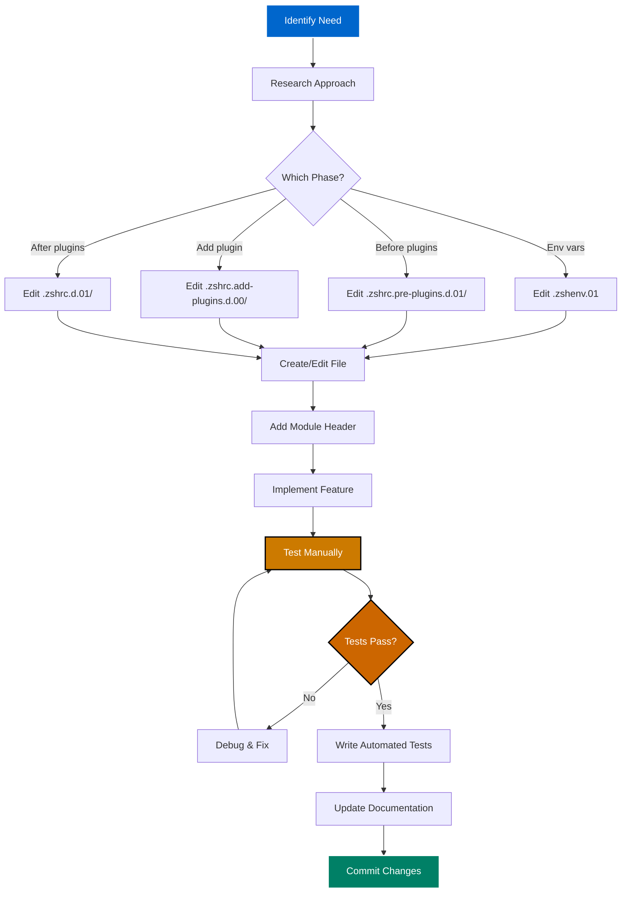

# Development Guide

**Extending & Customizing the Configuration** | **Technical Level: Intermediate-Advanced**

---

## 📋 Table of Contents

<details>
<summary>Expand Table of Contents</summary>

- [1. Before You Start](#1-before-you-start)
  - [1.1. Prerequisites](#11-prerequisites)
  - [1.2. Key Rules](#12-key-rules)
- [2. Development Workflow](#2-development-workflow)
  - [2.1. Standard Process](#21-standard-process)
  - [2.2. Step-by-Step](#22-step-by-step)
- [3. ➕ Adding New Features](#3-adding-new-features)
  - [3.1. Scenario 1: Adding a New Alias](#31-scenario-1-adding-a-new-alias)
  - [3.2. Scenario 2: Adding a Helper Function](#32-scenario-2-adding-a-helper-function)
  - [3.3. Scenario 3: Adding a New Plugin](#33-scenario-3-adding-a-new-plugin)
  - [3.4. Scenario 4: Adding Environment Variable](#34-scenario-4-adding-environment-variable)
  - [3.5. Scenario 5: Creating New Module](#35-scenario-5-creating-new-module)
- [4. Modifying Existing Features](#4-modifying-existing-features)
  - [4.1. Safe Modification Process](#41-safe-modification-process)
  - [4.2. Making Quick Changes](#42-making-quick-changes)
- [5. Testing Your Changes](#5-testing-your-changes)
  - [5.1. Manual Testing](#51-manual-testing)
  - [5.2. Automated Testing](#52-automated-testing)
- [6. ⚡ Performance Considerations](#6-performance-considerations)
  - [6.1. Best Practices](#61-best-practices)
- [7. Common Scenarios](#7-common-scenarios)
  - [7.1. Adding Keybinding](#71-adding-keybinding)
  - [7.2. Adding Completion](#72-adding-completion)
  - [7.3. Adding Development Tool](#73-adding-development-tool)
- [8. ✅ Checklist for New Features](#8-checklist-for-new-features)

</details>

---

## 1. 🎯 Before You Start

### 1.1. Prerequisites

✅ **Read these first**:

1. [Architecture Overview](020-architecture-overview.md) - Understand the system
2. [Startup Sequence](030-startup-sequence.md) - Know when things load
3. [Configuration Phases](040-configuration-phases.md) - Where to place code
4. [Naming Conventions](080-naming-conventions.md) - Follow standards

### 1.2. Key Rules

> 🔴 **CRITICAL RULES**:
> - ✅ Always edit numbered versions (`.zshrc.d.01/`), never symlinks
> - ❌ Never edit vendored files (`.zshrc`, `.zgen-setup`)
> - ⚠️ User local files (`.zshrc.local`) require explicit approval
> - ✅ Test with `zsh -f` for tests
> - ✅ Follow 90%+ test coverage requirement

---

## 2. 🔄 Development Workflow

### 2.1. Standard Process



### 2.2. Step-by-Step

1. **Identify which phase** your code belongs in (see [Configuration Phases](040-configuration-phases.md))
2. **Create or edit file** in the correct numbered version directory
3. **Add module header** with metadata
4. **Implement feature** following conventions
5. **Test manually** in new shell
6. **Write automated tests** (`zsh -f` compatible)
7. **Update documentation** as needed
8. **Commit with conventional commit message**

---

## 3. ➕ Adding New Features

### 3.1. Scenario 1: Adding a New Alias

**Phase**: Post-plugin (5)
**File**: `.zshrc.d.01/500-aliases.zsh`

```bash

# 1. Edit the file

vim ~/.config/zsh/.zshrc.d.01/500-aliases.zsh

# 2. Add your alias
# Modern ls with eza

if command -v eza &>/dev/null; then
    alias ll='eza -la --git --icons'
else
    alias ll='ls -la'
fi

# 3. Test

source ~/.zshrc
ll  # Try it out

# 4. Verify in fresh shell

zsh
ll

```

### 3.2. Scenario 2: Adding a Helper Function

**Phase**: Pre-plugin (3) or Environment (1)
**File**: `.zshrc.pre-plugins.d.01/060-zqs-enhancements.zsh` or `.zshenv.01`

```bash

# 1. Edit appropriate file

vim ~/.config/zsh/.zshrc.pre-plugins.d.01/060-zqs-enhancements.zsh

# 2. Add function with proper naming

function zf::my_helper() {
    local arg1="$1"
    local arg2="${2:-default}"

    # Implementation
    echo "Processing: $arg1, $arg2"
}

# 3. Test

source ~/.zshrc
zf::my_helper "test" "value"

```

### 3.3. Scenario 3: Adding a New Plugin

**Phase**: Plugin (4)
**File**: `.zshrc.add-plugins.d.00/` (create new or use existing category file)

```bash

# 1. Choose or create category file

vim ~/.config/zsh/.zshrc.add-plugins.d.00/270-productivity-fzf.zsh

# 2. Add plugin declaration

if (( $+functions[zgenom] )); then
    zgenom load author/plugin-name
fi

# 3. Reset cache and reload

zgenom reset
source ~/.zshrc

# 4. Verify loaded

zgenom list | grep "plugin-name"

```

### 3.4. Scenario 4: Adding Environment Variable

**Phase**: Environment (1)
**File**: `.zshenv.01` or `.zshrc.local` (user-specific)

```bash

# For system-wide (all shells)

vim ~/.config/zsh/.zshenv.01

# Add near other exports

export MY_CUSTOM_VAR="${MY_CUSTOM_VAR:-default_value}"

# For user-specific

vim ~/.zshrc.local  # Requires approval!
export MY_USER_VAR="value"

```

### 3.5. Scenario 5: Creating New Module

**Template**:

```bash

#!/usr/bin/env zsh
# 520-my-new-module.zsh - Brief description
# Phase: post-plugin
# Requires: 410-completions.zsh
# Updated: 2025-10-31

# Guard against multiple loads

if (( ${+_ZF_MY_MODULE_LOADED} )); then
    return 0
fi
typeset -g _ZF_MY_MODULE_LOADED=1

# Performance tracking

zf::segment "my-module" "start"

# Feature flag (optional)

if (( ${ZSH_ENABLE_MY_MODULE:-1} )); then
    # Module implementation

    function my_module_function() {
        local arg="$1"
        # ...
    }

    # Configuration
    alias mm='my_module_function'
fi

# End tracking

zf::segment "my-module" "end"

```

---

## 4. 🔧 Modifying Existing Features

### 4.1. Safe Modification Process

1. **Create new version**:

```bash
   cp -R .zshrc.d.01 .zshrc.d.02

```

2. **Make changes in .02**:

```bash
   vim .zshrc.d.02/400-options.zsh

```

3. **Test in isolated shell**:

```bash
   # Test specific file
   zsh -i -c "source ~/.config/zsh/.zshrc.d.02/400-options.zsh"

```

4. **Activate new version**:

```bash
   ln -snf .zshrc.d.02 .zshrc.d.live

```

5. **Verify in new shell**:

```bash
   zsh
   zsh-healthcheck

```

### 4.2. Making Quick Changes

For small, safe changes:

```bash

# Edit current version directly

vim ~/.config/zsh/.zshrc.d.01/500-aliases.zsh

# Test

source ~/.zshrc

# If broken, use git to revert

git checkout ~/.config/zsh/.zshrc.d.01/500-aliases.zsh

```

---

## 5. 🧪 Testing Your Changes

### 5.1. Manual Testing

```bash

# 1. Test file syntax

zsh -n ~/.config/zsh/.zshrc.d.01/520-new-feature.zsh

# 2. Test file in isolation

zsh -i -c "source ~/.config/zsh/.zshrc.d.01/520-new-feature.zsh"

# 3. Test function directly

zsh -i -c "source ~/.config/zsh/.zshrc.d.01/520-new-feature.zsh && my_function test"

# 4. Test full shell load

zsh

```

### 5.2. Automated Testing

Create test file:

```bash

# tests/unit/test-my-feature.zsh
#!/usr/bin/env zsh
# TEST_CLASS: unit
# TEST_MODE: zsh-f-required

set -euo pipefail

# Setup

export PATH="/usr/bin:/bin"
REPO_ROOT="$(cd "$(dirname "$0")/../.." && pwd)"

# Source module

source "$REPO_ROOT/.zshrc.d.01/520-new-feature.zsh" || exit 1

# Test assertions

typeset -i PASS=0 FAIL=0

# Test 1: Function exists

if (( $+functions[my_function] )); then
    ((PASS++))
else
    ((FAIL++))
    echo "FAIL: my_function not defined"
fi

# Exit with status

[[ $FAIL -eq 0 ]] && exit 0 || exit 1

```

Run test:

```bash
zsh -f tests/unit/test-my-feature.zsh

```

---

## 6. ⚡ Performance Considerations

### 6.1. Best Practices

1. **Use performance tracking**:

```bash
   zf::segment "my-module" "start"
   # ... expensive operation ...
   zf::segment "my-module" "end"

```

2. **Avoid expensive operations in startup**:

```bash
   # ❌ WRONG - Slow!
   result=$(curl https://api.example.com/status)

   # ✅ CORRECT - Defer to first use
   function check_status() {
       local result=$(curl https://api.example.com/status)
       echo "$result"
   }

```

3. **Use ZSH built-ins**:

```bash
   # ❌ SLOWER - External command
   count=$(echo "$text" | wc -l)

   # ✅ FASTER - ZSH parameter expansion
   count=${#${(f)text}}

```

4. **Lazy-load expensive commands**:

```bash
   function expensive_command() {
       unfunction expensive_command
       source ~/expensive-module.zsh
       expensive_command "$@"
   }

```

---

## 7. 📚 Common Scenarios

### 7.1. Adding Keybinding

```bash

# File: .zshrc.d.01/490-keybindings.zsh

# Add new binding

bindkey '^X^E' edit-command-line  # Ctrl+X Ctrl+E

# With custom widget

my-custom-widget() {
    # Widget implementation
}
zle -N my-custom-widget
bindkey '^X^M' my-custom-widget

```

### 7.2. Adding Completion

```bash

# File: .zshrc.d.01/410-completions.zsh

# Custom completion function

_my_completion() {
    local -a options
    options=('option1' 'option2' 'option3')
    _describe 'options' options
}

compdef _my_completion my-command

```

### 7.3. Adding Development Tool

```bash

# File: .zshrc.d.01/510-developer-tools.zsh

# Check if tool available

if command -v mytool &>/dev/null; then
    # Setup environment
    export MYTOOL_HOME="${XDG_DATA_HOME}/mytool"

    # Add to PATH
    zf::path_prepend "${MYTOOL_HOME}/bin"

    # Create helper
    function mt() {
        mytool "$@"
    }
fi

```

---

## 8. ✅ Checklist for New Features

Before committing:

- [ ] Module header complete
- [ ] Guard against multiple loads
- [ ] Performance tracking added
- [ ] Feature flag implemented (if appropriate)
- [ ] Follows naming conventions
- [ ] Tested manually
- [ ] Automated tests written
- [ ] Documentation updated
- [ ] No vendored files edited
- [ ] Proper phase placement
- [ ] Conventional commit message ready

---

**Navigation:** [← Naming Conventions](080-naming-conventions.md) | [Top ↑](#development-guide) | [Testing Guide →](100-testing-guide.md)

---

*Compliant with AI-GUIDELINES.md (v1.0 2025-10-30)*
