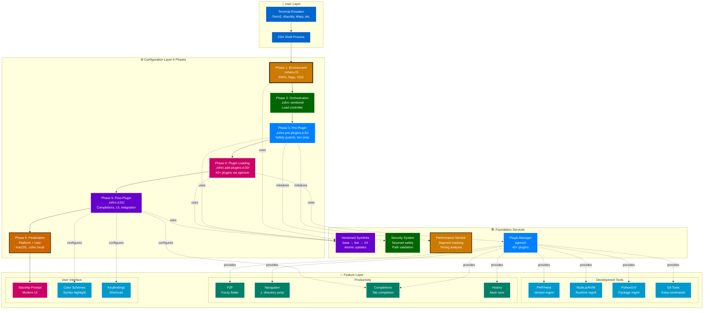
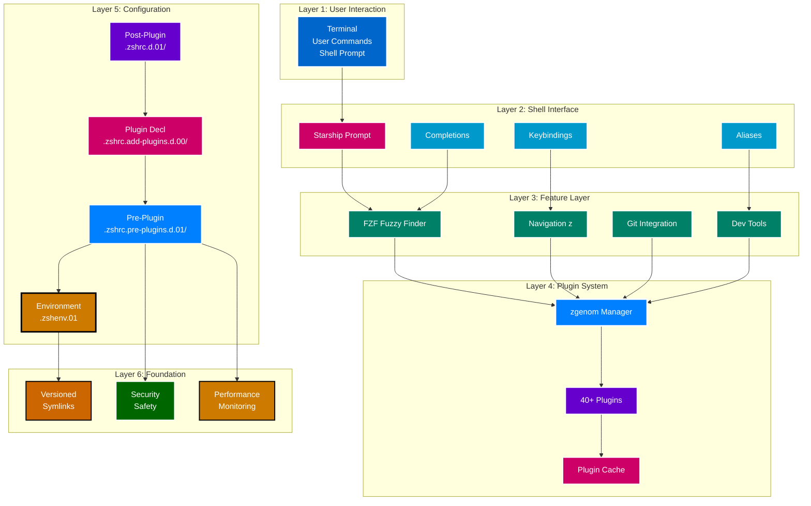

# System Architecture Diagram

**Complete Visual Architecture** | **WCAG AA Compliant**

---

## 🎯 Complete System Architecture

---

## 📊 Layered Architecture View

---

**Navigation:** [← Diagrams Index](000-index.md) | [Top ↑](#architecture-diagram) | [Startup Flow →](020-startup-flow.md)

---

*Compliant with AI-GUIDELINES.md (v1.0 2025-10-30)*
