# Configuration Phase Diagram

**Six-Phase Execution Model** | **WCAG AA Compliant**

---

## 📊 Phase Execution Model

```mermaid
graph LR
    START([Shell<br/>Start]) --> P1

    subgraph P1["🟡 Phase 1<br/>Environment<br/>~100ms"]
        ENV1[Set PATH]
        ENV2[Set Flags]
        ENV3[XDG Dirs]
        ENV1 --> ENV2 --> ENV3
    end

    P1 --> P2

    subgraph P2["🟢 Phase 2<br/>Orchestration<br/>~50ms"]
        ORC1[Load .zshrc]
        ORC2[Trigger Phases]
        ORC1 --> ORC2
    end

    P2 --> P3

    subgraph P3["🔵 Phase 3<br/>Pre-Plugin<br/>~150ms"]
        PRE1[Safety Guards]
        PRE2[Dev Prep]
        PRE3[Monitor Init]
        PRE1 --> PRE2 --> PRE3
    end

    P3 --> P4

    subgraph P4["🔴 Phase 4<br/>Plugin Loading<br/>~800ms"]
        PLG1[Declare Plugins]
        PLG2[Check Cache]
        PLG3[Load Plugins]
        PLG1 --> PLG2 --> PLG3
    end

    P4 --> P5

    subgraph P5["🟣 Phase 5<br/>Post-Plugin<br/>~400ms"]
        POST1[Completions]
        POST2[Keybindings]
        POST3[Aliases]
        POST1 --> POST2 --> POST3
    end

    P5 --> P6

    subgraph P6["🟠 Phase 6<br/>Finalization<br/>~350ms"]
        FIN1[Platform Config]
        FIN2[User Local]
        FIN3[Prompt Init]
        FIN1 --> FIN2 --> FIN3
    end

    P6 --> READY([✅ Ready<br/>~1.8s total])

    style START fill:#008066,stroke:#fff,stroke-width:3px,color:#fff
    style READY fill:#008066,stroke:#fff,stroke-width:3px,color:#fff

    style P1 fill:#cc7a00,stroke:#000,stroke-width:2px,color:#fff
    style ENV1 fill:#cc7a00,stroke:#000,stroke-width:2px,color:#fff
    style ENV2 fill:#cc7a00,stroke:#000,stroke-width:2px,color:#fff
    style ENV3 fill:#cc7a00,stroke:#000,stroke-width:2px,color:#fff

    style P2 fill:#006600,stroke:#fff,stroke-width:2px,color:#fff
    style ORC1 fill:#006600,stroke:#fff,stroke-width:2px,color:#fff
    style ORC2 fill:#006600,stroke:#fff,stroke-width:2px,color:#fff

    style P3 fill:#0080ff,stroke:#fff,stroke-width:2px,color:#fff
    style PRE1 fill:#0080ff,stroke:#fff,stroke-width:2px,color:#fff
    style PRE2 fill:#0080ff,stroke:#fff,stroke-width:2px,color:#fff
    style PRE3 fill:#0080ff,stroke:#fff,stroke-width:2px,color:#fff

    style P4 fill:#cc0066,stroke:#fff,stroke-width:3px,color:#fff
    style PLG1 fill:#cc0066,stroke:#fff,stroke-width:2px,color:#fff
    style PLG2 fill:#cc0066,stroke:#fff,stroke-width:2px,color:#fff
    style PLG3 fill:#cc0066,stroke:#fff,stroke-width:2px,color:#fff

    style P5 fill:#6600cc,stroke:#fff,stroke-width:2px,color:#fff
    style POST1 fill:#6600cc,stroke:#fff,stroke-width:2px,color:#fff
    style POST2 fill:#6600cc,stroke:#fff,stroke-width:2px,color:#fff
    style POST3 fill:#6600cc,stroke:#fff,stroke-width:2px,color:#fff

    style P6 fill:#cc6600,stroke:#000,stroke-width:2px,color:#fff
    style FIN1 fill:#cc6600,stroke:#000,stroke-width:2px,color:#fff
    style FIN2 fill:#cc6600,stroke:#000,stroke-width:2px,color:#fff
    style FIN3 fill:#cc6600,stroke:#000,stroke-width:2px,color:#fff

```

---

## 📋 Phase Characteristics

| Phase | Files | Operations | Plugin Access | Duration | % |
|-------|-------|------------|---------------|----------|---|
| 1 🟡 | 1 | Environment setup | ❌ No | ~100ms | 5% |
| 2 🟢 | 1 | Orchestration | ❌ No | ~50ms | 3% |
| 3 🔵 | 7 | Safety, preparation | ❌ No | ~150ms | 8% |
| 4 🔴 | 12+ | Plugin loading | ⚠️ Loading | ~800ms | 44% |
| 5 🟣 | 14 | Integration, UI | ✅ Yes | ~400ms | 22% |
| 6 🟠 | Variable | Platform, user | ✅ Yes | ~350ms | 18% |

---

**Navigation:** [← Symlink Chain](030-symlink-chain.md) | [Top ↑](#phase-diagram) | [Plugin Loading →](050-plugin-loading.md)

---

*Compliant with AI-GUIDELINES.md (v1.0 2025-10-30)*
