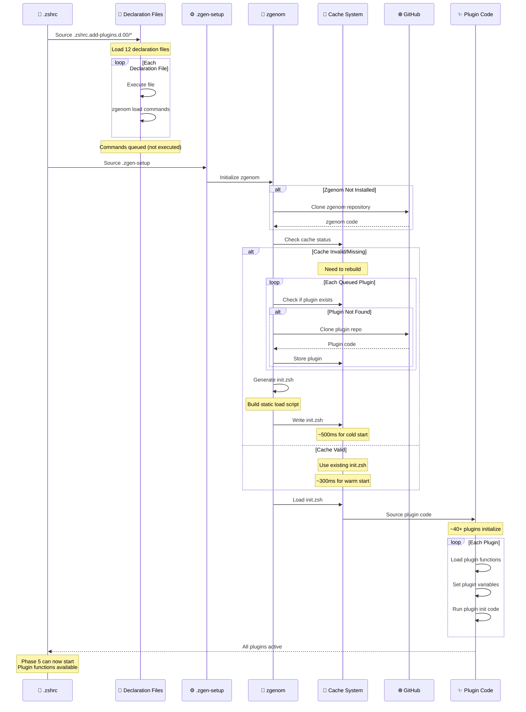
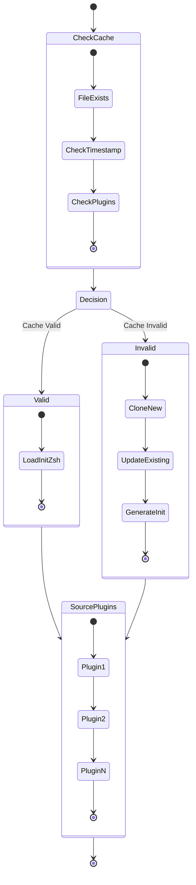
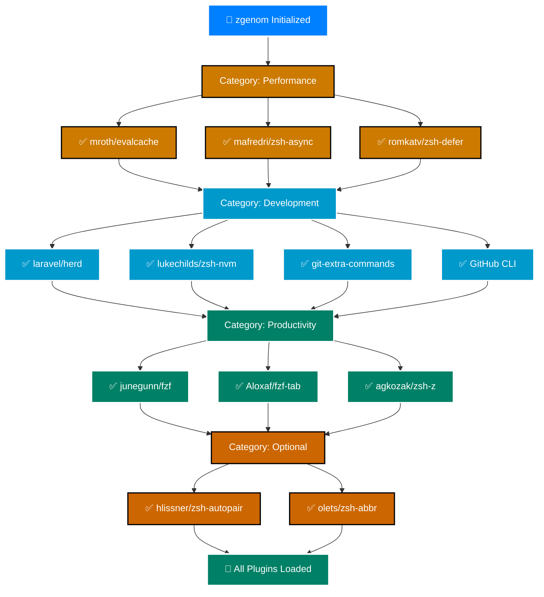

# Plugin Loading Process Diagram

**Zgenom Plugin Management Detail** | **WCAG AA Compliant**

---

## 🔌 Detailed Plugin Loading Sequence

---

## 🎯 Cache Strategy

---

## 📊 Plugin Load Order

---

**Navigation:** [← Phase Diagram](040-phase-diagram.md) | [Top ↑](#plugin-loading) | [Diagrams Index](000-index.md)

---

*Compliant with AI-GUIDELINES.md (v1.0 2025-10-30)*
