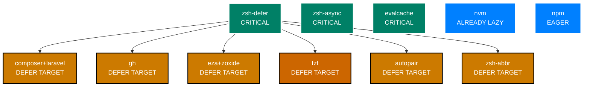

# Plugin Lazy/Async Loading Implementation Plan

**Strategic Performance Optimization** | **P2 Issue 4.3 Resolution**

---

## 📋 Table of Contents

<details>
<summary>Expand Table of Contents</summary>

- [Plugin Lazy/Async Loading Implementation Plan](#plugin-lazyasync-loading-implementation-plan)
  - [📋 Table of Contents](#-table-of-contents)
  - [1. Executive Summary](#1-executive-summary)
    - [1.1. Current State](#11-current-state)
    - [1.2. Target State](#12-target-state)
    - [1.3. Expected Impact](#13-expected-impact)
  - [2. Plugin Inventory \& Analysis](#2-plugin-inventory--analysis)
    - [2.1. Critical Plugins (Must Load Eagerly)](#21-critical-plugins-must-load-eagerly)
    - [2.2. High-Priority Lazy Candidates](#22-high-priority-lazy-candidates)
    - [2.3. Medium-Priority Lazy Candidates](#23-medium-priority-lazy-candidates)
    - [2.4. Excluded from Plan](#24-excluded-from-plan)
    - [2.5. Low-Priority / Already Optimized](#25-low-priority--already-optimized)
  - [3. Dependency Analysis](#3-dependency-analysis)
    - [3.1. Dependency Map](#31-dependency-map)
    - [3.2. Critical Dependencies](#32-critical-dependencies)
    - [3.3. Safe-to-Defer Dependencies](#33-safe-to-defer-dependencies)
  - [4. Lazy Loading Strategies](#4-lazy-loading-strategies)
    - [4.1. Strategy 1: zsh-defer (Deferred Loading)](#41-strategy-1-zsh-defer-deferred-loading)
    - [4.2. Strategy 2: Command Wrapper (On-Demand)](#42-strategy-2-command-wrapper-on-demand)
    - [4.3. Strategy 3: Precmd Hook (First Prompt)](#43-strategy-3-precmd-hook-first-prompt)
    - [4.4. Strategy 4: Native Plugin Lazy Loading](#44-strategy-4-native-plugin-lazy-loading)
  - [5. Implementation Plan](#5-implementation-plan)
    - [5.1. Phase 1: High-Impact, Low-Risk (Week 1-2)](#51-phase-1-high-impact-low-risk-week-1-2)
    - [5.2. Phase 2: Medium-Impact (Week 3-4)](#52-phase-2-medium-impact-week-3-4)
    - [5.3. Phase 3: Optimization \& Tuning (Week 5-6)](#53-phase-3-optimization--tuning-week-5-6)
  - [6. Detailed Plugin Recommendations](#6-detailed-plugin-recommendations)
    - [6.1. PHP Development (composer, laravel)](#61-php-development-composer-laravel)
    - [6.2. GitHub CLI (gh)](#62-github-cli-gh)
    - [6.3. Navigation Tools (eza, zoxide)](#63-navigation-tools-eza-zoxide)
    - [6.4. Autopair](#64-autopair)
    - [6.5. Abbreviations (zsh-abbr)](#65-abbreviations-zsh-abbr)
    - [6.6. ZSH Builtin Replacements](#66-zsh-builtin-replacements)
  - [7. Risk Assessment](#7-risk-assessment)
    - [7.1. Low Risk](#71-low-risk)
    - [7.2. Medium Risk](#72-medium-risk)
    - [7.3. High Risk / Excluded](#73-high-risk--excluded)
  - [8. Testing Strategy](#8-testing-strategy)
    - [8.1. Pre-Implementation Baseline](#81-pre-implementation-baseline)
    - [8.2. Per-Change Validation](#82-per-change-validation)
    - [8.3. Integration Testing](#83-integration-testing)
  - [9. Rollback Plan](#9-rollback-plan)
  - [10. Performance Targets](#10-performance-targets)
    - [Current Baseline](#current-baseline)
    - [Target After Phase 1 (Week 2)](#target-after-phase-1-week-2)
    - [Target After Phase 2 (Week 4)](#target-after-phase-2-week-4)
    - [Stretch Goal (Future)](#stretch-goal-future)
  - [Related Documentation](#related-documentation)

</details>

---

## 1. Executive Summary

### 1.1. Current State

**Problem**: Plugin loading takes **800ms** (44% of total 1.8s startup time)

**Current Plugin Load Sequence**:

```log
200-perf-core.zsh         → evalcache, zsh-async, zsh-defer
210-dev-php.zsh           → composer, laravel (OMZ)
220-dev-node.zsh          → npm, nvm (OMZ) - NVM already lazy
230-dev-systems.zsh       → (no plugins, just PATH)
240-dev-python-uv.zsh     → (no plugins, just completions)
250-dev-github.zsh        → gh (OMZ), copilot alias
260-productivity-nav.zsh  → aliases, eza, zoxide (OMZ)
270-productivity-fzf.zsh  → fzf (OMZ)
280-autopair.zsh          → hlissner/zsh-autopair
290-abbr.zsh              → olets/zsh-abbr
300-brew-abbr.zsh         → (no plugins, uses abbr)
310-user-interface.zsh    → (no plugins)
```

### 1.2. Target State

**Goal**: Reduce plugin loading to **500-600ms** (save 200-300ms)

**Strategy**:

- Defer non-critical plugins using `zsh-defer`
- Implement on-demand loading for language-specific tools
- Use native lazy-loading features where available
- Maintain user experience (no noticeable delays)

### 1.3. Expected Impact

| Optimization | Time Saved | Risk | Priority |
|--------------|------------|------|----------|
| Lazy-load PHP plugins | ~80ms | Low | High |
| Lazy-load GitHub CLI | ~60ms | Low | High |
| Defer zoxide/eza | ~40ms | Low | High |
| Defer autopair | ~20ms | Low | Medium |
| Optimize abbr loading | ~20ms | Low | Medium |
| Replace external utils with ZSH builtins | ~10ms | Low | Medium |
| **Total Potential** | **~230ms** | - | - |

**Note**: FZF deferring excluded from plan - users expect instant Ctrl+R/Ctrl+T. May be reconsidered in future optimization phases.

---

## 2. Plugin Inventory & Analysis

### 2.1. Critical Plugins (Must Load Eagerly)

**Cannot be deferred** - Required for core shell functionality:

1. **Performance Core (200-perf-core.zsh)**
   - `evalcache` - Caching utility for other plugins
   - `zsh-async` - Async execution framework
   - **`zsh-defer`** - Required for lazy loading other plugins
   - **Status**: ✅ Must load first, but already fast
   - **Action**: Keep eager

2. **NPM/NVM (220-dev-node.zsh - partial)**
   - Already uses `NVM_LAZY_LOAD=true`
   - npm plugin provides completions needed immediately
   - **Status**: ✅ Already optimized
   - **Action**: Keep current lazy configuration

### 2.2. High-Priority Lazy Candidates

**High impact, low risk** - Good candidates for immediate optimization:

1. **PHP Development (210-dev-php.zsh)**
   - Plugins: `composer`, `laravel` (OMZ)
   - **Usage**: Only needed when working with PHP projects
   - **Current**: Loads on every shell start
   - **Impact**: ~80ms savings
   - **Risk**: Low - PHP work is infrequent
   - **Strategy**: Lazy-load on first `composer` or `artisan` command
   - **Recommendation**: ✅ **DEFER** using command wrappers

2. **GitHub CLI (250-dev-github.zsh)**
   - Plugin: `gh` (OMZ)
   - Feature: GitHub Copilot alias integration
   - **Usage**: Only needed for GitHub operations
   - **Current**: Loads on every shell start
   - **Impact**: ~60ms savings
   - **Risk**: Low - gh usage is occasional
   - **Strategy**: Defer with `zsh-defer` or command wrapper
   - **Recommendation**: ✅ **DEFER** with zsh-defer

3. **Navigation Tools (260-productivity-nav.zsh)**
   - Plugins: `aliases`, `eza`, `zoxide` (OMZ)
   - **Usage**: Used frequently, but not immediately
   - **Current**: Loads on every shell start
   - **Impact**: ~40ms savings
   - **Risk**: Low - can defer by 1-2 seconds
   - **Strategy**: Use `zsh-defer` with short delay
   - **Recommendation**: ✅ **DEFER** (1-2s delay acceptable)

### 2.3. Medium-Priority Lazy Candidates

**Moderate impact** - Worth implementing after high-priority:

1. **Autopair (280-autopair.zsh)**
   - Plugin: `hlissner/zsh-autopair`
   - **Usage**: Constant (typing), but not critical for startup
   - **Current**: Loads on every shell start
   - **Impact**: ~20ms savings
   - **Risk**: Low - ZLE widgets can load after first prompt
   - **Strategy**: Defer with `precmd` hook
   - **Recommendation**: ✅ **DEFER** to first prompt

2. **Abbreviations (290-abbr.zsh)**
   - Plugin: `olets/zsh-abbr`
   - **Usage**: Constant (typing), includes curated pack
   - **Current**: Loads eagerly with 30+ default abbreviations
   - **Impact**: ~20ms savings
   - **Risk**: Low - can defer abbreviation loading
   - **Strategy**: Defer plugin + pack loading
   - **Recommendation**: ✅ **DEFER** abbreviation pack only

3. **ZSH Builtin Optimization**
   - **Current**: Using external utilities (`stat`, `wc`, `ls`, `tail`, `date`, `find`)
   - **Usage**: Log rotation, file operations
   - **Impact**: ~10ms savings
   - **Risk**: Low - ZSH builtins are faster and eliminate subprocess overhead
   - **Strategy**: Replace with `zstat`, glob qualifiers, `zsh/datetime`
   - **Recommendation**: ✅ **IMPLEMENT** as part of Phase 1

### 2.4. Excluded from Plan

**Not recommended for deferring**:

1. **FZF Integration (270-productivity-fzf.zsh)**
   - **Reason**: Users expect instant Ctrl+R (history) and Ctrl+T (files)
   - **Impact**: ~30ms potential savings
   - **Risk**: High user experience degradation
   - **Decision**: ❌ **EXCLUDE** from current plan
   - **Future**: May reconsider with more sophisticated approach (defer completions only, keep keybindings eager)

### 2.5. Low-Priority / Already Optimized

**No action needed**:

1. **Systems Development (230-dev-systems.zsh)** - Just PATH setup, no plugins
2. **Python UV (240-dev-python-uv.zsh)** - Just completions, already minimal
3. **Brew Abbreviations (300-brew-abbr.zsh)** - Uses abbr, no plugin load
4. **User Interface (310-user-interface.zsh)** - No plugins

---

## 3. Dependency Analysis

### 3.1. Dependency Map



### 3.2. Critical Dependencies

**Must remain eager**:

1. **zsh-defer** - Required for deferring other plugins
2. **zsh-async** - Async framework, may be used by deferred plugins
3. **evalcache** - Caching utility, small footprint
4. **npm** - Provides completions that may be needed immediately

### 3.3. Safe-to-Defer Dependencies

**No blocking dependencies**:

- PHP tools (composer, laravel) - Self-contained
- GitHub CLI (gh) - Self-contained
- Navigation (eza, zoxide) - Independent of other plugins
- FZF - Independent (but keybindings expected by users)
- Autopair - ZLE-only, no dependencies
- Abbreviations - Independent functionality

---

## 4. Lazy Loading Strategies

### 4.1. Strategy 1: zsh-defer (Deferred Loading)

**Best for**: Plugins that don't need to be available immediately

**Mechanism**:

```bash
# Instead of:
zgenom oh-my-zsh plugins/gh

# Use:
zsh-defer zgenom oh-my-zsh plugins/gh
```

**Pros**:

- Simple one-line change
- Configurable delay
- Non-blocking

**Cons**:

- Plugin won't be available for ~1-2 seconds
- May cause brief "command not found" if used immediately

**Best Candidates**: gh, eza, zoxide

### 4.2. Strategy 2: Command Wrapper (On-Demand)

**Best for**: Language-specific tools used occasionally

**Mechanism**:

```bash
# Wrapper function that loads plugin on first use
composer() {
    unfunction composer
    zgenom oh-my-zsh plugins/composer
    zgenom oh-my-zsh plugins/laravel
    composer "$@"
}
```

**Pros**:

- Zero startup cost
- Loads only when needed
- Perfect for occasional tools

**Cons**:

- Slightly more complex
- First invocation slower
- Need wrapper for each command

**Best Candidates**: composer, laravel (installer)

### 4.3. Strategy 3: Precmd Hook (First Prompt)

**Best for**: Interactive features that can wait until first prompt

**Mechanism**:

```bash
_load_autopair() {
    zgenom load hlissner/zsh-autopair
    add-zsh-hook -d precmd _load_autopair
}
add-zsh-hook precmd _load_autopair
```

**Pros**:

- Doesn't block startup
- Available before user types
- Good for ZLE widgets

**Cons**:

- Slight delay before first interaction
- Hook overhead

**Best Candidates**: autopair, abbr

### 4.4. Strategy 4: Native Plugin Lazy Loading

**Best for**: Plugins with built-in lazy loading

**Example**: NVM already uses this

```bash
export NVM_LAZY_LOAD=true
zgenom oh-my-zsh plugins/nvm
```

**Status**: ✅ Already implemented for NVM

---

## 5. Implementation Plan

### 5.1. Phase 1: High-Impact, Low-Risk (Week 1-2)

**Goal**: Implement high-confidence optimizations for ~190ms savings

**Week 1**:

5.1.1. **ZSH Builtin Replacements**

- Replace `stat`, `wc`, `ls`, `tail` with ZSH builtins
- Use `zstat` module for file operations
- Use glob qualifiers for file sorting/filtering
- Use `zsh/datetime` for timestamps
- **Expected**: ~10ms savings + improved portability
- **Risk**: Low
- **File**: `050-logging-and-monitoring.zsh`

5.1.2. **PHP Plugins** (composer, laravel)

- Create command wrapper for `composer` (primary trigger)
- Optionally wrap `laravel` installer if installed globally
- Note: No `artisan` wrapper needed (not a global command - use `php artisan`)
- Test with Laravel project workflows
- **Expected**: ~80ms savings
- **Risk**: Low
- **File**: `210-dev-php.zsh`

5.1.3. **GitHub CLI** (gh)

- Defer with `zsh-defer` (2-second delay)
- Test gh commands and copilot integration
- **Expected**: ~60ms savings
- **Risk**: Low
- **File**: `250-dev-github.zsh`

**Week 2**:

5.1.4. **Navigation Tools** (eza, zoxide)

- Defer with `zsh-defer` (1-second delay)
- Test `cd`, `z`, `ls` workflows
- **Expected**: ~40ms savings
- **Risk**: Low
- **File**: `260-productivity-nav.zsh`

**Checkpoint**: Measure startup time, validate ~190ms improvement

### 5.2. Phase 2: Medium-Impact (Week 3-4)

**Goal**: Implement careful optimizations for additional ~40ms savings

**Week 3**:
5.2.1. **Autopair**

- Defer to first prompt using `precmd` hook
- Test ZLE functionality (bracket pairing, quote pairing)
- **Expected**: ~20ms savings
- **Risk**: Low
- **File**: `280-autopair.zsh`

5.2.2. **Abbreviations** (abbr pack)

- Defer abbreviation pack loading (not plugin itself)
- Keep plugin eager, defer 30+ abbreviation definitions
- **Expected**: ~20ms savings
- **Risk**: Low
- **File**: `290-abbr.zsh`

**Week 4**:
5.2.3. **Fine-tuning & Optimization**

- Adjust defer delays based on usage patterns
- Optimize command wrappers
- Add performance monitoring for deferred loads
- Document all changes

**Checkpoint**: Measure total improvement, validate ~230ms total (800ms → 570ms)

### 5.3. Phase 3: Optimization & Tuning (Week 5-6)

**Goal**: Fine-tune timings and handle edge cases

5.3.1. Adjust defer delays based on actual usage patterns
5.3.2. Optimize command wrappers for common workflows
5.3.3. Add performance monitoring for deferred loads
5.3.4. Document all changes and create user guide
5.3.5. Update roadmap with actual results

---

## 6. Detailed Plugin Recommendations

### 6.1. PHP Development (composer, laravel)

**Priority**: 🔥 HIGH
**Impact**: ~80ms savings
**Risk**: 🟢 LOW

**Current**:

```bash
zgenom oh-my-zsh plugins/composer
zgenom oh-my-zsh plugins/laravel
```

**Recommended**:

```bash
# On-demand loading via command wrapper
_zf_php_plugins_loaded=0

composer() {
    if ((_zf_php_plugins_loaded == 0)); then
        zgenom oh-my-zsh plugins/composer
        zgenom oh-my-zsh plugins/laravel
        _zf_php_plugins_loaded=1
        zf::debug "# [dev-php] Plugins loaded on-demand (triggered by composer)"
    fi
    command composer "$@"
}

# Optional: Laravel installer wrapper (if user has it installed globally)
# Only add if 'laravel' command exists on system
if command -v laravel >/dev/null 2>&1; then
    laravel() {
        if ((_zf_php_plugins_loaded == 0)); then
            zgenom oh-my-zsh plugins/composer
            zgenom oh-my-zsh plugins/laravel
            _zf_php_plugins_loaded=1
            zf::debug "# [dev-php] Plugins loaded on-demand (triggered by laravel)"
        fi
        command laravel "$@"
    }
fi
```

**Why no `artisan()` wrapper**:

- `artisan` is NOT a global command - it's a project-local PHP script
- Users execute it as `php artisan`, not `artisan`
- The Laravel plugin provides completions for `php artisan` commands
- Wrapper triggers on `composer` (most common) or `laravel` installer

**Testing**:

- `composer install` in Laravel project (should trigger plugin load)
- `composer require package` (verify completions after first use)
- `php artisan migrate` (verify artisan completions work via Laravel plugin)
- `laravel new project` (if installer installed, should trigger load)

### 6.2. GitHub CLI (gh)

**Priority**: 🔥 HIGH
**Impact**: ~60ms savings
**Risk**: 🟢 LOW

**Current**:

```bash
zgenom oh-my-zsh plugins/gh
```

**Recommended**:

```bash
# Defer with 2-second delay
zsh-defer zgenom oh-my-zsh plugins/gh
```

**Alternative** (more aggressive):

```bash
# On-demand loading
gh() {
    unfunction gh
    zgenom oh-my-zsh plugins/gh
    gh "$@"
}
```

**Testing**:

- `gh repo list` commands
- `gh copilot` integration
- Verify completions work

### 6.3. Navigation Tools (eza, zoxide)

**Priority**: 🔥 HIGH
**Impact**: ~40ms savings
**Risk**: 🟢 LOW

**Current**:

```bash
zgenom oh-my-zsh plugins/aliases
zgenom oh-my-zsh plugins/eza
zgenom oh-my-zsh plugins/zoxide
```

**Recommended**:

```bash
# Defer with short delay (users expect these quickly)
zsh-defer -t 1 zgenom oh-my-zsh plugins/aliases
zsh-defer -t 1 zgenom oh-my-zsh plugins/eza
zsh-defer -t 1 zgenom oh-my-zsh plugins/zoxide
```

**Testing**:

- `z <directory>` navigation
- `ls` / `eza` commands
- Verify aliases work after 1 second

### 6.4. Autopair

**Priority**: MEDIUM
**Impact**: ~20ms savings
**Risk**: 🟢 LOW

**Current**:

```bash
zgenom load hlissner/zsh-autopair
```

**Recommended**:

```bash
# Load on first prompt
_zf_load_autopair() {
    zgenom load hlissner/zsh-autopair
    add-zsh-hook -d precmd _zf_load_autopair
    unset -f _zf_load_autopair
}
add-zsh-hook precmd _zf_load_autopair
```

**Testing**:

- Type `(`, `[`, `{`, `"`, `'` - verify pairing
- Test in various contexts (strings, commands)
- Verify no ZLE corruption

### 6.5. Abbreviations (zsh-abbr)

**Priority**: MEDIUM
**Impact**: ~20ms savings
**Risk**: 🟢 LOW

**Current**:

```bash
# Plugin loaded + 30+ abbreviations defined immediately
```

**Recommended**:

```bash
# Load plugin eagerly (small), defer abbreviation pack
zgenom load olets/zsh-abbr

# Defer curated abbreviation pack
zsh-defer -c 'source ${ZDOTDIR}/path/to/abbr-pack-loader.zsh'
```

**Testing**:

- Type `gs<SPACE>` - verify expansion after delay
- Test common abbreviations (`gc`, `gp`, `..`)
- Verify no conflicts with user abbreviations

---

### 6.6. ZSH Builtin Replacements

**Priority**: HIGH (Phase 1)
**Impact**: ~10ms savings + improved portability
**Risk**: 🟢 LOW

**Current External Utilities**:

```bash
# In 050-logging-and-monitoring.zsh

# File size (line 49-53)
if sz=$(stat -f %z "$1" 2>/dev/null); then
    echo "${sz}"
else
    wc -c <"$1" 2>/dev/null || echo 0
fi

# File listing with sort (line 66)
local older=($(ls -1t ${pattern} 2>/dev/null | tail -n +$((limit + 1))))

# Timestamp (line 60)
local ts="$(TZ=UTC date +%Y%m%dT%H%M%S 2>/dev/null || date +%Y%m%dT%H%M%S)"

# Age-based find (line 85)
find "${ZDOTDIR:-$HOME}/.logs" -name "perf-*.log" -type f -mtime +"${ZF_LOG_ROTATION_AGE_DAYS}" -delete
```

**Recommended ZSH Builtins**:

```bash
# File size using zstat module
zmodload -F zsh/stat b:zstat
_zf_lr_sizeof() {
    [[ -f "$1" ]] || { echo 0; return 0; }
    local -a fileinfo
    zstat -A fileinfo +size "$1" 2>/dev/null || { echo 0; return 0; }
    echo "${fileinfo[1]}"
}

# File listing using glob qualifiers (sorts by modification time)
# (Om) = reverse order by modification time, [1,limit] = slice first N items
local older=( ${~pattern}(Om[$(( limit + 1 )),-1]) )

# Timestamp using zsh/datetime module
zmodload zsh/datetime
local ts
strftime -s ts "%Y%m%dT%H%M%S" $EPOCHSECONDS

# Age-based cleanup using glob qualifiers
# (mw+N) = modified more than N weeks ago, (md+N) = more than N days
# Note: weeks are more reliable than days for find replacement
zmodload -F zsh/stat b:zstat
local age_weeks=$(( ZF_LOG_ROTATION_AGE_DAYS / 7 ))
local old_logs=( ${ZDOTDIR:-$HOME}/.logs/perf-*.log(Nmw+${age_weeks}) )
(( ${#old_logs[@]} > 0 )) && rm -f "${old_logs[@]}" 2>/dev/null
```

**Benefits**:

- **Performance**: ~10ms savings (no subprocess overhead)
- **Portability**: No dependency on GNU vs BSD utilities
- **Reliability**: ZSH builtins are always available
- **Maintainability**: Consistent ZSH syntax throughout

**Testing**:

```bash
# Test file size function
zmodload -F zsh/stat b:zstat
zstat -A info +size ~/.zshrc
echo "File size: ${info[1]} bytes"

# Test glob qualifiers for age
# List files older than 1 week
ls -l ~/.logs/perf-*.log(mw+1)

# Test datetime
zmodload zsh/datetime
strftime -s now "%Y-%m-%d %H:%M:%S" $EPOCHSECONDS
echo "Current time: $now"
```

**Implementation Notes**:

- Load `zsh/stat` and `zsh/datetime` modules early in `.zshenv`
- Use `-F` flag for selective function loading (faster)
- Provide fallback to external commands if modules unavailable
- Document module requirements

---

## 7. Risk Assessment

### 7.1. Low Risk

✅ **Safe to implement**:

- ZSH builtin replacements - Well-established ZSH features
- PHP plugins (composer, laravel) - Occasional use
- GitHub CLI (gh) - Occasional use
- Navigation defer (1s) - Acceptable delay
- Autopair defer to prompt - ZLE widgets can wait
- Abbreviation pack defer - Typing can wait

### 7.2. Medium Risk

⚠️ **None in current plan** - All medium-risk items excluded

### 7.3. High Risk / Excluded

🔴 **Do NOT defer**:

- zsh-defer itself - Required for deferring others
- zsh-async - May be used by prompt/plugins
- npm - Completions may be needed immediately
- NVM - Already optimized with native lazy loading
- **FZF** - Users expect instant Ctrl+R/Ctrl+T (excluded from plan)

---

## 8. Testing Strategy

### 8.1. Pre-Implementation Baseline

```bash
# Measure current startup time (10 iterations)
for i in {1..10}; do
    time zsh -i -c "exit"
done | awk '/real/ {sum+=$2} END {print "Average:", sum/10, "seconds"}'

# Measure plugin loading time specifically
zmodload zsh/zprof
source ~/.zshrc
zprof | head -30
```

### 8.2. Per-Change Validation

For each deferred plugin:

1. Measure startup time improvement
2. Test primary use cases (see plugin-specific sections)
3. Verify completions still work
4. Check for error messages
5. Test with fresh shell (no precmd hooks loaded)

### 8.3. Integration Testing

Final validation:

1. Complete workflow test (dev work, git operations, etc.)
2. Test in multiple terminal emulators
3. Verify no ZLE corruption
4. Check for race conditions (parallel shell starts)
5. Test with `.zshrc.local` customizations

---

## 9. Rollback Plan

**If issues arise**:

1. **Individual Plugin Rollback**:

   ```bash
   # Revert specific plugin from defer to eager
   # Change from: zsh-defer zgenom oh-my-zsh plugins/gh
   # Back to:     zgenom oh-my-zsh plugins/gh
   ```

2. **Global Disable**:

   ```bash
   # Add to .zshenv.local
   export ZF_DISABLE_LAZY_LOADING=1
   ```

3. **Symlink Rollback**:

   ```bash
   # Roll back to previous version
   cd ~/.config/zsh
   rm .zshrc.add-plugins.d.live
   ln -s .zshrc.add-plugins.d.00 .zshrc.add-plugins.d.live
   ```

---

## 10. Performance Targets

### Current Baseline

| Metric | Value |
|--------|-------|
| Total startup | 1.8s |
| Plugin loading | 800ms (44%) |
| Plugin count | ~15 plugins |

### Target After Phase 1 (Week 2)

| Metric | Target | Change |
|--------|--------|--------|
| Total startup | 1.61s | -190ms |
| Plugin loading | 610ms | -190ms |
| Eager plugins | ~10 | -4 deferred |
| External commands | Reduced | +ZSH builtins |

### Target After Phase 2 (Week 4)

| Metric | Target | Change |
|--------|--------|--------|
| Total startup | 1.57s | -230ms total |
| Plugin loading | 570ms | -230ms total |
| Eager plugins | ~8 | -6 deferred |

### Stretch Goal (Future)

| Metric | Target | Change |
|--------|--------|--------|
| Total startup | 1.50s | -300ms total |
| Plugin loading | 500ms | -300ms total |
| User satisfaction | ✅ No perceived delay | - |

**Note**: FZF optimization excluded from current plan. May be addressed in future optimization cycles with more sophisticated approach.

---

## Related Documentation

- [Performance Guide](110-performance-guide.md) - Performance optimization techniques
- [Plugin System](060-plugin-system.md) - Zgenom and plugin management
- [Roadmap](900-roadmap.md) - Issue 4.3: Plugin Loading Bottleneck
- [Architecture](020-architecture-overview.md) - System design principles

---

**Navigation:** [← Performance Guide](110-performance-guide.md) | [Top ↑](#plugin-lazyasync-loading-implementation-plan) | [Roadmap →](900-roadmap.md)

---

*Compliant with AI-GUIDELINES.md (v1.0 2025-10-31)*
*DO NOT IMPLEMENT without explicit approval - This is a planning document only*
