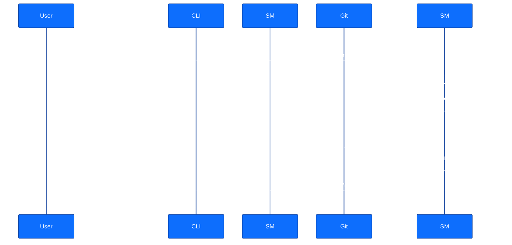
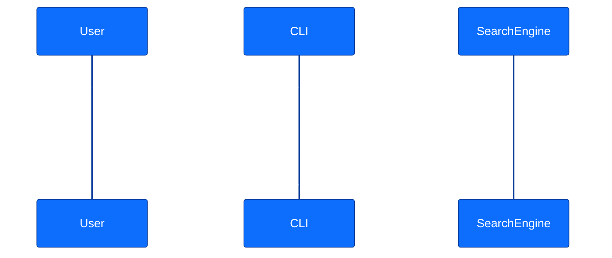
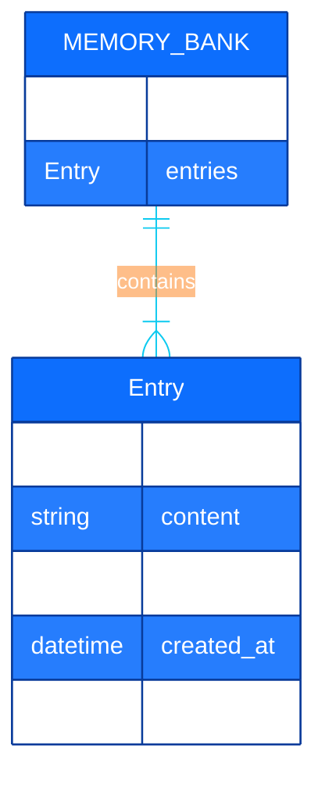

# Kilocode Memory Bank Architecture

<details>
<summary>Table of Contents</summary>

- [1. Overview](#1-overview)
  - [1.1. Core Principles](#11-core-principles)
- [2. System Components](#2-system-components)
  - [2.1. CLI Interface](#21-cli-interface)
  - [2.2. Storage Layer](#22-storage-layer)
  - [2.3. Search and Indexing](#23-search-and-indexing)
- [3. Data Flow and Interactions](#3-data-flow-and-interactions)
  - [3.1. Add Operation](#31-add-operation)
  - [3.2. Search Operation](#32-search-operation)
- [4. Data Model](#4-data-model)
- [5. Version Control Workflow](#5-version-control-workflow)

</details>

## 1. Overview

This document provides a detailed overview of the Kilocode Memory Bank's technical architecture. The system is designed to be robust, performant, and maintainable, adhering to modern development best practices and leveraging a set of powerful, interconnected components.

### 1.1. Core Principles

- **Modularity**: Each component is designed to be independent and easily replaceable.
- **XDG Compliance**: The system respects the XDG Base Directory Specification, ensuring a clean and predictable file structure.
- **Atomic Updates**: Symlink-based versioning guarantees that updates are atomic, preventing data corruption and enabling instant rollbacks.
- **Performance**: All operations, especially search, are optimized to deliver responses in under one second.

## 2. System Components

The Memory Bank consists of several key components that work together to provide a seamless experience.

<!--
alt-text: A diagram showing the system components of the Kilocode Memory Bank.
-->
```mermaid
%%{init: {'theme':'base', 'themeVariables': { 'primaryColor': '#0d6efd', 'primaryTextColor': '#ffffff', 'primaryBorderColor': '#083b9a', 'lineColor': '#0dcaf0', 'secondaryColor': '#198754', 'tertiaryColor': '#fd7e14', 'noteBkgColor': '#f8f9fa', 'noteTextColor': '#212529' }}}%%
graph TD
    subgraph User Interface
        A[CLI Interface]
    end

    subgraph Core Logic
        B[Command Parser]
        C[Search & Filter Engine]
        D[Storage Manager]
        E[Git Version Control]
    end

    subgraph Data Layer
        F[Knowledge Base (JSON)]
        G[Git Repository]
        H[Symlinks for Versioning]
    end

    A --> B
    B --> C
    B --> D
    C --> F
    D --> F
    D --> E
    D --> H
    E --> G

    classDef cli fill:#8E44AD,stroke:#000,stroke-width:2px,color:#fff
    classDef parser fill:#2980B9,stroke:#000,stroke-width:2px,color:#fff
    classDef search fill:#27AE60,stroke:#000,stroke-width:2px,color:#fff
    classDef storage fill:#F39C12,stroke:#000,stroke-width:2px,color:#fff
    classDef git fill:#D35400,stroke:#000,stroke-width:2px,color:#fff
    classDef db fill:#C0392B,stroke:#000,stroke-width:2px,color:#fff
    classDef repo fill:#7F8C8D,stroke:#000,stroke-width:2px,color:#fff
    classDef symlinks fill:#16A085,stroke:#000,stroke-width:2px,color:#fff

    class A cli
    class B parser
    class C search
    class D storage
    class E git
    class F db
    class G repo
    class H symlinks
```

### 2.1. CLI Interface

The Unified CLI is the primary entry point for all user interactions. It provides a consistent and intuitive set of commands for all memory bank operations.

### 2.2. Storage Layer

- **XDG-Compliant Structure**: The data is stored in `$XDG_DATA_HOME/kilocode/memory-bank`.
- **Git Backend**: A Git repository is automatically maintained for versioning and history.
- **Symlink-Based Updates**: The `live` version is a symlink to the current data directory, allowing for atomic updates.

### 2.3. Search and Indexing

The fuzzy search engine uses a relevance-ranking algorithm to provide fast and accurate results. It indexes entries based on content and tags for efficient retrieval.

## 3. Data Flow and Interactions

### 3.1. Add Operation

<!--
alt-text: A sequence diagram showing the process of adding a new entry to the Memory Bank.
-->


### 3.2. Search Operation

<!--
alt-text: A sequence diagram showing the process of searching for an entry in the Memory Bank.
-->


## 4. Data Model

The core data is stored in a structured format, typically JSON, which allows for flexibility and easy parsing.

<!--
alt-text: An entity-relationship diagram showing the data model of the Memory Bank.
-->


## 5. Version Control Workflow

The version control system is designed to be transparent to the user, with automatic commits for every operation.

<!--
alt-text: A flowchart showing the version control workflow for the Memory Bank.
-->
```mermaid
%%{init: {'theme':'base', 'themeVariables': { 'primaryColor': '#0d6efd', 'primaryTextColor': '#ffffff', 'primaryBorderColor': '#083b9a', 'lineColor': '#0dcaf0', 'secondaryColor': '#198754', 'tertiaryColor': '#fd7e14', 'noteBkgColor': '#f8f9fa', 'noteTextColor': '#212529' }}}%%
graph TD
    A[Start] --> B{User Action}
    B --> C[Create New Versioned Directory]
    C --> D[Apply Changes]
    D --> E[Commit to Git]
    E --> F[Update Symlink]
    F --> G[End]

    classDef start fill:#2ECC71,stroke:#000,stroke-width:2px,color:#fff
    classDef action fill:#3498DB,stroke:#000,stroke-width:2px,color:#fff
    classDef create fill:#9B59B6,stroke:#000,stroke-width:2px,color:#fff
    classDef apply fill:#F1C40F,stroke:#000,stroke-width:2px,color:#fff
    classDef commit fill:#E67E22,stroke:#000,stroke-width:2px,color:#fff
    classDef symlink fill:#E74C3C,stroke:#000,stroke-width:2px,color:#fff
    classDef end fill:#1ABC9C,stroke:#000,stroke-width:2px,color:#fff

    class A start
    class B action
    class C create
    class D apply
    class E commit
    class F symlink
    class G end
```

---
[Previous](./000-index.md) | [Next](./000-index.md) | [Top](./000-index.md)
