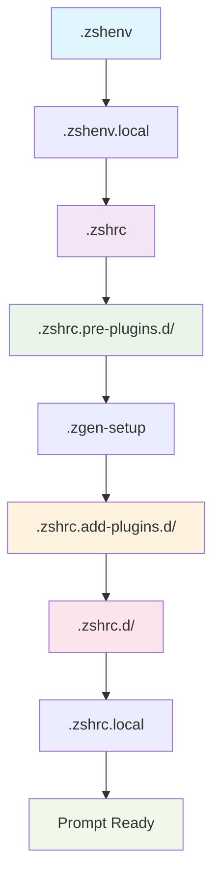

# Activation Flow & Loading Sequence

## Top

## Overview

The ZSH configuration implements a sophisticated multi-stage activation process that ensures safe, performant, and modular shell initialization. This document details the complete startup sequence from shell invocation through prompt readiness.

## High-Level Flow



## Detailed Phase Analysis

### **Phase 1: Environment Setup** (`.zshenv`)

**Timing:** Shell startup (all shell types)
**Purpose:** Establish core environment before any interactive configuration

#### **1.1 Critical Startup Stanza** (Lines 1-70)

```bash

# Flag / Toggle Index - Comprehensive environment variable documentation

# Visual / Splash, Health / Instrumentation, Debug / Diagnostics, Security / Integrity

```

#### Key Variables Set:

- `ZSH_DISABLE_SPLASH` - Splash screen control
- `ZSH_PERF_TRACK` - Performance monitoring
- `ZSH_DEBUG` - Debug logging
- `ZSH_SEC_DISABLE_AUTO_DEDUP` - Security features


#### **1.2 Emergency Protection** (Lines 86-97)

```bash

# EMERGENCY IFS PROTECTION - Prevent corruption during startup

if [[ "$IFS" != $' \t\n' ]]; then
    unset IFS
    IFS=$' \t\n'
    export IFS
fi

# Emergency PATH fix if corrupted with literal $sep

if [[ "$PATH" == *'$sep'* ]]; then
    PATH="${PATH//\$sep/:}"
    export PATH
fi
```

#### **1.3 XDG Base Directory Setup** (Lines 105-111)

```bash
export XDG_CONFIG_HOME="${XDG_CONFIG_HOME:-${HOME}/.config}"
export XDG_CACHE_HOME="${XDG_CACHE_HOME:-${HOME}/.cache}"
export XDG_DATA_HOME="${XDG_DATA_HOME:-${HOME}/.local/share}"
export XDG_STATE_HOME="${XDG_STATE_HOME:-${HOME}/.local/state}"
export XDG_BIN_HOME="${XDG_BIN_HOME:-${HOME}/.local/bin}"
```

#### **1.4 ZDOTDIR Resolution** (Lines 120-161)

- **Primary:** `${HOME}/dotfiles/dot-config/zsh` (if exists)
- **Fallback:** XDG-compliant location
- **Canonicalization:** Resolves symlinks safely


#### **1.5 Terminal Detection** (Lines 174-197)

#### Detection Order:

1. **Alacritty** - `ALACRITTY_LOG` environment variable
2. **Apple Terminal** - Parent process name matching
3. **Ghostty** - Parent process name matching
4. **iTerm2** - `ITERM_SESSION_ID` variable
5. **Kitty** - `TERM` or `KITTY_PID` variables
6. **Warp** - `WARP_IS_LOCAL_SHELL_SESSION` variable
7. **WezTerm** - `WEZTERM_EXECUTABLE` or `WEZTERM_CONFIG_DIR`


#### **1.6 Performance Harness Setup** (Lines 259-260)

```bash
export _PERFORMANCE_MONITORING_LOADED="${_PERFORMANCE_MONITORING_LOADED:-1}"
```

#### **1.7 Debug Policy Application** (Lines 256-257)

```bash
zf::apply_debug_policy
```bash

### **Phase 2: Main Configuration** (`.zshrc`)

**Timing:** Interactive shell startup
**Purpose:** Load core configuration and settings

#### **2.1 Powerlevel10k Instant Prompt** (Lines 43-48)

```bash
if [[ -r "${XDG_CACHE_HOME:-$HOME/.cache}/p10k-instant-prompt-${(%):-%n}.zsh" ]]; then
    source "${XDG_CACHE_HOME:-$HOME/.cache}/p10k-instant-prompt-${(%):-%n}.zsh"
fi
```

#### **2.2 Settings System Initialization** (Lines 59-65)

```bash
_ZQS_SETTINGS_DIR="${ZDOTDIR:-$HOME}/.zqs-settings"
export _ZQS_SETTINGS_DIR
```

#### **2.3 SSH Key Management** (Lines 331-422)

#### Components:

- **1Password Integration** - SSH agent support for macOS/Linux
- **Keychain Integration** - SSH agent forwarding
- **Manual Agent** - Fallback SSH agent management


#### **2.4 Pre-Plugin Directory Loading** (Lines 432-437)

```bash
load-shell-fragments ${ZDOTDIR:-$HOME}/.zshrc.pre-plugins.d
load-shell-fragments "${ZDOTDIR:-$HOME}/.zshrc.pre-plugins.$(uname).d"
```bash

### **Phase 3: Pre-Plugin Setup** (`.zshrc.pre-plugins.d/`)

**Timing:** Before zgenom initialization
**Purpose:** Security, safety, and environment preparation

#### **3.1 Layer Set Marker** (`000-layer-set-marker.zsh`)

- Initializes layered configuration system
- Sets up version tracking


#### **3.2 Shell Safety** (`010-shell-safety-nounset.zsh`)

#### Critical Protection:
```bash

# Snapshot original option states

typeset -gA _ZQS_OPTION_SNAPSHOT

# Disable nounset for Oh-My-Zsh compatibility

if [[ -o nounset ]]; then
    export _ZQS_NOUNSET_WAS_ON=1
    unsetopt nounset
    export _ZQS_NOUNSET_DISABLED_FOR_OMZ=1
fi
```bash

#### **3.3 XDG Extensions** (`015-xdg-extensions.zsh`)

- Ensures XDG directory existence
- Sets up localized cache and log directories


#### **3.4 Delayed Nounset Activation** (`020-delayed-nounset-activation.zsh`)

```bash
zf::enable_nounset_safe() {
    # Controlled nounset re-enablement after environment stabilization
}
```bash

#### **3.5 Log Rotation** (`025-log-rotation.zsh`)

- Manages debug and performance log rotation
- Prevents log directory bloat


#### **3.6 Segment Management** (`030-segment-management.zsh`)

#### Performance Monitoring Setup:
```bash
zf::segment() {
    local module_name="$1" action="$2" phase="${3:-other}"
    # Unified segment timing for all plugin phases
}
```

### **Phase 4: Plugin Manager Setup** (`.zgen-setup`)

**Timing:** After pre-plugin setup, before plugin loading
**Purpose:** Initialize zgenom and prepare plugin environment

#### **4.1 Zgenom Source Detection** (`.zshenv` lines 742-774)

#### Priority Order:

1. `${ZDOTDIR}/.zqs-zgenom` (localized vendored)
2. `${ZDOTDIR}/zgenom` (stow-friendly)
3. `${ZDOTDIR}/.zgenom` (legacy)
4. `${HOME}/.zgenom` (user fallback)


#### **4.2 Plugin Manager Initialization**

- Sets up zgenom paths and variables
- Configures cache and compdump locations
- Loads zgenom functions into `fpath`


### **Phase 5: Plugin Loading** (`.zshrc.add-plugins.d/`)

**Timing:** After zgenom initialization
**Purpose:** Load and configure all plugins

#### **5.1 Performance Core** (`100-perf-core.zsh`)

```bash
zgenom load mroth/evalcache    # Command output caching
zgenom load mafredri/zsh-async # Async job management
zgenom load romkatv/zsh-defer  # Deferred loading
```

#### **5.2 Development Tools**

- **110-dev-php.zsh** - PHP, Composer, Herd integration
- **120-dev-node.zsh** - Node.js, nvm, npm, yarn, bun
- **130-dev-systems.zsh** - Rust, Go, Python, GitHub CLI
- **136-dev-python-uv.zsh** - Python with uv package manager


#### **5.3 Productivity Features**

- **150-productivity-nav.zsh** - Enhanced navigation
- **160-productivity-fzf.zsh** - FZF integration
- **180-optional-autopair.zsh** - Auto-pairing
- **190-optional-abbr.zsh** - Abbreviations


### **Phase 6: Post-Plugin Integration** (`.zshrc.d/`)

**Timing:** After all plugins are loaded
**Purpose:** Terminal integration and final setup

#### **6.1 Terminal Integration** (`100-terminal-integration.zsh`)

- Terminal-specific optimizations
- Environment detection and setup


#### **6.2 Prompt Setup** (`110-starship-prompt.zsh`)

```bash

# Starship prompt initialization

# Configured via ${ZDOTDIR:-$HOME}/.config/starship.toml

```bash

#### **6.3 Live Segment Capture** (`115-live-segment-capture.zsh`)

- Real-time performance monitoring
- Integration with prompt system


#### **6.4 Completion System** (`330-completions.zsh`, `335-completion-styles.zsh`)

```bash
zstyle ':completion:*' accept-exact '*(N)'
zstyle ':completion:*' use-cache on
zstyle ':completion:*' cache-path ${ZDOTDIR:-$HOME}/.zsh/cache
```bash

#### **6.5 History Management** (`300-shell-history.zsh`)

```bash
export HISTSIZE=100000
export SAVEHIST=100000
export HISTFILE=${ZDOTDIR:-$HOME}/.zsh_history
setopt INC_APPEND_HISTORY SHARE_HISTORY
```bash

### **Phase 7: Local Configuration** (`.zshrc.local`)

**Timing:** Final configuration step
**Purpose:** User-specific overrides and customizations

## Timing and Performance

### **Startup Time Breakdown**

**Target:** ~1.8 seconds total

#### Estimated Phase Timing:

- **Phase 1 (.zshenv):** < 100ms
- **Phase 2 (.zshrc):** 200-400ms
- **Phase 3 (Pre-plugins):** 100-200ms
- **Phase 4 (zgenom init):** 50-100ms
- **Phase 5 (Plugin loading):** 800-1200ms ⚠️ **Performance critical**
- **Phase 6 (Post-plugins):** 200-400ms
- **Phase 7 (Local config):** < 50ms


### **Performance Monitoring Points**

#### Segment Markers:
```bash
zf::pre_segment "module" "start"    # Pre-plugin timing
zf::add_segment "module" "start"    # Plugin load timing
zf::post_segment "module" "start"   # Post-plugin timing
```

#### Debug Integration:
```bash
zf::debug "# [module] Operation description"
```

## Error Handling Flow

### **Error Recovery Strategy**

#### Plugin Failures:

1. **Detection:** zgenom load failure
2. **Logging:** Debug message emission
3. **Continuation:** Non-fatal, shell continues
4. **User Notification:** Optional warning messages


#### Environment Errors:

1. **Directory Creation:** Silent failure, continue operation
2. **Permission Issues:** Graceful fallback to user home
3. **Command Absence:** Silent skipping with debug log


### **Debug Enablement**

#### Environment Variables:

- `ZSH_DEBUG=1` - Enable debug output
- `ZSH_PERF_TRACK=1` - Enable performance tracking
- `PERF_SEGMENT_LOG="/path/to/log"` - Specify log location


## Conditional Loading

### **Platform-Specific Loading**

#### macOS Detection:
```bash
if [[ "$(uname -s)" == "Darwin" ]]; then
    load-shell-fragments ${ZDOTDIR:-$HOME}/.macos_aliases.d
fi
```

#### Linux Detection:
```bash
if [[ "$(uname -s)" == "Linux" ]]; then
    load-shell-fragments "${ZDOTDIR:-$HOME}/.zshrc.pre-plugins.$(uname).d"
fi
```

### **Feature Toggles**

#### Environment-Based Control:

- `ZSH_DISABLE_SPLASH=1` - Disable visual splash
- `ZSH_MINIMAL=1` - Minimal configuration mode
- `ZSH_DEBUG=1` - Debug mode
- `ZSH_PERF_TRACK=1` - Performance monitoring


## Integration Points

### **External Tool Integration**

#### During Phase 5 (Plugin Loading):

- **Atuin** - Shell history synchronization
- **FZF** - Fuzzy finder integration
- **Carapace** - Completion system
- **Starship** - Cross-shell prompt


#### During Phase 6 (Post-Plugin):

- **Terminal detection** and optimization
- **History management** setup
- **Completion system** configuration
- **Environment-specific** customizations


## Troubleshooting Flow

### **Common Failure Points**

#### 1. Plugin Load Failures:
```bash

# Check zgenom status

ls -la ${ZDOTDIR}/.zgenom/

# Force plugin cache rebuild

rm -f ${ZDOTDIR}/.zgenom/init.zsh
```

#### 2. Performance Issues:
```bash

# Enable performance tracking

export ZSH_PERF_TRACK=1
export PERF_SEGMENT_LOG="${ZDOTDIR}/perf.log"

# Review timing data

cat ${ZDOTDIR}/perf.log
```

#### 3. Environment Problems:
```bash

# Verify ZDOTDIR

echo $ZDOTDIR

# Check for broken symlinks

find ${ZDOTDIR} -type l -exec test ! -e {} \; -print
```

## Assessment

### **Flow Efficiency**

- ✅ **Clear phase separation** prevents conflicts
- ✅ **Conditional loading** reduces startup time
- ✅ **Error handling** ensures robustness
- ⚠️ **Plugin loading** is the primary performance bottleneck


### **Debuggability**

- ✅ **Comprehensive logging** at each phase
- ✅ **Performance monitoring** throughout
- ✅ **Error messages** guide troubleshooting


### **Maintainability**

- ✅ **Modular structure** allows easy modifications
- ✅ **Standardized interfaces** ensure consistency
- ✅ **Documentation** supports understanding


---

*This activation flow documentation provides the complete startup sequence. For performance optimization, focus on Phase 5 (Plugin Loading) as it represents the largest timing segment.*
