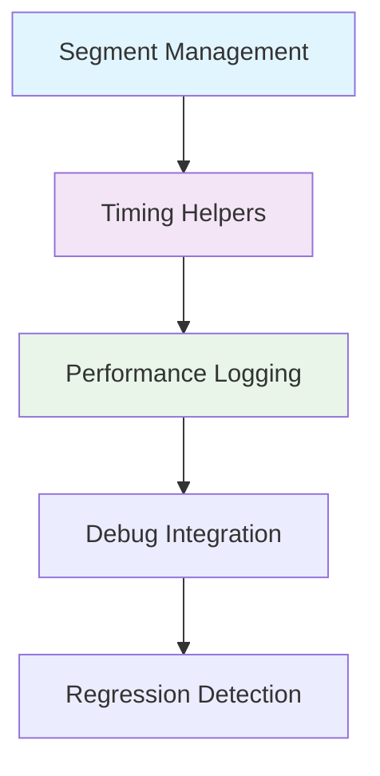

# Performance Monitoring System

## Overview

The ZSH configuration implements a sophisticated performance monitoring system called `_zf*segment` that provides millisecond-precision timing and performance regression detection throughout the shell startup process.

## System Architecture

### **Core Components**



## Performance Monitoring Implementation

### **1. Segment Management Core** (`030-segment-management.zsh`)

**Purpose:** Unified timing system for all plugin phases

```bash
zf::segment() {
    local module_name="$1" action="$2" phase="${3:-other}"
    [[ -z "$module_name" || -z "$action" ]] && return 0

    # Normalize module name (consistent with file naming)
    module_name=${module_name// /-}
    local segment_label="plugin/${module_name}"

    if typeset -f _zsh_perf_segment_${action} >/dev/null 2>&1; then
        # Use full segment library
        _zsh_perf_segment_${action} "$segment_label" "$phase"
    else
        # Fallback timing system
        zf::segment_fallback "$module_name" "$action" "$phase"
    fi
}
```

#### Features:

- **Module normalization** - converts spaces to hyphens
- **Phase tracking** - pre_plugin, add_plugin, post_plugin, other
- **Library integration** - uses full segment library when available
- **Fallback support** - works without external dependencies


### **2. Multi-Source Timing System**

**Challenge:** Need millisecond precision across different systems without external dependencies

**Solution:** Multi-source timing with fallbacks:

```bash
zf::now_ms() {
    if command -v python3 >/dev/null 2>&1; then
        python3 -c "import time; print(int(time.time() * 1000))"
    elif command -v node >/dev/null 2>&1; then
        node -e "console.log(Date.now())"
    elif command -v perl >/dev/null 2>&1; then
        perl -MTime::HiRes=time -E 'say int(time*1000)'
    else
        # Fallback to seconds * 1000
        echo $(($(date +%s) * 1000))
    fi
}
```

#### Timing Sources (in priority order):

1. **Python 3** - `python3 -c "import time; print(int(time.time() * 1000))"`
2. **Node.js** - `node -e "console.log(Date.now())"`
3. **Perl** - `perl -MTime::HiRes=time -E 'say int(time*1000)'`
4. **Date fallback** - `$(($(date +%s) * 1000))`


### **3. Fallback Timing System**

**Purpose:** Provide timing when full segment library unavailable

```bash
zf::segment_fallback() {
    local module_name="$1" action="$2" phase="$3"
    local key="${module_name}_${phase}"

    if [[ "$action" == "start" ]]; then
        _ZF_SEGMENT_START[$key]=$(zf::now_ms)
        zf::debug "# [segment-fallback] Started: plugin/${module_name} phase=${phase}"
    elif [[ "$action" == "end" && -n ${_ZF_SEGMENT_START[$key]:-} ]]; then
        local end_ms=$(zf::now_ms)
        local delta=$((end_ms - _ZF_SEGMENT_START[$key]))
        ((delta < 0)) && delta=0

        # Emit segment data if logging enabled
        if [[ -n "${PERF_SEGMENT_LOG:-}" ]]; then
            print "SEGMENT name=plugin/${module_name} ms=${delta} phase=${phase} sample=${PERF_SAMPLE_CONTEXT:-unknown}" >>"${PERF_SEGMENT_LOG}" 2>/dev/null || true
        fi

        zf::debug "# [segment-fallback] Completed: plugin/${module_name} phase=${phase} delta=${delta}ms"
        unset "_ZF_SEGMENT_START[$key]"
    fi
}
```

#### Features:

- **Global timing array** - `_ZF_SEGMENT_START` tracks active segments
- **Delta calculation** - computes elapsed time in milliseconds
- **Log integration** - writes to `PERF_SEGMENT_LOG` when enabled
- **Debug output** - provides timing feedback during development


### **4. Phase-Specific Helpers**

**Purpose:** Provide convenient timing functions for each phase

```bash
zf::pre_segment() { zf::segment "$1" "$2" "pre_plugin"; }
zf::add_segment() { zf::segment "$1" "$2" "add_plugin"; }
zf::post_segment() { zf::segment "$1" "$2" "post_plugin"; }
```

#### Usage Examples:
```bash
zf::pre_segment "shell-safety" "start"    # Pre-plugin phase
zf::add_segment "perf-core" "start"       # Plugin loading phase
zf::post_segment "completions" "start"    # Post-plugin phase
```

## Performance Logging System

### **Log File Management**

#### Log Location:
```bash
export PERF_SEGMENT_LOG="${ZSH_LOG_DIR}/perf-segments-${ZSH_SESSION_ID}.log"
```

#### Log Format:
```
SEGMENT name=plugin/perf-core ms=150 phase=add_plugin sample=unknown
SEGMENT name=plugin/dev-php ms=75 phase=add_plugin sample=unknown
SEGMENT name=plugin/dev-node ms=200 phase=add_plugin sample=unknown
```bash

**Log Rotation:** (`025-log-rotation.zsh`)

- Manages log file sizes
- Prevents log directory bloat
- Configurable rotation policies


### **Session Tracking**

#### Session Identification:
```bash
export ZSH_SESSION_ID="${ZSH_SESSION_ID:-$$-$(date +%s 2>/dev/null || echo 'unknown')}"
```

#### Benefits:

- **Unique identification** for each shell session
- **Temporal tracking** for performance analysis
- **Debug correlation** across log files


## Debug Integration

### **Debug Output Formatting**

#### Conditional Debug Output:
```bash
zf::debug() {
    if [[ "${ZSH_DEBUG:-0}" == "1" ]]; then
        printf '%s\n' "$@" 1>&2
        if [[ -n "${ZSH_DEBUG_LOG:-}" ]]; then
            print -r -- "$@" >> "$ZSH_DEBUG_LOG" 2>/dev/null || true
        fi
    fi
}
```

#### Usage in Performance Monitoring:
```bash
zf::debug "# [segment-fallback] Started: plugin/${module_name} phase=${phase}"
zf::debug "# [segment-fallback] Completed: plugin/${module_name} phase=${phase} delta=${delta}ms"
```

### **Performance Harness Mode**

#### Minimal Harness Mode:
```bash
if [[ "${PERF_HARNESS_MINIMAL:-0}" == "1" ]]; then
    # Minimal perf harness path detected
    ZSH_DEBUG=${ZSH_DEBUG:-0}
    export ZSH_PERF_PROMPT_MARKERS=1
    # Load only essential performance monitoring
fi
```

#### Benefits:

- **CI/CD optimization** - faster testing in constrained environments
- **Lightweight profiling** - reduced overhead for performance testing
- **Essential monitoring** - maintains timing data for critical paths


## Configuration Variables

### **Performance Control Flags**

#### Core Flags:
```bash
export ZSH_PERF_TRACK="${ZSH_PERF_TRACK:-0}"                    # Master performance tracking
export PERF_SEGMENT_LOG="${PERF_SEGMENT_LOG:-}"                 # Log file location
export PERF_SEGMENT_TRACE="${PERF_SEGMENT_TRACE:-0}"            # Verbose tracing
export PERF_CAPTURE_FAST="${PERF_CAPTURE_FAST:-0}"              # Reduced capture mode
```

#### Debug Integration:
```bash
export ZSH_DEBUG="${ZSH_DEBUG:-0}"                              # Master debug flag
export ZSH_DEBUG_LOG="${ZSH_DEBUG_LOG:-${ZSH_LOG_DIR}/${ZSH_SESSION_ID}-zsh-debug.log}"
export DEBUG_ZSH_REDESIGN="${DEBUG_ZSH_REDESIGN:-0}"            # Redesign-specific debug
```

### **Timing Configuration**

#### Segment Timing:
```bash
export ZF_WITH_TIMING_EMIT="${ZF_WITH_TIMING_EMIT:-auto}"       # High-level timing summary
export PERF_HARNESS_MINIMAL="${PERF_HARNESS_MINIMAL:-0}"        # Minimal harness mode
export PERF_HARNESS_TIMEOUT_SEC="${PERF_HARNESS_TIMEOUT_SEC:-0}" # Watchdog timeout
```

## Usage Patterns

### **Module Timing Pattern**

#### Standard Module Implementation:
```bash

#!/usr/bin/env zsh

# 100-perf-core.zsh - Core Performance Plugins

# Phase 2: Performance + Core Plugins

zf::add_segment "perf-core" "start"
zf::debug "# [perf-core] Loading performance utilities..."

# Plugin loading code here...

zf::debug "# [perf-core] Performance utilities loaded"
zf::add_segment "perf-core" "end"

return 0
```

#### Benefits:

- **Consistent timing** across all modules
- **Debug visibility** into loading process
- **Performance regression detection**
- **Easy troubleshooting** of slow modules


### **Complex Operation Timing**

#### Multi-Operation Modules:
```bash
zf::add_segment "dev-tools" "start"

zf::add_segment "php-setup" "start"

# PHP setup operations

zf::add_segment "php-setup" "end"

zf::add_segment "node-setup" "start"

# Node.js setup operations

zf::add_segment "node-setup" "end"

zf::add_segment "dev-tools" "end"
```

#### Benefits:

- **Hierarchical timing** - track sub-operations
- **Performance attribution** - identify slow sub-components
- **Debug granularity** - detailed troubleshooting


## Performance Analysis Tools

### **Log Analysis**

#### Basic Performance Review:
```bash

# View recent performance data

tail -20 "${ZSH_LOG_DIR}/perf-segments-${ZSH_SESSION_ID}.log"

# Sort by slowest operations

sort -k4 -nr "${ZSH_LOG_DIR}/perf-segments-${ZSH_SESSION_ID}.log"

# Filter by phase

grep "phase=add_plugin" "${ZSH_LOG_DIR}/perf-segments-${ZSH_SESSION_ID}.log"
```

#### Performance Summary:
```bash

# Generate performance summary

awk '
    /^SEGMENT/ {
        gsub(/.*ms=/, ""); gsub(/ phase=.*/, "");
        time[$1] += $2; count[$1]++
    }
    END {
        for (module in time) {
            avg = time[module] / count[module]
            print module ": " time[module] "ms total, " count[module] " calls, " avg "ms avg"
        }
    }
' "${ZSH_LOG_DIR}/perf-segments-${ZSH_SESSION_ID}.log"
```

### **Regression Detection**

#### Historical Comparison:
```bash

# Compare current performance with baseline

function compare_performance() {
    local current_log="${ZSH_LOG_DIR}/perf-segments-${ZSH_SESSION_ID}.log"
    local baseline_log="${ZSH_LOG_DIR}/perf-baseline.log"

    if [[ -f "$baseline_log" ]]; then
        echo "Performance regression analysis:"
        # Compare timing data between current and baseline
    fi
}
```

## Integration with Development Tools

### **Atuin Integration**

#### History Performance Monitoring:
```bash

# Atuin initialization timing

zf::post_segment "atuin" "start"

# Atuin initialization code

zf::post_segment "atuin" "end"
```

### **FZF Integration**

#### Fuzzy Finder Performance:
```bash

# FZF setup timing

zf::post_segment "fzf" "start"

# FZF initialization code

zf::post_segment "fzf" "end"
```

### **Carapace Integration**

#### Completion System Timing:
```bash

# Carapace initialization timing

zf::post_segment "carapace" "start"

# Carapace setup code

zf::post_segment "carapace" "end"
```

## Performance Optimization

### **Current Performance Targets**

**Startup Time Goal:** ~1.8 seconds

#### Phase Breakdown:

- **Environment Setup:** < 100ms
- **Pre-plugin Setup:** 100-200ms
- **Plugin Loading:** 800-1200ms ⚠️ **Primary optimization target**
- **Post-plugin Setup:** 200-400ms
- **Prompt Ready:** < 100ms


### **Optimization Strategies**

#### 1. Plugin Loading Optimization:
```bash

# Deferred loading for non-critical plugins

zgenom load romkatv/zsh-defer || true

# Async loading for independent plugins

zgenom load mafredri/zsh-async || true
```

#### 2. Cache Utilization:
```bash

# Efficient zgenom caching

export ZGEN_CUSTOM_COMPDUMP="${ZSH_CACHE_DIR}/zcompdump_${ZSH_VERSION:-unknown}"

# Plugin load caching

zgenom bin zgenom save
```

#### 3. Conditional Loading:
```bash

# Only load when needed

if [[ -d "/some/optional/path" ]]; then
    zf::add_segment "optional-feature" "start"
    # Optional feature loading
    zf::add_segment "optional-feature" "end"
fi
```

## Assessment

### **Strengths**

- ✅ **Millisecond-precision timing** across platforms
- ✅ **Comprehensive phase tracking** throughout startup
- ✅ **Multiple fallback timing sources**
- ✅ **Integration with debug system**
- ✅ **Performance regression detection**


### **Areas for Improvement**

- ⚠️ **Plugin loading** remains the primary performance bottleneck
- ⚠️ **Log analysis tools** could be more sophisticated
- ⚠️ **Real-time performance feedback** for users


### **Performance Best Practices**

- ✅ **Always use `zf::segment`** for module timing
- ✅ **Log significant operations** with `zf::debug`
- ✅ **Use conditional loading** for optional features
- ✅ **Leverage zgenom caching** for plugin performance


## Troubleshooting

### **Performance Issues**

#### 1. Slow Plugin Loading:
```bash

# Enable detailed performance tracking

export ZSH_PERF_TRACK=1
export PERF_SEGMENT_TRACE=1

# Identify slow plugins

grep "SEGMENT" "${ZSH_LOG_DIR}/perf-segments-${ZSH_SESSION_ID}.log" | sort -k4 -nr
```

#### 2. Timing Anomalies:
```bash

# Check for timing source issues

zf::now_ms  # Test timing function directly

# Verify log file permissions

ls -la "${ZSH_LOG_DIR}/"
```

#### 3. Memory Usage:
```bash

# Monitor memory usage during startup

export PERF_SEGMENT_LOG="${ZSH_LOG_DIR}/perf.log"
/usr/bin/time zsh -c exit
```

### **Debug Commands**

#### Quick Performance Check:
```bash

# Enable performance monitoring for current session

export ZSH_PERF_TRACK=1

# Run shell with performance monitoring

zsh
```

#### Performance Log Review:
```bash

# View recent performance data

tail -50 "${ZSH_LOG_DIR}/perf-segments-$(date +%Y%m%d).log"

# Generate performance summary

grep "SEGMENT" "${ZSH_LOG_DIR}/perf-segments-*.log" | awk -F'[: ]' '
    {time[$3] += $5; count[$3]++}
    END {for (mod in time) print mod ": " time[mod] "ms (" count[mod] " calls)"}
'
```

## Future Enhancements

### **Proposed Improvements**

- **Real-time performance dashboard**
- **Performance trend analysis**
- **Automatic performance regression alerts**
- **Plugin performance scoring system**


### **Advanced Features**

- **Memory usage tracking** per module
- **CPU usage monitoring** during startup
- **Network request timing** for remote plugins
- **Performance visualization** tools


---

*The performance monitoring system provides comprehensive visibility into shell startup performance, enabling data-driven optimization and troubleshooting. The multi-source timing approach ensures reliable millisecond-precision timing across different system configurations.*
