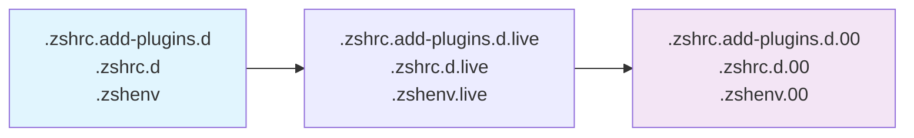

# Layered Configuration System

## Overview

The ZSH configuration implements a sophisticated **layered symlink system** that enables safe configuration updates, environment-specific customizations, and rollback capabilities. This system provides a robust mechanism for managing configuration versions while maintaining safety and flexibility.

## System Architecture

### **Core Concept**

#### Layered Structure:
```
Active Configuration → Live Version → Stable Version
      ↓                    ↓             ↓
.zshrc.add-plugins.d → .live → .00 (backup)
```

#### Benefits:

- **Safe updates** - Active config points to stable version
- **Easy rollback** - Quick reversion to previous state
- **Development workflow** - Separate active development from stable releases


### **Symlink Chain**



## Implementation Details

### **1. Current Active Files**

#### Symlink Structure:
```bash

# Active configuration files (what the shell loads)

.zshrc.add-plugins.d -> .zshrc.add-plugins.d.live
.zshrc.d -> .zshrc.d.live
.zshenv -> .zshenv.live

# Live versions (current stable)

.zshrc.add-plugins.d.live -> .zshrc.add-plugins.d.00
.zshrc.d.live -> .zshrc.d.00
.zshenv.live -> .zshenv.00

# Backup versions (previous stable)

.zshrc.add-plugins.d.00  # Contains actual configuration files
.zshrc.d.00              # Contains actual configuration files
.zshenv.00               # Contains actual configuration files
```

### **2. Version Management**

#### Three States:

1. **`.00` files** - Stable backup versions
2. **`.live` symlinks** - Current active versions
3. **No extension** - Development or live editing versions


#### State Transitions:
```bash

# Development state

edit .zshrc.add-plugins.d/110-dev-php.zsh

# Deploy to live

ln -sf .zshrc.add-plugins.d.live .zshrc.add-plugins.d
.zshrc.add-plugins.d.live -> .zshrc.add-plugins.d.00

# Update backup

cp -r .zshrc.add-plugins.d/* .zshrc.add-plugins.d.00/
```

## Directory Structure Analysis

### **Main Configuration Directories**

| Directory | Purpose | State |
|-----------|---------|-------|
| `.zshrc.pre-plugins.d/` | Pre-plugin setup | Active development |
| `.zshrc.add-plugins.d/` | Plugin definitions | Active development |
| `.zshrc.d/` | Post-plugin integration | Active development |

### **Backup Directories**

| Directory | Purpose | Relationship |
|-----------|---------|--------------|
| `.zshrc.pre-plugins.d.00/` | Pre-plugin backup | `.zshrc.pre-plugins.d` → `.live` → `.00` |
| `.zshrc.add-plugins.d.00/` | Plugin backup | `.zshrc.add-plugins.d` → `.live` → `.00` |
| `.zshrc.d.00/` | Post-plugin backup | `.zshrc.d` → `.live` → `.00` |

## Usage Patterns

### **Safe Configuration Updates**

#### Workflow:

1. **Edit active files** (`.zshrc.add-plugins.d/`, etc.)
2. **Test configuration** in development environment
3. **Deploy to live** by updating symlinks
4. **Create backup** by copying to `.00` versions


#### Commands:
```bash

# Edit configuration

vim .zshrc.add-plugins.d/110-dev-php.zsh

# Test configuration

zsh -c "source .zshenv && source .zshrc"

# Deploy to live (update symlink)

ln -sf .zshrc.add-plugins.d.live .zshrc.add-plugins.d

# Update backup

cp -r .zshrc.add-plugins.d/* .zshrc.add-plugins.d.00/
```

### **Rollback Procedure**

#### Emergency Rollback:
```bash

# Quick rollback to previous stable version

ln -sf .zshrc.add-plugins.d.00 .zshrc.add-plugins.d.live
ln -sf .zshrc.add-plugins.d.live .zshrc.add-plugins.d

# Restart shell or source files

source .zshenv && source .zshrc
```

#### Verification:
```bash

# Verify rollback

ls -la .zshrc.add-plugins.d*

# Should show: .zshrc.add-plugins.d -> .zshrc.add-plugins.d.live -> .zshrc.add-plugins.d.00

```

## Environment-Specific Configurations

### **Layered System Benefits**

#### Environment Adaptation:
```bash

# Platform-specific configurations

.zshrc.pre-plugins.darwin.d/    # macOS-specific
.zshrc.pre-plugins.linux.d/     # Linux-specific

# Environment-specific configurations

.zshrc.work.d/                  # Work environment
.zshrc.personal.d/              # Personal environment
```

#### Loading Strategy:
```bash

# Load base pre-plugin configurations

load-shell-fragments ${ZDOTDIR:-$HOME}/.zshrc.pre-plugins.d

# Load platform-specific configurations

if [[ "$(uname -s)" == "Darwin" ]]; then
    load-shell-fragments "${ZDOTDIR:-$HOME}/.zshrc.pre-plugins.darwin.d"
fi

# Load environment-specific configurations

if [[ -d "${ZDOTDIR:-$HOME}/.zshrc.work.d" ]]; then
    load-shell-fragments "${ZDOTDIR:-$HOME}/.zshrc.work.d"
fi
```

## Integration with Version Control

### **Git Integration**

#### Repository Structure:
```bash
/Users/s-a-c/dotfiles/dot-config/zsh/
├── .zshrc.add-plugins.d/           # Active development
├── .zshrc.add-plugins.d.00/       # Git-tracked stable version
├── .zshrc.d/                      # Active development
├── .zshrc.d.00/                   # Git-tracked stable version
└── docs/                          # Documentation
```

#### Git Strategy:

- **Track `.00` versions** in version control
- **Ignore active directories** in `.gitignore`
- **Deploy updates** by copying from development to `.00`


### **Update Workflow**

#### Automated Update Process:
```bash

#!/bin/bash

# update-zsh-config.sh

# Copy active configurations to backup

cp -r .zshrc.add-plugins.d/* .zshrc.add-plugins.d.00/
cp -r .zshrc.d/* .zshrc.d.00/
cp .zshenv .zshenv.00

# Update symlinks to point to backup

ln -sf .zshrc.add-plugins.d.00 .zshrc.add-plugins.d.live
ln -sf .zshrc.d.00 .zshrc.d.live
ln -sf .zshenv.00 .zshenv.live

# Update active symlinks

ln -sf .zshrc.add-plugins.d.live .zshrc.add-plugins.d
ln -sf .zshrc.d.live .zshrc.d
ln -sf .zshenv.live .zshenv
```

## Development Workflow

### **Feature Development**

#### Safe Feature Addition:

1. **Develop in active directories**
2. **Test thoroughly** in development environment
3. **Deploy to staging** (update `.live` symlinks)
4. **Final deployment** (update `.00` backups)
5. **Commit changes** to version control


#### Example:
```bash

# 1. Develop new plugin

vim .zshrc.add-plugins.d/200-new-plugin.zsh

# 2. Test configuration

zsh --interactive

# 3. Deploy to live

ln -sf .zshrc.add-plugins.d.live .zshrc.add-plugins.d

# 4. Update backup and commit

cp -r .zshrc.add-plugins.d/* .zshrc.add-plugins.d.00/
git add .zshrc.add-plugins.d.00/
git commit -m "Add new-plugin configuration"
```

### **Environment-Specific Customization**

#### Work vs Personal Setup:
```bash

# Personal configuration

echo "export WORK_MODE=0" > .zshrc.d/100-personal-settings.zsh

# Work configuration

echo "export WORK_MODE=1" > .zshrc.work.d/100-work-settings.zsh
```

#### Conditional Loading:
```bash

# In .zshrc.d/ configuration

if [[ "$WORK_MODE" == "1" ]]; then
    # Load work-specific settings
    load-shell-fragments .zshrc.work.d/
fi
```

## Maintenance & Housekeeping

### **Cleanup Procedures**

#### Log Rotation:
```bash

# Clean old performance logs

find "${ZSH_LOG_DIR}" -name "perf-segments-*.log" -mtime +7 -delete

# Clean old debug logs

find "${ZSH_LOG_DIR}" -name "*-zsh-debug.log" -mtime +30 -delete
```

#### Cache Management:
```bash

# Clean zgenom cache if corrupted

rm -rf "${ZDOTDIR}/.zgenom/"

# Rebuild plugin cache

zgenom reset && zgenom save
```

### **Health Checks**

#### Configuration Validation:
```bash

# Check for broken symlinks

find "${ZDOTDIR}" -type l -exec test ! -e {} \; -print

# Verify all configuration files are readable

find "${ZDOTDIR}" -name "*.zsh" -exec zsh -n {} \;

# Check plugin loading

zgenom list | grep -v "loaded successfully"
```

#### Performance Monitoring:
```bash

# Monitor configuration load time

time zsh -c "source .zshenv && source .zshrc && echo 'Configuration loaded'"

# Check for slow-loading modules

grep "SEGMENT" "${ZSH_LOG_DIR}/perf-segments-*.log" | sort -k4 -nr
```

## Troubleshooting

### **Common Issues**

#### 1. Broken Symlinks:
```bash

# Find broken symlinks

find "${ZDOTDIR}" -type l -exec test ! -e {} \; -print

# Fix broken symlinks

ln -sf .zshrc.add-plugins.d.00 .zshrc.add-plugins.d.live
ln -sf .zshrc.add-plugins.d.live .zshrc.add-plugins.d
```

#### 2. Configuration Conflicts:
```bash

# Check for duplicate configurations

find . -name "*.zsh" -exec basename {} \; | sort | uniq -d

# Review duplicate files

diff .zshrc.add-plugins.d/195-optional-brew-abbr.zsh .zshrc.d/195-optional-brew-abbr.zsh
```

#### 3. Version Confusion:
```bash

# Clarify current state

ls -la .zshrc.add-plugins.d*

# Understand symlink chain

readlink -f .zshrc.add-plugins.d

# Output: .zshrc.add-plugins.d.00

```

### **Recovery Procedures**

#### Emergency Recovery:
```bash

# If active configuration is broken

# 1. Rollback to backup

ln -sf .zshrc.add-plugins.d.00 .zshrc.add-plugins.d.live
ln -sf .zshrc.add-plugins.d.live .zshrc.add-plugins.d

# 2. Verify functionality

zsh -c "echo 'Configuration test successful'"

# 3. Investigate root cause

# Check git log for recent changes

git log --oneline -10 .zshrc.add-plugins.d.00/
```

#### Performance Recovery:
```bash

# If performance degraded

# 1. Clear caches

rm -rf "${ZDOTDIR}/.zgenom/"

# 2. Rebuild configuration

zgenom reset && zgenom save

# 3. Monitor performance

export ZSH_PERF_TRACK=1
zsh
```

## Assessment

### **Strengths**

- ✅ **Safe update mechanism** prevents configuration breakage
- ✅ **Easy rollback** capability for quick recovery
- ✅ **Environment-specific** customization support
- ✅ **Development workflow** integration
- ✅ **Version control** friendly structure


### **Areas for Improvement**

- ⚠️ **Complexity** may confuse new users
- ⚠️ **Manual maintenance** required for version management
- ⚠️ **Limited tooling** for layered system management


### **Best Practices**

#### For Users:

- **Understand the symlink chain** before making changes
- **Test changes** in development environment first
- **Use version control** to track configuration changes
- **Document customizations** for future reference


#### For Developers:

- **Respect the layered system** when adding new features
- **Test update procedures** when modifying configuration structure
- **Document environment-specific** customizations
- **Include rollback procedures** in change documentation


## Future Enhancements

### **Proposed Features**

- **Automated update scripts** for safe deployment
- **Configuration validation** before deployment
- **Visual tooling** for layered system management
- **Automatic backup** and cleanup procedures


### **Advanced Capabilities**

- **Branch-based configurations** for different environments
- **Automatic rollback** on configuration errors
- **Configuration diff** and merge capabilities
- **Remote configuration** synchronization


---

*The layered configuration system provides a robust foundation for safe configuration management while supporting complex environment-specific customizations. Understanding the symlink relationships is key to effective use and maintenance of this system.*
