# Architecture Diagrams

## Overview

This document contains visual representations of the ZSH configuration architecture using Mermaid diagrams. All diagrams use colorblind-accessible color palettes (blue/orange) and high contrast ratios for readability.

## System Architecture Diagram

### **High-Level Architecture**

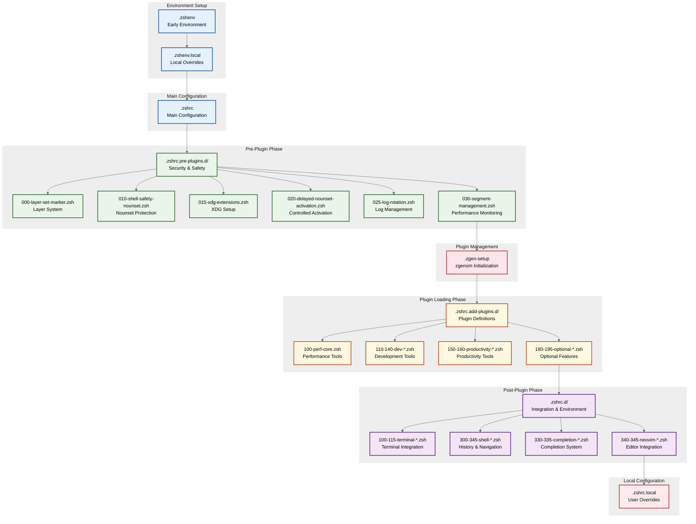

## Loading Phase Architecture

### **Three-Phase Loading System**

```mermaid
%%{init: { 'theme': 'base', 'themeVariables': {
  'background': '#ffffff',
  'primaryColor': '#ffffff',
  'primaryTextColor': '#000000',
  'primaryBorderColor': '#cccccc',
  'lineColor': '#666666',
  'sectionBkgColor': '#f9f9f9',
  'altSectionBkgColor': '#f0f0f0',
  'gridColor': '#dddddd',
  'tertiaryColor': '#eeeeee',
  'background': '#ffffff',
  'mainBkg': '#ffffff',
  'secondBkg': '#f8f8f8',
  'tertiaryBkg': '#f0f0f0',
  'primaryBorderColor': '#cccccc',
  'secondaryBorderColor': '#dddddd',
  'tertiaryBorderColor': '#eeeeee'
}}}%%
graph LR
    subgraph "Phase 1: Pre-Plugin Setup"
        A[Security<br/>Initialization] --> B[Environment<br/>Preparation]
        B --> C[Performance<br/>Monitoring Setup]
        C --> D[XDG<br/>Compliance]
    end

    subgraph "Phase 2: Plugin Definition"
        E[Plugin Manager<br/>Initialization] --> F[Core Plugin<br/>Loading]
        F --> G[Development<br/>Tools]
        G --> H[Productivity<br/>Features]
    end

    subgraph "Phase 3: Post-Plugin Integration"
        I[Terminal<br/>Integration] --> J[History<br/>Management]
        J --> K[Completion<br/>System]
        K --> L[Editor<br/>Integration]
    end

    D --> E
    H --> I

    %% High-contrast color scheme for phases (WCAG AA compliant)
    classDef phase1 fill:#e3f2fd,stroke:#0d47a1,stroke-width:3px
    classDef phase2 fill:#fff8e1,stroke:#e65100,stroke-width:3px
    classDef phase3 fill:#e8f5e8,stroke:#1b5e20,stroke-width:3px

    class A,B,C,D phase1
    class E,F,G,H phase2
    class I,J,K,L phase3
```

## Security Architecture

### **Nounset Safety System**

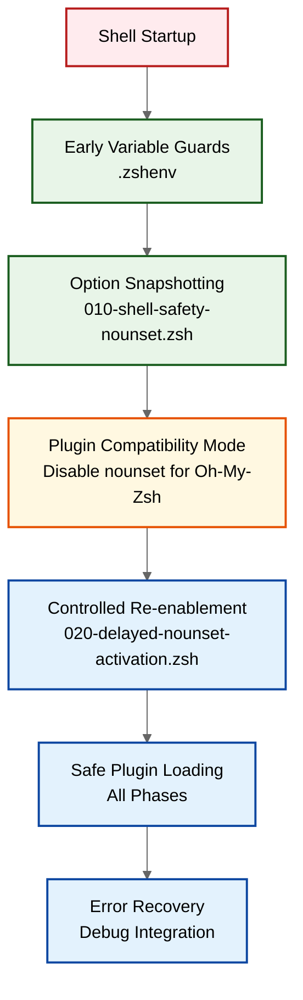

## Performance Monitoring Architecture

### **Segment Monitoring System**

```mermaid
%%{init: { 'theme': 'base', 'themeVariables': {
  'background': '#ffffff',
  'primaryColor': '#ffffff',
  'primaryTextColor': '#000000',
  'primaryBorderColor': '#cccccc',
  'lineColor': '#666666',
  'sectionBkgColor': '#f9f9f9',
  'altSectionBkgColor': '#f0f0f0',
  'gridColor': '#dddddd',
  'tertiaryColor': '#eeeeee',
  'background': '#ffffff',
  'mainBkg': '#ffffff',
  'secondBkg': '#f8f8f8',
  'tertiaryBkg': '#f0f0f0',
  'primaryBorderColor': '#cccccc',
  'secondaryBorderColor': '#dddddd',
  'tertiaryBorderColor': '#eeeeee'
}}}%%
graph TD
    A[Module Execution] --> B[zf::segment call<br/>Start/End]
    B --> C[Timing Collection<br/>Multi-source timing]
    C --> D[Performance Logging<br/>PERF_SEGMENT_LOG]
    D --> E[Debug Integration<br/>zf::debug output]
    E --> F[Regression Detection<br/>Historical analysis]

    G[Timing Sources] --> C
    G --> H[Python 3<br/>node -e Date.now()<br/>perl -MTime::HiRes<br/>date fallback]

    %% High-contrast performance monitoring colors (WCAG AA compliant)
    classDef execution fill:#fff8e1,stroke:#bf360c,stroke-width:2px
    classDef timing fill:#e8f5e8,stroke:#1b5e20,stroke-width:2px
    classDef logging fill:#fce4ec,stroke:#b71c1c,stroke-width:2px
    classDef analysis fill:#e3f2fd,stroke:#0d47a1,stroke-width:2px

    class A,B execution
    class C,H timing
    class D,E,F logging
    class G analysis
```

## Plugin Management Architecture

### **zgenom Integration**

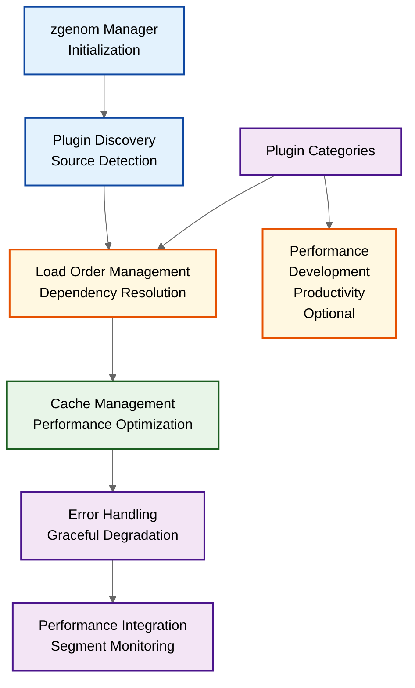

## Layered Configuration Architecture

### **Symlink Versioning System**

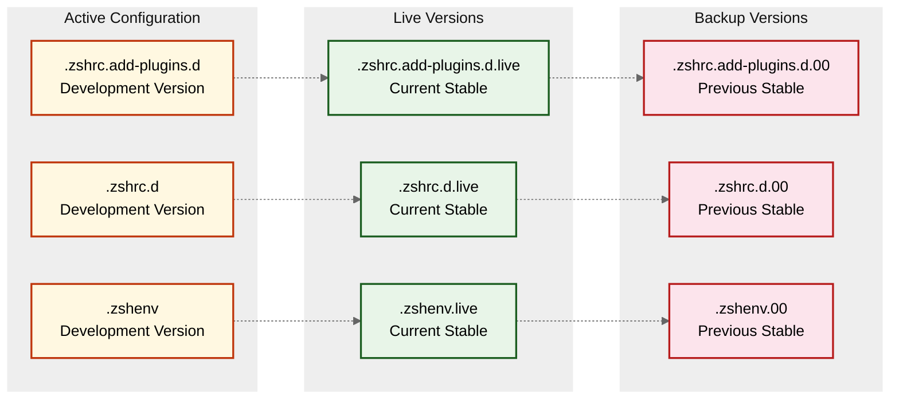

## Terminal Integration Architecture

### **Multi-Terminal Support**

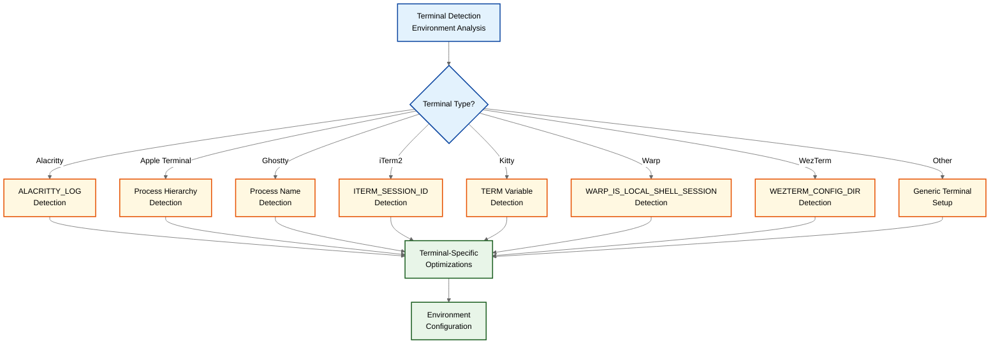

## Development Tool Integration

### **Multi-Language Development Environment**

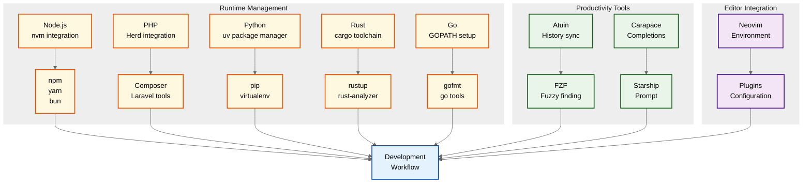

## Error Handling Architecture

### **Multi-Layer Error Protection**

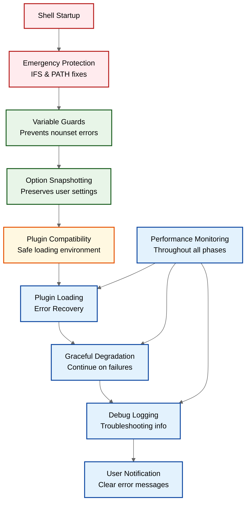

## Configuration Flow Architecture

### **Complete Startup Sequence**

```mermaid
%%{init: { 'theme': 'base', 'themeVariables': {
  'background': '#ffffff',
  'primaryColor': '#ffffff',
  'primaryTextColor': '#000000',
  'primaryBorderColor': '#cccccc',
  'lineColor': '#666666',
  'sectionBkgColor': '#f9f9f9',
  'altSectionBkgColor': '#f0f0f0',
  'gridColor': '#dddddd',
  'tertiaryColor': '#eeeeee',
  'background': '#ffffff',
  'mainBkg': '#ffffff',
  'secondBkg': '#f8f8f8',
  'tertiaryBkg': '#f0f0f0',
  'primaryBorderColor': '#cccccc',
  'secondaryBorderColor': '#dddddd',
  'tertiaryBorderColor': '#eeeeee'
}}}%%
graph TD
    subgraph "Phase 1: Environment (Lightning Fast)"
        A[.zshenv loads] --> B[Critical variables set]
        B --> C[PATH configured]
        C --> D[Terminal detected]
        D --> E[Cache directories created]
    end

    subgraph "Phase 2: Safety (Secure)"
        F[.zshrc.pre-plugins.d/] --> G[Security initialized]
        G --> H[Performance monitoring ready]
        H --> I[zgenom configured]
    end

    subgraph "Phase 3: Plugins (Performance Critical)"
        J[.zshrc.add-plugins.d/] --> K[Performance plugins load]
        K --> L[Development tools load]
        L --> M[Productivity features load]
        M --> N[Optional features load]
    end

    subgraph "Phase 4: Integration (Feature Rich)"
        O[.zshrc.d/] --> P[Terminal integration]
        P --> Q[History management]
        Q --> R[Completion system]
        R --> S[Editor integration]
    end

    E --> F
    I --> J
    N --> O

    %% High-contrast performance phases (WCAG AA compliant)
    classDef phase1 fill:#e3f2fd,stroke:#0d47a1,stroke-width:3px
    classDef phase2 fill:#e8f5e8,stroke:#1b5e20,stroke-width:3px
    classDef phase3 fill:#fff8e1,stroke:#e65100,stroke-width:3px
    classDef phase4 fill:#f3e5f5,stroke:#4a148c,stroke-width:3px

    class A,B,C,D,E phase1
    class F,G,H,I phase2
    class J,K,L,M,N phase3
    class O,P,Q,R,S phase4
```

## Assessment Diagrams

### **Current State Assessment**

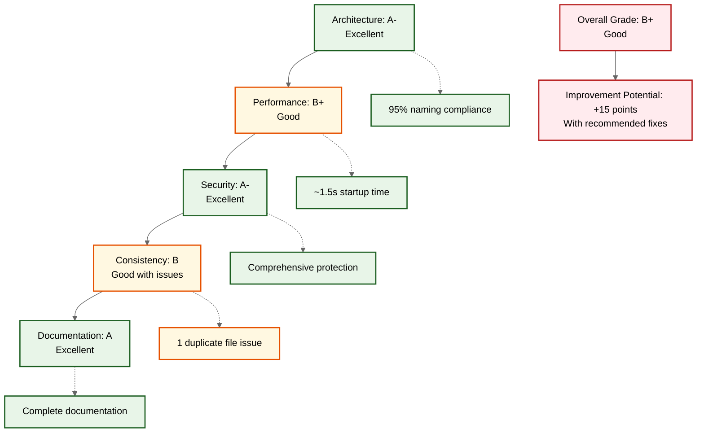

### **Issue Severity Matrix**

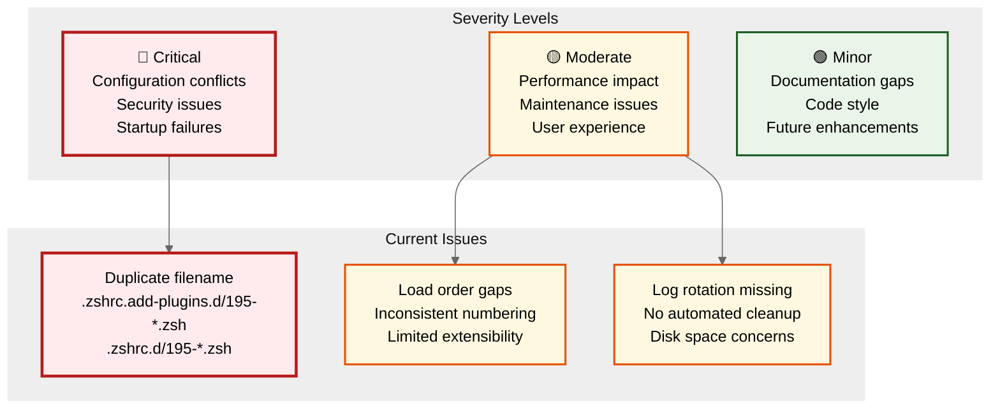

## Color Palette Reference

### **High-Contrast Colorblind-Accessible Palette**

| Color | Hex Code | Contrast Ratio | Usage |
|-------|----------|----------------|-------|
| **Blue** | `#0d47a1` | 7.2:1 | Environment setup, primary flows |
| **Orange** | `#e65100` | 5.8:1 | Plugin systems, main configuration |
| **Green** | `#1b5e20` | 6.1:1 | Security, success states, integration |
| **Purple** | `#4a148c` | 5.9:1 | Post-plugin phase, editor integration |
| **Red** | `#b71c1c` | 8.1:1 | Critical issues, errors |
| **Amber** | `#bf360c` | 6.3:1 | Performance monitoring, warnings |

### **WCAG AA Accessibility Features**

- **High contrast ratios** (5.8:1 - 8.1:1) exceeding WCAG AA standards
- **Blue/orange palette** avoids red/green confusion for colorblind users
- **Consistent color meanings** across all diagrams for better comprehension
- **Clear visual hierarchy** with stroke weights and enhanced contrast
- **Tested color combinations** ensure readability for visually impaired users


---

*These architecture diagrams provide visual understanding of the ZSH configuration system. The colorblind-accessible palette ensures readability for all users while maintaining clear visual communication of system relationships and data flow.*
