# Flow Diagrams

## Overview

This document contains detailed flow diagrams showing the ZSH configuration processes, error handling flows, and integration patterns. All diagrams use colorblind-accessible palettes and maintain consistency with the architecture diagrams.

## Startup Flow Diagram

### **Complete Startup Sequence**

## Error Handling Flow

### **Plugin Loading Error Recovery**

```mermaid
%%{init: { 'theme': 'base', 'themeVariables': {
  'background': '#ffffff',
  'primaryColor': '#ffffff',
  'primaryTextColor': '#000000',
  'primaryBorderColor': '#cccccc',
  'lineColor': '#666666',
  'sectionBkgColor': '#f9f9f9',
  'altSectionBkgColor': '#f0f0f0',
  'gridColor': '#dddddd',
  'tertiaryColor': '#eeeeee',
  'background': '#ffffff',
  'mainBkg': '#ffffff',
  'secondBkg': '#f8f8f8',
  'tertiaryBkg': '#f0f0f0',
  'primaryBorderColor': '#cccccc',
  'secondaryBorderColor': '#dddddd',
  'tertiaryBorderColor': '#eeeeee'
}}}%%
flowchart TD
    Start([Plugin Load Attempt]) --> A{Plugin Manager<br/>Available?}
    A -->|No| B[zf::debug: zgenom not available<br/>Continue without plugins]
    A -->|Yes| C[zgenom load plugin]
    C --> D{Load<br/>Successful?}
    D -->|No| E[zf::debug: Plugin load failed<br/>Check dependencies]
    E --> F{Dependency<br/>Issue?}
    F -->|Yes| G[Log missing dependency<br/>Continue with other plugins]
    F -->|No| H[Log plugin error<br/>Continue with other plugins]
    D -->|Yes| I[Plugin loaded successfully<br/>Continue to next plugin]
    H --> J[Check if critical plugin<br/>Required for shell function?]
    J -->|No| K[Continue loading<br/>Non-critical plugins work]
    J -->|Yes| L[⚠️ Warning: Critical plugin failed<br/>Shell may have reduced functionality]

    B --> End([Continue Shell Startup])
    G --> End
    I --> End
    K --> End
    L --> End

    %% High-contrast error handling colors (WCAG AA compliant)
    classDef attempt fill:#fff8e1,stroke:#bf360c,stroke-width:2px
    classDef failure fill:#ffebee,stroke:#b71c1c,stroke-width:2px
    classDef recovery fill:#e8f5e8,stroke:#1b5e20,stroke-width:2px
    classDef warning fill:#fff8e1,stroke:#e65100,stroke-width:2px

    class Start,A,C,D attempt
    class B,E,H,L failure
    class F,G,I,K recovery
    class J warning
```

## Security Flow

### **Nounset Protection Flow**

## Performance Monitoring Flow

### **Segment Timing Flow**

## Plugin Loading Flow

### **zgenom Plugin Loading Process**

## Terminal Integration Flow

### **Multi-Terminal Detection Process**

## Configuration Validation Flow

### **Configuration Health Check**

```mermaid
%%{init: { 'theme': 'base', 'themeVariables': {
  'background': '#ffffff',
  'primaryColor': '#ffffff',
  'primaryTextColor': '#000000',
  'primaryBorderColor': '#cccccc',
  'lineColor': '#666666',
  'sectionBkgColor': '#f9f9f9',
  'altSectionBkgColor': '#f0f0f0',
  'gridColor': '#dddddd',
  'tertiaryColor': '#eeeeee',
  'background': '#ffffff',
  'mainBkg': '#ffffff',
  'secondBkg': '#f8f8f8',
  'tertiaryBkg': '#f0f0f0',
  'primaryBorderColor': '#cccccc',
  'secondaryBorderColor': '#dddddd',
  'tertiaryBorderColor': '#eeeeee'
}}}%%
flowchart TD
    Start([Configuration Validation]) --> A[Check .zsh syntax<br/>All .zsh files]
    A --> B{Syntax<br/>errors?}
    B -->|Yes| C[❌ Report syntax errors<br/>List problematic files]
    B -->|No| D[Check naming convention<br/>XX_YY-name.zsh format]
    D --> E{Naming<br/>violations?}
    E -->|Yes| F[❌ Report naming violations<br/>List non-compliant files]
    E -->|No| G[Check for duplicate files<br/>Same filename in different dirs]
    G --> H{Duplicates<br/>found?}
    H -->|Yes| I[❌ Report duplicate files<br/>Show conflicting locations]
    H -->|No| J[Validate module headers<br/>Check dependency documentation]
    J --> K{Header<br/>issues?}
    K -->|Yes| L[⚠️ Report header issues<br/>Missing dependency info]
    K -->|No| M[Check plugin availability<br/>Verify zgenom plugins exist]
    M --> N{Plugin<br/>issues?}
    N -->|Yes| O[⚠️ Report plugin issues<br/>Missing or broken plugins]
    N -->|No| P[✅ Configuration validation passed<br/>All checks successful]

    C --> End([Validation Failed])
    F --> End
    I --> End
    L --> End
    O --> End
    P --> End([Validation Successful])

    %% Validation colors
    classDef check fill:#fff8e1,stroke:#fbc02d,stroke-width:2px
    classDef error fill:#ffebee,stroke:#c62828,stroke-width:2px
    classDef warning fill:#fff3e0,stroke:#ef6c00,stroke-width:2px
    classDef success fill:#e8f5e8,stroke:#2e7d32,stroke-width:2px

    class Start,A,D,G,J,M check
    class B,E,H,K,N error
    class C,F,I,L,O warning
    class P success
```

## Development Tool Integration Flow

### **Multi-Language Development Setup**

## Error Recovery Flow

### **Multi-Level Error Recovery**

```mermaid
%%{init: { 'theme': 'base', 'themeVariables': {
  'background': '#ffffff',
  'primaryColor': '#ffffff',
  'primaryTextColor': '#000000',
  'primaryBorderColor': '#cccccc',
  'lineColor': '#666666',
  'sectionBkgColor': '#f9f9f9',
  'altSectionBkgColor': '#f0f0f0',
  'gridColor': '#dddddd',
  'tertiaryColor': '#eeeeee',
  'background': '#ffffff',
  'mainBkg': '#ffffff',
  'secondBkg': '#f8f8f8',
  'tertiaryBkg': '#f0f0f0',
  'primaryBorderColor': '#cccccc',
  'secondaryBorderColor': '#dddddd',
  'tertiaryBorderColor': '#eeeeee'
}}}%%
flowchart TD
    Start([Error Encountered]) --> A{Error Type?}
    A -->|Plugin Failure| B[Graceful degradation<br/>Continue without plugin]
    A -->|Configuration Error| C[Debug logging<br/>Error context capture]
    A -->|Environment Error| D[Safe fallbacks<br/>Emergency PATH setup]
    A -->|Performance Issue| E[Timing analysis<br/>Bottleneck identification]

    B --> F{Plugin critical<br/>for shell function?}
    F -->|No| G[Continue operation<br/>Non-critical plugin failed]
    F -->|Yes| H[⚠️ User notification<br/>Reduced functionality]

    C --> I[Error context logged<br/>Debug information saved]

    D --> J{Emergency fallbacks<br/>work?}
    J -->|No| K[❌ Critical failure<br/>Shell may not function]
    J -->|Yes| L[✅ Emergency mode<br/>Basic shell available]

    E --> M[Performance data<br/>collected for analysis]

    G --> End([Continue Operation])
    H --> End
    I --> End
    L --> End
    M --> End
    K --> End([Critical Failure])

    %% Error recovery colors
    classDef error fill:#ffebee,stroke:#c62828,stroke-width:2px
    classDef recovery fill:#e8f5e8,stroke:#2e7d32,stroke-width:2px
    classDef warning fill:#fff3e0,stroke:#ef6c00,stroke-width:2px
    classDef critical fill:#fce4ec,stroke:#c2185b,stroke-width:2px

    class Start,A error
    class B,C,D,E recovery
    class F,G,I,J,L,M warning
    class H critical
    class K critical
```

## Integration Flow

### **External Tool Integration Process**

## Maintenance Flow

### **Configuration Maintenance Process**

## Color Legend

### **Flow Diagram Color Scheme**

| Color | Hex Code | Usage |
|-------|----------|-------|
| **Blue** | `#1976d2` | Environment setup, primary flows |
| **Orange** | `#f57c00` | Plugin systems, main processes |
| **Green** | `#1b5e20` | Success states, integration, fallbacks |
| **Purple** | `#4a148c` | Post-plugin phase, deployment |
| **Red** | `#b71c1c` | Critical errors, failures |
| **Amber** | `#bf360c` | Performance monitoring, warnings |

### **Flow Status Indicators**

- **✅ Success Path** - Green outline, normal operation
- **⚠️ Warning Path** - Orange outline, degraded functionality
- **❌ Error Path** - Red outline, failure handling
- **🔄 Loop/Retry** - Blue outline, iterative processes

---

*These flow diagrams illustrate the complex processes within the ZSH configuration system, from startup sequences through error recovery and maintenance procedures. The visual representation helps understand the relationships between different components and the flow of execution through various phases.*
