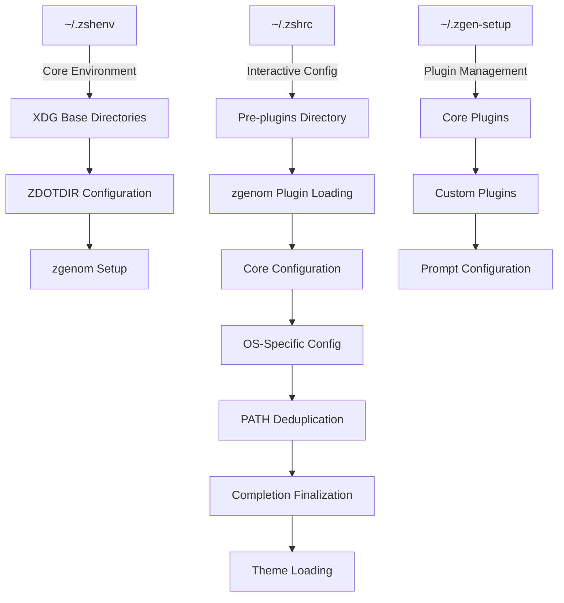

# ZSH Startup Flow and Session Types

## Overview

This document details the complete ZSH startup process, including system files, session types, environment variables, and the interaction between the zsh-quickstart-kit, zgenom, and custom configuration components.

## Session Types and Initialization Files

ZSH has different types of sessions, each loading specific configuration files in a defined order:

### Login vs Non-Login Sessions

A **login session** is the first session when you log into a system, while a **non-login session** occurs when you start additional shells within an existing session.

### Interactive vs Non-Interactive Sessions

An **interactive session** accepts input and displays output on a terminal, while a **non-interactive session** runs scripts without user interaction.

### File Loading Order by Session Type

| File | Login | Interactive Non-Login | Script (Non-Interactive) |
|------|-------|------------------------|--------------------------|
| `/etc/zshenv` | ✓ | ✓ | ✓ |
| `~/.zshenv` | ✓ | ✓ | ✓ |
| `/etc/zprofile` | ✓ | ✗ | ✗ |
| `~/.zprofile` | ✓ | ✗ | ✗ |
| `/etc/zshrc` | ✓ | ✓ | ✗ |
| `~/.zshrc` | ✓ | ✓ | ✗ |
| `/etc/zlogin` | ✓ | ✗ | ✗ |
| `~/.zlogin` | ✓ | ✗ | ✗ |
| `~/.zlogout` | ✓ (at exit) | ✗ | ✗ |
| `/etc/zlogout` | ✓ (at exit) | ✗ | ✗ |

## System Files

### `/etc/zshenv`

System-wide environment setup for all ZSH sessions:

```zsh
# Set up Nix only on SSH connections
if [ -e '/nix/var/nix/profiles/default/etc/profile.d/nix-daemon.sh' ] && [ -n "${SSH_CONNECTION}" ] && [ "${SHLVL}" -eq 1 ]; then
    . '/nix/var/nix/profiles/default/etc/profile.d/nix-daemon.sh'
fi
```

- **Purpose**: Sets up Nix environment only for SSH connections at shell level 1
- **Loaded by**: All ZSH sessions (login, interactive, scripts)

### `/etc/zshrc`

System-wide configuration for interactive shells:

```zsh
# Nix
if [ -e '/nix/var/nix/profiles/default/etc/profile.d/nix-daemon.sh' ]; then
    . '/nix/var/nix/profiles/default/etc/profile.d/nix-daemon.sh'
fi
```

- **Purpose**: Configures Nix for all interactive shells
- **Loaded by**: Login and interactive non-login sessions

## User Configuration Files

### `~/.zshenv`

Core environment setup that applies to ALL ZSH sessions:

- Sets essential environment variables
- Defines core PATH with minimal entries
- Implements critical functions like `_path_prepend`, `_path_append`
- Configures XDG Base Directory paths
- Sets up zgenom plugin manager environment

Key sections:
```zsh
# Simple, safe PATH - MUST BE FIRST
export PATH="/usr/bin:/bin:/usr/sbin:/sbin:/usr/local/bin"

# XDG Base Directory Specification
export XDG_BIN_HOME=${XDG_BIN_HOME:="${HOME}/.local/bin"}
export XDG_CACHE_HOME=${XDG_CACHE_HOME:="${HOME}/.cache"}
export XDG_CONFIG_HOME=${XDG_CONFIG_HOME:="${HOME}/.config"}
export XDG_DATA_HOME=${XDG_DATA_HOME:="${HOME}/.local/share"}

# Zsh-specific directories
export ZDOTDIR=${ZDOTDIR:="${XDG_CONFIG_HOME}/zsh"}

# Plugin manager setup - zgenom configuration
export ZGENOM_PARENT_DIR="${ZDOTDIR}"
export ZGEN_SOURCE="${ZDOTDIR}/.zqs-zgenom"
export ZGENOM_SOURCE_FILE="${ZGEN_SOURCE}/zgenom.zsh"
export ZGEN_DIR="${ZDOTDIR}/.zgenom"
```

### `~/.zshrc`

Main configuration for interactive sessions, powered by zsh-quickstart-kit:

1. **Early Initialization**:
   - Sets up Powerlevel10k instant prompt
   - Loads font mode configuration
   - Configures history and completion settings

2. **Pre-Plugins Setup**:
   - Loads `.zshrc.pre-plugins.d/*.zsh` files
   - Handles FZF, completion system, and NVM fixes

3. **Plugin Management**:
   - Sources `.zgen-setup` to initialize zgenom
   - Loads core plugins via zgenom

4. **Core Configuration**:
   - Loads `.zshrc.d/*.zsh` files
   - Processes additional plugins from `.zshrc.add-plugins.d/*.zsh`
   - Handles OS-specific configuration from `.zshrc.$(uname).d/*.zsh`
   - Manages PATH deduplication

5. **Finalization**:
   - Configures completion system
   - Loads Powerlevel10k theme
   - Sets up SSH keys
   - Performs self-update checks

### `~/.config/zsh/.zgen-setup`

Manages plugin initialization via zgenom:

1. **Initializes zgenom**:
   - Clones zgenom if not present
   - Sets up zgenom directories and environment

2. **Loads Core Plugins**:
   - Handles Oh-My-ZSH integration
   - Loads syntax highlighting, completions, and utility plugins
   - Configures Powerlevel10k or Bullet Train prompt

3. **Manages Plugin Updates**:
   - Checks if plugin configs have changed
   - Regenerates zgenom initialization file when needed

## Modular Configuration Structure

Your ZSH setup uses a highly modular structure with directory-based configuration:

### Pre-Plugins Configuration (loaded before plugins)

```
~/.zshrc.pre-plugins.d/
├── 00-fzf-setup.zsh       # Early FZF configuration to prevent conflicts
├── 01-completion-init.zsh # Initialize completion system early
└── 02-nvm-npm-fix.zsh     # Fix NVM and NPM config conflicts
```

### Core Configuration (loaded after plugins)

```
~/.zshrc.d/
├── 00-core/               # Core environment and ZSH settings
├── 10-tools/              # Development tool configurations
├── 20-plugins/            # Plugin-specific configurations
├── 30-ui/                 # UI and theme settings
└── 90-finalize/           # Path deduplication, completion finalization
```

### Additional Plugins (extends default plugin set)

```
~/.zshrc.add-plugins.d/
└── 010-add-plugins.zsh    # Additional plugins beyond zsh-quickstart-kit defaults
```

### OS-Specific Configuration (macOS)

```
~/.zshrc.Darwin.d/
└── 100-macos-defaults.zsh # macOS-specific system settings
```

## ZSH Session Startup Sequence

```mermaid
flowchart TD
    A[Shell Invocation] --> B{Session Type}
    
    B -->|All Sessions| C[/etc/zshenv]
    C --> D[~/.zshenv]
    
    D -->|Login Session| E[/etc/zprofile]
    E -->|Login Session| F[~/.zprofile]
    
    D -->|Interactive| G[/etc/zshrc]
    F -->|Login Session| G
    
    G -->|Interactive| H[~/.zshrc]
    
    H -->|Interactive| I[Pre-plugins]
    I --> J[zgenom setup]
    J --> K[Core Configuration]
    K --> L[OS-specific Config]
    L --> M[Finalization]
    
    D -->|Login Session| N[/etc/zlogin]
    M -->|Login Session| N
    N -->|Login Session| O[~/.zlogin]
    
    B -->|Script| P[Script Execution]
    D --> P
    
    Q[Shell Exit] -->|Login Session| R[~/.zlogout]
    R -->|Login Session| S[/etc/zlogout]
```

## Environment Configuration Flow



## ZSH Quickstart Kit and zgenom Integration

The zsh-quickstart-kit provides a structured framework for managing your ZSH configuration:

1. **Core ZSH Settings**: Managed through modular configuration files
2. **Plugin Management**: Handled by zgenom, which:
   - Clones plugins from GitHub
   - Loads plugins in the correct order
   - Regenerates initialization when configurations change
   - Provides update mechanisms

3. **Custom Extensions**: Supported through:
   - `.zshrc.pre-plugins.d/`: Files loaded before plugins
   - `.zshrc.add-plugins.d/`: Additional plugins beyond defaults
   - `.zshrc.d/`: Core configuration files
   - `.zshrc.$(uname).d/`: OS-specific configuration

## Debugging ZSH Startup

1. **Debug Mode**: Enable with `zqs enable-debug-mode`
2. **Performance Profiling**: Enable with `zqs enable-zsh-profiling`
3. **Trace Output**: Set `ZSH_DEBUG=1` before starting ZSH

## Conclusion

This ZSH configuration uses a layered approach:

1. **Core Environment** (`~/.zshenv`): Essential environment variables and paths
2. **Interactive Setup** (`~/.zshrc`): ZSH options, key bindings, and aliases
3. **Plugin Management** (`~/.zgen-setup`): Plugin loading and configuration
4. **Modular Extensions**: Domain-specific configurations in separate directories

This structure allows for:
- Clean separation of concerns
- Easy customization without modifying core files
- Selective loading based on session type
- Efficient performance optimization
