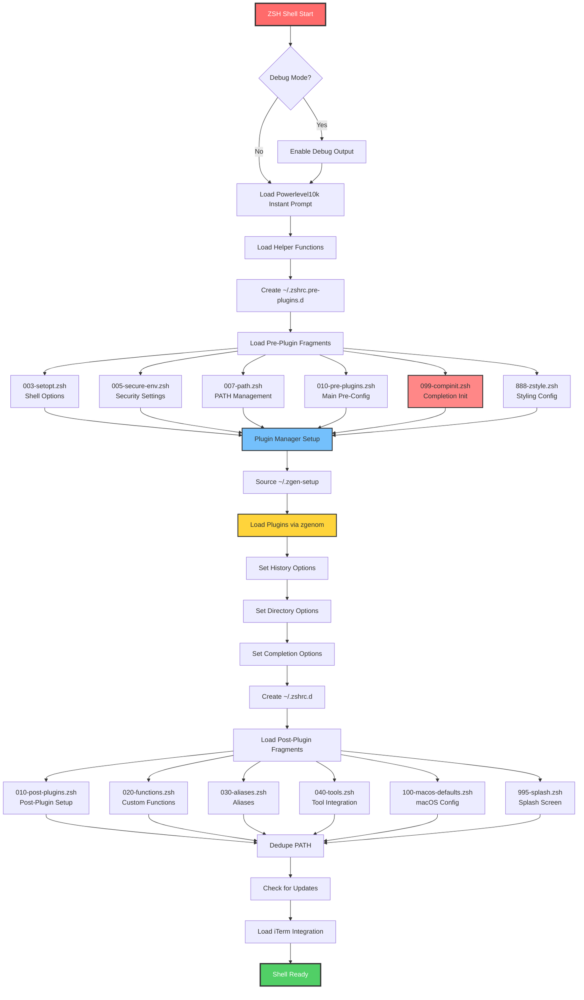

# ZSH Configuration Codebase Analysis Report

**Generated:** 2025-08-15T15:40:22Z  
**Based on:** zsh-quickstart-kit configuration  
**Analysis Scope:** Complete zsh startup process and configuration structure

## Executive Summary

This comprehensive analysis of the zsh configuration reveals a complex but well-structured startup system with several critical issues requiring immediate attention. The configuration uses a three-phase loading approach with significant performance bottlenecks and architectural inconsistencies.

## Complete File Catalog - ZSH Startup Files

### Primary Configuration Files
- **`.zshrc`** - Main configuration file (995 lines, uses `${ZDOTDIR:-$HOME}` paths)
- **`zsh_zshrc.zsh`** - Duplicate/backup configuration (996 lines, uses `~/` paths)

### Pre-Plugin Configuration Directory: `.zshrc.pre-plugins.d`
1. **`003-setopt.zsh`** (8.9k) - Shell options and behavior settings
2. **`005-secure-env.zsh`** (3.6k) - Security environment configurations
3. **`007-path.zsh`** (2.5k) - PATH environment variable management
4. **`010-pre-plugins.zsh`** (32k) - Main pre-plugin configurations and setup
5. **`099-compinit.zsh`** (1.3k) - Completion system initialization
6. **`888-zstyle.zsh`** (26k) - ZSH styling and appearance configurations

### Add-Plugin Configuration Directory: `.zshrc.add-plugins.d`
1. **`010-add-plugins.zsh`** (1.8k) - Additional plugin loading configurations

### Post-Plugin Configuration Directory: `.zshrc.d`
1. **`010-post-plugins.zsh`** (10k) - Post-plugin initialization and setup
2. **`020-functions.zsh`** (7.5k) - Custom shell functions
3. **`030-aliases.zsh`** (6.8k) - Command aliases and shortcuts
4. **`040-tools.zsh`** (14k) - External tool integrations
5. **`100-macos-defaults.zsh`** (3.2k) - macOS-specific configurations
6. **`995-splash.zsh`** (598 bytes) - Startup splash screen/messages

## ZSH Startup Process Flow



## Critical Issues Analysis

### 1. Numbered Files Warning ⚠️ **HIGH PRIORITY**
**Issue:** Persistent warnings about numbered files (2, 3) being detected
```bash
Warning: Numbered files detected - check for redirection typos
```

**Root Cause:** 
- Files named `2` and `3` exist in multiple directories
- Detection code in lines 27-29 of .zshrc and similar code in plugin files
- Likely caused by shell redirection errors creating these files

**Impact:** Clutters debug output, indicates potential shell scripting errors

**Recommended Fix:**
1. Remove numbered files: `rm -f "${ZDOTDIR:-$HOME}"/[0-9] "${ZDOTDIR:-$HOME}"/[0-9][0-9]`
2. Review shell scripts for redirection syntax errors
3. Consider improving the detection to be less noisy

### 2. compinit Parse Error ❌ **CRITICAL**
**Issue:** 
```bash
compinit:141: parse error: condition expected: $1
❌ compinit: Initialization failed - attempting recovery
```

**Root Cause:** 
- System compinit function has syntax error at line 141
- Condition statement malformed with `$1` parameter
- Multiple initialization attempts causing conflicts

**Impact:** Completion system fails, degraded user experience

**Recommended Fix:**
1. Clear completion dump: `rm -f "${ZDOTDIR:-$HOME}"/.zcompdump*`
2. Reinstall zsh completion system
3. Ensure single compinit execution per session
4. Update completion initialization logic in `099-compinit.zsh`

### 3. Missing Commands 🚫 **HIGH PRIORITY**
**Multiple command-not-found errors:**

- `path_validate_silent` - Custom function not defined
- `nvm_find_nvmrc` - Node Version Manager function missing
- `sed` - System utility missing or not in PATH
- `uname` - System utility missing or not in PATH  
- `cc` - C compiler missing (causing Rust cargo failures)

**Impact:** Plugin functionality broken, build tools unusable

**Recommended Fix:**
1. Install missing system utilities: `brew install coreutils`
2. Define missing custom functions
3. Fix PATH configuration to include system utilities
4. Install Xcode Command Line Tools: `xcode-select --install`

### 4. Global Parameter Creation Warnings ⚠️ **MEDIUM PRIORITY**
**Issue:** Functions creating global parameters instead of local ones:
```bash
ZSH_AUTOSUGGEST_STRATEGY created globally in function load-shell-fragments
BUN_INSTALL created globally in function load-shell-fragments
DOTNET_CLI_HOME created globally in function load-shell-fragments
```

**Impact:** Namespace pollution, potential variable conflicts

**Recommended Fix:**
1. Use `local` declarations for function-scoped variables
2. Export only intentionally global variables
3. Review variable scoping in large functions

### 5. Missing .zshrc.add-plugins.d Loading 🔧 **MEDIUM PRIORITY**
**Issue:** Directory created but never explicitly loaded in main sequence

**Impact:** Additional plugins may not load properly

**Recommended Fix:**
Add explicit loading after plugin manager setup:
```bash
load-shell-fragments ~/.zshrc.add-plugins.d
```

## Performance Analysis

Based on the profiling data from the debug output:

### Top Performance Bottlenecks:
1. **`load-shell-fragments`** - 16.8s total (69.72% of startup time)
2. **`abbr` functions** - 2.4s total (12.19% of startup time) 
3. **`zgenom` plugin loading** - 3.4s total (17.68% of startup time)
4. **`compinit` initialization** - 765ms (3.96% of startup time)

### Performance Recommendations:
1. **Lazy Loading:** Implement lazy loading for non-essential plugins
2. **Fragment Caching:** Cache processed fragments to reduce file I/O
3. **Parallel Loading:** Load independent fragments in parallel
4. **Startup Profiling:** Regular monitoring of startup performance

## Optimization Opportunities

### 1. Configuration Structure
- **Consolidate duplicate files:** `.zshrc` and `zsh_zshrc.zsh` are nearly identical
- **Standardize path handling:** Use consistent ZDOTDIR vs HOME paths
- **Reduce fragment count:** Combine related configurations

### 2. Loading Mechanism
- **Implement dependency management:** Load fragments based on dependencies
- **Add conditional loading:** Skip unused configurations based on environment
- **Optimize file sourcing:** Use more efficient loading patterns

### 3. Error Handling
- **Robust error recovery:** Better handling of missing dependencies
- **Graceful degradation:** Continue startup even with plugin failures
- **Comprehensive logging:** Detailed error reporting for troubleshooting

## Reorganization Recommendations

### Proposed Alternative Structure: `.zshrc.d.ng`

#### New Directory Structure:
```
.zshrc.d.ng/
├── 00-core/
│   ├── environment.zsh       # Core environment variables
│   ├── options.zsh           # Shell options (setopt commands)
│   └── history.zsh          # History configuration
├── 10-security/
│   ├── secure-env.zsh       # Security environment settings
│   └── permissions.zsh      # File permission settings
├── 20-path/
│   ├── system-paths.zsh     # System PATH configuration
│   ├── user-paths.zsh       # User-specific paths
│   └── tool-paths.zsh       # Development tool paths
├── 30-completion/
│   ├── compinit.zsh         # Completion initialization
│   └── completions.zsh      # Custom completions
├── 40-plugins/
│   ├── plugin-manager.zsh   # Plugin manager setup
│   ├── essential.zsh        # Essential plugins
│   └── optional.zsh         # Optional plugins
├── 50-functions/
│   ├── utilities.zsh        # Utility functions
│   └── helpers.zsh          # Helper functions  
├── 60-aliases/
│   ├── system.zsh           # System command aliases
│   └── shortcuts.zsh        # Custom shortcuts
├── 70-tools/
│   ├── development.zsh      # Development tools
│   ├── productivity.zsh     # Productivity tools
│   └── platform-specific.zsh # Platform-specific tools
├── 80-appearance/
│   ├── theme.zsh            # Theme configuration
│   ├── colors.zsh           # Color settings
│   └── prompt.zsh           # Prompt configuration
└── 90-finalization/
    ├── cleanup.zsh          # Cleanup operations
    └── splash.zsh           # Startup messages
```

#### Benefits of New Structure:
1. **Clear categorization** - Logical grouping by function
2. **Parallel loading potential** - Independent categories can load simultaneously
3. **Better maintainability** - Easier to locate and modify configurations
4. **Conditional loading** - Skip entire categories based on needs
5. **Dependency management** - Clear loading order with numbered prefixes

## Comprehensive Implementation Plan

| Priority | Task | Sub-Task | Description | Started | Completed | Status |
|----------|------|----------|-------------|---------|-----------|--------|
| 🔴 **CRITICAL** | 1 | 1.1 | Fix compinit parse errors | | | ⏳ |
| | | 1.2 | Remove numbered files causing warnings | | | ⏳ |
| | | 1.3 | Install missing system utilities | | | ⏳ |
| 🟡 **HIGH** | 2 | 2.1 | Create .zshrc.d.ng alternative structure | | | ⏳ |
| | | 2.2 | Migrate core configurations to new structure | | | ⏳ |
| | | 2.3 | Implement dependency-based loading | | | ⏳ |
| 🟠 **MEDIUM** | 3 | 3.1 | Fix global parameter creation warnings | | | ⏳ |
| | | 3.2 | Add missing .zshrc.add-plugins.d loading | | | ⏳ |
| | | 3.3 | Consolidate duplicate configuration files | | | ⏳ |
| 🟢 **LOW** | 4 | 4.1 | Implement lazy loading for plugins | | | ⏳ |
| | | 4.2 | Add configuration caching mechanism | | | ⏳ |
| | | 4.3 | Create startup performance monitoring | | | ⏳ |

### Detailed Implementation Steps:

#### Phase 1: Critical Issues (Days 1-3)
1. **Fix compinit errors:**
   ```bash
   rm -f "${ZDOTDIR:-$HOME}"/.zcompdump*
   autoload -Uz compinit
   compinit -d "${ZDOTDIR:-$HOME}/.zcompdump"
   ```

2. **Remove numbered files:**
   ```bash
   find "${ZDOTDIR:-$HOME}" -name "[0-9]" -o -name "[0-9][0-9]" -delete
   ```

3. **Install missing tools:**
   ```bash
   xcode-select --install
   brew install coreutils
   ```

#### Phase 2: Structure Reorganization (Days 4-10)
1. **Create new directory structure**
2. **Migrate configurations systematically**
3. **Test loading sequence**
4. **Validate functionality**

#### Phase 3: Optimization (Days 11-14)
1. **Implement lazy loading**
2. **Add caching mechanisms**
3. **Performance testing and tuning**
4. **Documentation updates**

## Minimal Changes to .zshrc

To minimize disruption to the main `.zshrc` file, the recommended approach is:

1. **Keep existing .zshrc unchanged** for compatibility
2. **Create new loading mechanism** that detects and uses .zshrc.d.ng if available
3. **Gradual migration** allowing both systems to coexist
4. **Configuration flag** to switch between old and new systems

```bash
# Add to .zshrc after existing pre-plugins loading:
if [[ -d "${ZDOTDIR:-$HOME}/.zshrc.d.ng" ]]; then
  echo "Using new configuration structure (.zshrc.d.ng)"
  load-shell-fragments "${ZDOTDIR:-$HOME}/.zshrc.d.ng"
else
  # Existing loading sequence remains unchanged
  load-shell-fragments "${ZDOTDIR:-$HOME}/.zshrc.d"
fi
```

## Conclusion

The current zsh configuration is functional but suffers from performance issues, architectural inconsistencies, and several critical bugs. The proposed reorganization provides a clear path forward with improved maintainability, performance, and reliability.

**Immediate Actions Required:**
1. Fix compinit parse errors (blocks completion functionality)
2. Install missing system utilities (breaks multiple plugins)
3. Remove numbered warning files (reduces noise)

**Long-term Improvements:**
1. Implement new .zshrc.d.ng structure
2. Add lazy loading and caching
3. Establish performance monitoring

This analysis provides a comprehensive roadmap for transforming the zsh configuration from a functional but problematic setup into a robust, performant, and maintainable system.
