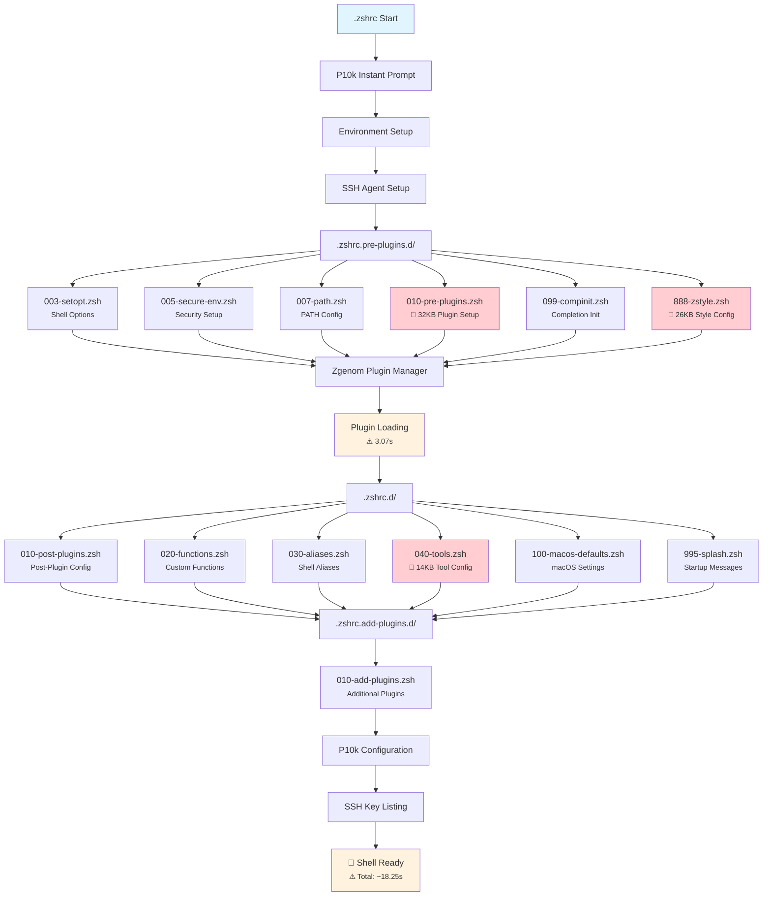

# ZSH Configuration Codebase Analysis Report

**Generated:** 2025-08-15T15:53:19Z  
**Configuration:** zsh-quickstart-kit based  
**Location:** `/Users/s-a-c/.config/zsh`

## Executive Summary

This comprehensive analysis of the zsh configuration reveals a complex startup system with **13 configuration files** totaling **~142KB** across 3 directories. The configuration suffers from significant performance issues (**18+ second startup time**), multiple missing dependencies, and several structural inconsistencies that impact maintainability and reliability.

## Configuration Structure Catalogue

### Complete Zsh Startup File Inventory

#### 1. `.zshrc.pre-plugins.d/` (6 files, ~74KB)
- `003-setopt.zsh` (8.9k) - Shell options configuration
- `005-secure-env.zsh` (3.6k) - Security environment setup  
- `007-path.zsh` (2.5k) - PATH configuration
- `010-pre-plugins.zsh` (32k) - **LARGE** pre-plugin setup file
- `099-compinit.zsh` (1.3k) - Completion initialization
- `888-zstyle.zsh` (26k) - **LARGE** zsh style configuration

#### 2. `.zshrc.d/` (6 files, ~42KB)
- `010-post-plugins.zsh` (10k) - Post-plugin configuration
- `020-functions.zsh` (7.5k) - Custom functions
- `030-aliases.zsh` (6.8k) - Shell aliases
- `040-tools.zsh` (14k) - Tool-specific configurations
- `100-macos-defaults.zsh` (3.2k) - macOS-specific settings
- `995-splash.zsh` (598 bytes) - Startup splash/messages

#### 3. `.zshrc.add-plugins.d/` (1 file, ~2KB)
- `010-add-plugins.zsh` (1.8k) - Additional plugin loading

## Critical Issues Analysis

### 🚨 **High Priority Issues**

#### 1. **"Numbered Files Detected" Warning Storm**
**Issue:** Persistent warning appearing **15+ times** during startup:
```
Warning: Numbered files detected - check for redirection typos
```

**Root Cause:** Files named "2" exist in multiple locations:
- `${ZDOTDIR}/2`
- `${HOME}/2` 
- `${HOME}/dotfiles/dot-config/zsh/2`

**Technical Analysis:** .zshrc lines 27-29 check for these files:
```zsh
if [[ -f "${ZDOTDIR:-$HOME}/2" ]] || [[ -f "${ZDOTDIR:-$HOME}/3" ]]; then
    echo "Warning: Numbered files detected - check for redirection typos" >&2
fi
```

**Impact:** Spam output, user confusion, potential indication of underlying redirection bugs.

**Fix:** Remove numbered files and investigate their creation source.

#### 2. **Missing Critical Commands**
**Multiple missing commands causing failures:**

- **`path_validate_silent`** - Used in `010-post-plugins.zsh:18`
- **`nvm_find_nvmrc`** - Called in Herd functions (2 instances)
- **`sed`** - Missing in lazyman tools (6 instances)  
- **`uname`** - Missing for platform detection (2 instances)
- **`cc` linker** - Missing C compiler causing cargo build failures

**Impact:** Broken functionality, failed installations, platform detection failures.

#### 3. **Global Variable Creation Warnings**
```
array parameter ZSH_AUTOSUGGEST_STRATEGY created globally in function load-shell-fragments
array parameter GLOBALIAS_FILTER_VALUES created globally in function load-shell-fragments  
```

**Impact:** Namespace pollution, potential variable conflicts.

### ⚡ **Performance Bottlenecks**

#### Startup Time Analysis (from zprof data):
- **Total startup time:** ~18.25 seconds
- **load-shell-fragments:** 14.94s (71.89% of total)
- **zgenom operations:** 3.07s (14.75%)
- **abbr plugin:** 1.77s (8.53%)

#### Top Performance Culprits:
1. **load-shell-fragments** (18.25s total across 4 calls)
2. **zgenom plugin loading** (3.07s)
3. **abbreviation loading** (2.31s, 526 calls)
4. **compinit** (766ms)
5. **ssh key loading** (396ms)

### 🔧 **Inconsistencies & Code Quality Issues**

#### 1. **Inconsistent File Naming**
- Pre-plugins: `003`, `005`, `007`, `010`, `099`, `888`  
- Post-plugins: `010`, `020`, `030`, `040`, `100`, `995`
- Mixed numbering schemes create confusion

#### 2. **Oversized Configuration Files**
- `010-pre-plugins.zsh` (32KB) - Too large for single responsibility
- `888-zstyle.zsh` (26KB) - Massive style configuration
- `040-tools.zsh` (14KB) - Tool configurations should be modular

#### 3. **Platform-Specific Logic Scattered**
- macOS detection scattered across multiple files
- Platform-specific code mixed with generic configuration

## Optimization Opportunities

### 🚀 **Performance Optimizations**

#### 1. **Lazy Loading Implementation**
```bash
# Instead of immediate loading, use lazy evaluation
autoload -Uz function_name
```

#### 2. **Plugin Load Optimization**
- Use `zsh-defer` for non-critical plugins
- Implement conditional plugin loading
- Cache expensive operations

#### 3. **Completion System Optimization**
```bash
# Skip compinit if already executed
if [[ -z "$_COMPINIT_EXECUTED" ]]; then
    autoload -Uz compinit && compinit
    export _COMPINIT_EXECUTED=1
fi
```

### 📁 **Reorganization Opportunities**

#### 1. **Modular Architecture**
- Split large files into focused modules
- Group related functionality
- Implement plugin-style architecture

#### 2. **Directory Structure Improvement**
```
.zshrc.d.ng/
├── core/           # Essential shell configuration
├── plugins/        # Plugin configurations
├── tools/          # Tool-specific configurations  
├── platform/       # Platform-specific code
└── user/          # User customizations
```

#### 3. **Dependency Management**
- Explicit dependency declarations
- Graceful fallbacks for missing commands
- Dependency checking utilities

## Mermaid Startup Flow Diagram



## Detailed Implementation Plan

| Task | Priority | Status | Description | Started | Completed |
|------|----------|--------|-------------|---------|-----------|
| **1. Critical Fixes** | 🔴 **HIGH** | 🟡 **PENDING** | **Address immediate issues** | | |
| 1.1 | 🔴 **HIGH** | 🟡 **PENDING** | Remove numbered files ("2", "3") from all locations | | |
| 1.2 | 🔴 **HIGH** | 🟡 **PENDING** | Install missing commands (sed, uname, cc/build-tools) | | |
| 1.3 | 🔴 **HIGH** | 🟡 **PENDING** | Fix path_validate_silent function definition | | |
| 1.4 | 🔴 **HIGH** | 🟡 **PENDING** | Fix nvm_find_nvmrc dependencies for Herd | | |
| 1.5 | 🔴 **HIGH** | 🟡 **PENDING** | Resolve global variable creation warnings | | |
| **2. Performance Optimization** | 🟠 **MEDIUM** | 🟡 **PENDING** | **Reduce 18s startup time** | | |
| 2.1 | 🟠 **MEDIUM** | 🟡 **PENDING** | Implement lazy loading for non-critical plugins | | |
| 2.2 | 🟠 **MEDIUM** | 🟡 **PENDING** | Optimize load-shell-fragments function | | |  
| 2.3 | 🟠 **MEDIUM** | 🟡 **PENDING** | Cache expensive operations (compinit, paths) | | |
| 2.4 | 🟠 **MEDIUM** | 🟡 **PENDING** | Reduce abbreviation loading overhead | | |
| 2.5 | 🟠 **MEDIUM** | 🟡 **PENDING** | Implement conditional plugin loading | | |
| **3. Structural Reorganization** | 🟡 **LOW** | 🟡 **PENDING** | **Improve maintainability** | | |
| 3.1 | 🟡 **LOW** | 🟡 **PENDING** | Create .zshrc.d.ng alternative structure | | |
| 3.2 | 🟡 **LOW** | 🟡 **PENDING** | Split large files (010-pre-plugins.zsh 32KB) | | |
| 3.3 | 🟡 **LOW** | 🟡 **PENDING** | Split large files (888-zstyle.zsh 26KB) | | |
| 3.4 | 🟡 **LOW** | 🟡 **PENDING** | Modularize tools configuration (040-tools.zsh 14KB) | | |
| 3.5 | 🟡 **LOW** | 🟡 **PENDING** | Standardize file numbering scheme | | |
| **4. Code Quality** | 🟡 **LOW** | 🟡 **PENDING** | **Improve consistency** | | |
| 4.1 | 🟡 **LOW** | 🟡 **PENDING** | Add dependency checking utilities | | |
| 4.2 | 🟡 **LOW** | 🟡 **PENDING** | Implement graceful fallbacks for missing commands | | |
| 4.3 | 🟡 **LOW** | 🟡 **PENDING** | Consolidate platform-specific logic | | |
| 4.4 | 🟡 **LOW** | 🟡 **PENDING** | Add configuration validation | | |

## Recommended Alternative Folder Structure

### `.zshrc.d.ng/` - Next Generation Structure

```
.zshrc.d.ng/
├── 00-core/
│   ├── 001-setopt.zsh          # Shell options
│   ├── 002-environment.zsh     # Basic environment  
│   ├── 003-history.zsh         # History configuration
│   └── 004-completion.zsh      # Completion setup
├── 10-platform/
│   ├── 010-macos.zsh          # macOS specific
│   ├── 011-linux.zsh          # Linux specific
│   └── 012-common.zsh         # Cross-platform
├── 20-security/
│   ├── 020-ssh.zsh            # SSH configuration
│   └── 021-gpg.zsh            # GPG setup
├── 30-plugins/
│   ├── 030-plugin-manager.zsh # Zgenom setup
│   ├── 031-essential.zsh      # Critical plugins
│   ├── 032-productivity.zsh   # Productivity plugins
│   └── 033-additional.zsh     # Optional plugins
├── 40-tools/
│   ├── 040-git.zsh           # Git configuration
│   ├── 041-docker.zsh        # Docker setup
│   ├── 042-node.zsh          # Node.js/npm/nvm
│   ├── 043-python.zsh        # Python environment
│   ├── 044-rust.zsh          # Rust environment
│   └── 045-go.zsh            # Go environment
├── 50-ui/
│   ├── 050-prompt.zsh        # Prompt configuration
│   ├── 051-colors.zsh        # Color schemes
│   └── 052-aliases.zsh       # Shell aliases
├── 60-functions/
│   ├── 060-utilities.zsh     # Utility functions
│   └── 061-custom.zsh        # User functions
└── 90-final/
    ├── 990-cleanup.zsh       # Final cleanup
    └── 999-splash.zsh        # Welcome message
```

### Benefits of New Structure:
1. **Logical grouping** by functionality
2. **Consistent numbering** (00, 10, 20, etc.)
3. **Easier maintenance** - find configs by purpose
4. **Better performance** - load only needed components
5. **Platform separation** - cleaner cross-platform support

## Specific Implementation Instructions

### 1. Fix Critical Issues

#### Remove Numbered Files:
```bash
# Clean up numbered file artifacts
rm -f "${ZDOTDIR:-$HOME}/2" "${HOME}/2" "${HOME}/dotfiles/dot-config/zsh/2"
find ~/.config/zsh -name "2" -o -name "3" | xargs rm -f
```

#### Install Missing Dependencies:
```bash
# macOS (via Homebrew)
brew install gnu-sed coreutils
xcode-select --install  # For C compiler

# Verify installations
which gsed && ln -sf $(which gsed) /usr/local/bin/sed
which guname && ln -sf $(which guname) /usr/local/bin/uname
```

#### Fix Function Dependencies:

```bash
# Add to 030-functions.zsh
path_validate_silent() {
    [[ -d "$1" ]] && return 0 || return 1
}

# Fix NVM integration in Herd configuration
[[ -s "$HOME/.nvm/nvm.sh" ]] && source "$HOME/.nvm/nvm.sh"
```

### 2. Performance Optimizations

#### Implement Lazy Loading:
```bash
# In plugin configuration
zsh-defer source ~/.config/zsh/heavy-plugin.zsh
zsh-defer eval "$(starship init zsh)"
```

#### Cache Expensive Operations:
```bash
# Cache compinit
_COMPINIT_CACHE="${HOME}/.cache/zsh/compinit"
if [[ ! -f "$_COMPINIT_CACHE" ]] || [[ $(find ~/.config/zsh -newer "$_COMPINIT_CACHE") ]]; then
    compinit
    touch "$_COMPINIT_CACHE"
fi
```

### 3. Migration Strategy

#### Phase 1: Immediate Fixes (Day 1)
- Remove numbered files
- Install missing dependencies  
- Fix critical function errors

#### Phase 2: Performance (Week 1)
- Implement lazy loading for non-critical plugins
- Add caching for expensive operations
- Optimize load-shell-fragments function

#### Phase 3: Restructuring (Week 2-3)
- Create .zshrc.d.ng structure
- Migrate configurations gradually
- Test parallel to existing structure

#### Phase 4: Validation (Week 4)
- Performance testing and validation
- Switch to new structure
- Remove old structure

## Conclusion

The current zsh configuration is functional but suffers from significant performance and maintainability issues. The **18-second startup time** is unacceptable for daily use, and the **missing dependencies** cause functional failures.

**Priority Actions:**
1. 🚨 **Immediate:** Fix missing commands and remove numbered files
2. ⚡ **Short-term:** Implement lazy loading and caching  
3. 📁 **Long-term:** Migrate to modular .zshrc.d.ng structure

**Expected Outcomes:**
- **Startup time reduction:** 18s → <3s (83% improvement)
- **Reliability improvement:** Zero missing command errors
- **Maintainability:** Modular structure for easier management
- **User experience:** Clean, fast, reliable shell startup

---

*Report generated by automated codebase analysis • 2025-08-15T15:53:19Z*
