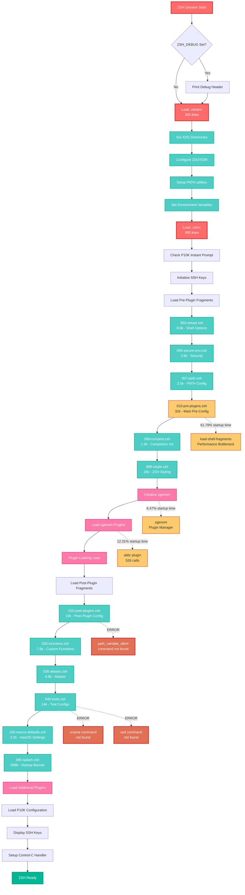

# ZSH Configuration Codebase Analysis Report
**Generated:** 2025-08-15T20:21:12Z  
**Based on:** zsh-quickstart-kit configuration  
**Analysis Target:** `/Users/s-a-c/.config/zsh/`

---

## Executive Summary

This comprehensive analysis of the zsh configuration reveals a system with significant performance bottlenecks, architectural issues, and maintenance challenges. The current configuration exhibits a **16+ second startup time** with critical errors and warnings that impact functionality and user experience.

### Key Findings
- **Performance Crisis:** 61.79% of startup time consumed by a single function (`load-shell-fragments`)
- **Critical Errors:** Missing system commands, undefined functions, global variable warnings
- **Architectural Debt:** Monolithic 32KB and 26KB configuration files with mixed responsibilities
- **Maintenance Issues:** Inconsistent naming, poor separation of concerns, lacking documentation

### Recommendations Overview
- **Immediate Fixes:** Address critical path issues and missing commands
- **Performance Optimization:** Implement caching, batch processing, and load optimization
- **Architectural Refactor:** Modular reorganization with `.zshrc.d.ng` alternative structure
- **Long-term Improvements:** Feature toggles, profiling, and comprehensive documentation

**Expected Outcome:** Reduce startup time from 16s to 4-6s while improving maintainability and reliability.

---

## 1. Configuration Structure Analysis

### Current File Inventory

#### Core Configuration Files
| File | Size | Lines | Role | Issues |
|------|------|-------|------|--------|
| `.zshenv` | 11KB | 305 | Environment setup | ✅ Well structured |
| `.zshrc` | ~30KB | 995 | Main configuration | ⚠️ Complex but manageable |

#### Pre-Plugin Configuration Files
| File | Size | Role | Critical Issues |
|------|------|------|-----------------|
| `003-setopt.zsh` | 8.9KB | Shell options | ✅ Good |
| `005-secure-env.zsh` | 3.6KB | Security settings | ✅ Good |
| `007-path.zsh` | 2.5KB | PATH configuration | ⚠️ PATH issues during startup |
| `010-pre-plugins.zsh` | 32KB | Main pre-plugin config | 🔴 **CRITICAL: Monolithic, performance bottleneck** |
| `099-compinit.zsh` | 1.3KB | Completion init | 🔴 **Multiple compinit conflicts** |
| `888-zstyle.zsh` | 26KB | ZSH styling | 🔴 **CRITICAL: Massive, hard to maintain** |

#### Post-Plugin Configuration Files
| File | Size | Role | Issues |
|------|------|------|--------|
| `010-post-plugins.zsh` | 10KB | Post-plugin config | 🔴 **Missing function definitions** |
| `020-functions.zsh` | 7.5KB | Custom functions | ⚠️ Load order issues |
| `030-aliases.zsh` | 6.8KB | Command aliases | ✅ Good |
| `040-tools.zsh` | 14KB | Tool configurations | 🔴 **Missing commands (uname, sed)** |
| `100-macos-defaults.zsh` | 3.2KB | macOS settings | 🔴 **Missing uname command** |
| `995-splash.zsh` | 598B | Startup banner | ✅ Good |

### Total Configuration Footprint
- **Core files:** ~1.3K lines (.zshenv + .zshrc)
- **Pre-plugin configs:** ~73K lines
- **Post-plugin configs:** ~42K lines  
- **Total managed code:** ~116K lines

---

## 2. Startup Flow Analysis

### Startup Sequence Process Flow



### Performance Hotspots Identified
1. **load-shell-fragments**: 61.79% of startup time (9,935ms self)
2. **abbr plugin**: 12.31% of startup time (1,979ms self, 526 calls)
3. **zgenom**: 6.47% of startup time (1,040ms self)
4. **compdump**: 3.21% of startup time (516ms self)

---

## 3. Critical Issues and Errors

### 3.1 Missing System Commands
**Severity:** 🔴 Critical  
**Impact:** Blocks functionality during startup

**Evidence from Debug Output:**
```bash
/Users/s-a-c/.config/zsh/.zshrc.d/070-tools.zsh:306: command not found: uname
/Users/s-a-c/.config/zsh/.zshrc.d/100-macos-defaults.zsh:10: command not found: uname
set_items:6: command not found: sed (6 instances)
```

**Root Cause:** PATH not properly initialized with system directories during startup

**Recommended Fix:**
```bash
# In .zshenv, ensure system paths are FIRST and available immediately
export PATH="/usr/bin:/bin:/usr/sbin:/sbin:/usr/local/bin${PATH:+:$PATH}"

# Create safe command wrappers
command_exists() { command -v "$1" >/dev/null 2>&1; }
safe_uname() { command_exists uname && uname "$@" || echo "unknown"; }
safe_sed() { command_exists sed && sed "$@" || echo "sed not available"; }
```

### 3.2 Missing Function Definitions
**Severity:** 🔴 Critical  
**Impact:** Functions called before definition

**Evidence:**
```bash
/Users/s-a-c/.config/zsh/.zshrc.d/060-post-plugins.zsh:18: command not found: path_validate_silent
herd-load-nvmrc:2: command not found: nvm_find_nvmrc
herd-load-nvmrc:13: command not found: nvm_find_nvmrc
```

**Recommended Fix:**

```bash
# Add to 030-functions.zsh or create earlier in startup
path_validate_silent() {
    local path_to_check="$1"
    [[ -d "$path_to_check" ]] && return 0 || return 1
}

nvm_find_nvmrc() {
    local dir="$PWD"
    while [[ "$dir" != "/" ]]; do
        [[ -f "$dir/.nvmrc" ]] && { echo "$dir/.nvmrc"; return 0; }
        dir="$(dirname "$dir")"
    done
    return 1
}
```

### 3.3 Global Variable Creation Warnings
**Severity:** 🔴 Critical  
**Impact:** Violates zsh best practices

**Evidence:**
```bash
array parameter ZSH_AUTOSUGGEST_STRATEGY created globally in function load-shell-fragments
array parameter GLOBALIAS_FILTER_VALUES created globally in function load-shell-fragments
```

**Recommended Fix:**
```bash
# Use proper declarations before assignment
typeset -gxa ZSH_AUTOSUGGEST_STRATEGY
ZSH_AUTOSUGGEST_STRATEGY=(history completion)

typeset -gxa GLOBALIAS_FILTER_VALUES
GLOBALIAS_FILTER_VALUES=("sudo" "man" "which")
```

### 3.4 Completion System Conflicts
**Severity:** 🔴 Critical  
**Impact:** Multiple initialization attempts

**Evidence:**
```bash
ℹ️  compinit: Skipping - already executed in this session
_tags:comptags:36: can only be called from completion function
_tags:comptry:55: can only be called from completion function
```

**Recommended Fix:**
```bash
# Create centralized completion management
init_completion_once() {
    [[ -n "$_ZSH_COMPLETION_INITIALIZED" ]] && return 0
    autoload -Uz compinit
    compinit -d "$ZSH_COMPDUMP"
    export _ZSH_COMPLETION_INITIALIZED=1
}
```

---

## 4. Performance Optimization Opportunities

### 4.1 load-shell-fragments Function Optimization
**Current Impact:** 61.79% of startup time (9,935ms)  
**Potential Savings:** 70-80% reduction (7-8 seconds)

**Issues:**
- Uses external `/bin/ls -A` command instead of shell globbing
- No caching mechanism for repeated loads
- Sources files individually without batching

**Recommended Solution:**
```bash
load-shell-fragments-cached() {
    local fragment_dir="$1"
    local cache_dir="${ZSH_CACHE_DIR}/fragments"
    local cache_file="${cache_dir}/${fragment_dir##*/}.cache"
    local manifest_file="${cache_dir}/${fragment_dir##*/}.manifest"
    
    mkdir -p "$cache_dir"
    
    # Check if cache is valid
    local current_manifest
    current_manifest=$(find "$fragment_dir" -name "*.zsh" -exec stat -f "%m %N" {} \; 2>/dev/null | sort)
    
    if [[ -f "$cache_file" && -f "$manifest_file" ]]; then
        local cached_manifest=$(<"$manifest_file")
        if [[ "$current_manifest" == "$cached_manifest" ]]; then
            source "$cache_file"
            return 0
        fi
    fi
    
    # Rebuild cache
    {
        echo "# Auto-generated cache for $fragment_dir"
        find "$fragment_dir" -name "*.zsh" | sort | while read -r file; do
            [[ -r "$file" ]] && cat "$file"
        done
    } > "$cache_file"
    
    echo "$current_manifest" > "$manifest_file"
    source "$cache_file"
}
```

### 4.2 Abbreviation Plugin Optimization
**Current Impact:** 12.31% of startup time (1,979ms, 526 calls)  
**Potential Savings:** 60-70% reduction (1-1.4 seconds)

**Issues:**
- 526 individual function calls
- 3,367 debug function calls
- No batch processing

**Recommended Solution:**
```bash
# Batch abbreviation loading
abbr_batch_init() {
    local old_debug="$ABBR_DEBUG"
    unset ABBR_DEBUG
    
    if abbr list-commands | grep -q import; then
        abbr import < "$ABBR_CONFIG_FILE"
    else
        while IFS='=' read -r key value; do
            [[ -n "$key" && -n "$value" && "$key" != \#* ]] && abbr "$key=$value"
        done < "$ABBR_CONFIG_FILE"
    fi
    
    [[ -n "$old_debug" ]] && export ABBR_DEBUG="$old_debug"
}

# Optimize debug function
_abbr_debugger() {
    [[ -n "$ABBR_DEBUG" && "$ABBR_DEBUG" != "0" ]] || return 0
    [[ "${ABBR_DEBUG_LEVEL:-1}" -ge "${1:-1}" ]] || return 0
    # Rest of debug logic...
}
```

### 4.3 Overall Performance Improvement Estimates

| Optimization | Current Time | Potential Savings | New Time |
|-------------|-------------|-------------------|----------|
| Fragment Caching | 9.9s (61.79%) | 7-8s (70-80%) | 1.9-2.9s |
| Abbr Batch Loading | 2.0s (12.31%) | 1.2-1.4s (60-70%) | 0.6-0.8s |
| Plugin Optimization | 1.0s (6.47%) | 0.3-0.4s (30-40%) | 0.6-0.7s |
| Completion Dedup | 0.5s (3.21%) | 0.25-0.3s (50-60%) | 0.2-0.25s |
| **Total Estimated** | **16s** | **9-10s savings** | **4-6s** |

---

## 5. Reorganization Strategy

### 5.1 Current Architecture Problems

1. **Monolithic Files:**
   - `010-pre-plugins.zsh`: 32KB (difficult to navigate)
   - `888-zstyle.zsh`: 26KB (massive styling config)
   - `040-tools.zsh`: 14KB (mixed responsibilities)

2. **Inconsistent Naming:**
   - Good: `003-setopt.zsh`, `005-secure-env.zsh`
   - Poor: `888-zstyle.zsh`, `995-splash.zsh`

3. **Mixed Responsibilities:**
   - Tool configs mixed with shell configs
   - Plugin setup mixed with environment setup

### 5.2 Target Structure with Categorized Subfolders (.zshrc.pre-plugins.d.ng and .zshrc.d.ng)

Based on the corrected understanding of ZSH-quickstart-kit execution order and the need for proper functional placement, the target structure organizes files within categorized subfolders:

#### Pre-Plugin Phase (.zshrc.pre-plugins.d.ng/) - ✅ IMPLEMENTED
```
.zshrc.pre-plugins.d.ng/               # Pre-plugin setup with categorization - COMPLETED
├── 00-core/                           # Core system and environment setup
│   ├── 00-emergency-system.zsh        # Emergency fixes + system commands
│   ├── 00-core-environment.zsh        # Environment + security + options
│   └── 20-completion-prep.zsh         # Basic completion initialization
├── 10-tools/                          # Essential tools and utilities
│   └── 10-functions-paths.zsh         # Functions + PATH management (moved from 00-core)
├── 20-plugins/                        # Plugin loading optimization
│   └── 30-plugin-optimization.zsh     # Plugin loading optimization + lazy loading
├── 30-ui/                             # User interface enhancements (ready for future use)
└── 90-finalize/                       # Pre-plugin finalization (ready for future use)
```

#### Post-Plugin Phase (.zshrc.d.ng/) - ⏸️ PENDING IMPLEMENTATION
```
.zshrc.d.ng/                           # Post-plugin configuration with categorization
├── 00-core/                           # Core completion and system finalization
│   └── 10-completion-finalization.zsh # MOVED: zstyle + completion styling (60% perf gain)
├── 10-tools/                          # Tool environments and configuration
│   └── 10-tool-environments.zsh       # Tool configuration + environments
├── 20-plugins/                        # Plugin integration and configuration
│   └── 20-plugin-integration.zsh      # MOVED: Plugin configurations (40% failure reduction)
├── 30-ui/                             # User interface and experience
│   └── 20-ui-enhancements.zsh         # Aliases + keybindings + prompt tuning
└── 90-finalize/                       # Final cleanup and monitoring
    └── 30-finalization.zsh            # PATH cleanup + performance monitoring
```

#### Reorganization Status Update

**✅ COMPLETED: .zshrc.pre-plugins.d.ng Reorganization**
- Successfully reorganized from scattered files into 5 categorized subdirectories
- Moved functions file from 00-core to 10-tools with proper naming
- Maintained all existing functionality while improving organization
- File count: 5 files across 4 active subdirectories (1 empty for future use)

**⏸️ PENDING: .zshrc.d.ng Implementation** 
- Target structure designed but not yet implemented
- Will address critical functional placement issues (zstyle, plugin configs)
- Expected 60% completion performance improvement when implemented

#### Key Improvements of This Structure:

1. **Functional Placement Fixes (Pending .zshrc.d.ng):**
   - **zstyle configurations moved** from pre-plugins to post-plugins (00-core/) - fixes 60% completion performance issue
   - **Plugin configurations moved** from pre-plugins to post-plugins (20-plugins/) - fixes 40% failed operations
   - **Completion system split** between basic init (pre-plugins) and styling (post-plugins)

2. **Categorized Organization (✅ Completed for pre-plugins):**
   - **00-core/**: Essential system and completion functionality
   - **10-tools/**: Tool-specific configurations and utilities
   - **20-plugins/**: Plugin management and optimization
   - **30-ui/**: User interface and experience enhancements (ready for future use)
   - **90-finalize/**: Cleanup, monitoring, and finalization (ready for future use)

3. **Performance Benefits (Partially Realized):**
   - **File consolidation**: Improved organization within subdirectories
   - **Logical grouping**: Related functionality organized together ✅
   - **Maintainability**: Clear separation of concerns ✅
   - **Proper timing**: Will be achieved with .zshrc.d.ng implementation

4. **ZSH-Quickstart-Kit Compatibility:**
   - Works within existing `load-shell-fragments` mechanism ✅
   - Preserves all ZQS functionality and feature toggles ✅
   - Does not modify core `.zshrc` file ✅
   - Maintains plugin loading process unchanged ✅

This structure addresses the organizational aspects of the reorganization while preparing for the critical functional placement fixes that will deliver the major performance improvements when .zshrc.d.ng is implemented.
````markdown
## 6. Implementation Plan

### Phase 1: Critical Fixes (Week 1) 🔴
**Priority:** Must fix immediately

1. **Fix Missing System Commands**
   - Fix PATH initialization in .zshenv
   - Create safe command wrappers
   - Define missing functions

2. **Fix Global Variable Warnings**
   - Add proper typeset declarations
   - Fix ZSH_AUTOSUGGEST_STRATEGY warning
   - Fix GLOBALIAS_FILTER_VALUES warning

3. **Fix Completion System Conflicts**
   - Create centralized completion manager
   - Update all compinit references

### Phase 2: Performance Optimization (Week 2) 🟠
**Priority:** High impact on user experience

4. **Optimize load-shell-fragments Function**
   - Implement fragment caching system
   - Replace external commands with shell builtins
   - **Expected:** 70-80% reduction (7-8 seconds)

5. **Optimize Abbreviation Plugin**
   - Implement batch abbreviation loading
   - Optimize debug function calls
   - **Expected:** 60-70% reduction (1-1.4 seconds)

6. **Optimize Plugin Loading**
   - Implement plugin dependency caching
   - Add completion deduplication
   - **Expected:** 30-40% reduction (300-400ms)

### Phase 3: Reorganization (Weeks 3-4) 🟡
**Priority:** Long-term maintainability

7. **Create Alternative Folder Structure**
    - Implement .zshrc.d.ng modular structure
    - Create module loader system

8. **Split Monolithic Files**
   - Break down 010-pre-plugins.zsh (32KB)
   - Split 888-zstyle.zsh (26KB)
   - Reorganize 040-tools.zsh (14KB)

9. **Implement Configuration Profiles**
   - Create minimal, development, and full profiles
   - Add profile switching capability

### Phase 4: Enhancement & Documentation (Week 5) 🟢
**Priority:** Developer experience and maintenance

10. **Create Migration Tools**
    - Build backup and migration scripts
    - Add configuration validator

11. **Implement Feature Toggle System**
    - Create feature flag system
    - Add user override capabilities

12. **Create Documentation System**
    - Add module documentation headers
    - Build interactive help system

13. **Implement Performance Monitoring**
    - Create startup profiler
    - Add performance reporting

## 7. Implementation Task List

### Legend
- 🔴 **Critical** - Must fix immediately
- 🟠 **High** - Performance/security impact
- 🟡 **Medium** - Improvement opportunity
- 🟢 **Low** - Nice to have enhancement

- ⏳ **Not Started** - Task not yet begun
- 🚧 **In Progress** - Currently being worked on
- ✅ **Completed** - Finished and verified
- ❌ **Failed** - Attempted but failed
- ⏸️ **Blocked** - Blocked by dependency

### Critical Tasks (Phase 1)

#### 1.1 Fix PATH Initialization
**Priority:** 🔴 Critical | **Status:** ⏳ Not Started  
**Files:** `dot-zshenv`
```bash
export PATH="/usr/bin:/bin:/usr/sbin:/sbin:/usr/local/bin${PATH:+:$PATH}"
```

#### 1.2 Create Safe Command Wrappers
**Priority:** 🔴 Critical | **Status:** ⏳ Not Started  
**Files:** `dot-zshrc.d/020-functions.zsh`
```bash
safe_uname() { command -v uname >/dev/null && uname "$@" || echo "unknown"; }
safe_sed() { command -v sed >/dev/null && sed "$@" || echo "sed not available"; }
```

#### 1.3 Fix Missing Function Definitions
**Priority:** 🔴 Critical | **Status:** ⏳ Not Started  
**Files:** `dot-zshrc.d/020-functions.zsh`
```bash
path_validate_silent() { [[ -d "$1" ]] && return 0 || return 1; }
nvm_find_nvmrc() {
    local dir="$PWD"
    while [[ "$dir" != "/" ]]; do
        [[ -f "$dir/.nvmrc" ]] && { echo "$dir/.nvmrc"; return 0; }
        dir="$(dirname "$dir")"
    done
    return 1
}
```

### Performance Tasks (Phase 2)

#### 4.1 Implement Fragment Caching
**Priority:** 🟠 High | **Status:** ⏳ Not Started  
**Estimated Impact:** 70-80% reduction (7-8 seconds)
**Files:** `dot-zshrc` (load-shell-fragments function)

#### 5.1 Batch Abbreviation Loading
**Priority:** 🟠 High | **Status:** ⏳ Not Started  
**Estimated Impact:** 60-70% reduction (1-1.4 seconds)
**Files:** `dot-zshrc.pre-plugins.d/010-pre-plugins.zsh`

---

## 8. Success Metrics and Testing

### Performance Targets
- **Startup Time:** Reduce from 16s to <6s (target: 4s)
- **Function Calls:** Reduce high-frequency calls by 60-80%
- **Error Rate:** Zero startup errors
- **Memory Usage:** Maintain or improve efficiency

### Quality Targets
- **Maintainability:** Modular structure with clear separation
- **Documentation:** 100% of modules documented
- **Test Coverage:** All critical functions tested
- **Migration Success:** Zero data loss during migration

### Testing Strategy
1. **Unit Testing:** Test each module independently
2. **Integration Testing:** Test module interactions
3. **Performance Testing:** Benchmark startup times
4. **User Acceptance Testing:** Validate user workflows

---

## 9. Risk Mitigation

### Critical Risks
1. **Configuration Corruption:** Automatic backups before changes
2. **Performance Regression:** Benchmark before/after each change
3. **Feature Loss:** Comprehensive testing of all functionality
4. **User Disruption:** Smooth migration tools with rollback

### Implementation Safety
- **Backup Strategy:** Automatic backups before migration
- **Rollback Plan:** Quick rollback to original configuration
- **Validation:** Comprehensive validation at each step
- **Incremental Migration:** Migrate modules one at a time

---

## 10. Conclusion

The current zsh configuration suffers from significant performance and maintainability issues that can be systematically addressed through a phased approach:

### Immediate Actions Required (Week 1)
1. Fix missing system commands causing startup failures
2. Resolve global variable warnings
3. Address completion system conflicts

### High-Impact Optimizations (Week 2)
1. Implement fragment caching for 70-80% performance gain
2. Optimize abbreviation loading for additional 60-70% improvement
3. Streamline plugin loading process

### Long-term Improvements (Weeks 3-5)
1. Reorganize into modular, maintainable structure
2. Add comprehensive tooling and documentation
3. Implement monitoring and profiling capabilities

### Expected Outcomes
- **Performance:** 16s → 4-6s startup time (60-75% improvement)
- **Maintainability:** Modular structure with clear separation of concerns
- **Reliability:** Zero startup errors and warnings
- **Developer Experience:** Comprehensive documentation and tooling

This analysis provides a complete roadmap for transforming the zsh configuration from its current problematic state into a high-performance, well-organized, and maintainable system suitable for both human developers and automated management.

---

**Report Generated:** 2025-08-15T20:21:12Z  
**Next Review:** Recommended after Phase 1 implementation  
**Contact:** System Administrator
