# ZSH Configuration Codebase Analysis Report

**Generated:** 2025-08-15 07:51  
**Updated:** 2025-08-15 14:55
**Configuration Type:** zsh-quickstart-kit based  
**Location:** `/Users/s-a-c/.config/zsh`

## Executive Summary

This analysis covers a comprehensive zsh configuration setup based on zsh-quickstart-kit, using a modular approach with multiple startup directories. The configuration uses symbolic links to a dotfiles repository and employs zgenom for plugin management.

**RECENT UPDATE:** Based on live ZSH_DEBUG=1 diagnostic output (2025-08-15 14:55), confirmed successful directory usage and identified critical system issues requiring immediate attention.

### Key Findings - Latest Live Diagnostic Status
- ✅ **CONFIRMED:** .zshrc.pre-plugins.d directory successfully loaded (5 files)
- ✅ **CONFIRMED:** .zshrc.d directory successfully loaded (6 files) - **STATUS CORRECTED**
- ✅ **CONFIRMED:** .zshrc.add-plugins.d directory successfully loaded (1 file)
- ✅ **CONFIRMED:** Plugin system functional with zgenom integration
- ❌ **CRITICAL:** compinit parse error: "condition expected: $1" - system failure persists
- ❌ **CRITICAL:** Missing C compiler (`cc` not found in $PATH) causing Rust compilation failures
- ❌ **CRITICAL:** Multiple command not found errors (sed, uname, nvm commands)
- ❌ **WARNING:** Persistent "Numbered files detected" warnings throughout startup
- ❌ **PERFORMANCE:** Severe performance degradation - startup time increased to ~17 seconds
- ❌ **COMPLETION:** _tags context errors indicating broken completion system

### New Critical Findings (2025-08-15 14:55)
- 🔥 **PERFORMANCE REGRESSION:** load-shell-fragments now consuming 86.53% of startup time (14,951.31ms vs previous 3,811.41ms)
- 🔥 **PATH MONITORING URGENT:** Missing `cc` compiler preventing Rust toolchain installations
- ✅ **DIRECTORY STATUS CORRECTION:** Previous reports incorrectly claimed .zshrc.d/ was not loading - **ALL DIRECTORIES ARE FUNCTIONAL**

---

## 1. Live ZSH_DEBUG=1 Diagnostic Analysis (2025-08-15 14:40)

### 1.1 Confirmed Successful Directory Usage

**MAJOR CONFIRMATION:** All three directory structures are successfully loading:

#### .zshrc.pre-plugins.d/ Directory - ✅ FUNCTIONAL
The debug output shows successful loading of all 5 files:
```
# ++++++ /Users/s-a-c/.config/zsh/.zshrc.pre-plugins.d/003-setopt.zsh ++++++++++++++++++++++++++++++++++++
# ++++++ /Users/s-a-c/.config/zsh/.zshrc.pre-plugins.d/005-secure-env.zsh ++++++++++++++++++++++++++++++++++++
# ++++++ /Users/s-a-c/.config/zsh/.zshrc.pre-plugins.d/007-path.zsh ++++++++++++++++++++++++++++++++++++
# ++++++ /Users/s-a-c/.config/zsh/.zshrc.pre-plugins.d/010-pre-plugins.zsh ++++++++++++++++++++++++++++++++++++
# ++++++ /Users/s-a-c/.config/zsh/.zshrc.pre-plugins.d/888-zstyle.zsh ++++++++++++++++++++++++++++++++++++
```

#### .zshrc.d/ Directory - ✅ FUNCTIONAL
The debug output shows successful loading of all 6 files:
```
# ++++++ /Users/s-a-c/.config/zsh/.zshrc.d/010-post-plugins.zsh ++++++++++++++++++++++++++++++++++++
# ++++++ /Users/s-a-c/.config/zsh/.zshrc.d/020-functions.zsh ++++++++++++++++++++++++++++++++++++
# ++++++ /Users/s-a-c/.config/zsh/.zshrc.d/030-aliases.zsh ++++++++++++++++++++++++++++++++++++
# ++++++ /Users/s-a-c/.config/zsh/.zshrc.d/040-tools.zsh ++++++++++++++++++++++++++++++++++++
# ++++++ /Users/s-a-c/.config/zsh/.zshrc.d/100-macos-defaults.zsh ++++++++++++++++++++++++++++++++++++
# ++++++ /Users/s-a-c/.config/zsh/.zshrc.d/995-splash.zsh ++++++++++++++++++++++++++++++++++++
```

#### .zshrc.add-plugins.d/ Directory - ✅ FUNCTIONAL
The debug output confirms successful loading:
```
# ++++++ /Users/s-a-c/.config/zsh/.zshrc.add-plugins.d/010-add-plugins.zsh ++++++++++++++++++++++++++++++++++++
```

**CONCLUSION:** Previous reports of non-functional directory loading were incorrect. All modular directory structures are working properly.

### 1.2 Critical System Failures Identified

#### compinit Parse Error - ❌ CRITICAL FAILURE
```
compinit failed, attempting recovery
compinit:141: parse error: condition expected: $1
```
- **Status:** Complete compinit system failure
- **Impact:** Broken completion system throughout shell
- **Location:** Occurring in pre-plugins phase
- **Severity:** CRITICAL - renders completion system unusable

#### Missing System Dependencies - ❌ CRITICAL INFRASTRUCTURE
**Missing C Compiler:**
```
error: linker `cc` not found
  |
  = note: No such file or directory (os error 2)
```
- **Impact:** Rust compilation failures for cargo tools
- **Affected:** cargo-audit, cargo-nextest, cargo-edit installations fail
- **Root Cause:** Missing Xcode Command Line Tools or build environment

**Command Not Found Errors:**
```
/Users/s-a-c/.config/zsh/.zshrc.d/040-tools.zsh:294: command not found: uname
/Users/s-a-c/.config/zsh/.zshrc.d/100-macos-defaults.zsh:10: command not found: uname
set_items:6: command not found: sed
herd-load-nvmrc:2: command not found: nvm_find_nvmrc
```

### 1.3 Performance Profiling Analysis - Live Data

**Major Performance Bottlenecks Identified (Latest Session 2025-08-15 14:55):**

| Function | Calls | Total Time | Self Time | % Total | % Self | Analysis |
|----------|-------|------------|-----------|---------|---------|-----------|
| load-shell-fragments | 4 | 14,951.31ms | 11,558.37ms | 86.53% | 66.89% | **CRITICAL REGRESSION** |
| abbr | 526 | 2,425.32ms | 1,888.96ms | 14.04% | 10.93% | High call frequency |
| zgenom | 46 | 3,186.40ms | 1,222.05ms | 18.44% | 7.07% | Plugin loading overhead |
| compdump | 1 | 496.83ms | 496.83ms | 2.88% | 2.88% | Completion cache generation |
| compinit | 3 | 766.46ms | 115.26ms | 4.44% | 0.67% | Multiple executions |

**Critical Performance Issues - Updated Analysis:**
1. **🔥 SEVERE REGRESSION:** load-shell-fragments increased from 11,450ms to 11,558ms self time 
2. **🔥 TOTAL STARTUP TIME:** Now ~17.3 seconds (up from ~16.9 seconds)
3. **abbr plugin overhead:** 526 calls with 10.93% self time (slight improvement)
4. **zgenom overhead increase:** Plugin loading time increased to 7.07% from 5.77%
5. **Performance trend:** Overall degradation with increased startup times

### 1.4 Numbered Files Warning Analysis

**Persistent Warning Throughout Startup:**
```
Warning: Numbered files detected - check for redirection typos
```
- **Frequency:** Appears with every file load (12+ times)
- **Source:** Monitoring script detecting file named "2" 
- **Impact:** Cosmetic warning spam, indicates monitoring system is active
- **Recommendation:** Clean up numbered files and refine warning system

### 1.5 Completion System Breakdown

**Context Errors:**
```
_tags:comptags:36: can only be called from completion function
_tags:comptry:55: can only be called from completion function
_tags:comptags:60: can only be called from completion function
```
- **Status:** Completion functions called outside proper context
- **Impact:** Broken tab completion functionality
- **Root Cause:** compinit failure cascading to completion system

### 1.6 Plugin System Status - ✅ FUNCTIONAL

**Confirmed Working Plugins:**
- **zgenom:** Successfully loading 46 plugins
- **zsh-abbr:** Functional but performance-heavy (526 calls)
- **fast-syntax-highlighting:** Loading successfully
- **carapace:** Integration working
- **evalcache:** Performance optimization active

### 1.7 System Environment Issues

**Tool Integration Failures:**
- **Google Cloud SDK:** bashcompinit function definition file not found
- **Herd/NVM:** nvm_find_nvmrc command not found
- **Lazyman:** sed command resolution issues
- **Rustup:** Working but compiler dependencies missing

---

## 2. Historical Profiling Analysis (Previous Sessions)

### 1.1 Performance Bottlenecks

**Startup Time Distribution (Latest Profiling Data):**
- **abbr:** 37.74% total (2490.27ms), 29.08% self (1918.79ms) - MAJOR BOTTLENECK with 526 calls
- **zgenom:** 54.97% total (3627.37ms), 14.40% self (950.28ms) - Plugin loading overhead (46 calls)
- **compdef:** 11.66% (769.36ms) - Completion definitions (1125 calls)
- **load-shell-fragments:** 57.76% total (3811.41ms), 6.08% self (400.96ms) - 4 calls but high overhead
- **compinit:** 23.43% total (1546.11ms), 3.66% self (241.79ms) - 4 calls with conflicts
- **compdump:** 7.51% (495.27ms) - Completion cache generation (1 call)

**Critical Performance Issues:**
1. **abbr plugin dominance:** 526 calls consuming nearly 30% of startup time
2. **load-shell-fragments overhead:** Single highest total time consumer at 57.76%
3. **Excessive compdef calls:** 1125 completion definitions being processed
4. **Multiple compinit conflicts:** 4 separate compinit executions causing 241.79ms overhead
5. **zgenom plugin loading:** 46 plugins with 950.28ms self time

### 1.2 compinit Execution Conflicts - Detailed Analysis

**DISCOVERY:** Investigation revealed multiple conflicting compinit executions throughout the configuration:

**Sources of compinit calls identified:**
1. **Primary:** `.zshrc.pre-plugins.d/010-pre-plugins.zsh` lines 42-65 (main compinit setup)
2. **Conflicting:** `.zshrc.pre-plugins.d/010-pre-plugins.zsh` line 228 (zsh-defer compinit)
3. **Additional:** `.zshrc.pre-plugins.d/010-pre-plugins.zsh` lines 297-298 (Homebrew section)
4. **More:** `.zshrc.d/040-tools.zsh` lines 77-78 (tools section)
5. **Plugin-managed:** zgenom automatic compinit handling

**Timing Issues:**
- **Line 228 conflict:** `zsh-defer -c 'autoload -U compinit; compinit' 2>/dev/null || autoload -U compinit; compinit`
- **This creates a race condition** with the main compinit setup and zgenom's automatic handling
- **Result:** 4 compinit executions detected in profiling, causing 241.79ms overhead

**Recommended Fix - Ensure Single compinit Execution:**

**Step 1:** Disable conflicting compinit calls

```bash
# In 060-pre-plugins.zsh line 228, replace with:
# zsh-defer disabled - conflicts with main compinit
# zsh-defer -c 'autoload -U compinit; compinit' 2>/dev/null || autoload -U compinit; compinit

# In 060-pre-plugins.zsh lines 297-298, replace with:
# autoload -Uz compinit  # DISABLED - handled by main compinit
# compinit              # DISABLED - handled by main compinit

# In 070-tools.zsh lines 77-78, replace with:
# autoload -Uz compinit  # DISABLED - handled by main compinit  
# compinit              # DISABLED - handled by main compinit
```

**Step 2:** Configure zgenom to skip compinit
```bash
# Add to early in configuration (before zgenom calls):
export ZGEN_AUTOLOAD_COMPINIT=0  # Disable zgenom's compinit
```

**Step 3:** Ensure single, properly timed compinit execution
- **BEST TIMING:** After all plugins are loaded but before completion-dependent configurations
- **RECOMMENDED LOCATION:** End of `.zshrc.pre-plugins.d/010-pre-plugins.zsh` (current main location is correct)
- **FREQUENCY:** Exactly once per shell startup

### 1.3 File "2" Investigation Results

**DISCOVERY:** The mysterious file named `2` was investigated and found to contain:
```
# ++++++++++++++++++++++++++++++++++++++++++++++
[empty line]
```

**Analysis:**
- **Content:** Only a comment line with plus signs and an empty line
- **Source:** Likely from debug output redirection, not a critical redirection typo
- **Pattern Match:** The plus signs pattern matches the debug headers used throughout configuration files:
  ```bash
  [[ "$ZSH_DEBUG" == "1" ]] && printf "# ++++++ %s ++++++++++++++++++++++++++++++++++++\n" "$0" >&2
  ```

**Probable Cause:** 
- A debug printf statement may have been mistakenly redirected to `>2` instead of `>&2`
- However, search of codebase shows no `>2` redirection typos currently present
- File may be historical artifact from previous debugging session

**Impact:** Minimal - file contains only debug output, no functional impact

**Recommendation:** 
- **Immediate:** Safe to delete the file `2`
- **Prevention:** Add validation to debug output redirections
- **Monitoring:** Watch for recreation of numbered files during startup

**Prevention Strategy:**
```bash
# Add this check to detect errant file creation:
if [[ -f "${ZDOTDIR:-$HOME}/2" ]] || [[ -f "${ZDOTDIR:-$HOME}/3" ]]; then
    echo "Warning: Numbered files detected - check for redirection typos" >&2
fi
```

### 1.4 Critical Runtime Errors

**Parsing Errors:**
```
compinit:141: parse error: condition expected: $1
compinit:480: compdump: function definition file not found
```

**Command Resolution Errors:**
```
/Users/s-a-c/.config/zsh/.zshrc.d/100-macos-defaults.zsh:4: command not found: uname
```

**Completion Context Errors:**
```
_tags:comptags:36: can only be called from completion function
_tags:comptry:55: can only be called from completion function
_tags:comptags:60: can only be called from completion function
```

**Plugin Parse Errors:**
```
/Users/s-a-c/dotfiles/dot-config/zsh/dot-zgenom/b4b4r07/enhancd/___/src/cd.sh:20: parse error near `>&'
```

### 1.3 Function Call Analysis

**High-frequency functions causing overhead:**
- `_abbr_debugger`: 3367 calls (0.29% time)
- `compdef`: 1127 calls (12.03% time)
- `abbr`: 526 calls (36.42% time)
- `zgenom-*` functions: 47+ calls with various overhead

---

## 2. ZSH Startup Files Structure

### 1.1 Directory Overview

```
.config/zsh/
├── .zshrc                      → symlink to dotfiles
├── .zshrc.pre-plugins.d/       → symlink to dotfiles (5 files)
├── .zshrc.add-plugins.d/       → symlink to dotfiles (1 file) ⚠️ NOT LOADED
├── .zshrc.d/                   → symlink to dotfiles (6 files)
├── .zshrc.local.d/             → symlink to dotfiles (empty) ❓ REDUNDANT
├── zgenom/                     → plugin manager
└── docs/                       → documentation
```

### 1.2 Startup File Catalog

#### .zshrc.pre-plugins.d/ (Loaded first - Line 433 in .zshrc)
| File | Size | Purpose | Status |
|------|------|---------|---------|
| `003-setopt.zsh` | 8.7k | Shell options configuration | ✅ |
| `005-secure-env.zsh` | 3.4k | Environment security settings | ✅ |
| `007-path.zsh` | 2.3k | PATH configuration | ⚠️ Modified |
| `010-pre-plugins.zsh` | 32k | Pre-plugin setup, compinit, bindings | ⚠️ Modified |
| `888-zstyle.zsh` | 26k | Completion styles configuration | ✅ |

#### .zshrc.add-plugins.d/ (✅ PROPERLY LOADED - Status Corrected)
| File | Size | Purpose | Status |
|------|------|---------|---------|
| `010-add-plugins.zsh` | 1.5k | 47 zgenom plugin definitions | ✅ **LOADED** via .zshrc lines 666-668 |

#### .zshrc.d/ (✅ CONFIRMED FUNCTIONAL - STATUS CORRECTED 2025-08-15 14:55)
| File | Size | Purpose | Status |
|------|------|---------|---------|
| `010-post-plugins.zsh` | 10k | Post-plugin configuration | ✅ **LOADING CONFIRMED** |
| `020-functions.zsh` | 4.6k | Custom functions | ✅ **LOADING CONFIRMED** |
| `030-aliases.zsh` | 6.5k | Command aliases | ✅ **LOADING CONFIRMED** |
| `040-tools.zsh` | 13k | Tool-specific configurations | ✅ **LOADING CONFIRMED** (contains uname errors) |
| `100-macos-defaults.zsh` | 2.9k | macOS system defaults | ✅ **LOADING CONFIRMED** (contains uname errors) |
| `995-splash.zsh` | 370B | Startup splash screen | ✅ **LOADING CONFIRMED** |

**CRITICAL CORRECTION:** Previous analysis incorrectly reported this directory as non-functional. Live debug output from 2025-08-15 14:55 confirms all 6 files are successfully loaded via load-shell-fragments function.

#### .zshrc.local.d/ (Empty directory)
- **Status:** Empty, potentially redundant

---

## 2. Critical $PATH Monitoring & Missing Compiler Analysis

### 2.1 Missing `cc` Compiler - Critical Infrastructure Issue

**URGENT ISSUE IDENTIFIED:** The debug output reveals missing C compiler causing multiple compilation failures:

```bash
error: linker `cc` not found
  |
  = note: No such file or directory (os error 2)
```

**Impact Assessment:**
- **Rust Toolchain:** cargo-audit, cargo-nextest, cargo-edit installations failing
- **Build Dependencies:** Any native compilation blocked
- **Development Environment:** Severely compromised

**Current $PATH Analysis (from debug output):**
```bash
/Users/s-a-c/bin:/Users/s-a-c/sbin:/Users/s-a-c/.local/bin:/Users/s-a-c/.local/sbin:/Users/s-a-c/.local/share/bob:/Users/s-a-c/.turso:/Users/s-a-c/Library/Application Support/Herd/bin:/Users/s-a-c/Library/Application Support/Herd:/Applications/Herd.app/Contents/Resources:/Applications/Xcode.app/Contents/Developer/usr/bin:/Users/s-a-c/go/bin:/opt/homebrew/opt/go/libexec/bin:/opt/homebrew/bin:/opt/homebrew/sbin:/run/current-system/sw/bin:/nix/var/nix/profiles/default/bin:/usr/local/bin:/usr/local/sbin:/usr/bin:/usr/sbin:/bin:/sbin:/Users/s-a-c/.cargo/bin
```

**Problem Analysis:**
- Xcode Developer Tools path present: `/Applications/Xcode.app/Contents/Developer/usr/bin`
- Standard system paths included: `/usr/bin`, `/usr/sbin`, `/bin`, `/sbin`
- **Likely Issue:** Xcode Command Line Tools not properly installed or corrupted

### 2.2 $PATH Monitoring Recommendations

#### Immediate Fix for Missing Compiler
```bash
# Verify Xcode Command Line Tools installation
xcode-select --print-path
xcode-select --install

# Alternative: Check for cc/gcc availability
which cc gcc clang
ls -la /usr/bin/cc /usr/bin/gcc /usr/bin/clang
```

#### Comprehensive $PATH Monitoring Strategy

**1. Add $PATH Health Check Function**
Add to `.zshrc.d/020-functions.zsh`:
```bash
# PATH Health Check Function
path_health_check() {
    echo "=== PATH Health Check ==="
    
    # Critical development tools
    local critical_tools=("cc" "gcc" "clang" "make" "git" "python3" "node" "cargo")
    local missing_tools=()
    
    for tool in "${critical_tools[@]}"; do
        if ! command -v "$tool" >/dev/null 2>&1; then
            missing_tools+=("$tool")
            echo "❌ MISSING: $tool"
        else
            echo "✅ FOUND: $tool -> $(which "$tool")"
        fi
    done
    
    echo "\n=== PATH Contents ==="
    echo "$PATH" | tr ':' '\n' | nl
    
    echo "\n=== Missing Tools Summary ==="
    if [[ ${#missing_tools[@]} -gt 0 ]]; then
        echo "🔥 CRITICAL: ${#missing_tools[@]} essential tools missing: ${(j:, :)missing_tools}"
        echo "Run: xcode-select --install"
    else
        echo "✅ All critical development tools found"
    fi
}

# Quick PATH validation on startup (silent check)
path_validate_silent() {
    if ! command -v cc >/dev/null 2>&1; then
        echo "⚠️  WARNING: C compiler (cc) not found - run 'path_health_check' for details" >&2
    fi
}
```

**2. Add Startup PATH Validation**
Add to `.zshrc.d/010-post-plugins.zsh`:
```bash
# Silent PATH validation on every shell startup
if [[ "$ZSH_DEBUG" == "1" ]] || [[ ! -f "${ZDOTDIR:-$HOME}/.path_check_done" ]]; then
    path_validate_silent
    # Create marker to reduce spam (refresh daily)
    touch "${ZDOTDIR:-$HOME}/.path_check_done"
fi
```

**3. Add PATH Change Monitoring**
Add to `.zshrc.d/020-functions.zsh`:
```bash
# Monitor PATH changes during session
monitor_path_changes() {
    if [[ -z "$_INITIAL_PATH" ]]; then
        export _INITIAL_PATH="$PATH"
    fi
    
    if [[ "$PATH" != "$_INITIAL_PATH" ]]; then
        echo "🔄 PATH CHANGED detected"
        echo "Run 'path_diff' to see changes"
    fi
}

# Show PATH differences
path_diff() {
    if [[ -n "$_INITIAL_PATH" ]]; then
        echo "=== INITIAL PATH ==="
        echo "$_INITIAL_PATH" | tr ':' '\n' | sort | nl
        echo "\n=== CURRENT PATH ==="
        echo "$PATH" | tr ':' '\n' | sort | nl
        echo "\n=== ADDED PATHS ==="
        comm -13 <(echo "$_INITIAL_PATH" | tr ':' '\n' | sort) <(echo "$PATH" | tr ':' '\n' | sort)
        echo "\n=== REMOVED PATHS ==="
        comm -23 <(echo "$_INITIAL_PATH" | tr ':' '\n' | sort) <(echo "$PATH" | tr ':' '\n' | sort)
    else
        echo "No initial PATH recorded"
    fi
}
```

**4. Add Automated Problem Detection**
Create `.zshrc.d/015-path-monitoring.zsh`:
```bash
# Automated PATH problem detection
check_critical_paths() {
    # Check for duplicate paths
    local path_array=(${(s/:/)PATH})
    local unique_paths=($(printf '%s\n' "${path_array[@]}" | sort -u))
    
    if [[ ${#path_array[@]} -ne ${#unique_paths[@]} ]]; then
        echo "⚠️  WARNING: Duplicate paths in \$PATH detected"
    fi
    
    # Check for non-existent paths
    local missing_paths=()
    for path_entry in "${path_array[@]}"; do
        if [[ ! -d "$path_entry" ]]; then
            missing_paths+=("$path_entry")
        fi
    done
    
    if [[ ${#missing_paths[@]} -gt 0 ]]; then
        echo "⚠️  WARNING: ${#missing_paths[@]} non-existent paths in \$PATH"
    fi
}
```

---

## 3. compinit Execution Strategy & Best Practices

### 3.1 Current compinit Issues (2025-08-15 14:55)

**Critical Parse Error Identified:**
```bash
compinit failed, attempting recovery
compinit:141: parse error: condition expected: $1
```

**Multiple Execution Problem:**
- **Current Status:** 3 compinit executions detected in profiling (766.46ms total)
- **Impact:** 115.26ms self time overhead from redundant calls
- **Completion System:** Broken due to parse errors and context conflicts

### 3.2 How to Ensure compinit Executes Only Once

#### Step 1: Identify All compinit Sources
Current compinit calls found in configuration:

1. **Primary (Recommended):** `.zshrc.pre-plugins.d/010-pre-plugins.zsh` lines 42-65
2. **Conflicting:** Multiple plugin managers trying to run compinit
3. **Tool-specific:** Various tools attempting their own compinit calls

#### Step 2: Implement Single compinit Guard
Add to the beginning of `.zshrc.pre-plugins.d/010-pre-plugins.zsh`:

```bash
# compinit execution guard - ensure only one execution per session
if [[ -z "$_COMPINIT_EXECUTED" ]]; then
    export _COMPINIT_EXECUTED=1
    
    # Clean slate approach - remove old completion dumps
    [[ -f "${ZDOTDIR:-$HOME}/.zcompdump" ]] && rm -f "${ZDOTDIR:-$HOME}/.zcompdump"*
    
    # Single, robust compinit execution
    autoload -Uz compinit
    if [[ -n "$COMPINIT_INSECURE" ]]; then
        compinit -C  # Skip security check if explicitly requested
    else
        # Standard secure execution with error handling
        if compinit -D; then
            echo "✅ compinit: Completion system initialized successfully"
        else
            echo "❌ compinit: Initialization failed - attempting recovery" >&2
            # Clean recovery attempt
            rm -f "${ZDOTDIR:-$HOME}/.zcompdump"*
            autoload -Uz compinit && compinit -C
        fi
    fi
else
    [[ "$ZSH_DEBUG" == "1" ]] && echo "ℹ️  compinit: Skipping - already executed in this session"
fi
```

#### Step 3: Disable Competing compinit Calls

**In zgenom configuration:**
```bash
# Disable zgenom's automatic compinit (add before zgenom load calls)
export ZGEN_AUTOLOAD_COMPINIT=0
export ZGENOM_AUTO_COMPINIT=0
```

**In other configuration files:**
```bash
# Comment out or guard other compinit calls:
# autoload -Uz compinit  # DISABLED - handled by main compinit guard
# compinit              # DISABLED - handled by main compinit guard
```

### 3.3 Best Point to Call compinit - Recommendations

#### Recommended Execution Order:

1. **BEST LOCATION:** End of `.zshrc.pre-plugins.d/010-pre-plugins.zsh`
   - **Why:** After shell options but before plugin loading
   - **Timing:** Allows plugins to properly register completions
   - **Dependencies:** All core shell setup completed

2. **Alternative:** Dedicated `.zshrc.pre-plugins.d/099-compinit.zsh`
   - **Why:** Explicit, clear separation of concerns
   - **Timing:** Last pre-plugin step ensures proper foundation

#### Execution Sequence Best Practices:

```mermaid
flowchart TD
    A["Shell Options (setopt)"] --> B["Environment Setup"]
    B --> C["PATH Configuration"] 
    C --> D["🎯 compinit EXECUTION"]
    D --> E["Plugin Loading (zgenom)"]
    E --> F["Plugin-specific completions"]
    F --> G["Custom Functions & Aliases"]
    G --> H["Tool-specific configs"]
```



**Critical Timing Rules:**
- ✅ **BEFORE** any plugin loading
- ✅ **AFTER** all PATH modifications
- ✅ **AFTER** all shell options (setopt)
- ❌ **NEVER** run multiple times in same session
- ❌ **NEVER** run after completion functions are defined

### 3.4 compinit Performance Optimization

**Current Performance Impact:**
- compinit calls: 766.46ms total (4.44% of startup time)
- compdump generation: 496.83ms (2.88% of startup time)

**Optimization Strategy:**
```bash
# Add to compinit section for performance monitoring
if [[ "$ZSH_DEBUG" == "1" ]]; then
    local compinit_start=$EPOCHREALTIME
fi

# ... compinit execution ...

if [[ "$ZSH_DEBUG" == "1" ]]; then
    local compinit_end=$EPOCHREALTIME
    printf "compinit execution time: %.2fms\n" $((($compinit_end - $compinit_start) * 1000))
fi
```

**Completion Cache Management:**
```bash
# Intelligent cache refresh (daily)
local zcompdump="${ZDOTDIR:-$HOME}/.zcompdump"
if [[ "$zcompdump" -ot $(date -d 'yesterday' +%Y%m%d) ]] || [[ ! -f "$zcompdump" ]]; then
    compinit
else
    compinit -C  # Skip security check for recent dumps
fi
```

---

## 4. Additional Findings from Latest Debug Session (2025-08-15 14:55)

### 4.1 SSH Key Display Feature - New Confirmation

**New Feature Discovered:**
The debug output reveals an SSH key display feature is now functional:

```bash
Current SSH Keys:
256 SHA256:2925ZCutAr6zy/xpYt1IZch74+sSBiTcrgzkr+bXBhY embrace.s0ul+s-a-c@gmail.com (ED25519)
```

**Analysis:**
- **Status:** ✅ Working correctly
- **Key Type:** ED25519 (modern, secure)
- **Purpose:** Provides quick SSH key verification on shell startup
- **Security:** Displays key fingerprint, not private key content
- **Integration:** Part of startup splash/information display

### 4.2 Command Resolution Issues - Detailed Analysis

**Missing System Commands:**
From the debug output, several system commands are failing:

```bash
/Users/s-a-c/.config/zsh/.zshrc.d/070-tools.zsh:294: command not found: uname
/Users/s-a-c/.config/zsh/.zshrc.d/100-macos-defaults.zsh:10: command not found: uname
set_items:6: command not found: sed
herd-load-nvmrc:2: command not found: nvm_find_nvmrc
```

**Impact Assessment:**
1. **`uname` missing:** Platform detection failing in multiple scripts
2. **`sed` missing:** Text processing operations failing
3. **`nvm_find_nvmrc` missing:** Node.js version management broken

**Root Cause Analysis:**
- These are standard POSIX utilities that should be available
- Likely related to the same PATH/development tools issue as missing `cc`
- May indicate broader system configuration problems

**Recommended Investigation:**
```bash
# Check for missing core utilities
which uname sed awk grep
ls -la /usr/bin/{uname,sed,awk,grep}
ls -la /bin/{uname,sed,awk,grep}

# Verify system integrity
echo $PATH | grep -E "(usr/bin|bin)"
```

### 4.3 Performance Profiling Deep Dive - New Data

**Top Performance Consuming Functions (Updated):**

| Rank | Function | Calls | Total Time (ms) | Self Time (ms) | % Total | Key Insight |
|------|----------|-------|----------------|----------------|---------|-------------|
| 1 | load-shell-fragments | 4 | 14,951.31 | 11,558.37 | 86.53% | **CRITICAL BOTTLENECK** |
| 2 | abbr | 526 | 2,425.32 | 1,888.96 | 14.04% | High frequency calls |
| 3 | zgenom | 46 | 3,186.40 | 1,222.05 | 18.44% | Plugin loading |
| 4 | compdump | 1 | 496.83 | 496.83 | 2.88% | Completion cache |
| 5 | compinit | 3 | 766.46 | 115.26 | 4.44% | Multiple executions |

**Performance Regression Analysis:**
- **Total startup time:** Now ~17.3 seconds (severe degradation)
- **Primary bottleneck:** load-shell-fragments consuming 66.89% of all startup time
- **abbr optimization opportunity:** 526 calls suggest potential caching benefits

### 4.4 Completion System Status Update

**Context Errors Identified:**
```bash
_tags:comptags:36: can only be called from completion function
_tags:comptry:55: can only be called from completion function
_tags:comptags:60: can only be called from completion function
```

**Status Assessment:**
- ❌ **Completion system fundamentally broken**
- **Root cause:** compinit parse errors cascading to completion functions
- **Impact:** Tab completion non-functional across the shell
- **Priority:** Critical - affects daily shell usage

**Recovery Strategy:**
1. **Immediate:** Clean all completion cache files
2. **Fix:** Implement single compinit execution guard
3. **Verify:** Test tab completion after fixes
4. **Monitor:** Watch for recurring context errors

### 4.5 Plugin System Health Assessment

**Confirmed Working Plugins:**
- ✅ **zsh-abbr:** Functional (526 abbreviations loaded)
- ✅ **fast-syntax-highlighting:** Loading successfully  
- ✅ **carapace:** Integration confirmed
- ✅ **evalcache:** Performance optimization active
- ✅ **zgenom:** 46 plugins loaded successfully

**Plugin Performance Impact:**
- **abbr:** Major startup cost but high utility
- **zgenom:** Reasonable overhead for plugin management
- **Others:** Minimal individual impact

### 4.6 System Environment Health

**Development Tools Status:**
- ❌ **C/C++ Toolchain:** Completely broken (`cc` not found)
- ❌ **Core Utilities:** Missing `uname`, `sed` 
- ❌ **Node.js Tools:** NVM integration failing
- ✅ **Rust Toolchain:** Present but can't compile due to missing linker
- ✅ **Go Environment:** Functional
- ✅ **Python:** Available

**Infrastructure Recommendations:**
1. **Priority 1:** Fix Xcode Command Line Tools installation
2. **Priority 2:** Verify core system utilities availability  
3. **Priority 3:** Restore NVM/Node.js integration
4. **Priority 4:** Test development workflow after fixes

---

## 5. Startup Process Flow

```mermaid
flowchart TD
    A["🚀 ZSH Startup"] --> B["📄 .zshrc"]
    B --> C["⚙️ Load Settings & Functions"]
    C --> D["📁 .zshrc.pre-plugins.d/"]
    
    D --> E["003-setopt.zsh<br/>Shell Options"]
    E --> F["005-secure-env.zsh<br/>Security Settings"]
    F --> G["007-path.zsh<br/>PATH Setup"]
    G --> H["010-pre-plugins.zsh<br/>compinit + Bindings"]
    H --> I["888-zstyle.zsh<br/>Completion Styles"]
    
    I --> J["🔌 Plugin Loading<br/>(zgenom)"]
    
    J --> JA["📁 .zshrc.add-plugins.d/<br/>✅ Additional Plugins"]
    JA --> K["📁 .zshrc.d/"]
    K --> L["010-post-plugins.zsh<br/>Post-plugin Config"]
    L --> M["020-functions.zsh<br/>Custom Functions"]
    M --> N["030-aliases.zsh<br/>Command Aliases"]
    N --> O["040-tools.zsh<br/>Tool Configs"]
    O --> P["100-macos-defaults.zsh<br/>⚠️ macOS Settings"]
    P --> Q["995-splash.zsh<br/>Startup Message"]
    
    Q --> R["✅ Shell Ready"]
    
    style A fill:#2d5a87,stroke:#ffffff,color:#ffffff
    style B fill:#4a90e2,stroke:#ffffff,color:#ffffff
    style D fill:#7b68ee,stroke:#ffffff,color:#ffffff
    style J fill:#ff6b6b,stroke:#ffffff,color:#ffffff
    style JA fill:#28a745,stroke:#ffffff,color:#ffffff
    style K fill:#4ecdc4,stroke:#ffffff,color:#ffffff
    style P fill:#ffd93d,stroke:#333,color:#333
    style R fill:#6bcf7f,stroke:#ffffff,color:#ffffff
```



---

## 3. Critical Issues & Inconsistencies - Updated Analysis

### 3.1 Priority 1 - Critical Issues (Current Status from Profiling)

#### Issue #1: compinit Parsing Errors ❌ PERSISTENT
- **Current Errors from Profiling:**
  - `compinit:141: parse error: condition expected: $1`
  - `compinit:480: compdump: function definition file not found`
- **Location:** Multiple compinit calls (4 detected in profiling)
- **Primary Source:** `.zshrc.pre-plugins.d/010-pre-plugins.zsh` lines 42-57
- **Secondary Sources:** Plugin initialization creating additional compinit calls
- **Impact:** 
  - Completion system instability
  - 495.08ms delay from compdump issues
  - 248.08ms overhead from multiple compinit calls
- **Root Cause:** 
  - Corrupted completion cache files
  - Multiple compinit initializations creating conflicts
  - Parameter passing issues in fallback compinit call (line 55 in 010-pre-plugins.zsh)

**DETAILED FIX INSTRUCTIONS:**

**Step 1: Clean Corrupted Completion Dumps**
```bash
# Execute these commands to clean all completion caches
rm -f ${ZDOTDIR:-$HOME}/.zcompdump*
rm -f ${ZDOTDIR:-$HOME}/.zcompcache
rm -f ${ZDOTDIR:-$HOME}/.zgenom/init.zsh  # Force plugin reinitialization
```

**Step 2: Fix compinit Implementation**
**File:** `.zshrc.pre-plugins.d/010-pre-plugins.zsh`  
**Lines to replace:** 42-57  

**Current problematic code:**
```zsh
# Lines 50-56 (problematic fallback)
if [[ -n "$COMPINIT_INSECURE" ]]; then
    compinit -C 2>/dev/null || compinit
else
    compinit 2>/dev/null || {
        echo "compinit failed, attempting fallback" >&2
        autoload -Uz compinit && compinit -C  # ← Error source: parameter issue
    }
fi
```

**Replace with:**
```zsh
# Load compinit with improved error handling
if ! autoload -Uz compinit; then
    echo "Error: Failed to load compinit" >&2
    return 1
fi

# Single, robust compinit call with proper error handling
if [[ -n "$COMPINIT_INSECURE" ]]; then
    compinit -C -d "${ZDOTDIR:-$HOME}/.zcompdump" 2>/dev/null || {
        echo "compinit -C failed, trying secure mode" >&2
        compinit -d "${ZDOTDIR:-$HOME}/.zcompdump"
    }
else
    compinit -d "${ZDOTDIR:-$HOME}/.zcompdump" 2>/dev/null || {
        echo "compinit failed, attempting recovery" >&2
        rm -f "${ZDOTDIR:-$HOME}/.zcompdump"*
        compinit -d "${ZDOTDIR:-$HOME}/.zcompdump"
    }
fi
```

**Step 3: Prevent Multiple compinit Calls**
**File:** `.zshrc.pre-plugins.d/010-pre-plugins.zsh`  
**Location:** Add after line 32 (after the existing check)

**Add this code:**
```zsh
# Enhanced multiple initialization prevention
if [[ -n "$_COMPINIT_LOADED" ]]; then
    [[ "$ZSH_DEBUG" == "1" ]] && echo "# compinit already loaded" >&2
    return 0
fi
```

**Step 4: Set Global Skip Flag**
**File:** `.zshrc.pre-plugins.d/010-pre-plugins.zsh`  
**Location:** After line 40 (before compinit loading)

**Add this code:**
```zsh
# Skip system compinit to prevent conflicts
export SKIP_GLOBAL_COMPINIT=1
```

#### Issue #2: uname Command PATH Issue ❌ REGRESSED
- **Current Error:** `/Users/s-a-c/.config/zsh/.zshrc.d/100-macos-defaults.zsh:4: command not found: uname`
- **Status:** Previously thought fixed, but error persists in profiling output
- **Impact:** macOS-specific configurations fail to load
- **Immediate Fix Required:**
  ```zsh
  # In 100-macos-defaults.zsh line 4:
  [[ "$(/usr/bin/uname)" == "Darwin" ]] && {
  ```

#### Issue #3: Completion Function Context Errors ❌ NEW CRITICAL
- **Current Errors:**
  - `_tags:comptags:36: can only be called from completion function`
  - `_tags:comptry:55: can only be called from completion function`
  - `_tags:comptags:60: can only be called from completion function`
- **Root Cause:** Completion functions being called outside completion context
- **Impact:** Broken completion system functionality
- **Investigation Required:** Check plugin initialization order

#### Issue #4: enhancd Plugin Parse Error ❌ NEW CRITICAL
- **Current Error:** `/Users/s-a-c/dotfiles/dot-config/zsh/dot-zgenom/b4b4r07/enhancd/___/src/cd.sh:20: parse error near '>&'`
- **Impact:** enhancd plugin fails to load, cd enhancements unavailable
- **Recommended Fix:** 
  - Update enhancd plugin to latest version
  - Consider alternative cd enhancement plugin
  - Temporarily disable if causing startup failures

#### Issue #5: Missing Plugin Manager Integration ❌ CRITICAL - SYSTEM BROKEN
- **Status:** **CATASTROPHIC DISCOVERY** - Entire plugin system is non-functional
- **Root Causes:**
  1. **No zgenom initialization** - .zshrc contains NO "zgenom" references except in CLI functions
  2. **No load-shell-fragments calls** - Function defined but never executed
  3. **No .zshrc.add-plugins.d loading** - 47 plugins completely ignored
  4. **No .zshrc.d loading** - Post-plugin configurations never loaded
- **Impact:** 
  - 47 plugins (zsh-abbr, autopair, fast-syntax-highlighting, etc.) not loaded
  - Configuration files in .zshrc.d ignored (causing uname errors, etc.)
  - Performance profiling shows plugins "loading" but this is impossible
  - Completion system unstable due to missing plugin support
- **Evidence:** 
  - Search for "zgenom load" in .zshrc: NOTHING FOUND
  - Search for "load-shell-fragments" calls: NOTHING FOUND
  - .zshrc ends with CLI functions, no plugin loading logic

#### Issue #6: .zshrc.add-plugins.d Loading ❌ CRITICAL - NEVER LOADED  
- **Status:** **CONFIRMED** - Directory completely orphaned
- **Contents:** 47 zgenom plugin definitions in 010-add-plugins.zsh (1.5k)
- **Plugin List:** mroth/evalcache, olets/zsh-abbr, hlissner/zsh-autopair, zdharma-continuum/fast-syntax-highlighting, and 43+ others
- **Consequence:** Users expect these plugins but they're completely non-functional

#### Issue #7: Mysterious File Named "2" ❌ CRITICAL - REDIRECTION TYPO
- **Status:** **CONFIRMED** - File created from shell redirection error
- **Location:** `/Users/s-a-c/.config/zsh/2`
- **Contents:** 
  ```
  # ++++++++++++++++++++++++++++++++++++++++++++++
  
  ```
- **Root Cause:** Likely from incorrect redirection (e.g., `command > 2` instead of `command >&2`)
- **Evidence:** Line 5 in .zshrc.d/100-macos-defaults.zsh has redirection: `defaults read >| "${ZDOTDIR}/saved_macos_defaults.plist"`
- **Investigation Results:** 
  - File contains only comment line with plus signs (typical debug output)
  - Created accidentally during configuration script execution
  - Similar to debug output pattern seen in other config files
- **Impact:** Indicates sloppy redirection handling in configuration scripts
- **Recommendation:** Remove file and audit all redirection statements in config files

### 3.2 Priority 2 - Configuration Issues

#### Issue #4: Redundant .zshrc.local.d Directory
- **Problem:** Empty directory linked but not used
- **Impact:** Confusing configuration structure
- **Recommendation:** Remove or document intended usage

#### Issue #5: Inconsistent Numbering Convention
- **Problem:** Mixed numbering patterns (003, 005, 007, 010, 888, 995)
- **Impact:** Unclear loading order
- **Recommendation:** Standardize to 3-digit format (003, 005, 007, 010, 020, 030, etc.)

---

## 4. compinit Execution Analysis & Critical Fix Recommendations

### 4.1 CRITICAL: Live compinit System Failure (2025-08-15 14:40)

**CURRENT STATUS:** Complete compinit system breakdown confirmed via live diagnostic:

```
compinit failed, attempting recovery
compinit:141: parse error: condition expected: $1
```

#### 4.1.1 Critical compinit Failure Analysis
**From Live ZSH_DEBUG Output:**
- **Status:** COMPLETE SYSTEM FAILURE - compinit not functional
- **Error Location:** Line 141 in compinit function
- **Error Type:** Parse error with parameter passing issue
- **Impact:** Entire completion system non-functional
- **Cascade Effects:** _tags context errors, broken tab completion
- **Performance Impact:** 3 compinit attempts consuming 759.18ms total

#### 4.1.2 Immediate compinit Recovery Required
**URGENT ACTIONS NEEDED:**

**Step 1: Emergency Completion System Recovery**
```bash
# Clean all corrupted completion files
rm -f ${ZDOTDIR:-$HOME}/.zcompdump*
rm -f ${ZDOTDIR:-$HOME}/.zcompcache*
rm -f ${ZDOTDIR:-$HOME}/.zgenom/init.zsh

# Test basic compinit functionality
autoload -Uz compinit
compinit -d "${ZDOTDIR:-$HOME}/.zcompdump-test" 2>&1
```

**Step 2: Fix Parameter Passing Issue**
The "condition expected: $1" error indicates parameter handling problems in the compinit wrapper. Locate and fix the problematic code in:
- **Primary Location:** `.zshrc.pre-plugins.d/010-pre-plugins.zsh`
- **Likely Issue:** Incorrect parameter passing in error handling logic

#### 4.1.2 compinit Best Practices

**RULE 1: Single Initialization**
- Call compinit exactly once per shell session
- Use a guard variable to prevent multiple calls
- Place early in startup process but after plugin loading

**RULE 2: Proper Error Handling**
- Always check if compinit autoload succeeds
- Clean corrupted dumps before retry attempts  
- Use explicit dump file paths (-d option)

**RULE 3: Optimal Placement**
- **BEFORE plugins load:** If plugins add completions to fpath
- **AFTER plugins load:** If plugins call compdef themselves
- **For zgenom:** After all plugins loaded, before first completion use

### 4.2 Recommended compinit Implementation

#### 4.2.1 Single-Point compinit Call
**Location:** `.zshrc.pre-plugins.d/010-pre-plugins.zsh` (or after plugin loading)

```zsh
# compinit execution guard
if [[ -n "$_COMPINIT_LOADED" ]]; then
    [[ "$ZSH_DEBUG" == "1" ]] && echo "# compinit already loaded, skipping" >&2
    return 0
fi

# Skip system-wide compinit to prevent conflicts  
export SKIP_GLOBAL_COMPINIT=1

# Load compinit with error handling
if ! autoload -Uz compinit; then
    echo "Error: Failed to autoload compinit" >&2
    return 1
fi

# Determine dump file location
local dump_file="${ZDOTDIR:-$HOME}/.zcompdump"

# Execute compinit with proper error handling
if [[ -n "$COMPINIT_INSECURE" ]]; then
    # Insecure mode (faster, skip security checks)
    compinit -C -d "$dump_file" 2>/dev/null || {
        echo "compinit -C failed, cleaning and retrying" >&2
        rm -f "$dump_file"*
        compinit -C -d "$dump_file"
    }
else
    # Secure mode (default, with security checks)
    compinit -d "$dump_file" 2>/dev/null || {
        echo "compinit failed, cleaning and retrying" >&2
        rm -f "$dump_file"*
        compinit -d "$dump_file"
    }
fi

# Set guard to prevent multiple calls
export _COMPINIT_LOADED=1

[[ "$ZSH_DEBUG" == "1" ]] && echo "# compinit initialization complete" >&2
```

#### 4.2.2 Ensuring Single Execution

**Method 1: Environment Guard (Recommended)**
```zsh
# At start of any file that might call compinit
[[ -n "$_COMPINIT_LOADED" ]] && return 0
```

**Method 2: Function Wrapper**  
```zsh
# Create a safe compinit wrapper
safe_compinit() {
    [[ -n "$_COMPINIT_LOADED" ]] && return 0
    # ... compinit logic here ...
    export _COMPINIT_LOADED=1
}
```

### 4.3 Integration with Plugin Managers

#### 4.3.1 zgenom Integration Strategy
1. **Pre-plugin compinit:** Run before zgenom loads plugins
2. **Plugin loading:** Let zgenom load all plugins  
3. **Post-plugin compdef:** Let plugins register completions
4. **No additional compinit:** Trust the initial call

#### 4.3.2 Optimal Execution Flow
```
1. Pre-plugins setup (.zshrc.pre-plugins.d/)
2. compinit execution (SINGLE CALL)  
3. Plugin manager initialization (zgenom)
4. Plugin loading (.zshrc.add-plugins.d/)
5. Post-plugin configuration (.zshrc.d/)
6. Completion system ready
```

---

## 5. System Dependency Resolution - Critical Infrastructure Issues

### 5.1 Missing C Compiler - CRITICAL INFRASTRUCTURE FAILURE

**Issue Identified from Live Diagnostic:**
```
error: linker `cc` not found
  |
  = note: No such file or directory (os error 2)
```

**Impact Analysis:**
- **Rust Compilation Failures:** cargo-audit, cargo-nextest, cargo-edit installations fail
- **Build Tool Breakdown:** Any tool requiring compilation cannot install
- **Development Environment Incomplete:** Missing essential build dependencies

**Resolution Steps:**

**Method 1: Install Xcode Command Line Tools (Recommended)**
```bash
# Install complete development toolchain
sudo xcode-select --install

# Verify installation
xcode-select -p
# Expected output: /Applications/Xcode.app/Contents/Developer
# or: /Library/Developer/CommandLineTools

# Test C compiler availability
which cc
# Expected: /usr/bin/cc

# Verify functionality
echo 'int main(){return 0;}' | cc -x c - -o /tmp/test && echo "C compiler working"
```

**Method 2: Alternative Build Tools Setup**
```bash
# If Xcode tools fail, try Homebrew build essentials
brew install gcc make cmake

# Add to PATH if needed
export PATH="/opt/homebrew/bin:$PATH"
```

### 5.2 Command Resolution Failures - PATH/Environment Issues

**Commands Not Found from Live Diagnostic:**
```
command not found: uname    # /Users/s-a-c/.config/zsh/.zshrc.d/040-tools.zsh:294
command not found: uname    # /Users/s-a-c/.config/zsh/.zshrc.d/100-macos-defaults.zsh:10
command not found: sed      # set_items:6
command not found: nvm_find_nvmrc  # herd-load-nvmrc:2
```

**Resolution Strategy:**

**Fix 1: uname Command Issues**
```bash
# File: .zshrc.d/070-tools.zsh line 294
# Replace: uname
# With: /usr/bin/uname

# File: .zshrc.d/100-macos-defaults.zsh line 10  
# Replace: uname
# With: /usr/bin/uname
```

**Fix 2: sed Command Resolution**
```bash
# Ensure sed is available in PATH early in startup
# Add to .zshrc.pre-plugins.d/040-path.zsh:
export PATH="/usr/bin:/bin:$PATH"
```

**Fix 3: NVM Integration Issues**
```bash
# File: .zshrc.d/070-tools.zsh
# Add proper NVM initialization before herd-load-nvmrc calls:
if [[ -f "$HOME/.nvm/nvm.sh" ]]; then
    source "$HOME/.nvm/nvm.sh"
elif [[ -f "/opt/homebrew/opt/nvm/nvm.sh" ]]; then
    source "/opt/homebrew/opt/nvm/nvm.sh"
fi
```

### 5.3 Tool Integration Environment Fixes

**Google Cloud SDK Integration:**
```bash
# Fix bashcompinit function definition file not found
# File: .zshrc.d/070-tools.zsh
# Add before GCP initialization:
if [[ -f "${HOMEBREW_PREFIX}/share/google-cloud-sdk/completion.zsh.inc" ]]; then
    source "${HOMEBREW_PREFIX}/share/google-cloud-sdk/completion.zsh.inc"
fi
```

**Rustup Environment Fix:**
```bash
# Ensure Rust toolchain properly initialized
# Add early in startup process:
if [[ -f "$HOME/.cargo/env" ]]; then
    source "$HOME/.cargo/env"
fi
```

### 5.4 System Environment Validation Script

**Create Environment Health Check:**
```bash
# File: health-check-dependencies.zsh
#!/usr/bin/env zsh

echo "=== ZSH Environment Dependency Check ==="

# Check essential commands
check_command() {
    local cmd=$1
    if command -v "$cmd" >/dev/null 2>&1; then
        echo "✅ $cmd: $(which $cmd)"
    else
        echo "❌ $cmd: NOT FOUND"
    fi
}

echo "\n--- Core System Commands ---"
check_command cc
check_command gcc
check_command uname
check_command sed
check_command make

echo "\n--- Development Tools ---"
check_command rustc
check_command cargo
check_command nvm
check_command node
check_command npm

echo "\n--- Build Environment ---"
if xcode-select -p >/dev/null 2>&1; then
    echo "✅ Xcode Command Line Tools: $(xcode-select -p)"
else
    echo "❌ Xcode Command Line Tools: NOT INSTALLED"
fi

echo "\n--- PATH Analysis ---"
echo "Current PATH entries:"
echo "$PATH" | tr ':' '\n' | head -10

echo "\n=== Dependency Check Complete ==="
```

---

## 6. Critical Solution: Fixing the Broken Plugin System

### 5.1 Root Cause Analysis Summary

The zsh configuration is fundamentally broken due to **complete absence of plugin system integration**:

1. **Missing zgenom initialization** - No plugin manager startup code
2. **Missing directory loading** - load-shell-fragments function never called
3. **Missing plugin loading sequence** - .zshrc.add-plugins.d never executed
4. **Missing post-configuration loading** - .zshrc.d never executed

### 5.2 Step-by-Step Complete Fix

#### Step 1: Add Missing Plugin System Integration to .zshrc

**Location:** Add to `.zshrc` after line 172 (after `_zqs-update-stale-settings-files`)

**Code to add:**
```zsh
# ============================================================================
# CRITICAL FIX: Plugin Manager Integration (MISSING FROM ORIGINAL .zshrc)
# ============================================================================

# Initialize zgenom plugin manager
if [[ -f "${ZDOTDIR:-$HOME}/zgenom/zgenom.zsh" ]]; then
    source "${ZDOTDIR:-$HOME}/zgenom/zgenom.zsh"
    
    # Initialize zgenom if needed
    if ! zgenom saved; then
        echo "Creating a zgenom save..."
        
        # Load pre-plugin configurations
        echo "Loading pre-plugin configurations..."
        load-shell-fragments "${ZDOTDIR:-$HOME}/.zshrc.pre-plugins.d"
        
        # Load additional plugins from .zshrc.add-plugins.d
        echo "Loading plugin definitions..."
        load-shell-fragments "${ZDOTDIR:-$HOME}/.zshrc.add-plugins.d"
        
        # Generate the init script
        zgenom save
        
        echo "zgenom initialization complete"
    else
        # Load pre-plugin configurations
        load-shell-fragments "${ZDOTDIR:-$HOME}/.zshrc.pre-plugins.d"
    fi
else
    echo "Warning: zgenom not found at ${ZDOTDIR:-$HOME}/zgenom/zgenom.zsh" >&2
    # Still load pre-plugin configurations even without zgenom
    load-shell-fragments "${ZDOTDIR:-$HOME}/.zshrc.pre-plugins.d"
fi

# Load post-plugin configurations
echo "Loading post-plugin configurations..."
load-shell-fragments "${ZDOTDIR:-$HOME}/.zshrc.d"
```

#### Step 2: Clean Up Mysterious File "2"
```bash
rm -f "${ZDOTDIR:-$HOME}/2"
```

#### Step 3: Fix uname Command Issue in 100-macos-defaults.zsh
**File:** `.zshrc.d/100-macos-defaults.zsh`
**Line 4:** Change from:
```zsh
[[ "$(uname)" == "Darwin" ]] && {
```
**To:**
```zsh
[[ "$(/usr/bin/uname)" == "Darwin" ]] && {
```

#### Step 4: Clean Completion System
```bash
# Remove corrupted completion files
rm -f "${ZDOTDIR:-$HOME}/.zcompdump"*
rm -f "${ZDOTDIR:-$HOME}/.zcompcache"
rm -f "${ZDOTDIR:-$HOME}/.zgenom/init.zsh"
```

### 5.3 Verification Steps

#### Step 1: Test Configuration Loading
```bash
# Start new zsh session
zsh -l

# Verify plugins are loading
echo "Checking if zsh-abbr is loaded..."
which abbr

# Verify zgenom is functional  
zgenom list

# Check if .zshrc.d files are loaded
echo "Checking if aliases are loaded..."
alias | head -5
```

#### Step 2: Verify Performance Improvement
```bash
# Enable profiling
touch "${ZDOTDIR:-$HOME}/.zqs-zprof-enabled"

# Start new session and check timing
zsh -l
# Should show significant improvement in startup time
```

### 5.4 Expected Results After Fix

#### 5.4.1 Plugin Loading
- **47 plugins** from .zshrc.add-plugins.d/010-add-plugins.zsh will load
- **zsh-abbr, autopair, fast-syntax-highlighting** and others functional
- **Completion system** stable with proper plugin support

#### 5.4.2 Configuration Loading  
- **6 files** from .zshrc.d/ will execute properly
- **macOS defaults** will load without uname errors
- **Custom functions, aliases, tools** will be available

#### 5.4.3 Performance Impact
- Initial startup may be **slower** (2-4 seconds) due to plugin compilation
- Subsequent startups should be **significantly faster** 
- Completion system stable (no more parse errors)
- Plugin functionality restored

#### 5.4.4 Completion System
- Single compinit execution (no more multiple calls)
- No more `parse error: condition expected` errors
- No more `function definition file not found` errors
- Stable completion functionality

---

## 6. Performance Optimization Recommendations - Based on Profiling Data

### 4.1 Major Performance Bottlenecks (Immediate Action Required)

#### abbr Plugin Optimization (36.42% startup time)
- **Current Impact:** 2342.75ms total, 526 function calls
- **Optimization Strategies:**
  1. **Lazy Load abbr:** Defer initialization until first use
     ```zsh
     # In .zshrc.add-plugins.d/010-add-plugins.zsh
     zsh-defer zgenom load olets/zsh-abbr . v6
     ```
  2. **Reduce abbr debug calls:** 3367 `_abbr_debugger` calls consuming overhead
  3. **Consider abbr alternatives:** Evaluate if all 526 abbreviations are necessary

#### zgenom Loading Optimization (56.51% startup time)
- **Current Impact:** 3635.05ms total loading 47 plugins
- **Optimization Strategies:**
  1. **Plugin audit:** Review necessity of all 47 additional plugins
  2. **Conditional loading:** Load plugins only when commands are used
     ```zsh
     # Example: Load golang plugin only if go is installed
     [[ $(command -v go) ]] && zgenom ohmyzsh plugins/golang
     ```
  3. **Use zsh-defer for non-critical plugins:**
     ```zsh
     zsh-defer zgenom load b4b4r07/enhancd
     zsh-defer zgenom ohmyzsh plugins/themes
     ```

#### Completion System Optimization (12.03% + 7.70% = 19.73%)
- **Current Issues:** 
  - compdef: 1127 calls, 773.52ms
  - compdump: 495.08ms
  - Multiple compinit calls (4x)

**DETAILED OPTIMIZATION INSTRUCTIONS:**

**Fix #1: Consolidate compinit Calls**
- **Problem:** 4 separate compinit calls detected in profiling
- **Solution:** Single initialization with proper caching

**Implementation:**
1. **Primary Fix:** Use the compinit fix from Issue #1 above
2. **Secondary Prevention:** Add compinit guard in plugins

**File:** `.zshrc.add-plugins.d/010-add-plugins.zsh`  
**Add at top (before any zgenom commands):**
```zsh
# Prevent plugin-triggered compinit calls
if [[ -z "$_COMPINIT_LOADED" ]]; then
    echo "Warning: compinit not loaded before plugins" >&2
fi
```

**Fix #2: Optimize compdef Usage (1127 calls → target <500)**
- **Problem:** Excessive completion definitions from plugins
- **Current Impact:** 773.52ms startup overhead

**Files to modify:**
1. **`.zshrc.add-plugins.d/010-add-plugins.zsh`** - Add conditional loading
2. **Create new file:** `.zshrc.pre-plugins.d/004-compdef-optimization.zsh`

**Step 1: Create compdef optimization file**
**File:** `.zshrc.pre-plugins.d/004-compdef-optimization.zsh`
```zsh
# Compdef optimization - defer non-critical completions
[[ "$ZSH_DEBUG" == "1" ]] && echo "# Loading compdef optimizations" >&2

# Create array to defer compdef calls
typeset -ga _deferred_compdef_calls
_deferred_compdef_calls=()

# Override compdef for non-critical commands
compdef_deferred() {
    _deferred_compdef_calls+=("$@")
}

# Apply deferred completions after all plugins load
_apply_deferred_compdef() {
    local cmd
    for cmd in "${_deferred_compdef_calls[@]}"; do
        compdef $cmd
    done
    unset _deferred_compdef_calls
}

# Schedule execution after plugin loading
autoload -U add-zsh-hook
add-zsh-hook precmd _apply_deferred_compdef_once

_apply_deferred_compdef_once() {
    _apply_deferred_compdef
    add-zsh-hook -d precmd _apply_deferred_compdef_once
}
```

**Step 2: Optimize plugin completion loading**
**File:** `.zshrc.add-plugins.d/010-add-plugins.zsh`  
**Replace specific plugins with conditional loading:**

**Current:**
```zsh
zgenom ohmyzsh plugins/golang
zgenom ohmyzsh plugins/npm
zgenom ohmyzsh plugins/pip
```

**Replace with:**
```zsh
# Conditional plugin loading - only if commands exist
[[ $(command -v go) ]] && zgenom ohmyzsh plugins/golang
[[ $(command -v npm) ]] && zgenom ohmyzsh plugins/npm  
[[ $(command -v pip) ]] && zgenom ohmyzsh plugins/pip
```

**Fix #3: Improve Completion Cache Management**
- **Problem:** compdump taking 495.08ms
- **Solution:** Optimized cache generation and validation

**File:** `.zshrc.pre-plugins.d/010-pre-plugins.zsh`  
**Add after the compinit fix:**
```zsh
# Optimize completion cache
_optimize_compinit_cache() {
    local compinit_dump="${ZDOTDIR:-$HOME}/.zcompdump"
    local compinit_zwc="${compinit_dump}.zwc"
    
    # Compile completion dump if newer
    if [[ "$compinit_dump" -nt "$compinit_zwc" ]] || [[ ! -f "$compinit_zwc" ]]; then
        zcompile "$compinit_dump"
    fi
}

# Execute cache optimization
_optimize_compinit_cache

# Background cache rebuild for next session
{
    autoload -U compaudit && compaudit
    [[ $? -eq 0 ]] && touch "${ZDOTDIR:-$HOME}/.zcompdump_valid"
} &!
```

**VERIFICATION STEPS FOR COMPINIT/COMPLETION FIXES:**

**Test 1: Verify Error Resolution**
```bash
# Clean start test
rm -f ${ZDOTDIR:-$HOME}/.zcompdump*
zsh -c 'echo "Testing clean compinit initialization"' 2>&1 | grep -i error
# Expected: No compinit error messages

# Check for parse errors specifically
zsh -c 'autoload -Uz compinit && compinit 2>&1' | grep -E "(parse error|condition expected)"
# Expected: No output (no errors)
```

**Test 2: Performance Measurement**
```bash
# Before fixes - record baseline
echo 'zmodload zsh/zprof; source ~/.zshrc; zprof' | zsh -s 2>&1 | grep -E "(compinit|compdef|compdump)"

# After fixes - measure improvement
echo 'zmodload zsh/zprof; source ~/.zshrc; zprof' | zsh -s 2>&1 | grep -E "(compinit|compdef|compdump)"
# Expected: Reduced time for all completion-related functions
```

**Test 3: Completion Functionality**
```bash
# Test basic completion still works
zsh -c 'autoload -Uz compinit && compinit && echo "test" && complete -p' | wc -l
# Expected: >100 lines (completions loaded)

# Test specific command completion
zsh -c 'autoload -Uz compinit && compinit && which _git' 
# Expected: Function definition found
```

**Test 4: Plugin Impact Assessment**
```bash
# Count active plugins after optimization
zgenom list | wc -l
# Expected: <50 plugins (down from 77+)

# Verify conditional loading worked
[[ ! $(command -v go) ]] && echo "golang plugin should be skipped"
[[ ! $(command -v npm) ]] && echo "npm plugin should be skipped"
```

**Test 5: Cache Optimization Verification**
```bash
# Check if compilation worked
ls -la ${ZDOTDIR:-$HOME}/.zcompdump*
# Expected: Both .zcompdump and .zcompdump.zwc files present

# Verify cache validity
[[ -f "${ZDOTDIR:-$HOME}/.zcompdump_valid" ]] && echo "Cache validation completed"
```

**Expected Results Summary:**
- **Error Elimination:** Zero compinit parse errors
- **Performance Improvement:** 50-70% reduction in completion system overhead
- **Startup Time:** Target <2 seconds total (from current 6+ seconds)
- **Functionality:** All completions working without regression

### 4.2 Performance Optimization Targets

**Immediate (Critical):**
- Target 50% startup time reduction by optimizing abbr and zgenom
- Fix compinit to eliminate redundant calls
- Implement selective plugin loading

**Medium-term:**
- Lazy loading framework for all non-essential plugins  
- Completion system overhaul
- PATH optimization early in startup

### 4.3 Legacy Performance Optimizations

1. **Lazy Loading Plugins**
   - ✅ Now critical due to profiling data showing 56.51% zgenom overhead
   - Implement conditional loading for resource-intensive plugins
   - Use `zsh-defer` for non-critical initializations

2. **Completion Caching**
   - ❌ Current system broken (compdump errors)
   - Recommended: Complete rebuild of completion cache system

3. **PATH Deduplication**
   - Current: Done after .zshrc.d loading
   - Optimization: Early PATH setup to prevent multiple resolutions

### 4.2 Maintainability Improvements

1. **Modular Function Loading**
   ```zsh
   # Create utility functions
   load-if-exists() { [[ -f "$1" ]] && source "$1" }
   load-dir-if-exists() { [[ -d "$1" ]] && load-shell-fragments "$1" }
   ```

2. **Environment Detection**
   ```zsh
   # Standardize OS detection
   export ZSH_OS="$(uname -s)"
   export ZSH_ARCH="$(uname -m)"
   ```

---

## 5. Reorganization Recommendations

### 5.1 Proposed Directory Structure

```
.zshrc.d.ng/                    # New generation structure
├── 000-early/                 # Critical early setup
│   ├── path.zsh
│   ├── environment.zsh
│   └── options.zsh
├── 100-completion/             # Completion setup
│   ├── compinit.zsh
│   └── styles.zsh
├── 200-plugins/                # Plugin management
│   ├── zgenom-setup.zsh
│   └── plugin-configs.zsh
├── 300-interactive/            # Interactive features
│   ├── bindings.zsh
│   ├── functions.zsh
│   └── aliases.zsh
├── 400-tools/                  # Tool configurations
│   └── tool-specific/
└── 900-finalize/               # Final setup
    ├── macos-defaults.zsh
    └── splash.zsh
```

### 5.2 File Redistribution Plan

#### From .zshrc.pre-plugins.d/
| Current File | New Location | Rationale |
|--------------|-------------|-----------|
| `003-setopt.zsh` | `000-early/options.zsh` | Core shell behavior |
| `005-secure-env.zsh` | `000-early/environment.zsh` | Security first |
| `007-path.zsh` | `000-early/path.zsh` | PATH needs early setup |
| `010-pre-plugins.zsh` | Split into multiple | Too large, mixed purposes |
| `888-zstyle.zsh` | `100-completion/styles.zsh` | Completion-specific |

#### From .zshrc.d/
| Current File | New Location | Rationale |
|--------------|-------------|-----------|
| `010-post-plugins.zsh` | `200-plugins/configs.zsh` | Plugin-related |
| `020-functions.zsh` | `300-interactive/functions.zsh` | Interactive features |
| `030-aliases.zsh` | `300-interactive/aliases.zsh` | Interactive features |
| `040-tools.zsh` | `400-tools/` | Tool configurations |
| `100-macos-defaults.zsh` | `900-finalize/macos.zsh` | OS-specific finalization |
| `995-splash.zsh` | `900-finalize/splash.zsh` | Final startup message |

---

## 6. .zshrc.local and .zshrc.local.d Analysis

### Current Status
- **`~/.zshrc.local`**: Not present
- **`~/.zshrc.local.d/`**: Empty directory

### Recommendation
**REMOVE REDUNDANCY** - The .zshrc.local.d mechanism is redundant because:

1. **Dotfiles Pattern**: Configuration is managed via dotfiles repository
2. **Existing Modularity**: .zshrc.d provides sufficient local customization
3. **Empty Directory**: No current usage indicates low value

### Alternative: Enhanced Local Configuration
If local customization is needed:
```zsh
# Add to end of .zshrc
[[ -f ~/.zshrc.local ]] && source ~/.zshrc.local
[[ -d ~/.zshrc.local.d ]] && load-shell-fragments ~/.zshrc.local.d
```

---

## 7. Implementation Plan - Updated Based on Live ZSH_DEBUG Analysis (2025-08-15 14:41)

### Phase 0: EMERGENCY System Recovery (Priority: 🚨 CRITICAL) - IMMEDIATE (0-2 hours)
| Task | Sub-task | Priority | Progress | Description | Started | Completed |
|------|----------|----------|-----------|-------------|---------|-----------|
| 0.1 | Install missing C compiler | 🚨 Critical | ⭕ Todo | Install Xcode Command Line Tools: `sudo xcode-select --install` | | |
| 0.2 | Fix compinit system failure | 🚨 Critical | ⭕ Todo | Emergency recovery: clean dumps, fix parse error "condition expected: $1" | | |
| 0.3 | Fix command resolution failures | 🚨 Critical | ⭕ Todo | Replace `uname` with `/usr/bin/uname`, fix sed PATH issues | | |
| 0.4 | Verify system functionality | 🚨 Critical | ⭕ Todo | Run dependency health check, test basic completion | | |

### Phase 1: Critical System Stabilization (Priority: 🔴 High) - URGENT (2-8 hours)
| Task | Sub-task | Priority | Progress | Description | Started | Completed |
|------|----------|----------|-----------|-------------|---------|-----------|
| 1.1 | Fix completion system breakdown | 🔴 High | ⭕ Todo | Resolve _tags context errors, rebuild completion cache | | |
| 1.2 | Fix NVM/Herd integration | 🔴 High | ⭕ Todo | Proper NVM initialization before herd-load-nvmrc calls | | |
| 1.3 | Fix Google Cloud SDK integration | 🔴 High | ⭕ Todo | Resolve bashcompinit function definition file not found | | |
| 1.4 | Clean numbered files warnings | 🔴 High | ⭕ Todo | Remove file "2", refine warning system | | |
| 1.5 | Test system stability | 🔴 High | ⭕ Todo | Verify error-free startup, functional completion | | |

### Phase 2: Performance Optimization (Priority: 🟠 Critical Performance) - URGENT  
| Task | Sub-task | Priority | Progress | Description | Started | Completed |
|------|----------|----------|-----------|-------------|---------|-----------|
| 2.1 | Optimize abbr plugin (36.42% startup) | 🟠 Critical | ⭕ Todo | Implement lazy loading for abbr plugin | | |
| 2.2 | Optimize zgenom loading (56.51% startup) | 🟠 Critical | ⭕ Todo | Audit and conditionally load 47 plugins | | |
| 2.3 | Fix completion system overhead (19.73%) | 🟠 Critical | ⭕ Todo | Consolidate compinit calls, optimize compdef | | |
| 2.4 | Implement zsh-defer for non-critical plugins | 🟠 Critical | ⭕ Todo | Defer loading of non-essential functionality | | |
| 2.5 | Performance testing | 🟠 Critical | ⭕ Todo | Target 50% startup time reduction | | |

### Phase 3: Structure Improvements (Priority: 🟡 Medium) - DEFERRED
| Task | Sub-task | Priority | Progress | Description | Started | Completed |
|------|----------|----------|-----------|-------------|---------|-----------|
| 3.1 | Create .zshrc.d.ng structure | 🟡 Medium | ⭕ Todo | Set up new directory hierarchy | | |
| 3.2 | Migrate configuration files | 🟡 Medium | ⭕ Todo | Redistribute to new structure | | |
| 3.3 | Test new structure | 🟡 Medium | ⭕ Todo | Ensure functionality parity | | |

### Phase 4: Long-term Optimization (Priority: 🔵 Low) - FUTURE
| Task | Sub-task | Priority | Progress | Description | Started | Completed |
|------|----------|----------|-----------|-------------|---------|-----------|
| 4.1 | Standardize numbering | 🔵 Low | ⭕ Todo | Convert to consistent 3-digit format | | |
| 4.2 | Remove redundant directories | 🔵 Low | ⭕ Todo | Clean up .zshrc.local.d if unused | | |

### Phase 5: Documentation & Testing (Priority: 🟢 Ongoing) - CONTINUOUS
| Task | Sub-task | Priority | Progress | Description | Started | Completed |
|------|----------|----------|-----------|-------------|---------|-----------|
| 5.1 | Update documentation | 🟢 Ongoing | ✓ | Document current issues and profiling findings | 2025-08-15 | 2025-08-15 |
| 5.2 | Create performance optimization guide | 🟢 Ongoing | ⭕ Todo | Document optimization strategies | | |
| 5.3 | Performance benchmarking | 🟢 Ongoing | ⭕ Todo | Measure startup time improvements | | |

### RESOLVED ISSUES ✅
| Task | Description | Completed |
|------|-------------|-----------|
| ✅ | .zshrc.add-plugins.d loading implementation | Previous session |
| ✅ | ZDOTDIR-aware path handling | Previous session |
| ✅ | 47 additional plugins now loading | Previous session |

---

## 8. Alternative Folder Structures

### Option A: .zshrc.d.ng (Recommended)
```
.zshrc.d.ng/
├── 000-early/          # PATH, environment, options
├── 100-completion/     # compinit, styles
├── 200-plugins/        # zgenom, plugin configs
├── 300-interactive/    # bindings, functions, aliases  
├── 400-tools/          # tool-specific configs
└── 900-finalize/       # OS defaults, splash
```

### Option B: .zsh-config/ (Flat hierarchy)
```
.zsh-config/
├── early-setup/
├── completion/
├── plugins/
├── interactive/
├── tools/
└── finalize/
```

### Option C: .zshrc.modular/ (Categorical)
```
.zshrc.modular/
├── core/               # Essential functionality
├── ui/                 # User interface elements
├── integrations/       # Tool integrations
└── system/             # OS-specific settings
```

---

## 9. Risk Assessment

### High Risk
- **Changing .zshrc**: Core startup file modifications
- **PATH Issues**: Could break command resolution
- **Plugin Loading**: May affect plugin functionality

### Medium Risk  
- **Directory Restructure**: Requires careful migration
- **Completion System**: Complex initialization process

### Low Risk
- **Documentation Updates**: No functional impact
- **Number Standardization**: Cosmetic improvements

---

## 10. Next Steps - Updated Based on Profiling Analysis

### Immediate Actions (Next 24 hours) - CRITICAL
1. 🔴 **Fix compinit parsing errors** - Clean completion dumps and fix initialization
2. 🔴 **Fix regressed uname PATH issue** - Update 100-macos-defaults.zsh with absolute path
3. 🔴 **Resolve enhancd plugin parse error** - Update or disable problematic plugin
4. 🔴 **Fix completion function context errors** - Investigate _tags function calls

### Urgent Performance Actions (Next 48 hours) - HIGH IMPACT
1. 🟠 **Optimize abbr plugin** - Implement lazy loading (36.42% startup time)
2. 🟠 **Audit zgenom plugins** - Conditionally load 47 plugins (56.51% startup time)
3. 🟠 **Consolidate completion system** - Single compinit, optimize compdef calls
4. 🟠 **Implement zsh-defer** - Defer non-critical plugin loading

### Short Term (Next Week)
1. **Performance testing** - Measure optimization impact, target 50% reduction
2. **Plugin audit** - Review necessity of all loaded plugins
3. **Completion system overhaul** - Rebuild from clean state

### Long Term (Deferred until critical issues resolved)
1. **Directory restructure** - .zshrc.d.ng implementation
2. **Advanced optimizations** - Further performance tuning
3. **Documentation maintenance** - Update guides and examples

---

## 11. Comprehensive Investigation Summary (2025-08-15 13:33)

### Key Corrections to Previous Analysis

**MAJOR CORRECTION: .zshrc.add-plugins.d Status**
- **Previous Assessment:** ❌ "NEVER LOADED - CRITICAL DISCOVERY"
- **Corrected Status:** ✅ **PROPERLY LOADED** via main .zshrc lines 666-668
- **Evidence:** Direct investigation of .zshrc shows `load-shell-fragments "${ZDOTDIR:-$HOME}/.zshrc.add-plugins.d"` is functional
- **Impact:** Plugin system IS working, previous critical assessment was incorrect

**NEW DISCOVERY: Multiple compinit Conflicts**
- **Finding:** At least 4 different compinit executions detected in configuration
- **Locations:**
  1. Primary: `.zshrc.pre-plugins.d/010-pre-plugins.zsh` lines 42-65 (main setup)
  2. Conflicting: Line 228 (zsh-defer compinit creates race condition)
  3. Additional: Lines 297-298 (Homebrew section redundant compinit)
  4. More: `.zshrc.d/040-tools.zsh` lines 77-78 (tools section duplicate)
- **Performance Impact:** 241.79ms overhead from multiple executions
- **Root Cause:** Lack of coordination between different initialization phases

**File "2" Investigation Results**
- **Content:** Only debug output (`# ++++++++++++++++++++++++++++++++++++++++++++++`)
- **Origin:** Historical artifact from debug session, not active redirection error
- **Impact:** Minimal - cosmetic issue only
- **Recommendation:** Safe to delete, implement monitoring for numbered file creation

### Updated Performance Analysis

**Latest Profiling Data (from issue description):**
- **abbr:** 29.08% self time (1918.79ms) - 526 calls - MAJOR BOTTLENECK
- **load-shell-fragments:** 57.76% total time (3811.41ms) - highest consumer
- **zgenom:** 14.40% self time (950.28ms) - 46 calls - reasonable overhead
- **compinit conflicts:** 3.66% self time (241.79ms) - 4 executions - preventable waste
- **compdef:** 11.66% (769.36ms) - 1125 calls - excessive completion definitions

### Definitive Recommendations

**PRIORITY 1: Eliminate compinit Conflicts**
1. Comment out zsh-defer compinit at line 228 in `010-pre-plugins.zsh`
2. Remove redundant compinit calls in lines 297-298 and in `040-tools.zsh`
3. Set `export ZGEN_AUTOLOAD_COMPINIT=0` to prevent zgenom conflicts
4. Ensure single compinit execution in proper location

**PRIORITY 2: Address abbr Performance Bottleneck**
- **Current Impact:** 526 calls consuming 29.08% of startup time
- **Investigation:** abbr plugin is functioning but extremely inefficient
- **Recommendation:** Implement lazy loading or optimize abbr configuration

**PRIORITY 3: Fix uname PATH Issue**
- **File:** `.zshrc.d/100-macos-defaults.zsh` line 4
- **Fix:** Replace `uname` with `/usr/bin/uname` for absolute path
- **Root Cause:** PATH not fully established when script executes

**PRIORITY 4: File System Cleanup**
- **Action:** Remove file named `2` - safe to delete
- **Prevention:** Add monitoring for numbered file creation
- **Implementation:** Include check in startup validation

### Confirmed Working Systems

- ✅ .zshrc.add-plugins.d integration (corrected assessment)
- ✅ Plugin manager (zgenom) functionality
- ✅ Modular configuration structure
- ✅ Load-shell-fragments mechanism
- ✅ Basic zsh-quickstart-kit foundation

---

## Conclusion - Live Diagnostic Assessment (2025-08-15 14:41)

The live ZSH_DEBUG=1 diagnostic reveals a **mixed but clarified state**: successful confirmation of all directory structures working properly, but critical system infrastructure failures requiring immediate emergency intervention.

### ✅ CONFIRMED SUCCESSES (Major Corrections to Previous Analysis):

1. **✅ Directory Structure SUCCESS:** All three directory systems (.zshrc.pre-plugins.d, .zshrc.d, .zshrc.add-plugins.d) are **FULLY FUNCTIONAL** - Previous reports of broken directory loading were incorrect
2. **✅ Plugin System SUCCESS:** zgenom loading 46 plugins successfully - Plugin manager integration is working
3. **✅ Modular Configuration SUCCESS:** Load-shell-fragments mechanism operational across all directories
4. **✅ Configuration Structure SUCCESS:** Symbolic link setup to dotfiles repository functional

### 🚨 CRITICAL SYSTEM FAILURES (Immediate Emergency Action Required):

1. **🚨 INFRASTRUCTURE BREAKDOWN:** Missing C compiler causing complete build tool failure
2. **🚨 COMPLETION SYSTEM FAILURE:** compinit parse error "condition expected: $1" - completion system completely broken
3. **🚨 COMMAND RESOLUTION CRISIS:** Multiple core commands (uname, sed, nvm functions) not found
4. **🚨 PERFORMANCE CATASTROPHE:** 16.93 second startup time with 67.61% consumed by load-shell-fragments

### 📊 PERFORMANCE CRISIS DATA:
- **Total Startup Time:** 16.93 seconds (UNACCEPTABLE)
- **Major Bottleneck:** load-shell-fragments consuming 11.45 seconds (67.61%)
- **Secondary Issues:** abbr plugin 526 calls, zgenom overhead acceptable
- **System Impact:** Daily usage severely compromised by startup delays

### 🎯 REVISED CRITICAL PRIORITIES (Emergency Triage):

1. **🚨 PHASE 0 - EMERGENCY (0-2 hours):** Install missing C compiler, fix compinit system failure, resolve command resolution
2. **🔴 PHASE 1 - CRITICAL (2-8 hours):** Stabilize completion system, fix tool integrations, clean warnings
3. **🟠 PHASE 2 - PERFORMANCE (8-24 hours):** Address 16.93s startup time, optimize load-shell-fragments bottleneck
4. **🟡 PHASE 3+ - DEFERRED:** Structure improvements, advanced optimizations (after system stabilization)

### 📈 SUCCESS METRICS - Emergency Recovery Targets:

**Immediate (Phase 0):**
- **✅ Zero system errors** during startup (Currently: Multiple critical errors)
- **✅ Functional completion system** (Currently: Completely broken)
- **✅ All core commands resolved** (Currently: uname, sed, nvm missing)
- **✅ Build environment functional** (Currently: No C compiler)

**Short-term (Phase 1-2):**
- **Target: <5 second startup time** (Currently: 16.93 seconds)
- **Target: Functional tool integrations** (Currently: GCP, NVM, Herd broken)
- **Target: Clean startup logs** (Currently: Warning spam)

### ⚠️ RISK ASSESSMENT - CRITICAL:

- **🚨 SYSTEM UNUSABLE:** Current configuration may be completely non-functional for daily development work
- **🚨 DATA INTEGRITY RISK:** Completion system failure may cause data loss in command operations  
- **🚨 PRODUCTIVITY CRISIS:** 16.93s startup time makes shell unusable
- **🔴 DEPENDENCY CASCADE:** Missing build tools affect entire development environment

### 🏁 ASSESSMENT SUMMARY:

**POSITIVE:** Confirmed that the foundational zsh configuration architecture is sound - all directories load properly and plugin system works.

**CRITICAL:** However, the system is currently **UNUSABLE** due to infrastructure failures (missing compiler, broken completion system) and **UNACCEPTABLE** performance (16.93s startup).

**ACTION REQUIRED:** Emergency intervention needed within 2 hours to restore basic functionality, followed by performance recovery within 24 hours.

**CONFIDENCE LEVEL:** High confidence in successful recovery due to confirmed working foundation, but immediate action critical to prevent complete system breakdown.

---

*Report generated: 2025-08-15 07:51*  
*Updated with profiling analysis: 2025-08-15 11:51*  
*Comprehensive investigation: 2025-08-15 13:33*  
*Live diagnostic analysis completed: 2025-08-15 14:41*
