# ZSH Configuration Codebase Analysis Report

**Generated:** 2025-08-15 07:51  
**Updated:** 2025-08-15 11:51  
**Configuration Type:** zsh-quickstart-kit based  
**Location:** `/Users/s-a-c/.config/zsh`

## Executive Summary

This analysis covers a comprehensive zsh configuration setup based on zsh-quickstart-kit, using a modular approach with multiple startup directories. The configuration uses symbolic links to a dotfiles repository and employs zgenom for plugin management.

**RECENT UPDATE:** Based on latest profiling output (2025-08-15 11:47), several critical issues persist despite previous fixes, with new performance and parsing errors identified.

### Key Findings - Updated Status
- ✅ Well-structured modular configuration
- ✅ Missing .zshrc.add-plugins.d loading ✅ **RESOLVED** - 47 plugins now loading
- ❌ **REGRESSED:** uname command failures persist in 100-macos-defaults.zsh  
- ❌ **PERSISTENT:** compinit initialization errors continue
- ❌ **NEW:** Completion function calling context errors
- ❌ **NEW:** enhancd plugin parse error (`parse error near '>&'`)
- ❌ **NEW:** Performance bottleneck - abbr taking 36.42% startup time
- ❌ **NEW:** zgenom overhead taking 56.51% startup time

---

## 1. Current Profiling Analysis (2025-08-15 11:47)

### 1.1 Performance Bottlenecks

**Startup Time Distribution:**
- **abbr:** 36.42% (2342.75ms total, 1846.82ms self) - Major bottleneck
- **zgenom:** 56.51% (3635.05ms total, 965.44ms self) - Plugin loading overhead
- **compdef:** 12.03% (773.52ms) - Completion definitions
- **compdump:** 7.70% (495.08ms) - Completion cache generation

**Top Performance Issues:**
1. **abbr plugin** taking over 1/3 of startup time with 526 calls
2. **zgenom loading** 47 plugins with significant overhead  
3. **Completion system** requiring multiple compinit calls (4x)
4. **Plugin source operations** with 46 __zgenom_source calls

### 1.2 Critical Runtime Errors

**Parsing Errors:**
```
compinit:141: parse error: condition expected: $1
compinit:480: compdump: function definition file not found
```

**Command Resolution Errors:**
```
/Users/s-a-c/.config/zsh/.zshrc.d/100-macos-defaults.zsh:4: command not found: uname
```

**Completion Context Errors:**
```
_tags:comptags:36: can only be called from completion function
_tags:comptry:55: can only be called from completion function
_tags:comptags:60: can only be called from completion function
```

**Plugin Parse Errors:**
```
/Users/s-a-c/dotfiles/dot-config/zsh/dot-zgenom/b4b4r07/enhancd/___/src/cd.sh:20: parse error near `>&'
```

### 1.3 Function Call Analysis

**High-frequency functions causing overhead:**
- `_abbr_debugger`: 3367 calls (0.29% time)
- `compdef`: 1127 calls (12.03% time)
- `abbr`: 526 calls (36.42% time)
- `zgenom-*` functions: 47+ calls with various overhead

---

## 2. ZSH Startup Files Structure

### 1.1 Directory Overview

```
.config/zsh/
├── .zshrc                      → symlink to dotfiles
├── .zshrc.pre-plugins.d/       → symlink to dotfiles (5 files)
├── .zshrc.add-plugins.d/       → symlink to dotfiles (1 file) ⚠️ NOT LOADED
├── .zshrc.d/                   → symlink to dotfiles (6 files)
├── .zshrc.local.d/             → symlink to dotfiles (empty) ❓ REDUNDANT
├── zgenom/                     → plugin manager
└── docs/                       → documentation
```

### 1.2 Startup File Catalog

#### .zshrc.pre-plugins.d/ (Loaded first - Line 433 in .zshrc)
| File | Size | Purpose | Status |
|------|------|---------|---------|
| `003-setopt.zsh` | 8.7k | Shell options configuration | ✅ |
| `005-secure-env.zsh` | 3.4k | Environment security settings | ✅ |
| `007-path.zsh` | 2.3k | PATH configuration | ⚠️ Modified |
| `010-pre-plugins.zsh` | 32k | Pre-plugin setup, compinit, bindings | ⚠️ Modified |
| `888-zstyle.zsh` | 26k | Completion styles configuration | ✅ |

#### .zshrc.add-plugins.d/ (❌ NOT LOADED IN STARTUP SEQUENCE)
| File | Size | Purpose | Status |
|------|------|---------|---------|
| `010-add-plugins.zsh` | 1.5k | Additional plugin definitions | ❌ Orphaned |

#### .zshrc.d/ (Loaded after plugins - Line 664 in .zshrc)
| File | Size | Purpose | Status |
|------|------|---------|---------|
| `010-post-plugins.zsh` | 10k | Post-plugin configuration | ✅ |
| `020-functions.zsh` | 4.6k | Custom functions | ✅ |
| `030-aliases.zsh` | 6.5k | Command aliases | ✅ |
| `040-tools.zsh` | 13k | Tool-specific configurations | ✅ |
| `100-macos-defaults.zsh` | 2.9k | macOS system defaults | ❌ Error |
| `995-splash.zsh` | 370B | Startup splash screen | ✅ |

#### .zshrc.local.d/ (Empty directory)
- **Status:** Empty, potentially redundant

---

## 2. Startup Process Flow

```mermaid
flowchart TD
    A["🚀 ZSH Startup"] --> B["📄 .zshrc"]
    B --> C["⚙️ Load Settings & Functions"]
    C --> D["📁 .zshrc.pre-plugins.d/"]
    
    D --> E["003-setopt.zsh<br/>Shell Options"]
    E --> F["005-secure-env.zsh<br/>Security Settings"]
    F --> G["007-path.zsh<br/>PATH Setup"]
    G --> H["010-pre-plugins.zsh<br/>compinit + Bindings"]
    H --> I["888-zstyle.zsh<br/>Completion Styles"]
    
    I --> J["🔌 Plugin Loading<br/>(zgenom)"]
    
    J --> K["📁 .zshrc.d/"]
    K --> L["010-post-plugins.zsh<br/>Post-plugin Config"]
    L --> M["020-functions.zsh<br/>Custom Functions"]
    M --> N["030-aliases.zsh<br/>Command Aliases"]
    N --> O["040-tools.zsh<br/>Tool Configs"]
    O --> P["100-macos-defaults.zsh<br/>⚠️ macOS Settings"]
    P --> Q["995-splash.zsh<br/>Startup Message"]
    
    Q --> R["✅ Shell Ready"]
    
    style A fill:#2d5a87,stroke:#ffffff,color:#ffffff
    style B fill:#4a90e2,stroke:#ffffff,color:#ffffff
    style D fill:#7b68ee,stroke:#ffffff,color:#ffffff
    style J fill:#ff6b6b,stroke:#ffffff,color:#ffffff
    style K fill:#4ecdc4,stroke:#ffffff,color:#ffffff
    style P fill:#ffd93d,stroke:#333,color:#333
    style R fill:#6bcf7f,stroke:#ffffff,color:#ffffff
    
    %% Orphaned directory
    S["📁 .zshrc.add-plugins.d/<br/>❌ NOT LOADED"] 
    style S fill:#ff4757,stroke:#ffffff,color:#ffffff
```



---

## 3. Critical Issues & Inconsistencies - Updated Analysis

### 3.1 Priority 1 - Critical Issues (Current Status from Profiling)

#### Issue #1: compinit Parsing Errors ❌ PERSISTENT
- **Current Errors from Profiling:**
  - `compinit:141: parse error: condition expected: $1`
  - `compinit:480: compdump: function definition file not found`
- **Location:** Multiple compinit calls (4 detected in profiling)
- **Primary Source:** `.zshrc.pre-plugins.d/010-pre-plugins.zsh` lines 42-57
- **Secondary Sources:** Plugin initialization creating additional compinit calls
- **Impact:** 
  - Completion system instability
  - 495.08ms delay from compdump issues
  - 248.08ms overhead from multiple compinit calls
- **Root Cause:** 
  - Corrupted completion cache files
  - Multiple compinit initializations creating conflicts
  - Parameter passing issues in fallback compinit call (line 55 in 010-pre-plugins.zsh)

**DETAILED FIX INSTRUCTIONS:**

**Step 1: Clean Corrupted Completion Dumps**
```bash
# Execute these commands to clean all completion caches
rm -f ${ZDOTDIR:-$HOME}/.zcompdump*
rm -f ${ZDOTDIR:-$HOME}/.zcompcache
rm -f ${ZDOTDIR:-$HOME}/.zgenom/init.zsh  # Force plugin reinitialization
```

**Step 2: Fix compinit Implementation**
**File:** `.zshrc.pre-plugins.d/010-pre-plugins.zsh`  
**Lines to replace:** 42-57  

**Current problematic code:**
```zsh
# Lines 50-56 (problematic fallback)
if [[ -n "$COMPINIT_INSECURE" ]]; then
    compinit -C 2>/dev/null || compinit
else
    compinit 2>/dev/null || {
        echo "compinit failed, attempting fallback" >&2
        autoload -Uz compinit && compinit -C  # ← Error source: parameter issue
    }
fi
```

**Replace with:**
```zsh
# Load compinit with improved error handling
if ! autoload -Uz compinit; then
    echo "Error: Failed to load compinit" >&2
    return 1
fi

# Single, robust compinit call with proper error handling
if [[ -n "$COMPINIT_INSECURE" ]]; then
    compinit -C -d "${ZDOTDIR:-$HOME}/.zcompdump" 2>/dev/null || {
        echo "compinit -C failed, trying secure mode" >&2
        compinit -d "${ZDOTDIR:-$HOME}/.zcompdump"
    }
else
    compinit -d "${ZDOTDIR:-$HOME}/.zcompdump" 2>/dev/null || {
        echo "compinit failed, attempting recovery" >&2
        rm -f "${ZDOTDIR:-$HOME}/.zcompdump"*
        compinit -d "${ZDOTDIR:-$HOME}/.zcompdump"
    }
fi
```

**Step 3: Prevent Multiple compinit Calls**
**File:** `.zshrc.pre-plugins.d/010-pre-plugins.zsh`  
**Location:** Add after line 32 (after the existing check)

**Add this code:**
```zsh
# Enhanced multiple initialization prevention
if [[ -n "$_COMPINIT_LOADED" ]]; then
    [[ -n "$ZSH_DEBUG" ]] && echo "# compinit already loaded" >&2
    return 0
fi
```

**Step 4: Set Global Skip Flag**
**File:** `.zshrc.pre-plugins.d/010-pre-plugins.zsh`  
**Location:** After line 40 (before compinit loading)

**Add this code:**
```zsh
# Skip system compinit to prevent conflicts
export SKIP_GLOBAL_COMPINIT=1
```

#### Issue #2: uname Command PATH Issue ❌ REGRESSED
- **Current Error:** `/Users/s-a-c/.config/zsh/.zshrc.d/100-macos-defaults.zsh:4: command not found: uname`
- **Status:** Previously thought fixed, but error persists in profiling output
- **Impact:** macOS-specific configurations fail to load
- **Immediate Fix Required:**
  ```zsh
  # In 100-macos-defaults.zsh line 4:
  [[ "$(/usr/bin/uname)" == "Darwin" ]] && {
  ```

#### Issue #3: Completion Function Context Errors ❌ NEW CRITICAL
- **Current Errors:**
  - `_tags:comptags:36: can only be called from completion function`
  - `_tags:comptry:55: can only be called from completion function`
  - `_tags:comptags:60: can only be called from completion function`
- **Root Cause:** Completion functions being called outside completion context
- **Impact:** Broken completion system functionality
- **Investigation Required:** Check plugin initialization order

#### Issue #4: enhancd Plugin Parse Error ❌ NEW CRITICAL
- **Current Error:** `/Users/s-a-c/dotfiles/dot-config/zsh/dot-zgenom/b4b4r07/enhancd/___/src/cd.sh:20: parse error near '>&'`
- **Impact:** enhancd plugin fails to load, cd enhancements unavailable
- **Recommended Fix:** 
  - Update enhancd plugin to latest version
  - Consider alternative cd enhancement plugin
  - Temporarily disable if causing startup failures

#### Issue #5: .zshrc.add-plugins.d Loading ✅ RESOLVED
- **Status:** Successfully fixed in previous session
- **Result:** 47 additional plugins now loading correctly with ZDOTDIR support

### 3.2 Priority 2 - Configuration Issues

#### Issue #4: Redundant .zshrc.local.d Directory
- **Problem:** Empty directory linked but not used
- **Impact:** Confusing configuration structure
- **Recommendation:** Remove or document intended usage

#### Issue #5: Inconsistent Numbering Convention
- **Problem:** Mixed numbering patterns (003, 005, 007, 010, 888, 995)
- **Impact:** Unclear loading order
- **Recommendation:** Standardize to 3-digit format (003, 005, 007, 010, 020, 030, etc.)

---

## 4. Performance Optimization Recommendations - Based on Profiling Data

### 4.1 Major Performance Bottlenecks (Immediate Action Required)

#### abbr Plugin Optimization (36.42% startup time)
- **Current Impact:** 2342.75ms total, 526 function calls
- **Optimization Strategies:**
  1. **Lazy Load abbr:** Defer initialization until first use
     ```zsh
     # In .zshrc.add-plugins.d/010-add-plugins.zsh
     zsh-defer zgenom load olets/zsh-abbr . v6
     ```
  2. **Reduce abbr debug calls:** 3367 `_abbr_debugger` calls consuming overhead
  3. **Consider abbr alternatives:** Evaluate if all 526 abbreviations are necessary

#### zgenom Loading Optimization (56.51% startup time)
- **Current Impact:** 3635.05ms total loading 47 plugins
- **Optimization Strategies:**
  1. **Plugin audit:** Review necessity of all 47 additional plugins
  2. **Conditional loading:** Load plugins only when commands are used
     ```zsh
     # Example: Load golang plugin only if go is installed
     [[ $(command -v go) ]] && zgenom ohmyzsh plugins/golang
     ```
  3. **Use zsh-defer for non-critical plugins:**
     ```zsh
     zsh-defer zgenom load b4b4r07/enhancd
     zsh-defer zgenom ohmyzsh plugins/themes
     ```

#### Completion System Optimization (12.03% + 7.70% = 19.73%)
- **Current Issues:** 
  - compdef: 1127 calls, 773.52ms
  - compdump: 495.08ms
  - Multiple compinit calls (4x)

**DETAILED OPTIMIZATION INSTRUCTIONS:**

**Fix #1: Consolidate compinit Calls**
- **Problem:** 4 separate compinit calls detected in profiling
- **Solution:** Single initialization with proper caching

**Implementation:**
1. **Primary Fix:** Use the compinit fix from Issue #1 above
2. **Secondary Prevention:** Add compinit guard in plugins

**File:** `.zshrc.add-plugins.d/010-add-plugins.zsh`  
**Add at top (before any zgenom commands):**
```zsh
# Prevent plugin-triggered compinit calls
if [[ -z "$_COMPINIT_LOADED" ]]; then
    echo "Warning: compinit not loaded before plugins" >&2
fi
```

**Fix #2: Optimize compdef Usage (1127 calls → target <500)**
- **Problem:** Excessive completion definitions from plugins
- **Current Impact:** 773.52ms startup overhead

**Files to modify:**
1. **`.zshrc.add-plugins.d/010-add-plugins.zsh`** - Add conditional loading
2. **Create new file:** `.zshrc.pre-plugins.d/004-compdef-optimization.zsh`

**Step 1: Create compdef optimization file**
**File:** `.zshrc.pre-plugins.d/004-compdef-optimization.zsh`
```zsh
# Compdef optimization - defer non-critical completions
[[ -n "$ZSH_DEBUG" ]] && echo "# Loading compdef optimizations" >&2

# Create array to defer compdef calls
typeset -ga _deferred_compdef_calls
_deferred_compdef_calls=()

# Override compdef for non-critical commands
compdef_deferred() {
    _deferred_compdef_calls+=("$@")
}

# Apply deferred completions after all plugins load
_apply_deferred_compdef() {
    local cmd
    for cmd in "${_deferred_compdef_calls[@]}"; do
        compdef $cmd
    done
    unset _deferred_compdef_calls
}

# Schedule execution after plugin loading
autoload -U add-zsh-hook
add-zsh-hook precmd _apply_deferred_compdef_once

_apply_deferred_compdef_once() {
    _apply_deferred_compdef
    add-zsh-hook -d precmd _apply_deferred_compdef_once
}
```

**Step 2: Optimize plugin completion loading**
**File:** `.zshrc.add-plugins.d/010-add-plugins.zsh`  
**Replace specific plugins with conditional loading:**

**Current:**
```zsh
zgenom ohmyzsh plugins/golang
zgenom ohmyzsh plugins/npm
zgenom ohmyzsh plugins/pip
```

**Replace with:**
```zsh
# Conditional plugin loading - only if commands exist
[[ $(command -v go) ]] && zgenom ohmyzsh plugins/golang
[[ $(command -v npm) ]] && zgenom ohmyzsh plugins/npm  
[[ $(command -v pip) ]] && zgenom ohmyzsh plugins/pip
```

**Fix #3: Improve Completion Cache Management**
- **Problem:** compdump taking 495.08ms
- **Solution:** Optimized cache generation and validation

**File:** `.zshrc.pre-plugins.d/010-pre-plugins.zsh`  
**Add after the compinit fix:**
```zsh
# Optimize completion cache
_optimize_compinit_cache() {
    local compinit_dump="${ZDOTDIR:-$HOME}/.zcompdump"
    local compinit_zwc="${compinit_dump}.zwc"
    
    # Compile completion dump if newer
    if [[ "$compinit_dump" -nt "$compinit_zwc" ]] || [[ ! -f "$compinit_zwc" ]]; then
        zcompile "$compinit_dump"
    fi
}

# Execute cache optimization
_optimize_compinit_cache

# Background cache rebuild for next session
{
    autoload -U compaudit && compaudit
    [[ $? -eq 0 ]] && touch "${ZDOTDIR:-$HOME}/.zcompdump_valid"
} &!
```

**VERIFICATION STEPS FOR COMPINIT/COMPLETION FIXES:**

**Test 1: Verify Error Resolution**
```bash
# Clean start test
rm -f ${ZDOTDIR:-$HOME}/.zcompdump*
zsh -c 'echo "Testing clean compinit initialization"' 2>&1 | grep -i error
# Expected: No compinit error messages

# Check for parse errors specifically
zsh -c 'autoload -Uz compinit && compinit 2>&1' | grep -E "(parse error|condition expected)"
# Expected: No output (no errors)
```

**Test 2: Performance Measurement**
```bash
# Before fixes - record baseline
echo 'zmodload zsh/zprof; source ~/.zshrc; zprof' | zsh -s 2>&1 | grep -E "(compinit|compdef|compdump)"

# After fixes - measure improvement
echo 'zmodload zsh/zprof; source ~/.zshrc; zprof' | zsh -s 2>&1 | grep -E "(compinit|compdef|compdump)"
# Expected: Reduced time for all completion-related functions
```

**Test 3: Completion Functionality**
```bash
# Test basic completion still works
zsh -c 'autoload -Uz compinit && compinit && echo "test" && complete -p' | wc -l
# Expected: >100 lines (completions loaded)

# Test specific command completion
zsh -c 'autoload -Uz compinit && compinit && which _git' 
# Expected: Function definition found
```

**Test 4: Plugin Impact Assessment**
```bash
# Count active plugins after optimization
zgenom list | wc -l
# Expected: <50 plugins (down from 77+)

# Verify conditional loading worked
[[ ! $(command -v go) ]] && echo "golang plugin should be skipped"
[[ ! $(command -v npm) ]] && echo "npm plugin should be skipped"
```

**Test 5: Cache Optimization Verification**
```bash
# Check if compilation worked
ls -la ${ZDOTDIR:-$HOME}/.zcompdump*
# Expected: Both .zcompdump and .zcompdump.zwc files present

# Verify cache validity
[[ -f "${ZDOTDIR:-$HOME}/.zcompdump_valid" ]] && echo "Cache validation completed"
```

**Expected Results Summary:**
- **Error Elimination:** Zero compinit parse errors
- **Performance Improvement:** 50-70% reduction in completion system overhead
- **Startup Time:** Target <2 seconds total (from current 6+ seconds)
- **Functionality:** All completions working without regression

### 4.2 Performance Optimization Targets

**Immediate (Critical):**
- Target 50% startup time reduction by optimizing abbr and zgenom
- Fix compinit to eliminate redundant calls
- Implement selective plugin loading

**Medium-term:**
- Lazy loading framework for all non-essential plugins  
- Completion system overhaul
- PATH optimization early in startup

### 4.3 Legacy Performance Optimizations

1. **Lazy Loading Plugins**
   - ✅ Now critical due to profiling data showing 56.51% zgenom overhead
   - Implement conditional loading for resource-intensive plugins
   - Use `zsh-defer` for non-critical initializations

2. **Completion Caching**
   - ❌ Current system broken (compdump errors)
   - Recommended: Complete rebuild of completion cache system

3. **PATH Deduplication**
   - Current: Done after .zshrc.d loading
   - Optimization: Early PATH setup to prevent multiple resolutions

### 4.2 Maintainability Improvements

1. **Modular Function Loading**
   ```zsh
   # Create utility functions
   load-if-exists() { [[ -f "$1" ]] && source "$1" }
   load-dir-if-exists() { [[ -d "$1" ]] && load-shell-fragments "$1" }
   ```

2. **Environment Detection**
   ```zsh
   # Standardize OS detection
   export ZSH_OS="$(uname -s)"
   export ZSH_ARCH="$(uname -m)"
   ```

---

## 5. Reorganization Recommendations

### 5.1 Proposed Directory Structure

```
.zshrc.d.ng/                    # New generation structure
├── 000-early/                 # Critical early setup
│   ├── path.zsh
│   ├── environment.zsh
│   └── options.zsh
├── 100-completion/             # Completion setup
│   ├── compinit.zsh
│   └── styles.zsh
├── 200-plugins/                # Plugin management
│   ├── zgenom-setup.zsh
│   └── plugin-configs.zsh
├── 300-interactive/            # Interactive features
│   ├── bindings.zsh
│   ├── functions.zsh
│   └── aliases.zsh
├── 400-tools/                  # Tool configurations
│   └── tool-specific/
└── 900-finalize/               # Final setup
    ├── macos-defaults.zsh
    └── splash.zsh
```

### 5.2 File Redistribution Plan

#### From .zshrc.pre-plugins.d/
| Current File | New Location | Rationale |
|--------------|-------------|-----------|
| `003-setopt.zsh` | `000-early/options.zsh` | Core shell behavior |
| `005-secure-env.zsh` | `000-early/environment.zsh` | Security first |
| `007-path.zsh` | `000-early/path.zsh` | PATH needs early setup |
| `010-pre-plugins.zsh` | Split into multiple | Too large, mixed purposes |
| `888-zstyle.zsh` | `100-completion/styles.zsh` | Completion-specific |

#### From .zshrc.d/
| Current File | New Location | Rationale |
|--------------|-------------|-----------|
| `010-post-plugins.zsh` | `200-plugins/configs.zsh` | Plugin-related |
| `020-functions.zsh` | `300-interactive/functions.zsh` | Interactive features |
| `030-aliases.zsh` | `300-interactive/aliases.zsh` | Interactive features |
| `040-tools.zsh` | `400-tools/` | Tool configurations |
| `100-macos-defaults.zsh` | `900-finalize/macos.zsh` | OS-specific finalization |
| `995-splash.zsh` | `900-finalize/splash.zsh` | Final startup message |

---

## 6. .zshrc.local and .zshrc.local.d Analysis

### Current Status
- **`~/.zshrc.local`**: Not present
- **`~/.zshrc.local.d/`**: Empty directory

### Recommendation
**REMOVE REDUNDANCY** - The .zshrc.local.d mechanism is redundant because:

1. **Dotfiles Pattern**: Configuration is managed via dotfiles repository
2. **Existing Modularity**: .zshrc.d provides sufficient local customization
3. **Empty Directory**: No current usage indicates low value

### Alternative: Enhanced Local Configuration
If local customization is needed:
```zsh
# Add to end of .zshrc
[[ -f ~/.zshrc.local ]] && source ~/.zshrc.local
[[ -d ~/.zshrc.local.d ]] && load-shell-fragments ~/.zshrc.local.d
```

---

## 7. Implementation Plan - Updated Based on Profiling Analysis

### Phase 1: Critical Error Fixes (Priority: 🔴 High) - IMMEDIATE
| Task | Sub-task | Priority | Progress | Description | Started | Completed |
|------|----------|----------|-----------|-------------|---------|-----------|
| 1.1 | Fix compinit parsing errors | 🔴 High | ⭕ Todo | Clean completion dumps, fix parameter passing | | |
| 1.2 | Fix uname PATH issue (REGRESSED) | 🔴 High | ⭕ Todo | Replace `uname` with `/usr/bin/uname` in 100-macos-defaults.zsh | | |
| 1.3 | Fix enhancd plugin parse error | 🔴 High | ⭕ Todo | Update or disable enhancd plugin causing parse errors | | |
| 1.4 | Fix completion context errors | 🔴 High | ⭕ Todo | Resolve _tags functions called outside completion context | | |
| 1.5 | Test critical error fixes | 🔴 High | ⭕ Todo | Verify all startup errors eliminated | | |

### Phase 2: Performance Optimization (Priority: 🟠 Critical Performance) - URGENT  
| Task | Sub-task | Priority | Progress | Description | Started | Completed |
|------|----------|----------|-----------|-------------|---------|-----------|
| 2.1 | Optimize abbr plugin (36.42% startup) | 🟠 Critical | ⭕ Todo | Implement lazy loading for abbr plugin | | |
| 2.2 | Optimize zgenom loading (56.51% startup) | 🟠 Critical | ⭕ Todo | Audit and conditionally load 47 plugins | | |
| 2.3 | Fix completion system overhead (19.73%) | 🟠 Critical | ⭕ Todo | Consolidate compinit calls, optimize compdef | | |
| 2.4 | Implement zsh-defer for non-critical plugins | 🟠 Critical | ⭕ Todo | Defer loading of non-essential functionality | | |
| 2.5 | Performance testing | 🟠 Critical | ⭕ Todo | Target 50% startup time reduction | | |

### Phase 3: Structure Improvements (Priority: 🟡 Medium) - DEFERRED
| Task | Sub-task | Priority | Progress | Description | Started | Completed |
|------|----------|----------|-----------|-------------|---------|-----------|
| 3.1 | Create .zshrc.d.ng structure | 🟡 Medium | ⭕ Todo | Set up new directory hierarchy | | |
| 3.2 | Migrate configuration files | 🟡 Medium | ⭕ Todo | Redistribute to new structure | | |
| 3.3 | Test new structure | 🟡 Medium | ⭕ Todo | Ensure functionality parity | | |

### Phase 4: Long-term Optimization (Priority: 🔵 Low) - FUTURE
| Task | Sub-task | Priority | Progress | Description | Started | Completed |
|------|----------|----------|-----------|-------------|---------|-----------|
| 4.1 | Standardize numbering | 🔵 Low | ⭕ Todo | Convert to consistent 3-digit format | | |
| 4.2 | Remove redundant directories | 🔵 Low | ⭕ Todo | Clean up .zshrc.local.d if unused | | |

### Phase 5: Documentation & Testing (Priority: 🟢 Ongoing) - CONTINUOUS
| Task | Sub-task | Priority | Progress | Description | Started | Completed |
|------|----------|----------|-----------|-------------|---------|-----------|
| 5.1 | Update documentation | 🟢 Ongoing | ✓ | Document current issues and profiling findings | 2025-08-15 | 2025-08-15 |
| 5.2 | Create performance optimization guide | 🟢 Ongoing | ⭕ Todo | Document optimization strategies | | |
| 5.3 | Performance benchmarking | 🟢 Ongoing | ⭕ Todo | Measure startup time improvements | | |

### RESOLVED ISSUES ✅
| Task | Description | Completed |
|------|-------------|-----------|
| ✅ | .zshrc.add-plugins.d loading implementation | Previous session |
| ✅ | ZDOTDIR-aware path handling | Previous session |
| ✅ | 47 additional plugins now loading | Previous session |

---

## 8. Alternative Folder Structures

### Option A: .zshrc.d.ng (Recommended)
```
.zshrc.d.ng/
├── 000-early/          # PATH, environment, options
├── 100-completion/     # compinit, styles
├── 200-plugins/        # zgenom, plugin configs
├── 300-interactive/    # bindings, functions, aliases  
├── 400-tools/          # tool-specific configs
└── 900-finalize/       # OS defaults, splash
```

### Option B: .zsh-config/ (Flat hierarchy)
```
.zsh-config/
├── early-setup/
├── completion/
├── plugins/
├── interactive/
├── tools/
└── finalize/
```

### Option C: .zshrc.modular/ (Categorical)
```
.zshrc.modular/
├── core/               # Essential functionality
├── ui/                 # User interface elements
├── integrations/       # Tool integrations
└── system/             # OS-specific settings
```

---

## 9. Risk Assessment

### High Risk
- **Changing .zshrc**: Core startup file modifications
- **PATH Issues**: Could break command resolution
- **Plugin Loading**: May affect plugin functionality

### Medium Risk  
- **Directory Restructure**: Requires careful migration
- **Completion System**: Complex initialization process

### Low Risk
- **Documentation Updates**: No functional impact
- **Number Standardization**: Cosmetic improvements

---

## 10. Next Steps - Updated Based on Profiling Analysis

### Immediate Actions (Next 24 hours) - CRITICAL
1. 🔴 **Fix compinit parsing errors** - Clean completion dumps and fix initialization
2. 🔴 **Fix regressed uname PATH issue** - Update 100-macos-defaults.zsh with absolute path
3. 🔴 **Resolve enhancd plugin parse error** - Update or disable problematic plugin
4. 🔴 **Fix completion function context errors** - Investigate _tags function calls

### Urgent Performance Actions (Next 48 hours) - HIGH IMPACT
1. 🟠 **Optimize abbr plugin** - Implement lazy loading (36.42% startup time)
2. 🟠 **Audit zgenom plugins** - Conditionally load 47 plugins (56.51% startup time)
3. 🟠 **Consolidate completion system** - Single compinit, optimize compdef calls
4. 🟠 **Implement zsh-defer** - Defer non-critical plugin loading

### Short Term (Next Week)
1. **Performance testing** - Measure optimization impact, target 50% reduction
2. **Plugin audit** - Review necessity of all loaded plugins
3. **Completion system overhaul** - Rebuild from clean state

### Long Term (Deferred until critical issues resolved)
1. **Directory restructure** - .zshrc.d.ng implementation
2. **Advanced optimizations** - Further performance tuning
3. **Documentation maintenance** - Update guides and examples

---

## Conclusion - Updated Assessment

The zsh configuration profiling reveals a mixed state: successful resolution of previous ZDOTDIR issues, but emergence of critical parsing errors and severe performance bottlenecks.

**CRITICAL FINDINGS:**
- **Performance Crisis:** 92.93% of startup time consumed by abbr (36.42%) + zgenom (56.51%)
- **Error Regression:** uname PATH issue has returned despite previous fixes
- **System Instability:** compinit parsing errors indicate completion system failure
- **Plugin Conflicts:** enhancd parse errors suggest plugin compatibility issues

**Updated Key Priorities:**
1. 🔴 **IMMEDIATE:** Eliminate all startup parsing errors
2. 🟠 **URGENT:** Address performance bottlenecks (>90% startup time)
3. 🟡 **MEDIUM:** Plugin audit and optimization
4. 🔵 **LOW:** Structural improvements (deferred)
5. 🟢 **ONGOING:** Documentation and monitoring

**Success Metrics - Revised:**
- **Zero parsing/runtime errors** (Currently failing)
- **<2 second shell initialization** (Currently ~6+ seconds based on profiling)
- **<50 total plugins** (Currently 77+ causing overhead)
- **Stable completion system** (Currently broken)

**Risk Assessment:**
- **High Risk:** Current configuration may be unusable for daily work due to errors and performance
- **Medium Risk:** Plugin dependencies may break with optimization changes
- **Low Risk:** Documentation and structural changes

---

*Report generated: 2025-08-15 07:51*  
*Updated with profiling analysis: 2025-08-15 11:51*
