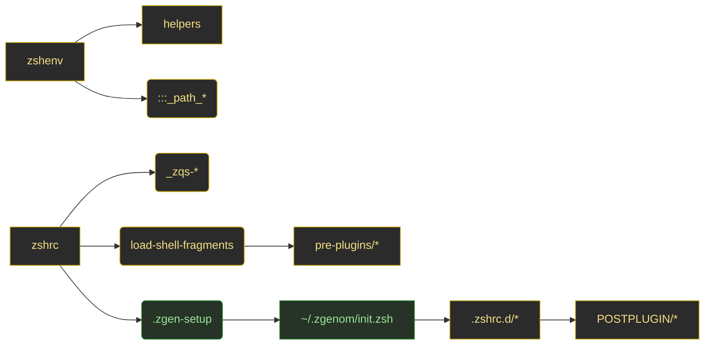
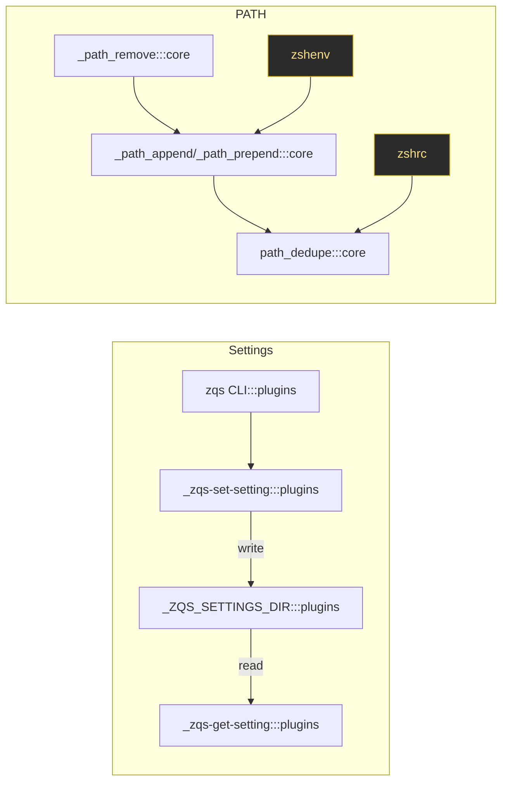

# Diagrams (v3)

High-contrast Mermaid diagrams for flows and dependencies. Color scheme follows:
- Security: red; Performance: blue; Plugins/Plugin Manager: green; Core boot/Env/Path: yellow; UI/Prompt: purple; Misc: gray

> Tip: When viewing on dark themes, prefer Mermaid's neutral backgrounds with colored edges/nodes for readability.

## Startup Flow
```mermaid
flowchart TD
  subgraph Boot[Boot & Environment]
    A[.zshenv\n(core env, PATH, flags):::core] --> B[.zshrc\n(entry, settings, loader):::core]
  end

  subgraph Pre[Pre-Plugins]
    C[.zshrc.pre-plugins.d/*:::core]
  end

  subgraph PM[Plugin Manager]
    D[.zgen-setup:::plugins] --> E[zgenom & plugins\n~/.zgenom/init.zsh:::plugins]
  end

  subgraph Post[Post-Plugins]
    F[.zshrc.d/*:::core] --> G[POSTPLUGIN/*:::core]
    H[[Prompt integration]]:::ui
  end

  A --> B --> C --> D --> E --> F --> G --> H

  classDef core stroke:#c7a600,fill:#2b2b2b,color:#f5e084;
  classDef plugins stroke:#1f7a1f,fill:#263326,color:#9ce59c;
  classDef ui stroke:#6a1f7a,fill:#2b242d,color:#d59ce5;
```

## Module Dependencies (simplified)


## Data Flow: Settings & PATH


