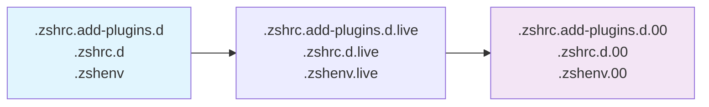

# Layered Configuration System

## Table of Contents

<details>
<summary>Click to expand</summary>

- [1. Overview](#1-overview)
- [2. System Architecture](#2-system-architecture)
  - [2.1. **Core Concept**](#21-core-concept)
    - [2.1.1. Layered Structure:](#211-layered-structure)
    - [2.1.2. Benefits:](#212-benefits)
  - [2.2. **Symlink Chain**](#22-symlink-chain)
- [3. Implementation Details](#3-implementation-details)
  - [3.1. **1. Current Active Files**](#31-1-current-active-files)
    - [3.1.1. Symlink Structure:](#311-symlink-structure)
  - [3.2. **2. Version Management**](#32-2-version-management)
    - [3.2.1. Three States:](#321-three-states)
    - [3.2.2. State Transitions:](#322-state-transitions)
- [4. Directory Structure Analysis](#4-directory-structure-analysis)
  - [4.1. **Main Configuration Directories**](#41-main-configuration-directories)
  - [4.2. **Backup Directories**](#42-backup-directories)
- [5. Usage Patterns](#5-usage-patterns)
  - [5.1. **Safe Configuration Updates**](#51-safe-configuration-updates)
    - [5.1.1. Workflow:](#511-workflow)
    - [5.1.2. Commands:](#512-commands)
  - [5.2. **Rollback Procedure**](#52-rollback-procedure)
    - [5.2.1. Emergency Rollback:](#521-emergency-rollback)
    - [5.2.2. Verification:](#522-verification)
- [6. Environment-Specific Configurations](#6-environment-specific-configurations)
  - [6.1. **Layered System Benefits**](#61-layered-system-benefits)
    - [6.1.1. Environment Adaptation:](#611-environment-adaptation)
    - [6.1.2. Loading Strategy:](#612-loading-strategy)
- [7. Integration with Version Control](#7-integration-with-version-control)
  - [7.1. **Git Integration**](#71-git-integration)
    - [7.1.1. Repository Structure:](#711-repository-structure)
    - [7.1.2. Git Strategy:](#712-git-strategy)
  - [7.2. **Update Workflow**](#72-update-workflow)
    - [7.2.1. Automated Update Process:](#721-automated-update-process)
- [8. Development Workflow](#8-development-workflow)
  - [8.1. **Feature Development**](#81-feature-development)
    - [8.1.1. Safe Feature Addition:](#811-safe-feature-addition)
    - [8.1.2. Example:](#812-example)
  - [8.2. **Environment-Specific Customization**](#82-environment-specific-customization)
    - [8.2.1. Work vs Personal Setup:](#821-work-vs-personal-setup)
    - [8.2.2. Conditional Loading:](#822-conditional-loading)
- [9. Maintenance & Housekeeping](#9-maintenance-housekeeping)
  - [9.1. **Cleanup Procedures**](#91-cleanup-procedures)
    - [9.1.1. Log Rotation:](#911-log-rotation)
    - [9.1.2. Cache Management:](#912-cache-management)
  - [9.2. **Health Checks**](#92-health-checks)
    - [9.2.1. Configuration Validation:](#921-configuration-validation)
    - [9.2.2. Performance Monitoring:](#922-performance-monitoring)
- [10. Troubleshooting](#10-troubleshooting)
  - [10.1. **Common Issues**](#101-common-issues)
    - [10.1.1. Broken Symlinks:](#1011-broken-symlinks)
    - [10.1.2. Configuration Conflicts:](#1012-configuration-conflicts)
    - [10.1.3. Version Confusion:](#1013-version-confusion)
  - [10.2. **Recovery Procedures**](#102-recovery-procedures)
    - [10.2.1. Emergency Recovery:](#1021-emergency-recovery)
    - [10.2.2. Performance Recovery:](#1022-performance-recovery)
- [11. Assessment](#11-assessment)
  - [11.1. **Strengths**](#111-strengths)
  - [11.2. **Areas for Improvement**](#112-areas-for-improvement)
  - [11.3. **Best Practices**](#113-best-practices)
    - [11.3.1. For Users:](#1131-for-users)
    - [11.3.2. For Developers:](#1132-for-developers)
- [12. Future Enhancements](#12-future-enhancements)
  - [12.1. **Proposed Features**](#121-proposed-features)
  - [12.2. **Advanced Capabilities**](#122-advanced-capabilities)

</details>

---


## 1. Overview

The ZSH configuration implements a sophisticated **layered symlink system** that enables safe configuration updates, environment-specific customizations, and rollback capabilities. This system provides a robust mechanism for managing configuration versions while maintaining safety and flexibility.

## 2. System Architecture

### 2.1. **Core Concept**

#### 2.1.1. Layered Structure:
```
Active Configuration → Live Version → Stable Version
      ↓                    ↓             ↓
.zshrc.add-plugins.d → .live → .00 (backup)
```

#### 2.1.2. Benefits:

- **Safe updates** - Active config points to stable version
- **Easy rollback** - Quick reversion to previous state
- **Development workflow** - Separate active development from stable releases


### 2.2. **Symlink Chain**



## 3. Implementation Details

### 3.1. **1. Current Active Files**

#### 3.1.1. Symlink Structure:
```bash

# Active configuration files (what the shell loads)

.zshrc.add-plugins.d -> .zshrc.add-plugins.d.live
.zshrc.d -> .zshrc.d.live
.zshenv -> .zshenv.live

# Live versions (current stable)

.zshrc.add-plugins.d.live -> .zshrc.add-plugins.d.00
.zshrc.d.live -> .zshrc.d.00
.zshenv.live -> .zshenv.00

# Backup versions (previous stable)

.zshrc.add-plugins.d.00  # Contains actual configuration files
.zshrc.d.00              # Contains actual configuration files
.zshenv.00               # Contains actual configuration files
```

### 3.2. **2. Version Management**

#### 3.2.1. Three States:

1. **`.00` files** - Stable backup versions
2. **`.live` symlinks** - Current active versions
3. **No extension** - Development or live editing versions


#### 3.2.2. State Transitions:
```bash

# Development state

edit .zshrc.add-plugins.d/110-dev-php.zsh

# Deploy to live

ln -sf .zshrc.add-plugins.d.live .zshrc.add-plugins.d
.zshrc.add-plugins.d.live -> .zshrc.add-plugins.d.00

# Update backup

cp -r .zshrc.add-plugins.d/* .zshrc.add-plugins.d.00/
```

## 4. Directory Structure Analysis

### 4.1. **Main Configuration Directories**

| Directory | Purpose | State |
|-----------|---------|-------|
| `.zshrc.pre-plugins.d/` | Pre-plugin setup | Active development |
| `.zshrc.add-plugins.d/` | Plugin definitions | Active development |
| `.zshrc.d/` | Post-plugin integration | Active development |

### 4.2. **Backup Directories**

| Directory | Purpose | Relationship |
|-----------|---------|--------------|
| `.zshrc.pre-plugins.d.00/` | Pre-plugin backup | `.zshrc.pre-plugins.d` → `.live` → `.00` |
| `.zshrc.add-plugins.d.00/` | Plugin backup | `.zshrc.add-plugins.d` → `.live` → `.00` |
| `.zshrc.d.00/` | Post-plugin backup | `.zshrc.d` → `.live` → `.00` |

## 5. Usage Patterns

### 5.1. **Safe Configuration Updates**

#### 5.1.1. Workflow:

1. **Edit active files** (`.zshrc.add-plugins.d/`, etc.)
2. **Test configuration** in development environment
3. **Deploy to live** by updating symlinks
4. **Create backup** by copying to `.00` versions


#### 5.1.2. Commands:
```bash

# Edit configuration

vim .zshrc.add-plugins.d/110-dev-php.zsh

# Test configuration

zsh -c "source .zshenv && source .zshrc"

# Deploy to live (update symlink)

ln -sf .zshrc.add-plugins.d.live .zshrc.add-plugins.d

# Update backup

cp -r .zshrc.add-plugins.d/* .zshrc.add-plugins.d.00/
```

### 5.2. **Rollback Procedure**

#### 5.2.1. Emergency Rollback:
```bash

# Quick rollback to previous stable version

ln -sf .zshrc.add-plugins.d.00 .zshrc.add-plugins.d.live
ln -sf .zshrc.add-plugins.d.live .zshrc.add-plugins.d

# Restart shell or source files

source .zshenv && source .zshrc
```

#### 5.2.2. Verification:
```bash

# Verify rollback

ls -la .zshrc.add-plugins.d*

# Should show: .zshrc.add-plugins.d -> .zshrc.add-plugins.d.live -> .zshrc.add-plugins.d.00

```

## 6. Environment-Specific Configurations

### 6.1. **Layered System Benefits**

#### 6.1.1. Environment Adaptation:
```bash

# Platform-specific configurations

.zshrc.pre-plugins.darwin.d/    # macOS-specific
.zshrc.pre-plugins.linux.d/     # Linux-specific

# Environment-specific configurations

.zshrc.work.d/                  # Work environment
.zshrc.personal.d/              # Personal environment
```

#### 6.1.2. Loading Strategy:
```bash

# Load base pre-plugin configurations

load-shell-fragments ${ZDOTDIR:-$HOME}/.zshrc.pre-plugins.d

# Load platform-specific configurations

if [[ "$(uname -s)" == "Darwin" ]]; then
    load-shell-fragments "${ZDOTDIR:-$HOME}/.zshrc.pre-plugins.darwin.d"
fi

# Load environment-specific configurations

if [[ -d "${ZDOTDIR:-$HOME}/.zshrc.work.d" ]]; then
    load-shell-fragments "${ZDOTDIR:-$HOME}/.zshrc.work.d"
fi
```

## 7. Integration with Version Control

### 7.1. **Git Integration**

#### 7.1.1. Repository Structure:
```bash
/Users/s-a-c/.config/zsh/
├── .zshrc.add-plugins.d/           # Active development
├── .zshrc.add-plugins.d.00/       # Git-tracked stable version
├── .zshrc.d/                      # Active development
├── .zshrc.d.00/                   # Git-tracked stable version
└── docs/                          # Documentation
```

#### 7.1.2. Git Strategy:

- **Track `.00` versions** in version control
- **Ignore active directories** in `.gitignore`
- **Deploy updates** by copying from development to `.00`


### 7.2. **Update Workflow**

#### 7.2.1. Automated Update Process:
```bash

#!/bin/bash

# update-zsh-config.sh

# Copy active configurations to backup

cp -r .zshrc.add-plugins.d/* .zshrc.add-plugins.d.00/
cp -r .zshrc.d/* .zshrc.d.00/
cp .zshenv .zshenv.00

# Update symlinks to point to backup

ln -sf .zshrc.add-plugins.d.00 .zshrc.add-plugins.d.live
ln -sf .zshrc.d.00 .zshrc.d.live
ln -sf .zshenv.00 .zshenv.live

# Update active symlinks

ln -sf .zshrc.add-plugins.d.live .zshrc.add-plugins.d
ln -sf .zshrc.d.live .zshrc.d
ln -sf .zshenv.live .zshenv
```

## 8. Development Workflow

### 8.1. **Feature Development**

#### 8.1.1. Safe Feature Addition:

1. **Develop in active directories**
2. **Test thoroughly** in development environment
3. **Deploy to staging** (update `.live` symlinks)
4. **Final deployment** (update `.00` backups)
5. **Commit changes** to version control


#### 8.1.2. Example:
```bash

# Develop new plugin

vim .zshrc.add-plugins.d/200-new-plugin.zsh

# Test configuration

zsh --interactive

# Deploy to live

ln -sf .zshrc.add-plugins.d.live .zshrc.add-plugins.d

# Update backup and commit

cp -r .zshrc.add-plugins.d/* .zshrc.add-plugins.d.00/
git add .zshrc.add-plugins.d.00/
git commit -m "Add new-plugin configuration"
```

### 8.2. **Environment-Specific Customization**

#### 8.2.1. Work vs Personal Setup:
```bash

# Personal configuration

echo "export WORK_MODE=0" > .zshrc.d/100-personal-settings.zsh

# Work configuration

echo "export WORK_MODE=1" > .zshrc.work.d/100-work-settings.zsh
```

#### 8.2.2. Conditional Loading:
```bash

# In .zshrc.d/ configuration

if [[ "$WORK_MODE" == "1" ]]; then
    # Load work-specific settings
    load-shell-fragments .zshrc.work.d/
fi
```

## 9. Maintenance & Housekeeping

### 9.1. **Cleanup Procedures**

#### 9.1.1. Log Rotation:
```bash

# Clean old performance logs

find "${ZSH_LOG_DIR}" -name "perf-segments-*.log" -mtime +7 -delete

# Clean old debug logs

find "${ZSH_LOG_DIR}" -name "*-zsh-debug.log" -mtime +30 -delete
```

#### 9.1.2. Cache Management:
```bash

# Clean zgenom cache if corrupted

rm -rf "${ZDOTDIR}/.zgenom/"

# Rebuild plugin cache

zgenom reset && zgenom save
```

### 9.2. **Health Checks**

#### 9.2.1. Configuration Validation:
```bash

# Check for broken symlinks

find "${ZDOTDIR}" -type l -exec test ! -e {} \; -print

# Verify all configuration files are readable

find "${ZDOTDIR}" -name "*.zsh" -exec zsh -n {} \;

# Check plugin loading

zgenom list | grep -v "loaded successfully"
```

#### 9.2.2. Performance Monitoring:
```bash

# Monitor configuration load time

time zsh -c "source .zshenv && source .zshrc && echo 'Configuration loaded'"

# Check for slow-loading modules

grep "SEGMENT" "${ZSH_LOG_DIR}/perf-segments-*.log" | sort -k4 -nr
```

## 10. Troubleshooting

### 10.1. **Common Issues**

#### 10.1.1. Broken Symlinks:
```bash

# Find broken symlinks

find "${ZDOTDIR}" -type l -exec test ! -e {} \; -print

# Fix broken symlinks

ln -sf .zshrc.add-plugins.d.00 .zshrc.add-plugins.d.live
ln -sf .zshrc.add-plugins.d.live .zshrc.add-plugins.d
```

#### 10.1.2. Configuration Conflicts:
```bash

# Check for duplicate configurations

find . -name "*.zsh" -exec basename {} \; | sort | uniq -d

# Review duplicate files

diff .zshrc.add-plugins.d/195-optional-brew-abbr.zsh .zshrc.d/195-optional-brew-abbr.zsh
```

#### 10.1.3. Version Confusion:
```bash

# Clarify current state

ls -la .zshrc.add-plugins.d*

# Understand symlink chain

readlink -f .zshrc.add-plugins.d

# Output: .zshrc.add-plugins.d.00

```

### 10.2. **Recovery Procedures**

#### 10.2.1. Emergency Recovery:
```bash

# If active configuration is broken

# Rollback to backup

ln -sf .zshrc.add-plugins.d.00 .zshrc.add-plugins.d.live
ln -sf .zshrc.add-plugins.d.live .zshrc.add-plugins.d

# Verify functionality

zsh -c "echo 'Configuration test successful'"

# Investigate root cause

# Check git log for recent changes

git log --oneline -10 .zshrc.add-plugins.d.00/
```

#### 10.2.2. Performance Recovery:
```bash

# If performance degraded

# Clear caches

rm -rf "${ZDOTDIR}/.zgenom/"

# Rebuild configuration

zgenom reset && zgenom save

# Monitor performance

export ZSH_PERF_TRACK=1
zsh
```

## 11. Assessment

### 11.1. **Strengths**

- ✅ **Safe update mechanism** prevents configuration breakage
- ✅ **Easy rollback** capability for quick recovery
- ✅ **Environment-specific** customization support
- ✅ **Development workflow** integration
- ✅ **Version control** friendly structure


### 11.2. **Areas for Improvement**

- ⚠️ **Complexity** may confuse new users
- ⚠️ **Manual maintenance** required for version management
- ⚠️ **Limited tooling** for layered system management


### 11.3. **Best Practices**

#### 11.3.1. For Users:

- **Understand the symlink chain** before making changes
- **Test changes** in development environment first
- **Use version control** to track configuration changes
- **Document customizations** for future reference


#### 11.3.2. For Developers:

- **Respect the layered system** when adding new features
- **Test update procedures** when modifying configuration structure
- **Document environment-specific** customizations
- **Include rollback procedures** in change documentation


## 12. Future Enhancements

### 12.1. **Proposed Features**

- **Automated update scripts** for safe deployment
- **Configuration validation** before deployment
- **Visual tooling** for layered system management
- **Automatic backup** and cleanup procedures


### 12.2. **Advanced Capabilities**

- **Branch-based configurations** for different environments
- **Automatic rollback** on configuration errors
- **Configuration diff** and merge capabilities
- **Remote configuration** synchronization


*The layered configuration system provides a robust foundation for safe configuration management while supporting complex environment-specific customizations. Understanding the symlink relationships is key to effective use and maintenance of this system.*

---

**Navigation:** [← Plugin Management](060-plugin-management.md) | [Top ↑](#layered-configuration-system) | [Development Tools →](100-development-tools.md)

---

*Last updated: 2025-10-13*
