# ZSH Startup Sequence

**Complete Shell Initialization Process** | **Technical Level: Intermediate-Advanced**

---

## 📋 Table of Contents

<details>
<summary>Expand Table of Contents</summary>

- [1. Standard ZSH Startup Files](#1-standard-zsh-startup-files)
  - [1.1. The Five Standard Files](#11-the-five-standard-files)
  - [1.2. Execution Order by Shell Type](#12-execution-order-by-shell-type)
  - [1.3. Login vs Interactive Shells](#13-login-vs-interactive-shells)
- [2. This Project's Six-Phase System](#2-this-projects-six-phase-system)
  - [2.1. Overview](#21-overview)
  - [2.2. Phase Summary](#22-phase-summary)
- [3. Detailed Phase Breakdown](#3-detailed-phase-breakdown)
  - [3.1. Phase 1: Pre-Zshrc Environment (`.zshenv`)](#31-phase-1-pre-zshrc-environment-zshenv)
  - [3.2. Phase 2: Interactive Shell Entrypoint (`.zshrc`)](#32-phase-2-interactive-shell-entrypoint-zshrc)
  - [3.3. Phase 3: Pre-Plugin Configuration (`.zshrc.pre-plugins.d.01/`)](#33-phase-3-pre-plugin-configuration-zshrcpre-pluginsd01)
  - [3.4. Phase 4: Plugin Activation (`.zgen-setup` & `.zshrc.add-plugins.d.00/`)](#34-phase-4-plugin-activation-zgen-setup-zshrcadd-pluginsd00)
  - [3.5. Phase 5: Post-Plugin Configuration (`.zshrc.d.01/`)](#35-phase-5-post-plugin-configuration-zshrcd01)
  - [3.6. Phase 6: Platform-Specific & Finalization](#36-phase-6-platform-specific-finalization)
- [4. ⏱️ Execution Timeline](#4-execution-timeline)
  - [4.1. Visual Timeline](#41-visual-timeline)
  - [4.2. Performance Breakdown](#42-performance-breakdown)
- [5. Startup Flow Diagram](#5-startup-flow-diagram)
  - [5.1. Complete Execution Flow](#51-complete-execution-flow)
- [6. File Loading Order](#6-file-loading-order)
  - [6.1. Complete File Sequence](#61-complete-file-sequence)
  - [6.2. Numbered Prefix System](#62-numbered-prefix-system)
- [7. Performance Characteristics](#7-performance-characteristics)
  - [7.1. Typical Startup Times](#71-typical-startup-times)
  - [7.2. Phase Timing (Warm Start)](#72-phase-timing-warm-start)
  - [7.3. Bottleneck Analysis](#73-bottleneck-analysis)
- [8. Debugging the Startup](#8-debugging-the-startup)
  - [8.1. Enable Detailed Logging](#81-enable-detailed-logging)
  - [8.2. Trace Execution](#82-trace-execution)
  - [8.3. Profile Specific Phase](#83-profile-specific-phase)
  - [8.4. Use Built-in Tools](#84-use-built-in-tools)
- [9. Understanding Load Context](#9-understanding-load-context)
  - [9.1. Where to Place New Code](#91-where-to-place-new-code)
  - [9.2. Common Mistakes](#92-common-mistakes)
- [Related Documentation](#related-documentation)

</details>

---

## 1. 📚 Standard ZSH Startup Files

### 1.1. The Five Standard Files

ZSH has five standard startup files sourced in different contexts:

| File | When Sourced | Purpose | Common Use |
|:-----|:-------------|:--------|:-----------|
| `.zshenv` | **Always** (login, interactive, scripts) | Environment variables | PATH, XDG dirs, flags |
| `.zprofile` | Login shells only (before `.zshrc`) | Login initialization | Like bash `.bash_profile` |
| `.zshrc` | Interactive shells | Main configuration | Aliases, functions, prompt |
| `.zlogin` | Login shells only (after `.zshrc`) | Post-config commands | Rarely used |
| `.zlogout` | Login shell exit | Cleanup | Clear history, logout tasks |

### 1.2. Execution Order by Shell Type

```text
┌─────────────────────┬─────────────────────┬─────────────────┐
│   Login Shell       │ Interactive Shell   │  Script Shell   │
├─────────────────────┼─────────────────────┼─────────────────┤
│ 1. .zshenv          │ 1. .zshenv          │ 1. .zshenv      │
│ 2. .zprofile        │ 2. .zshrc           │    (only)       │
│ 3. .zshrc           │                     │                 │
│ 4. .zlogin          │                     │                 │
│                     │                     │                 │
│ On logout:          │                     │                 │
│ .zlogout            │                     │                 │
└─────────────────────┴─────────────────────┴─────────────────┘

```

### 1.3. Login vs Interactive Shells

**Login Shell** (e.g., SSH session, Terminal.app on open):

```bash
.zshenv → .zprofile → .zshrc → .zlogin

```

**Interactive Shell** (e.g., `zsh` command, new tab):

```bash
.zshenv → .zshrc

```

**Script Execution** (e.g., `./script.zsh`):

```bash
.zshenv (only)

```

> 💡 **Tip**: Most ZSH users only need `.zshenv` and `.zshrc`. This configuration uses both but not the others.

---

## 2. 🎯 This Project's Six-Phase System

This configuration **extends** the standard ZSH startup with a modular, directory-based system built on the **zsh-quickstart-kit** framework.

### 2.1. Overview


### 2.2. Phase Summary

| Phase | File/Directory | Purpose | Plugin Access |
|-------|----------------|---------|---------------|
| 1 | `.zshenv.01` | Set env vars, PATH, flags | ❌ No plugins |
| 2 | `.zshrc` (vendored) | Orchestrate loading | ❌ No plugins |
| 3 | `.zshrc.pre-plugins.d.01/` | Safety, dev environment | ❌ No plugins |
| 4 | `.zshrc.add-plugins.d.00/` + zgenom | Load all plugins | ⚠️ Loading |
| 5 | `.zshrc.d.01/` | Integration, UI, completions | ✅ Full plugin access |
| 6 | `.zshrc.Darwin.d/`, `.zshrc.local` | Platform & user configs | ✅ Full access |

---

## 3. 🔍 Detailed Phase Breakdown

### 3.1. Phase 1: Pre-Zshrc Environment (`.zshenv`)

**File**: `/Users/s-a-c/.config/zsh/.zshenv.01` (via `.zshenv` → `.zshenv.live`)

**Executed**: ALWAYS (all shell types)

**Purpose**:
- Set critical environment variables
- Configure PATH
- Define 70+ feature flags
- Establish XDG base directories
- Initialize terminal detection
- Define core helper functions

**Key Content**:

```bash

# Essential system paths

export PATH="/opt/homebrew/bin:/usr/local/bin:$PATH"

# Configuration directory

export ZDOTDIR="${HOME}/.config/zsh"

# Feature flags

export ZSH_DISABLE_SPLASH=${ZSH_DISABLE_SPLASH:-0}
export ZSH_PERF_TRACK=${ZSH_PERF_TRACK:-0}

# Helper functions

zf::path_prepend() { ... }
zf::debug() { ... }

```

**⚠️ Critical Rules**:
- ❌ NO plugins available here
- ❌ NO plugin commands/functions
- ✅ Must be lightweight (affects ALL shells, including scripts)
- ✅ Set only universal environment needs

**File Size**: ~1,415 lines

---

### 3.2. Phase 2: Interactive Shell Entrypoint (`.zshrc`)

**File**: `/Users/s-a-c/.config/zsh/zsh-quickstart-kit/zsh/.zshrc` (vendored)

**Executed**: Interactive shells only

**Purpose**:
- Central orchestrator for all subsequent phases
- Initialize zsh-quickstart-kit framework
- Trigger pre-plugin directory sourcing
- Invoke zgenom setup
- Trigger post-plugin directory sourcing
- Apply platform-specific configurations

**❌ CRITICAL**: This file is VENDORED. Do not edit directly!

**How it Works**:

```bash

# Simplified view of .zshrc orchestration

source $ZDOTDIR/.zshrc.pre-plugins.d/*    # Phase 3
source $ZDOTDIR/.zgen-setup                # Phase 4
source $ZDOTDIR/.zshrc.d/*                 # Phase 5
source $ZDOTDIR/.zshrc.$(uname).d/*        # Phase 6 (platform)
[[ -f ~/.zshrc.local ]] && source ~/.zshrc.local  # Phase 6 (user)

```

---

### 3.3. Phase 3: Pre-Plugin Configuration (`.zshrc.pre-plugins.d.01/`)

**Directory**: `/Users/s-a-c/.config/zsh/.zshrc.pre-plugins.d.01/`

**Executed**: Before any plugins load

**Purpose**:
- Establish shell safety (nounset guards)
- Override quickstart kit defaults
- Configure development environment
- Setup Starship compatibility
- Initialize logging and monitoring
- Enhance quickstart features

**Files** (7 total, loaded in order):

```bash
000-layer-set-marker.zsh         # Layer system marker
010-shell-safety.zsh             # Nounset safety guards
020-zqs-overrides.zsh            # Quickstart customizations
030-dev-environment.zsh          # Dev tools preparation
040-starship-compat.zsh          # Prompt compatibility
050-logging-and-monitoring.zsh   # Performance init
060-zqs-enhancements.zsh         # Additional enhancements

```

**Key Responsibilities**:

1. **Nounset Safety** (`010-shell-safety.zsh`):

```bash
   # Disable nounset during plugin loading
   if [[ -o nounset ]]; then
       export _ZQS_NOUNSET_WAS_ON=1
       unsetopt nounset
   fi

```

2. **Development Environment** (`030-dev-environment.zsh`):

```bash
   # Prepare paths for Node, PHP, Python, etc.
   # But don't load the actual tools yet (plugins do that)

```

3. **Performance Monitoring** (`050-logging-and-monitoring.zsh`):

```bash
   # Initialize segment tracking
   zf::segment "pre-plugin" "start"

```

**⚠️ Critical Rules**:
- ❌ NO plugin functions available yet
- ❌ Cannot use zgenom commands
- ✅ Can set environment variables
- ✅ Can define helper functions
- ✅ Can configure plugin behavior (before they load)

---

### 3.4. Phase 4: Plugin Activation (`.zgen-setup` & `.zshrc.add-plugins.d.00/`)

**Two-Step Process**:

#### Step 1: Plugin Declaration (`.zshrc.add-plugins.d.00/`)

**Directory**: `/Users/s-a-c/.config/zsh/.zshrc.add-plugins.d.00/`

**Purpose**: Declare which plugins to load

**Files** (12 total):

```bash
200-perf-core.zsh        # Performance utilities
210-dev-php.zsh          # PHP development
220-dev-node.zsh         # Node.js development
230-dev-systems.zsh      # System utilities
240-dev-python-uv.zsh    # Python/UV tools
250-dev-github.zsh       # GitHub CLI
260-productivity-nav.zsh # Navigation enhancements
270-productivity-fzf.zsh # FZF integration
280-autopair.zsh         # Auto-pairing
290-abbr.zsh             # Abbreviations
300-brew-abbr.zsh        # Homebrew shortcuts
310-user-interface.zsh   # UI enhancements

```

**Example Declaration**:

```bash

# 270-productivity-fzf.zsh

if (( $+functions[zgenom] )); then
    zgenom load junegunn/fzf
    zgenom load Aloxaf/fzf-tab
fi

```

#### Step 2: Plugin Sourcing (`.zgen-setup`)

**File**: `/Users/s-a-c/.config/zsh/zsh-quickstart-kit/zsh/.zgen-setup` (vendored)

**Process**:
1. Check if plugins changed
2. Generate static `init.zsh` script
3. Source the init script
4. All plugins now loaded and active

**Result**: After this phase completes, all 40+ plugins are fully loaded and their functions are available!

**Performance**: ~800ms for plugin loading

---

### 3.5. Phase 5: Post-Plugin Configuration (`.zshrc.d.01/`)

**Directory**: `/Users/s-a-c/.config/zsh/.zshrc.d.01/`

**Executed**: After plugins are loaded

**Purpose**:
- Use functions/commands provided by plugins
- Configure completions (requires completion plugins)
- Setup terminal integration
- Configure navigation tools (requires plugins)
- Initialize Neovim integration
- Setup keybindings
- Define aliases
- Configure history (requires plugins)

**Files** (14 total):

```bash
400-options.zsh              # Shell options
410-completions.zsh          # Completion system
420-terminal-integration.zsh # Terminal detection/config
430-navigation-tools.zsh     # Dir navigation (uses plugins)
440-neovim.zsh              # Editor integration
450-node-environment.zsh    # Node.js setup
460-prompt.zsh              # Prompt finalization
470-user-interface.zsh      # UI elements
480-history.zsh             # History config
490-keybindings.zsh         # Key mappings
500-aliases.zsh             # Command aliases
510-developer-tools.zsh     # Dev utilities
520-kilocode-memory-bank.zsh # AI integration
990-final-overrides.zsh     # Last-chance overrides

```

**✅ Critical Rules**:
- ✅ Full plugin access (all functions available)
- ✅ Can use plugin-provided commands
- ✅ Can configure plugin-dependent features
- ✅ Can call completion functions

**Example Post-Plugin Code**:

```bash

# In 410-completions.zsh
# This REQUIRES plugins to be loaded first

autoload -Uz compinit
compinit

# Configure fzf-tab (plugin must be loaded)

if (( $+functions[enable-fzf-tab] )); then
    enable-fzf-tab
fi

```

---

### 3.6. Phase 6: Platform-Specific & Finalization

**Components**:

1. **Platform-Specific** (`.zshrc.Darwin.d/`)
   - macOS-specific configurations
   - Homebrew integration
   - macOS terminal features

2. **User Overrides** (`.zshrc.local`, `.zshenv.local`)
   - User-specific customizations
   - Machine-specific settings
   - ⚠️ Require explicit approval for edits

3. **Finalization**
   - Prompt setup (Starship initialization)
   - Health checks
   - Final shell options
   - Performance summary

---

## 4. ⏱️ Execution Timeline

### 4.1. Visual Timeline

```mermaid
gantt
    title ZSH Startup Timeline (~1.8s total)
    dateFormat X
    axisFormat %Lms

    section Phase 1
    Environment Setup    :p1, 0, 100

    section Phase 2
    Shell Entry         :p2, 100, 150

    section Phase 3
    Pre-Plugin Config   :p3, 150, 300

    section Phase 4
    Plugin Loading      :p4, 300, 1100

    section Phase 5
    Post-Plugin Config  :p5, 1100, 1500

    section Phase 6
    Finalization        :p6, 1500, 1850

```



### 4.2. Performance Breakdown

| Phase | Duration | % of Total | Optimization Potential |
|-------|----------|------------|------------------------|
| 1: Environment | ~100ms | 5.6% | Low (essential setup) |
| 2: Shell Entry | ~50ms | 2.8% | Low (orchestration) |
| 3: Pre-Plugin | ~150ms | 8.3% | Medium (reduce file count) |
| 4: Plugin Loading | ~800ms | 44.4% | High (lazy loading, fewer plugins) |
| 5: Post-Plugin | ~400ms | 22.2% | Medium (defer non-critical) |
| 6: Finalization | ~300ms | 16.7% | Medium (lazy prompt init) |
| **Total** | **~1.8s** | **100%** | **Plugin phase is bottleneck** |

> 💡 **Performance Insight**: Plugin loading is the biggest contributor to startup time. Consider lazy-loading rarely-used plugins.

---

## 5. 🔄 Startup Flow Diagram

### 5.1. Complete Execution Flow

```mermaid
flowchart TD
    START([User Opens Terminal]) --> ENV{Is .zshenv<br/>available?}
    ENV -->|Yes| LOAD_ENV[Load .zshenv.01<br/>via symlink chain]
    ENV -->|No| ERROR1[Error: Missing .zshenv]

    LOAD_ENV --> SET_PATH[Set PATH, ZDOTDIR,<br/>XDG directories]
    SET_PATH --> SET_FLAGS[Configure 70+ flags<br/>ZSH_*, ZF_*, etc.]
    SET_FLAGS --> HELPERS[Define helper functions<br/>zf::segment, zf::debug]
    HELPERS --> TERM_DETECT[Terminal Detection<br/>Set TERM_PROGRAM]

    TERM_DETECT --> INTERACTIVE{Interactive<br/>shell?}
    INTERACTIVE -->|No| SCRIPT_END[Script runs<br/>with .zshenv only]
    INTERACTIVE -->|Yes| LOAD_ZSHRC[Load .zshrc<br/>Quickstart Kit]

    LOAD_ZSHRC --> PRE_PLUGIN[Source .zshrc.pre-plugins.d.01/<br/>7 files in order]
    PRE_PLUGIN --> SAFETY[010-shell-safety.zsh<br/>Nounset guards]
    SAFETY --> DEV_PREP[030-dev-environment.zsh<br/>Prepare dev tools]
    DEV_PREP --> MONITOR[050-logging-and-monitoring.zsh<br/>Init performance tracking]

    MONITOR --> PLUGIN_DECL[Source .zshrc.add-plugins.d.00/<br/>12 plugin declaration files]
    PLUGIN_DECL --> ZGENOM{Is zgenom<br/>installed?}
    ZGENOM -->|No| INSTALL_ZGENOM[Auto-install zgenom]
    ZGENOM -->|Yes| ZGEN_SETUP[Run .zgen-setup]
    INSTALL_ZGENOM --> ZGEN_SETUP

    ZGEN_SETUP --> CACHE_CHECK{Plugin cache<br/>valid?}
    CACHE_CHECK -->|No| GENERATE[Generate init.zsh<br/>from declarations]
    CACHE_CHECK -->|Yes| LOAD_CACHE[Load cached init.zsh]
    GENERATE --> SOURCE_INIT[Source init.zsh<br/>40+ plugins active]
    LOAD_CACHE --> SOURCE_INIT

    SOURCE_INIT --> POST_PLUGIN[Source .zshrc.d.01/<br/>14 files in order]
    POST_PLUGIN --> COMPLETE[410-completions.zsh<br/>Setup tab completion]
    COMPLETE --> TERMINAL_INT[420-terminal-integration.zsh<br/>Terminal-specific config]
    TERMINAL_INT --> KEYBIND[490-keybindings.zsh<br/>Keyboard shortcuts]
    KEYBIND --> ALIASES[500-aliases.zsh<br/>Command aliases]

    ALIASES --> PLATFORM{Platform<br/>specific?}
    PLATFORM -->|macOS| DARWIN[Source .zshrc.Darwin.d/<br/>macOS configs]
    PLATFORM -->|Linux| SKIP_PLAT[Skip platform configs]
    DARWIN --> USER_LOCAL
    SKIP_PLAT --> USER_LOCAL

    USER_LOCAL{User .zshrc.local<br/>exists?}
    USER_LOCAL -->|Yes| LOAD_LOCAL[Source .zshrc.local<br/>User overrides]
    USER_LOCAL -->|No| PROMPT_INIT
    LOAD_LOCAL --> PROMPT_INIT

    PROMPT_INIT[Initialize Starship Prompt] --> HEALTH[Health Checks<br/>Optional]
    HEALTH --> PERF_SUMMARY[Performance Summary<br/>If enabled]
    PERF_SUMMARY --> READY([Shell Ready for Input])

    style START fill:#008066,stroke:#fff,stroke-width:2px,color:#fff
    style READY fill:#008066,stroke:#fff,stroke-width:2px,color:#fff
    style ENV fill:#cc7a00,stroke:#000,stroke-width:2px,color:#fff
    style LOAD_ENV fill:#cc7a00,stroke:#000,stroke-width:2px,color:#fff
    style LOAD_ZSHRC fill:#006600,stroke:#fff,stroke-width:2px,color:#fff
    style PRE_PLUGIN fill:#0080ff,stroke:#fff,stroke-width:2px,color:#fff
    style ZGEN_SETUP fill:#cc0066,stroke:#fff,stroke-width:2px,color:#fff
    style POST_PLUGIN fill:#6600cc,stroke:#fff,stroke-width:2px,color:#fff
    style PROMPT_INIT fill:#cc6600,stroke:#000,stroke-width:2px,color:#fff

```



---

## 6. 📁 File Loading Order

### 6.1. Complete File Sequence

```text
1. .zshenv → .zshenv.live → .zshenv.01
   └─ Single file: Environment foundation

2. .zshrc (vendored from zsh-quickstart-kit)
   └─ Orchestrator only

3. .zshrc.pre-plugins.d → .zshrc.pre-plugins.d.live → .zshrc.pre-plugins.d.01/
   ├─ 000-layer-set-marker.zsh
   ├─ 010-shell-safety.zsh
   ├─ 020-zqs-overrides.zsh
   ├─ 030-dev-environment.zsh
   ├─ 040-starship-compat.zsh
   ├─ 050-logging-and-monitoring.zsh
   └─ 060-zqs-enhancements.zsh

4. .zshrc.add-plugins.d → .zshrc.add-plugins.d.live → .zshrc.add-plugins.d.00/
   ├─ 200-perf-core.zsh
   ├─ 210-dev-php.zsh
   ├─ 220-dev-node.zsh
   ├─ 230-dev-systems.zsh
   ├─ 240-dev-python-uv.zsh
   ├─ 250-dev-github.zsh
   ├─ 260-productivity-nav.zsh
   ├─ 270-productivity-fzf.zsh
   ├─ 280-autopair.zsh
   ├─ 290-abbr.zsh
   ├─ 300-brew-abbr.zsh
   └─ 310-user-interface.zsh

   Then: .zgen-setup (loads all declared plugins)

5. .zshrc.d → .zshrc.d.live → .zshrc.d.01/
   ├─ 400-options.zsh
   ├─ 410-completions.zsh
   ├─ 420-terminal-integration.zsh
   ├─ 430-navigation-tools.zsh
   ├─ 440-neovim.zsh
   ├─ 450-node-environment.zsh
   ├─ 460-prompt.zsh
   ├─ 470-user-interface.zsh
   ├─ 480-history.zsh
   ├─ 490-keybindings.zsh
   ├─ 500-aliases.zsh
   ├─ 510-developer-tools.zsh
   ├─ 520-kilocode-memory-bank.zsh
   └─ 990-final-overrides.zsh

6. Platform & User:
   ├─ .zshrc.Darwin.d/ (if macOS)
   ├─ .zshenv.local (if exists)
   └─ .zshrc.local (if exists)

```

### 6.2. Numbered Prefix System

Files within each `.d` directory are sourced **lexicographically** (alphabetically):

- `000-` - Infrastructure, markers
- `100-199` - Core systems
- `200-299` - Plugin declarations
- `400-499` - Integration (post-plugin)
- `500-599` - User-facing features
- `990-999` - Final overrides

> 💡 **Tip**: Use numbered prefixes to control exact load order. Gap numbers (e.g., 400, 410, 420) allow inserting new files between existing ones.

---

## 7. 📊 Performance Characteristics

### 7.1. Typical Startup Times

```text
Cold Start (no cache):     ~2.5-3.0s
Warm Start (cached):        ~1.5-1.8s
Minimal Mode:               ~0.8-1.0s

```

### 7.2. Phase Timing (Warm Start)

```text
Phase 1: .zshenv              [████░░░░░░] 100ms   5.6%
Phase 2: .zshrc               [██░░░░░░░░]  50ms   2.8%
Phase 3: Pre-Plugins          [█████░░░░░] 150ms   8.3%
Phase 4: Plugin Loading       [████████░░] 800ms  44.4%
Phase 5: Post-Plugins         [██████░░░░] 400ms  22.2%
Phase 6: Finalization         [█████░░░░░] 300ms  16.7%
                              ─────────────────────────
Total:                                    1800ms 100.0%

```

### 7.3. Bottleneck Analysis

**Biggest Contributors**:
1. 🔴 **Plugin Loading** (800ms, 44%) - zgenom loads 40+ plugins
2. 🟡 **Post-Plugin Integration** (400ms, 22%) - Completion setup, keybindings
3. 🟡 **Finalization** (300ms, 17%) - Starship initialization

**Optimization Opportunities**:
- Lazy-load rarely-used plugins (save ~200-300ms)
- Defer completion generation to first use (save ~100ms)
- Async prompt initialization (save ~100ms)

---

## 8. 🔍 Debugging the Startup

### 8.1. Enable Detailed Logging

```bash

# In terminal or .zshenv.local

export PERF_SEGMENT_LOG=~/zsh-startup.log
export PERF_SEGMENT_TRACE=1
export ZSH_DEBUG=1

# Start new shell

zsh

# Review log

cat ~/zsh-startup.log

```

### 8.2. Trace Execution

```bash

# Enable xtrace for full execution trace

zsh -x -i -c "exit" 2>&1 | tee startup-trace.log

# Review what's taking time

grep "+" startup-trace.log | less

```

### 8.3. Profile Specific Phase

```bash

# Test just pre-plugin phase

zsh -i -c "source ~/.config/zsh/.zshrc.pre-plugins.d.01/010-shell-safety.zsh"

# Test specific module

zsh -i -c "source ~/.config/zsh/.zshrc.d.01/410-completions.zsh"

```

### 8.4. Use Built-in Tools

```bash

# Health check

zsh-healthcheck

# Performance baseline

zsh-performance-baseline

# Check plugin status

zgenom list

# Verify symlinks

ls -la ~/.config/zsh/ | grep "^l"

```

---

## 9. 🎓 Understanding Load Context

### 9.1. Where to Place New Code

**Decision Tree**:

```text
Need to set environment variable?
├─ Yes: Use .zshenv.01
└─ No: Continue...

Need to run before plugins load?
├─ Yes: Use .zshrc.pre-plugins.d.01/
└─ No: Continue...

Is this a plugin declaration?
├─ Yes: Use .zshrc.add-plugins.d.00/
└─ No: Continue...

Need to use plugin-provided functions?
├─ Yes: Use .zshrc.d.01/
└─ No: Use .zshrc.pre-plugins.d.01/

Is this macOS-specific?
├─ Yes: Use .zshrc.Darwin.d/
└─ No: Use .zshrc.d.01/

Is this user-specific customization?
└─ Yes: Use .zshrc.local (requires approval)

```

### 9.2. Common Mistakes

❌ **WRONG**: Calling plugin function in pre-plugin phase

```bash

# In .zshrc.pre-plugins.d.01/030-dev-environment.zsh

nvm use 20  # ❌ nvm not loaded yet!

```

✅ **CORRECT**: Call plugin function in post-plugin phase

```bash

# In .zshrc.d.01/450-node-environment.zsh

if (( $+functions[nvm] )); then
    nvm use 20  # ✅ nvm is loaded
fi

```

---

## 🔗 Related Documentation

- [Configuration Phases](040-configuration-phases.md) - Detailed phase documentation
- [File Organization](070-file-organization.md) - Directory structure
- [Performance Guide](110-performance-guide.md) - Optimization techniques
- [Startup Flow Diagram](150-diagrams/020-startup-flow.md) - Visual reference

---

**Navigation:** [← Architecture](020-architecture-overview.md) | [Top ↑](#startup-sequence) | [Configuration Phases →](040-configuration-phases.md)

---

*Compliant with AI-GUIDELINES.md (v1.0 2025-10-30)*
