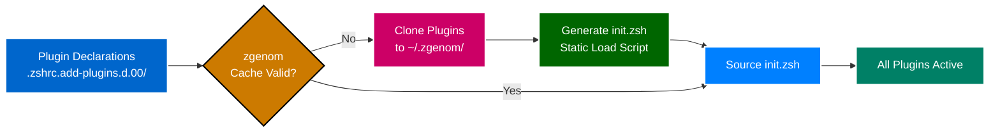
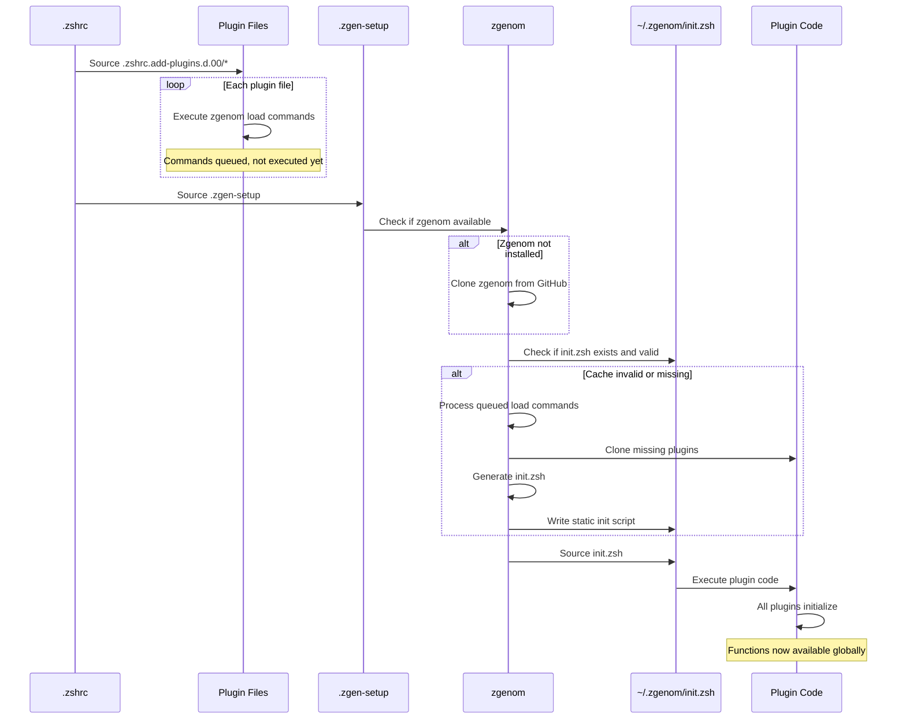

# Plugin System

**Zgenom Plugin Management** | **Technical Level: Intermediate**

---

## 📋 Table of Contents

<details>
<summary>Expand Table of Contents</summary>

- [1. Overview](#1-overview)
  - [1.1. Why Plugin Manager?](#11-why-plugin-manager)
- [2. What is Zgenom?](#2-what-is-zgenom)
  - [2.1. Key Features](#21-key-features)
  - [2.2. How It Works](#22-how-it-works)
  - [2.3. Installation](#23-installation)
- [3. Plugin Categories](#3-plugin-categories)
  - [3.1. Performance Utilities (200-perf-core.zsh)](#31-performance-utilities-200-perf-corezsh)
  - [3.2. Development Tools](#32-development-tools)
  - [3.3. Productivity Enhancements](#33-productivity-enhancements)
  - [3.4. Optional Features](#34-optional-features)
  - [3.5. Complete Plugin List](#35-complete-plugin-list)
- [4. How Plugins Load](#4-how-plugins-load)
  - [4.1. Loading Process](#41-loading-process)
  - [4.2. Cache Invalidation](#42-cache-invalidation)
- [5. ➕ Adding New Plugins](#5-adding-new-plugins)
  - [5.1. Step-by-Step Process](#51-step-by-step-process)
  - [5.2. Example: Adding zsh-autosuggestions](#52-example-adding-zsh-autosuggestions)
- [6. ️ Plugin Configuration](#6-plugin-configuration)
  - [6.1. Configuring Before Load (Phase 3)](#61-configuring-before-load-phase-3)
  - [6.2. Configuring After Load (Phase 5)](#62-configuring-after-load-phase-5)
- [7. Plugin Management](#7-plugin-management)
  - [7.1. Common Commands](#71-common-commands)
  - [7.2. Plugin Locations](#72-plugin-locations)
  - [7.3. Checking Plugin Status](#73-checking-plugin-status)
- [8. Troubleshooting Plugins](#8-troubleshooting-plugins)
  - [8.1. Plugin Not Loading](#81-plugin-not-loading)
  - [8.2. Plugin Causes Errors](#82-plugin-causes-errors)
  - [8.3. Plugin Slows Startup](#83-plugin-slows-startup)
  - [8.4. Cache Issues](#84-cache-issues)
- [9. Advanced Topics](#9-advanced-topics)
  - [9.1. Oh-My-Zsh Plugin Loading](#91-oh-my-zsh-plugin-loading)
  - [9.2. Custom Plugin Development](#92-custom-plugin-development)
  - [9.3. Conditional Plugin Loading](#93-conditional-plugin-loading)
- [10. Plugin Statistics](#10-plugin-statistics)
  - [10.1. Current Configuration](#101-current-configuration)
  - [10.2. Load Time Impact](#102-load-time-impact)
- [Related Documentation](#related-documentation)

</details>

---

## 1. 🎯 Overview

This configuration uses **zgenom** to manage 40+ ZSH plugins, providing features like syntax highlighting, auto-suggestions, git integration, fuzzy finding, and development tool management.

### 1.1. Why Plugin Manager?

**Without a plugin manager**:

```bash

# Manual plugin installation - tedious!

git clone https://github.com/zsh-users/zsh-syntax-highlighting ~/.zsh/plugins/zsh-syntax-highlighting
source ~/.zsh/plugins/zsh-syntax-highlighting/zsh-syntax-highlighting.plugin.zsh

# Repeat for each plugin... maintain updates manually... 😰


```

**With zgenom**:

```bash

# Simple declaration

zgenom load zsh-users/zsh-syntax-highlighting

# zgenom handles cloning, updates, loading, caching!


```

---

## 2. 🚀 What is Zgenom?

**[Zgenom](https://github.com/jandamm/zgenom)** is a fast, lightweight plugin manager for ZSH.

### 2.1. Key Features

✅ **Fast Loading**: Generates static init script, loads in milliseconds
✅ **Oh-My-Zsh Compatible**: Can load OMZ plugins and themes
✅ **Automatic Caching**: Regenerates only when plugins change
✅ **Simple API**: Easy to declare and manage plugins
✅ **Self-Installing**: Auto-installs on first use

### 2.2. How It Works



### 2.3. Installation

Zgenom is **auto-installed** on first shell load:

```bash

# Quickstart kit handles installation
# Location: ${ZDOTDIR}/.zgenom/


```

---

## 3. 📦 Plugin Categories

### 3.1. Performance Utilities (200-perf-core.zsh)

```bash
zgenom load mroth/evalcache             # Cache eval results (nvm, etc.)
zgenom load mafredri/zsh-async          # Background job system
zgenom load romkatv/zsh-defer           # Defer expensive loads

```

**Purpose**: Speed up shell startup

### 3.2. Development Tools

#### PHP Development (210-dev-php.zsh)


```bash
zgenom load laravel/herd-zsh-plugin     # PHP version manager

```

#### Node.js Development (220-dev-node.zsh)


```bash
zgenom load lukechilds/zsh-nvm          # Node version manager
zgenom load lukechilds/zsh-better-npm-completion

```

#### System Tools (230-dev-systems.zsh)


```bash
zgenom load unixorn/git-extra-commands  # Additional git commands
zgenom load peterhurford/git-it-on.zsh  # Open files in GitHub

```

#### Python Development (240-dev-python-uv.zsh)


```bash

# UV-based Python management
# Custom integration for uv package manager


```

#### GitHub CLI (250-dev-github.zsh)


```bash
zgenom load github/gh-cli               # GitHub CLI integration

```

### 3.3. Productivity Enhancements

#### Navigation (260-productivity-nav.zsh)


```bash
zgenom load agkozak/zsh-z               # Smart directory jumping
zgenom load rupa/z                      # Frecency-based navigation

```

#### FZF Integration (270-productivity-fzf.zsh)


```bash
zgenom load junegunn/fzf                # Fuzzy finder
zgenom load Aloxaf/fzf-tab              # FZF for tab completion

```

### 3.4. Optional Features

#### Auto-Pairing (280-autopair.zsh)


```bash
zgenom load hlissner/zsh-autopair       # Auto-close brackets, quotes

```

#### Abbreviations (290-abbr.zsh)


```bash
zgenom load olets/zsh-abbr              # Fish-like abbreviations

```

#### Homebrew Shortcuts (300-brew-abbr.zsh)


```bash

# Homebrew command abbreviations

abbr bi="brew install"
abbr bup="brew update && brew upgrade"

```

### 3.5. Complete Plugin List

```bash

# View all loaded plugins

zgenom list

# Output shows ~40+ plugins across categories


```

---

## 4. 🔄 How Plugins Load

### 4.1. Loading Process



### 4.2. Cache Invalidation

Cache regenerates when:

1. Plugin declaration files change
2. `zgenom reset` command run
3. init.zsh doesn't exist
4. zgenom updated

---

## 5. ➕ Adding New Plugins

### 5.1. Step-by-Step Process

#### 1. Find a Plugin

```bash

# Search GitHub for ZSH plugins
# Look for repos like: zsh-users/*, ohmyzsh/ohmyzsh, etc.


```

#### 2. Choose Appropriate Declaration File

Based on plugin purpose:

- Performance → `200-perf-core.zsh`
- PHP dev → `210-dev-php.zsh`
- Node dev → `220-dev-node.zsh`
- Navigation → `260-productivity-nav.zsh`
- FZF-related → `270-productivity-fzf.zsh`
- New category → Create new file (e.g., `320-my-category.zsh`)

#### 3. Add Plugin Declaration

```bash

# Edit appropriate file (in numbered version!)

vim ~/.config/zsh/.zshrc.add-plugins.d.00/270-productivity-fzf.zsh

# Add plugin

if (( $+functions[zgenom] )); then
    zgenom load author/plugin-name
fi

```

#### 4. Regenerate Cache

```bash

# Force cache rebuild

zgenom reset

# Reload shell

source ~/.zshrc

```

#### 5. Verify Plugin Loaded

```bash

# Check plugin list

zgenom list | grep "plugin-name"

# Test plugin function

which plugin_function_name

```

### 5.2. Example: Adding zsh-autosuggestions

```bash

# 1. Edit productivity file

vim ~/.config/zsh/.zshrc.add-plugins.d.00/270-productivity-fzf.zsh

# 2. Add to file:

if (( $+functions[zgenom] )); then
    zgenom load zsh-users/zsh-syntax-highlighting
    zgenom load zsh-users/zsh-autosuggestions  # ← New plugin
    zgenom load junegunn/fzf
fi

# 3. Reload

zgenom reset && source ~/.zshrc

# 4. Test
# Start typing a command you've used before
# You should see gray suggestion text


```

---

## 6. 🎛️ Plugin Configuration

### 6.1. Configuring Before Load (Phase 3)

Some plugins need variables set **before** they load:

```bash

# In .zshrc.pre-plugins.d.01/030-dev-environment.zsh

# Configure zsh-autosuggestions (before it loads)

export ZSH_AUTOSUGGEST_HIGHLIGHT_STYLE="fg=#666666"
export ZSH_AUTOSUGGEST_STRATEGY=(history completion)

```

### 6.2. Configuring After Load (Phase 5)

Other plugins need configuration **after** loading:

```bash

# In .zshrc.d.01/410-completions.zsh

# Configure fzf-tab (after plugin loaded)

if (( $+functions[enable-fzf-tab] )); then
    enable-fzf-tab
    zstyle ':fzf-tab:*' fzf-command fzf
fi

```

---

## 7. 🔧 Plugin Management

### 7.1. Common Commands

```bash

# List all loaded plugins

zgenom list

# Update all plugins

zgenom update

# Reset cache (force reload)

zgenom reset

# Clean up unused plugins

zgenom clean

# Save current plugin list

zgenom save

```

### 7.2. Plugin Locations

```bash

# Zgenom installation

~/.config/zsh/.zgenom/

# Plugin cache

~/.config/zsh/.zgenom/init.zsh

# Individual plugins

~/.config/zsh/.zgenom/*/

```

### 7.3. Checking Plugin Status

```bash

# Which plugins are loaded?

zgenom list

# Is specific plugin loaded?

zgenom list | grep "syntax-highlighting"

# Where is plugin located?

ls -la ~/.config/zsh/.zgenom/ | grep "syntax-highlighting"

```

---

## 8. 🐛 Troubleshooting Plugins

### 8.1. Plugin Not Loading

```bash

# 1. Verify declaration exists

cat ~/.config/zsh/.zshrc.add-plugins.d.00/*.zsh | grep "plugin-name"

# 2. Check zgenom can see it

zgenom list | grep "plugin-name"

# 3. Force regenerate cache

zgenom reset

# 4. Reload shell

source ~/.zshrc

# 5. Check for errors

zsh -x -c "source ~/.zshrc" 2>&1 | grep "error\|fail"

```

### 8.2. Plugin Causes Errors

```bash

# 1. Identify problematic plugin

zsh -x -c "source ~/.zshrc" 2>&1 | grep -B5 "error"

# 2. Temporarily disable
# Comment out in declaration file:
# zgenom load problem/plugin  # Disabled for testing

# 3. Reset and test

zgenom reset && source ~/.zshrc

```

### 8.3. Plugin Slows Startup

```bash

# 1. Enable performance tracking

export PERF_SEGMENT_LOG=~/perf.log
export PERF_SEGMENT_TRACE=1

# 2. Reload

source ~/.zshrc

# 3. Check timings

cat ~/perf.log | grep -E "plugin|zgenom"

# 4. Consider lazy-loading slow plugins
# Use zsh-defer or manual lazy-load wrapper


```

### 8.4. Cache Issues

```bash

# Symptoms:
# - Plugins not loading
# - Old versions active
# - Function conflicts

# Solution:

zgenom reset     # Clear cache
zgenom update    # Update all plugins
source ~/.zshrc  # Reload

# Nuclear option:

rm -rf ~/.config/zsh/.zgenom/
source ~/.zshrc  # Will reinstall everything

```

---

## 9. 🎓 Advanced Topics

### 9.1. Oh-My-Zsh Plugin Loading

```bash

# Load specific OMZ plugins

zgenom oh-my-zsh plugins/git
zgenom oh-my-zsh plugins/docker

```

### 9.2. Custom Plugin Development

```bash

# Create local plugin

mkdir -p ~/.config/zsh/plugins/my-plugin

# Create plugin file

cat > ~/.config/zsh/plugins/my-plugin/my-plugin.plugin.zsh << 'EOF'

# My custom plugin

function my_function() {
    echo "Hello from custom plugin"
}
EOF

# Load in .zshrc.add-plugins.d.00/

zgenom load ~/.config/zsh/plugins/my-plugin

```

### 9.3. Conditional Plugin Loading

```bash

# Load plugin only on specific platform

if [[ "$(uname)" == "Darwin" ]]; then
    zgenom load macos-specific/plugin
fi

# Load only if command exists

if command -v docker &>/dev/null; then
    zgenom oh-my-zsh plugins/docker
fi

# Load based on feature flag

if (( ${ZSH_ENABLE_EXPERIMENTAL:-0} )); then
    zgenom load experimental/plugin
fi

```

---

## 10. 📊 Plugin Statistics

### 10.1. Current Configuration

- **Total Plugins**: 40+ managed by zgenom
- **Performance Plugins**: 3 (evalcache, async, defer)
- **Development Plugins**: 10+ (PHP, Node, Python, Git, GitHub)
- **Productivity Plugins**: 5+ (FZF, navigation, abbreviations)
- **Optional Plugins**: 3 (autopair, UI enhancements)

### 10.2. Load Time Impact

```text
Plugin Loading Phase:  800ms total
├─ Performance: ~100ms (evalcache, async, defer)
├─ Development: ~300ms (nvm, herd, git tools)
├─ Productivity: ~250ms (FZF, navigation, completions)
└─ Optional: ~150ms (autopair, abbr, UI)

```

---

## 🔗 Related Documentation

- [Configuration Phases](040-configuration-phases.md) - When plugins load
- [Development Guide](090-development-guide.md) - Creating custom plugins
- [Performance Guide](110-performance-guide.md) - Optimizing plugin loading
- [Plugin Loading Diagram](150-diagrams/050-plugin-loading.md) - Visual flow

---

**Navigation:** [← Versioned Symlinks](050-versioned-symlinks.md) | [Top ↑](#plugin-system) | [File Organization →](070-file-organization.md)

---

*Compliant with AI-GUIDELINES.md (v1.0 2025-10-30)*
