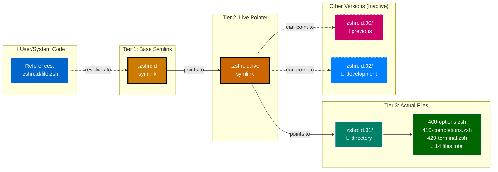
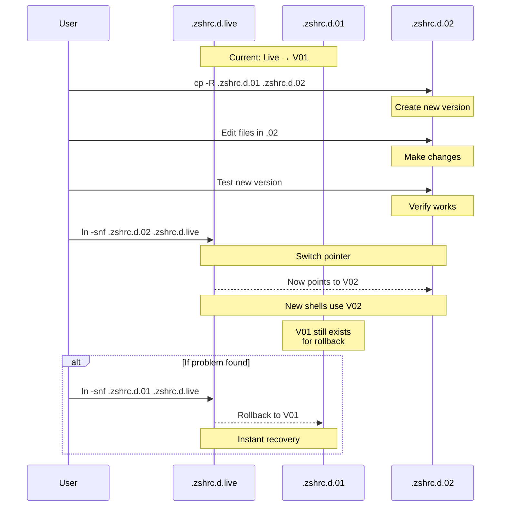

# Symlink Chain Diagram

**Version Management Visualization** | **WCAG AA Compliant**

---

## 🔗 Symlink Chain Architecture

### Three-Tier System



---

## 📊 All Versioned Components

### Complete Symlink Map

```mermaid
graph TD
    subgraph ENV["Environment"]
        ENV_BASE[.zshenv] --> ENV_LIVE[.zshenv.live]
        ENV_LIVE --> ENV_V1[.zshenv.01<br/>1,415 lines]
    end

    subgraph PRE["Pre-Plugin"]
        PRE_BASE[.zshrc.pre-plugins.d] --> PRE_LIVE[.zshrc.pre-plugins.d.live]
        PRE_LIVE --> PRE_V1[.zshrc.pre-plugins.d.01/<br/>7 files]
    end

    subgraph ADD["Plugin Declarations"]
        ADD_BASE[.zshrc.add-plugins.d] --> ADD_LIVE[.zshrc.add-plugins.d.live]
        ADD_LIVE --> ADD_V0[.zshrc.add-plugins.d.00/<br/>12 files]
    end

    subgraph POST["Post-Plugin"]
        POST_BASE[.zshrc.d] --> POST_LIVE[.zshrc.d.live]
        POST_LIVE --> POST_V1[.zshrc.d.01/<br/>14 files]
    end

    style ENV_BASE fill:#cc7a00,stroke:#000,stroke-width:2px,color:#fff
    style ENV_LIVE fill:#cc6600,stroke:#000,stroke-width:2px,color:#fff
    style ENV_V1 fill:#008066,stroke:#fff,stroke-width:2px,color:#fff

    style PRE_BASE fill:#0080ff,stroke:#fff,stroke-width:2px,color:#fff
    style PRE_LIVE fill:#cc6600,stroke:#000,stroke-width:2px,color:#fff
    style PRE_V1 fill:#008066,stroke:#fff,stroke-width:2px,color:#fff

    style ADD_BASE fill:#cc0066,stroke:#fff,stroke-width:2px,color:#fff
    style ADD_LIVE fill:#cc6600,stroke:#000,stroke-width:2px,color:#fff
    style ADD_V0 fill:#008066,stroke:#fff,stroke-width:2px,color:#fff

    style POST_BASE fill:#6600cc,stroke:#fff,stroke-width:2px,color:#fff
    style POST_LIVE fill:#cc6600,stroke:#000,stroke-width:2px,color:#fff
    style POST_V1 fill:#008066,stroke:#fff,stroke-width:2px,color:#fff

```



---

## 🔄 Version Switching Process



---

## 🎨 Visual Comparison

### Before Update

```text
User Code
    ↓
.zshrc.d ──→ .zshrc.d.live ──→ .zshrc.d.01/
                                    ├─ 400-options.zsh
                                    ├─ 410-completions.zsh
                                    └─ ...

.zshrc.d.00/ (previous, inactive)
.zshrc.d.02/ (doesn't exist yet)

```

### After Creating New Version

```text
User Code
    ↓
.zshrc.d ──→ .zshrc.d.live ──→ .zshrc.d.01/  ✅ Active
                                    ├─ 400-options.zsh
                                    └─ ...

.zshrc.d.00/ (previous, inactive)
.zshrc.d.02/  ⚙️ Development
    ├─ 400-options.zsh (modified)
    ├─ 540-new-feature.zsh (new!)
    └─ ...

```

### After Activating New Version

```text
User Code
    ↓
.zshrc.d ──→ .zshrc.d.live ──→ .zshrc.d.02/  ✅ Active
                                    ├─ 400-options.zsh (modified)
                                    ├─ 540-new-feature.zsh (new!)
                                    └─ ...

.zshrc.d.01/ (previous, for rollback)
.zshrc.d.00/ (old, can delete)

```

---

**Navigation:** [← Startup Flow](020-startup-flow.md) | [Top ↑](#symlink-chain) | [Phase Diagram →](040-phase-diagram.md)

---

*Compliant with AI-GUIDELINES.md (v1.0 2025-10-30)*
