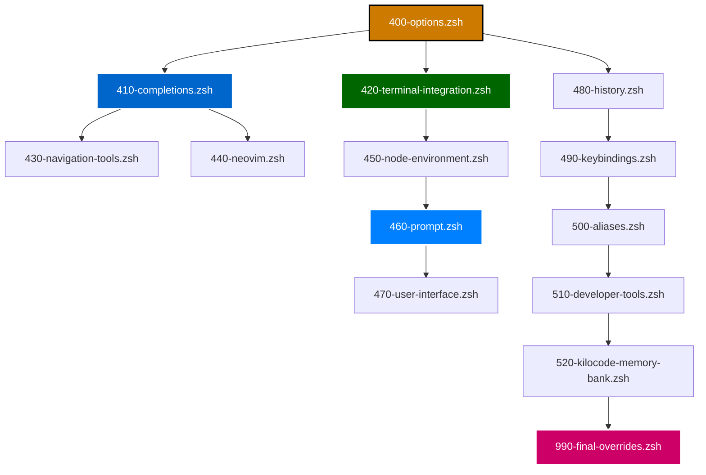

# Load Order Rationale

**Phase 5 Post-Plugin Configuration Sequence** | **Technical Level: Intermediate-Advanced**

---

## 📋 Table of Contents

<details>
<summary>Expand Table of Contents</summary>

- [1. Overview](#1-overview)
  - [1.1. Purpose](#11-purpose)
  - [1.2. Load Order Principles](#12-load-order-principles)
- [2. Phase 5 Sequence (400-990)](#2-phase-5-sequence-400-990)
  - [2.1. 400-options.zsh](#21-400-optionszsh)
  - [2.2. 410-completions.zsh](#22-410-completionszsh)
  - [2.3. 420-terminal-integration.zsh](#23-420-terminal-integrationzsh)
  - [2.4. 430-navigation-tools.zsh](#24-430-navigation-toolszsh)
  - [2.5. 440-neovim.zsh](#25-440-neovimzsh)
  - [2.6. 450-node-environment.zsh](#26-450-node-environmentzsh)
  - [2.7. 460-prompt.zsh](#27-460-promptzsh)
  - [2.8. 470-user-interface.zsh](#28-470-user-interfacezsh)
  - [2.9. 480-history.zsh](#29-480-historyzsh)
  - [2.10. 490-keybindings.zsh](#210-490-keybindingszsh)
  - [2.11. 500-aliases.zsh](#211-500-aliaseszsh)
  - [2.12. 510-developer-tools.zsh](#212-510-developer-toolszsh)
  - [2.13. 520-kilocode-memory-bank.zsh](#213-520-kilocode-memory-bankzsh)
  - [2.14. 990-final-overrides.zsh](#214-990-final-overrideszsh)
- [3. Dependency Map](#3-dependency-map)
- [4. Guidelines for Adding New Files](#4-guidelines-for-adding-new-files)
  - [4.1. Choosing a Number](#41-choosing-a-number)
  - [4.2. Dependency Analysis](#42-dependency-analysis)
  - [4.3. Testing Load Order](#43-testing-load-order)
- [Related Documentation](#related-documentation)

</details>

---

## 1. Overview

### 1.1. Purpose

This document explains **why** each file in Phase 5 (`.zshrc.d.01/`) loads in its specific order. Understanding these dependencies is critical when:

- Adding new configuration files
- Debugging load order issues
- Optimizing shell startup performance
- Preventing race conditions

### 1.2. Load Order Principles

1. **Foundation First**: Core shell options before features
2. **System Before User**: System integrations before user customizations
3. **Dependencies Satisfied**: Required functions/variables available before use
4. **Overrides Last**: User-specific overrides apply at the end

---

## 2. Phase 5 Sequence (400-990)

### 2.1. 400-options.zsh

**Purpose**: Sets all Zsh shell options (`setopt`/`unsetopt`)

**Why First**:
- Shell options affect the behavior of ALL subsequent scripts
- Options like `EXTENDED_GLOB`, `NULL_GLOB` impact file matching
- Options like `PROMPT_SUBST` affect prompt rendering
- Must be set before any feature depends on them

**Dependencies**: None

**Depended On By**: All subsequent files (implicit)

**Load Position**: **Must be first** in Phase 5

---

### 2.2. 410-completions.zsh

**Purpose**: Initializes the Zsh completion system (`compinit`) and Carapace

**Why After 400**:
- Completion behavior depends on shell options
- Needs `EXTENDED_GLOB` and other options set first

**Dependencies**:
- `400-options.zsh` (shell options)

**Depended On By**:
- `430-navigation-tools.zsh` (may use completions)
- `440-neovim.zsh` (completions for nvim commands)
- Any tool that registers custom completions

**Load Position**: **Early** (after options, before tools)

---

### 2.3. 420-terminal-integration.zsh

**Purpose**: Integrates with terminal emulators (Warp, WezTerm, Ghostty, Kitty, iTerm2, VSCode)

**Why After Completions**:
- Terminal integration is largely independent
- Could theoretically run earlier, but no benefit
- Current position provides good separation of concerns

**Dependencies**: None (self-contained)

**Depended On By**:
- `450-node-environment.zsh` (terminal context helps with environment detection)
- `460-prompt.zsh` (terminal type may affect prompt rendering)

**Notes**:
- **Does NOT depend on completions** (self-contained)
- Could move to 405 range if needed, but current position is fine

**Load Position**: **After core systems** (options, completions)

---

### 2.4. 430-navigation-tools.zsh

**Purpose**: Enhanced directory navigation (zoxide, fzf-based tools)

**Dependencies**:
- `410-completions.zsh` (may register custom completions)

**Load Position**: **After completions**

---

### 2.5. 440-neovim.zsh

**Purpose**: Neovim integration and environment setup

**Dependencies**:
- `410-completions.zsh` (neovim command completions)

**Load Position**: **After completions**

---

### 2.6. 450-node-environment.zsh

**Purpose**: Node.js environment (nvm, node path setup)

**Why Before Prompt**:
- Sets up `nvm` and node-related paths
- Terminal detection (from 420) provides context
- Prompt (460) may display node version info

**Dependencies**:
- `420-terminal-integration.zsh` (terminal context)

**Depended On By**:
- `460-prompt.zsh` (potentially - prompt can show node version)

**Notes**:
- Current Starship config doesn't show node info, but capability exists
- If prompt ever needs node version, this must load first

**Load Position**: **Before prompt**

---

### 2.7. 460-prompt.zsh

**Purpose**: Initializes the shell prompt (Starship)

**Why After Core Tools**:
- Prompt may display information from various sources
- Needs terminal integration (420) for proper rendering
- May need node info (450) for version display
- Needs shell options (400) for `PROMPT_SUBST`

**Dependencies**:
- `400-options.zsh` (PROMPT_SUBST, other prompt options)
- `420-terminal-integration.zsh` (terminal type affects rendering)
- `450-node-environment.zsh` (potentially, for version info)

**Load Position**: **After environment setup, before UI customization**

---

### 2.8. 470-user-interface.zsh

**Purpose**: UI enhancements (splash screen, cursor positioning)

**Why After Prompt**:
- UI tweaks should apply after prompt is initialized
- May reference prompt-related variables

**Dependencies**:
- `460-prompt.zsh` (prompt must exist first)

**Load Position**: **After prompt**

---

### 2.9. 480-history.zsh

**Purpose**: Command history configuration and tools

**Why Here**:
- History settings can load any time after options
- Placed here for logical grouping with other user features

**Dependencies**:
- `400-options.zsh` (history options)

**Load Position**: **After core features, before keybindings**

---

### 2.10. 490-keybindings.zsh

**Purpose**: Custom key bindings and ZLE widgets

**Why After History**:
- Keybindings may reference history functions
- Logical to set keybindings after all features are loaded

**Dependencies**:
- `480-history.zsh` (history-related bindings)
- All prior features (bindings may reference them)

**Load Position**: **After features, before aliases**

---

### 2.11. 500-aliases.zsh

**Purpose**: Command aliases

**Why Here**:
- Aliases should be defined after all commands/functions exist
- Prevents aliases shadowing functions that haven't loaded yet

**Dependencies**:
- All prior features (aliases may reference them)

**Load Position**: **After all features, before dev tools**

---

### 2.12. 510-developer-tools.zsh

**Purpose**: Development tool integrations (Laravel Herd, LM Studio, Console Ninja)

**Why Here**:
- Developer tools often modify PATH and environment
- Loaded after core features to avoid conflicts

**Dependencies**:
- Core features (paths, completions)

**Load Position**: **Late in sequence**

---

### 2.13. 520-kilocode-memory-bank.zsh

**Purpose**: AI memory bank integration

**Why Here**:
- Specialized tool that doesn't affect other features
- Can load late in the sequence

**Dependencies**: None specific

**Load Position**: **Late in sequence**

---

### 2.14. 990-final-overrides.zsh

**Purpose**: Final cleanup, user overrides, sourcing `.zshrc.local`

**Why Last**:
- **MUST** be last to allow user overrides to take precedence
- Restores safety options (`WARN_CREATE_GLOBAL`)
- Sources `.zshrc.local` for machine-specific customizations
- Final sanity checks

**Dependencies**: All prior files (this is the final override layer)

**Depended On By**: None (nothing runs after this)

**Load Position**: **MUST be last** in Phase 5

---

## 3. Dependency Map



---

## 4. Guidelines for Adding New Files

### 4.1. Choosing a Number

Use these ranges as a guide:

| Range | Purpose | Examples |
|-------|---------|----------|
| `400-409` | Core shell options | options.zsh |
| `410-419` | System foundations | completions.zsh, terminal-integration.zsh |
| `420-449` | Core tools & features | navigation, editors |
| `450-469` | Environment & prompt | node-env, prompt |
| `470-499` | User customization | UI, history, keys, aliases |
| `500-599` | Developer tools | dev-tools, memory-bank |
| `990-999` | Final overrides | final-overrides.zsh |

### 4.2. Dependency Analysis

Before adding a new file, ask:

1. **What does it depend on?** → Must load after those files
2. **What depends on it?** → Must load before those files
3. **Does it modify global state?** → Consider loading early
4. **Is it a user customization?** → Load later (470-499 range)

### 4.3. Testing Load Order

After adding a new file:

```bash
# Test that shell loads without errors
zsh -i -c "echo 'Shell loaded successfully'"

# Check for undefined variables/functions
setopt WARN_CREATE_GLOBAL
source ~/.zshrc

# Verify your new feature works
# ... specific tests for your feature ...
```

---

## Related Documentation

- [Architecture Overview](020-architecture-overview.md) - Overall system design
- [Startup Sequence](030-startup-sequence.md) - Complete 6-phase boot process
- [File Organization](070-file-organization.md) - Directory structure and naming
- [Development Guide](090-development-guide.md) - Adding new configuration

---

**Navigation:** [← File Organization](070-file-organization.md) | [Top ↑](#load-order-rationale) | [Development Guide →](090-development-guide.md)

---

*Compliant with AI-GUIDELINES.md (v1.0 2025-10-30)*
