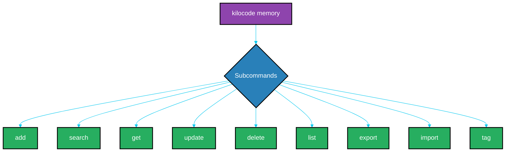

# Kilocode Memory Bank API Reference

<details>
<summary>Table of Contents</summary>

- [1. Introduction](#1-introduction)
  - [1.1. Command Structure](#11-command-structure)
- [2. Core Commands](#2-core-commands)
  - [2.1. `add`](#21-add)
  - [2.2. `search`](#22-search)
  - [2.3. `get`](#23-get)
  - [2.4. `update`](#24-update)
  - [2.5. `delete`](#25-delete)
  - [2.6. `list`](#26-list)
- [3. Data Management](#3-data-management)
  - [3.1. `export`](#31-export)
  - [3.2. `import`](#32-import)
- [4. Tag Management](#4-tag-management)
  - [4.1. `tag`](#41-tag)

</details>

## 1. Introduction

The Kilocode Memory Bank is managed through a unified and powerful command-line interface (CLI). This document provides a comprehensive reference for all available commands and their options.

### 1.1. Command Structure

The basic structure for all commands is:

```sh
kilocode memory [subcommand] [arguments] [options]
```

<!--
alt-text: A diagram showing the command structure of the Kilocode Memory Bank CLI.
-->


## 2. Core Commands

### 2.1. `add`

Adds a new entry to the memory bank.

- **Usage**: `kilocode memory add <content> [options]`
- **Arguments**:
    - `content`: The main text of the memory entry.
- **Options**:
    - `--tags <tag1,tag2>`: A comma-separated list of tags.
- **Example**:
    ```sh
    kilocode memory add "The quick brown fox jumps over the lazy dog." --tags "proverb,animal"
    ```

### 2.2. `search`

Performs a fuzzy search over the memory bank.

- **Usage**: `kilocode memory search <query> [options]`
- **Arguments**:
    - `query`: The search term.
- **Options**:
    - `--tags <tag1,tag2>`: Filter search results by tags.
- **Example**:
    ```sh
    kilocode memory search "lazy dog" --tags "proverb"
    ```

### 2.3. `get`

Retrieves a specific entry by its ID.

- **Usage**: `kilocode memory get <id>`
- **Arguments**:
    - `id`: The unique identifier of the entry.
- **Example**:
    ```sh
    kilocode memory get 12345
    ```

### 2.4. `update`

Modifies an existing entry.

- **Usage**: `kilocode memory update <id> <new_content>`
- **Arguments**:
    - `id`: The ID of the entry to update.
    - `new_content`: The new content for the entry.
- **Example**:
    ```sh
    kilocode memory update 12345 "The quick brown fox jumps over the energetic cat."
    ```

### 2.5. `delete`

Removes an entry from the memory bank.

- **Usage**: `kilocode memory delete <id>`
- **Arguments**:
    - `id`: The ID of the entry to delete.
- **Example**:
    ```sh
    kilocode memory delete 12345
    ```

### 2.6. `list`

Lists all entries, with optional filtering.

- **Usage**: `kilocode memory list [options]`
- **Options**:
    - `--tags <tag1,tag2>`: Filter the list by tags.
- **Example**:
    ```sh
    kilocode memory list --tags "animal"
    ```

## 3. Data Management

### 3.1. `export`

Exports the memory bank to a specified format.

- **Usage**: `kilocode memory export <path> [options]`
- **Arguments**:
    - `path`: The file path for the export.
- **Options**:
    - `--format <json|csv>`: The output format (defaults to JSON).
- **Example**:
    ```sh
    kilocode memory export ./backup.json --format json
    ```

### 3.2. `import`

Imports entries from a file.

- **Usage**: `kilocode memory import <path>`
- **Arguments**:
    - `path`: The path to the file to import.
- **Example**:
    ```sh
    kilocode memory import ./backup.json
    ```

## 4. Tag Management

### 4.1. `tag`

Adds, removes, or lists tags for an entry.

- **Usage**: `kilocode memory tag <id> [options]`
- **Arguments**:
    - `id`: The ID of the entry to manage tags for.
- **Options**:
    - `--add <tag1,tag2>`: Tags to add.
    - `--remove <tag1,tag2>`: Tags to remove.
- **Example**:
    ```sh
    kilocode memory tag 12345 --add "new-tag" --remove "old-tag"
    ```

---
[Previous](./000-index.md) | [Next](./000-index.md) | [Top](./000-index.md)
