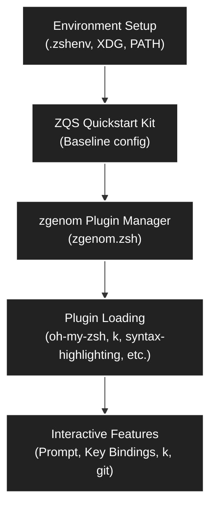
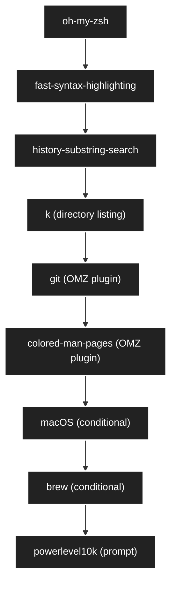

# Comprehensive Overview of the Active Zsh Configuration

---

## Table of Contents
1. [Introduction](#introduction)
2. [Startup Process Overview](#startup-process-overview)
3. [Configuration File Structure](#configuration-file-structure)
4. [Plugin Management: zgenom & ZQS](#plugin-management-zgenom--zqs)
5. [Plugin Loading Sequence](#plugin-loading-sequence)
6. [Environment Variables & Paths](#environment-variables--paths)
7. [Interactive Features](#interactive-features)
8. [Mermaid Diagrams](#mermaid-diagrams)
9. [Troubleshooting & Best Practices](#troubleshooting--best-practices)

---

## Introduction

This document provides a complete, technical description of the active Zsh configuration for your environment. It covers the startup process, plugin management (zgenom and ZQS), environment variables, interactive features, and includes high-contrast Mermaid diagrams for visual clarity.

---

## Startup Process Overview

The Zsh startup process is designed for reliability, speed, and feature completeness. The following steps are executed:

1. **Environment Preparation**
    - `.zshenv` is sourced if present, setting XDG and PATH variables.
    - `ZDOTDIR` is set to the dotfiles config directory.
    - `ZGEN_DIR` is set for zgenom cache.
2. **Shell Options & History**
    - Shell options (`AUTO_CD`, `INTERACTIVE_COMMENTS`, etc.) are set for usability.
    - History file and size are configured.
3. **Completions**
    - `compinit` is autoloaded and run for completion support.
4. **fpath Reset & Setup**
    - `fpath` is explicitly reset to avoid pollution.
    - Only valid directories are added, with zgenom functions first.
5. **Plugin Manager Initialization**
    - `ZGEN_SOURCE` is set to the local zgenom directory.
    - `zgenom.zsh` is sourced, which autoloads plugin management functions.
6. **Plugin Loading**
    - If the zgenom cache is missing or outdated, the full plugin set is loaded and saved.
    - Plugins include oh-my-zsh, fast-syntax-highlighting, k, git, colored-man-pages, macOS/brew (conditional), and powerlevel10k.
7. **Interactive Bindings & Prompt**
    - Key bindings for history search are set.
    - The prompt is customized for clarity.

---

## Configuration File Structure

- **.zshenv**: Sets XDG and PATH variables, ensures environment consistency.
- **.zshrc.step5**: Main configuration file, orchestrates all startup logic and plugin management.
- **zgenom/zgenom.zsh**: Plugin manager, handles plugin loading, cache, and autoloading.
- **zgenom/functions/**: Directory containing all zgenom autoloadable functions.

---

## Plugin Management: zgenom & ZQS

### zgenom
- Handles plugin loading, cache management, and autoloading.
- Ensures plugins are loaded in the correct order and only when needed.
- Uses a patched logic to respect the explicit `ZGEN_SOURCE` variable, preventing fpath pollution.

### ZQS (Quickstart Kit)
- Provides a baseline configuration and structure for rapid setup.
- Ensures compatibility and best practices for zsh environments.

---

## Plugin Loading Sequence

1. **oh-my-zsh**: Loads core framework and OMZ plugins.
2. **fast-syntax-highlighting**: Enables syntax highlighting for commands.
3. **zsh-history-substring-search**: Adds interactive history search.
4. **k**: Enhanced directory listing.
5. **git, colored-man-pages**: OMZ plugins for git integration and improved man pages.
6. **macOS, brew**: Loaded conditionally if on Darwin and Homebrew is present.
7. **powerlevel10k**: Loads advanced prompt theme.

---

## Environment Variables & Paths

- **ZDOTDIR**: `/Users/s-a-c/.config/zsh`
- **ZGEN_DIR**: `$ZDOTDIR/.zgenom`
- **ZGEN_SOURCE**: `$ZDOTDIR/zgenom`
- **fpath**: Reset and set to include only valid directories, with zgenom functions first.
- **HISTFILE**: `${ZSH_CACHE_DIR:-$HOME/.cache/zsh}/.zsh_history`

---

## Interactive Features

- **Key Bindings**: History substring search with up/down arrows.
- **Prompt**: Custom prompt for clarity and context.
- **Completions**: Robust completion system via compinit.
- **Enhanced Directory Listings**: `k` command for improved navigation.
- **Syntax Highlighting**: Immediate feedback on command syntax.
- **Git Integration**: OMZ plugin for git status and shortcuts.

---

## Mermaid Diagrams

### High-Contrast Startup Flow

### High-Contrast Plugin Loading Sequence

---

## Troubleshooting & Best Practices

- **Always reset fpath before sourcing plugin managers.**
- **Explicitly set ZGEN_SOURCE to avoid path pollution.**
- **Use debug/version messages to confirm active config.**
- **Regenerate zgenom cache after major changes.**
- **Test interactive features after plugin updates.**
- **Keep .zshenv minimal and focused on environment variables.**

---

## Conclusion

This configuration provides a robust, fast, and feature-rich Zsh environment. The startup process is clean, plugins are loaded efficiently, and interactive features are fully enabled. The use of zgenom and ZQS ensures maintainability and extensibility for future enhancements.

---

**For further customization or troubleshooting, refer to this document and the debug output in your shell sessions.**
