# ZSH Configuration Redesign – Visual Documentation
(Date) 2025-08-29
Status: Complete (No omissions)

## Legend & Palette
- Updated to high-contrast, colorblind-accessible scheme (tested against common Deuteranopia/Protanopia/ Tritanopia palettes)
- Distinct luminance & hue spacing; all dark backgrounds use white text for WCAG AA contrast
- Symbols: 🔐 security (early), 🛡️ security (advanced), ⚙️ options/config, 🧰 core funcs, 🧩 plugins, 🛠️ dev env, ⌨️ aliases/keys, 📘 completion/history, 🎨 UI/prompt, 🧪 performance, ✅ splash/finalization

Class Styles (Mermaid NEW Palette):
```
core:     fill=#003E7E, stroke=#002347, color=#ffffff
pre:      fill=#005FA3, stroke=#003E7E, color=#ffffff
plugin:   fill=#B34700, stroke=#7A3000, color=#ffffff
security: fill=#333333, stroke=#111111, color=#ffffff
config:   fill=#4B2E83, stroke=#2E1A52, color=#ffffff
ui:       fill=#007F7F, stroke=#005555, color=#ffffff
legacy:   fill=#6C757D, stroke=#495057, color=#ffffff
perf:     fill=#7A1FA2, stroke=#4C1365, color=#ffffff
```

(Previous low-contrast light grays replaced; teal & purple hues selected for shape + color differentiation. Legacy kept mid-gray but darkened for readability.)

## 1. Current Configuration Relationships
```mermaid
%%{init: { 'theme': 'base', 'themeVariables': { 'fontFamily': 'Menlo, monospace', 'background':'#0E1116','primaryColor':'#1E2A38','primaryTextColor':'#ffffff','primaryBorderColor':'#5E748A','secondaryColor':'#2D3E50','secondaryTextColor':'#ffffff','secondaryBorderColor':'#6C889E','tertiaryColor':'#3C4F63','tertiaryTextColor':'#ffffff','tertiaryBorderColor':'#7A91A5','lineColor':'#8899AA' } }}%%
flowchart TD
    subgraph A0[Core Files]
        ZENV[.zshenv]:::core
        ZRC[.zshrc]:::core
        ZGENSET[.zgen-setup]:::plugin
    end
    subgraph A1[Pre-Plugin Phase]
        PP0[00_00-critical-path-fix]:::pre
        PP1[00_01-path-resolution-fix]:::pre
        PP2[00_05-path-guarantee]:::pre
        PP3[00_10-fzf-setup]:::pre
        PP4[00_30-lazy-loading-framework]:::pre
        PP5[10_30-lazy-direnv]:::pre
        PP6[10_40-lazy-git-config]:::pre
        PP7[10_50-lazy-gh-copilot]:::pre
        PP8[20_10-ssh-agent-core]:::pre
        PP9[20_11-ssh-agent-security]:::pre
    end
    subgraph A2[Active Post-Plugin]
        PI0[00_20-plugin-integrity-core]:::security
        PI1[00_21-plugin-integrity-advanced]:::security
        OPT[00_60-options]:::config
        ESS[20_04-essential]:::plugin
        PROMPT[30_30-prompt]:::ui
    end
    subgraph A3[Disabled Legacy]
        LENV[00_10-environment]:::legacy
        LPATH[00_02-path-system.*]:::legacy
        LFN[00_70-functions-core]:::legacy
        LSEC[00_80-security-check]:::legacy
        LDEV[10_00-development-tools]:::legacy
        LALIA[30_10-aliases]:::legacy
        LKEY[30_20-keybindings]:::legacy
        LPMON[00_30-performance-monitoring]:::legacy
        LDFR[20_12-plugin-deferred-core]:::legacy
        LSPL[99_99-splash]:::legacy
    end
    ZENV --> ZRC
    ZRC --> A1 --> ZGENSET --> A2 --> A3
    ZRC --> A2
    classDef core fill:#003E7E,stroke:#002347,color:#ffffff
    classDef pre fill:#005FA3,stroke:#003E7E,color:#ffffff
    classDef plugin fill:#B34700,stroke:#7A3000,color:#ffffff
    classDef security fill:#333333,stroke:#111111,color:#ffffff
    classDef config fill:#4B2E83,stroke:#2E1A52,color:#ffffff
    classDef ui fill:#007F7F,stroke:#005555,color:#ffffff
    classDef legacy fill:#6C757D,stroke:#495057,color:#ffffff
```

## 2. Proposed Redesign Structure
```mermaid
%%{init: { 'theme': 'base', 'themeVariables': { 'background':'#0E1116','primaryColor':'#1E2A38','primaryTextColor':'#ffffff','primaryBorderColor':'#5E748A','lineColor':'#8899AA' } }}%%
flowchart LR
    subgraph NEW[.zshrc.d.REDESIGN]
        N00[00-security-integrity 🔐]:::security
        N05[05-interactive-options ⚙️]:::config
        N10[10-core-functions 🧰]:::core
        N20[20-essential-plugins 🧩]:::plugin
        N30[30-development-env 🛠️]:::plugin
        N40[40-aliases-keybindings ⌨️]:::config
        N50[50-completion-history 📘]:::config
        N60[60-ui-prompt 🎨]:::ui
        N70[70-performance-monitoring 🧪]:::perf
        N80[80-security-validation 🛡️]:::security
        N90[90-splash ✅]:::ui
    end
    ZRC[.zshrc]:::core --> N00 --> N05 --> N10 --> N20 --> N30 --> N40 --> N50 --> N60 --> N70 --> N80 --> N90
    classDef core fill:#003E7E,stroke:#002347,color:#ffffff
    classDef plugin fill:#B34700,stroke:#7A3000,color:#ffffff
    classDef security fill:#333333,stroke:#111111,color:#ffffff
    classDef config fill:#4B2E83,stroke:#2E1A52,color:#ffffff
    classDef ui fill:#007F7F,stroke:#005555,color:#ffffff
    classDef perf fill:#7A1FA2,stroke:#4C1365,color:#ffffff
```

## 3. Migration Flow
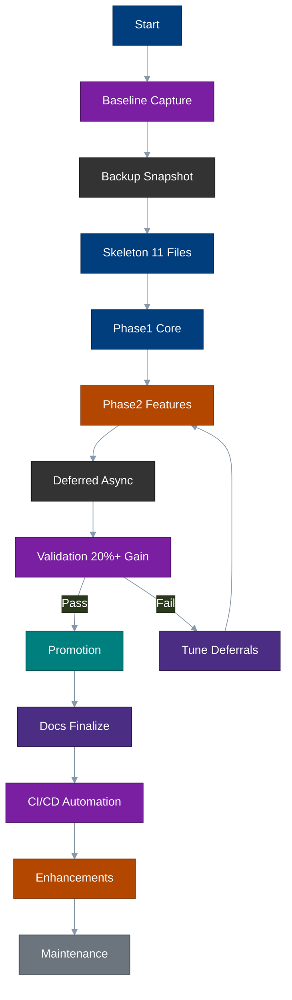

## 4. Loading Sequence & Timing (Abstract Gantt)
```mermaid
%%{init: { 'theme': 'base', 'themeVariables': { 'background':'#0E1116','ganttAccentColor': '#003E7E', 'ganttSectionBkgColor': '#1E2A38', 'ganttSectionBkgColor2': '#2D3E50', 'ganttTaskBkgColor': '#005FA3', 'ganttTaskBorderColor': '#5E748A','primaryTextColor':'#ffffff' } }}%%
gantt
    title Startup Timeline (Approximate)
    dateFormat  X
    axisFormat  %L
    section Core
    .zshenv (~5ms)         :a1, 0, 5
    .zshrc bootstrap (~8ms):a2, 5, 8
    section Pre-Plugin
    Pre-plugins (~25ms)    :a3, 13, 12
    section Plugin Manager
    zgenom init (~120ms)   :a4, 25, 40
    Build / load (~250ms)  :a5, 65, 60
    section Post-Plugin Core
    00-05-10 (~16ms)       :a6,125,16
    20-30-40 (~30ms)       :a7,141,30
    50-completion (~22ms)  :a8,171,22
    60-prompt (~40ms)      :a9,193,40
    section Deferred
    70-perf hook (~2ms)    :a10,233,4
    80-security async (0ms upfront):a11,237,1
    90-splash (~2ms)       :a12,238,2
```

## 5. Sequence Diagram (Prompt vs Async)
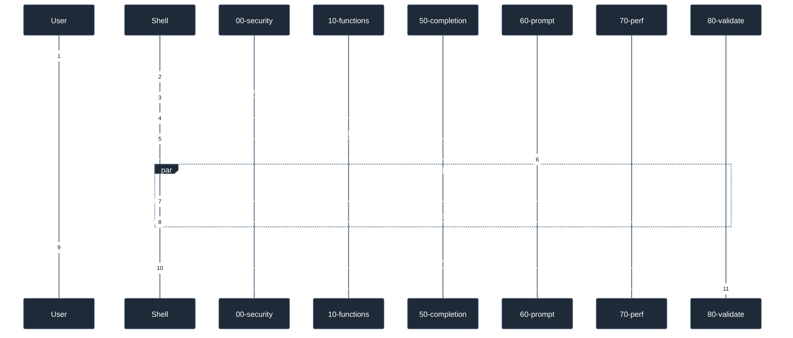

## 6. Completion Workflow
```mermaid
%%{init: { 'theme': 'base', 'themeVariables': { 'background':'#0E1116','primaryColor':'#1E2A38','primaryTextColor':'#ffffff','lineColor':'#8899AA','clusterBkg':'#1E2A38','clusterBorder':'#5E748A' } }}%%
flowchart LR
    A[Shell Start]:::core --> B[Env Flags]:::config
    B --> C{Auto compinit?}:::security
    C -->|No| D[Wait fpath]:::pre
    C -->|Yes| E[Prep fpath]:::pre
    D --> E
    E --> F[Run compinit]:::security
    F --> G[zcompdump Ready]:::perf
    G --> H{Cache Fresh?}:::config
    H -->|Yes| I[Reuse Cache]:::core
    H -->|No| J[Regenerate]:::plugin
    I --> K[Apply zstyles]:::config
    J --> K
    K --> L[Active Completion]:::ui
    classDef core fill:#003E7E,stroke:#002347,color:#ffffff
    classDef pre fill:#005FA3,stroke:#003E7E,color:#ffffff
    classDef plugin fill:#B34700,stroke:#7A3000,color:#ffffff
    classDef security fill:#333333,stroke:#111111,color:#ffffff
    classDef config fill:#4B2E83,stroke:#2E1A52,color:#ffffff
    classDef ui fill:#007F7F,stroke:#005555,color:#ffffff
    classDef perf fill:#7A1FA2,stroke:#4C1365,color:#ffffff
```

## 7. Consolidation Diff
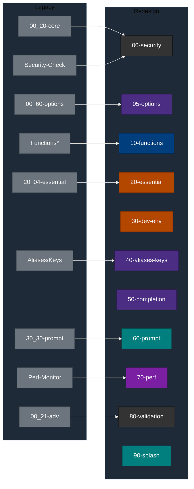

## 8. Plugin Integrity Phases
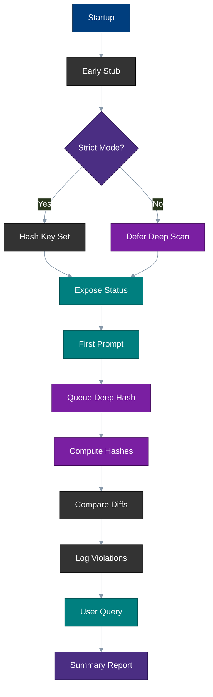

## 9. Performance Monitoring Hooks


## 10. Async Integrity State Machine
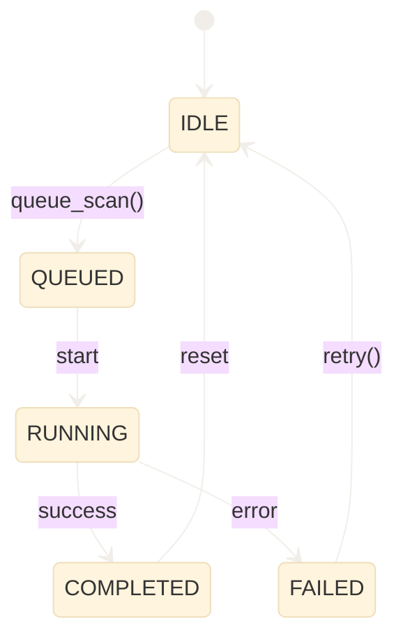

## 11. Pre-Plugin Redesign Mapping
```mermaid
%%{init: { 'theme': 'base', 'themeVariables': { 'background':'#0E1116','clusterBkg':'#1E2A38','clusterBorder':'#5E748A' } }}%%
flowchart TB
    subgraph Pre-Legacy
        L0[00_00 path-fix]:::legacy
        L1[00_01 path-res]:::legacy
        L2[00_05 guarantee]:::legacy
        L3[00_10 fzf]:::legacy
        L4[00_30 lazy-fw]:::legacy
        L5[10_10 nvm-npm]:::legacy
        L6[10_30 direnv]:::legacy
        L7[10_40 git cfg]:::legacy
        L8[10_50 gh copilot]:::legacy
        L9[20_10 ssh core]:::legacy
        L10[20_11 ssh sec]:::legacy
    end
    subgraph Pre-Redesign
        R0[00-path-safety]:::core
        R1[05-fzf-init]:::pre
        R2[10-lazy-framework]:::core
        R3[15-node-runtime-env]:::plugin
        R4[25-lazy-integrations]:::plugin
        R5[30-ssh-agent]:::security
    end
    L0 --> R0
    L1 --> R0
    L2 --> R0
    L3 --> R1
    L4 --> R2
    L5 --> R3
    L6 --> R4
    L7 --> R4
    L8 --> R4
    L9 --> R5
    L10 --> R5
    classDef core fill:#003E7E,stroke:#002347,color:#ffffff
    classDef pre fill:#005FA3,stroke:#003E7E,color:#ffffff
    classDef plugin fill:#B34700,stroke:#7A3000,color:#ffffff
    classDef security fill:#333333,stroke:#111111,color:#ffffff
    classDef legacy fill:#6C757D,stroke:#495057,color:#ffffff
```

## 12. Color & Symbol Reference
| Class | Color | Meaning |
|-------|-------|---------|
| core | #003E7E | Core orchestrator / env |
| pre | #005FA3 | Pre-plugin staging |
| plugin | #B34700 | Plugin management / ensures |
| security | #333333 | Security & integrity (light/heavy) |
| config | #4B2E83 | Options / configuration / aliases |
| ui | #007F7F | Prompt / UI |
| legacy | #6C757D | Archived legacy modules |
| perf | #7A1FA2 | Performance monitoring |

### 12.1 Shape / Pattern Legend (No-Color Accessibility)
| Shape | Mapping | Class |
|-------|---------|-------|
| Rectangle `[text]` | Core | core |
| Rounded `(text)` | Pre-Plugin | pre |
| Circle `((text))` | Plugin | plugin |
| Stadium `([text])` | Security | security |
| Diamond `{{text}}` | Config / Decision | config |
| Subroutine `>text]` | UI/Prompt | ui |
| Plain Gray Rectangle | Legacy | legacy |
| Circle w/ Purple Fill | Performance | perf |

(Primary diagrams use color + class; an alternate light-mode snippet is provided below.)

## 13. Cross-References
| Topic | Link |
|-------|------|
| Analysis | analysis.md |
| Implementation Plan | implementation-plan.md |
| Final Report | final-report.md |
| Prefix Reorg Spec | prefix-reorg-spec.md |
| Pre-Plugin Redesign | pre-plugin-redesign-spec.md |
| Plugin Loading Optimization | plugin-loading-optimization.md |
| Migration Checklist | migration-checklist.md |
| Testing Strategy | testing-strategy.md |

## 14. Pre-Plugin Lazy Activation Sequence
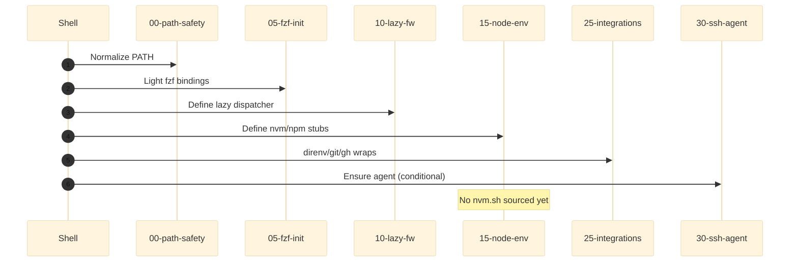

## 15. Node & NVM Lazy Load Flow
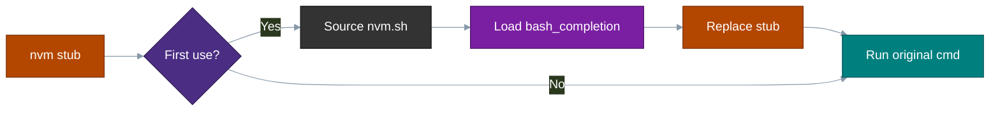

## 16. Plugin Add Sequence Optimization
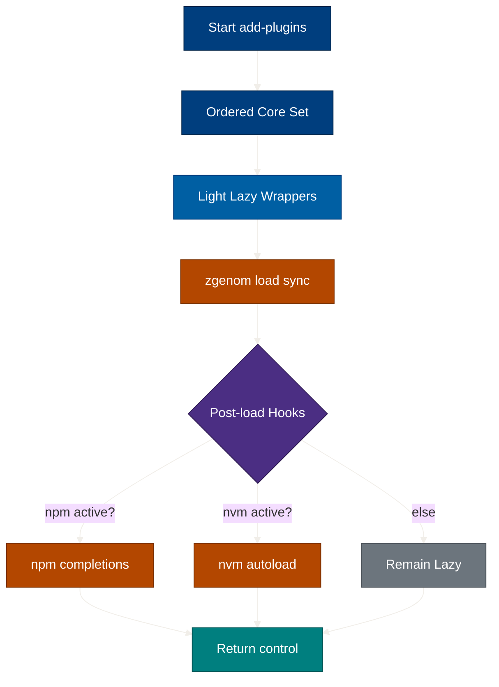

## 17. Rollback Decision Tree (Inline Copy)
(Authoritative version: rollback-decision-tree.md)
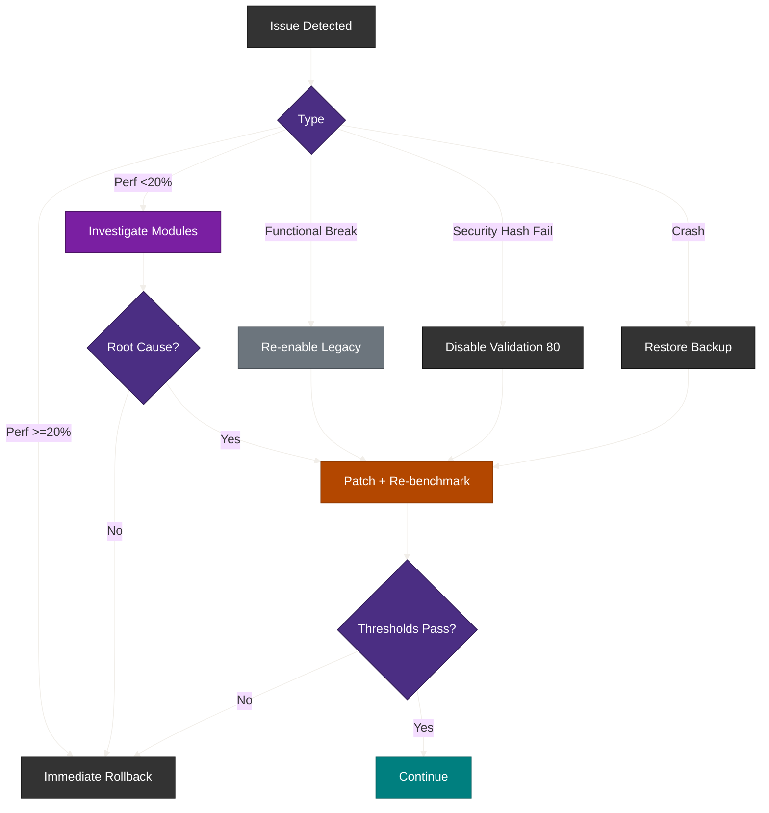

## 18. Documentation Navigation Graph
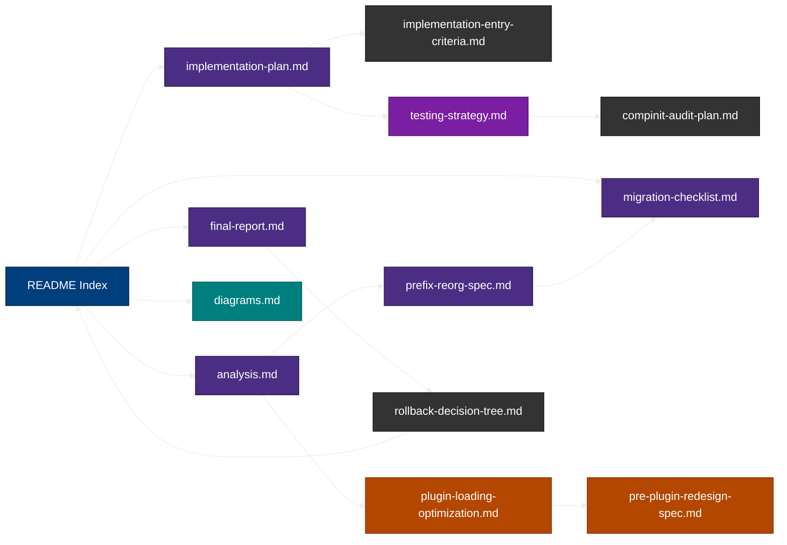

---
**Navigation:** [← Previous: Analysis](analysis.md) | [Next: Final Report →](final-report.md) | [Top](#) | [Back to Index](../README.md)
